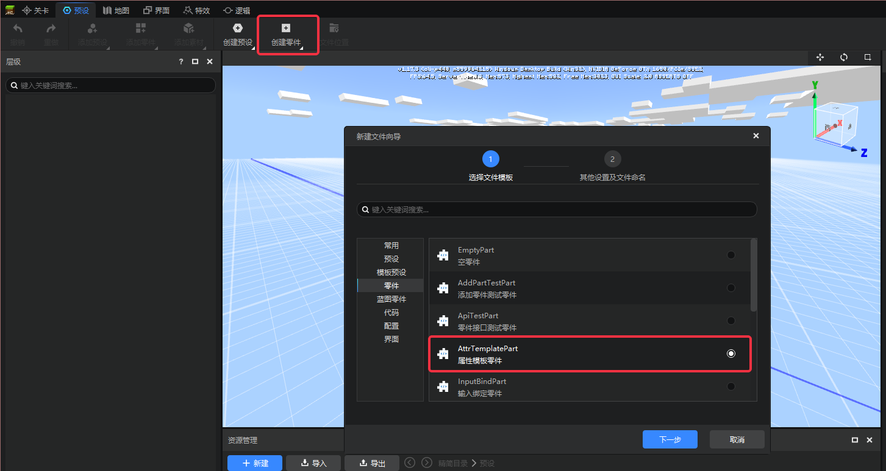
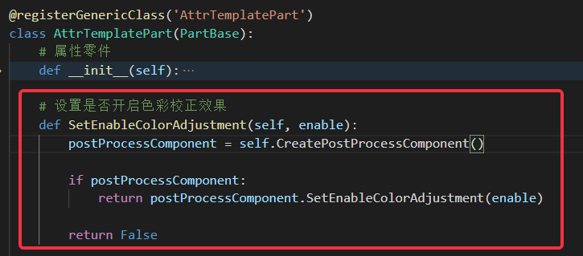
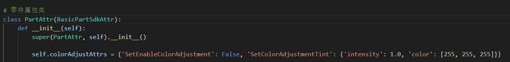
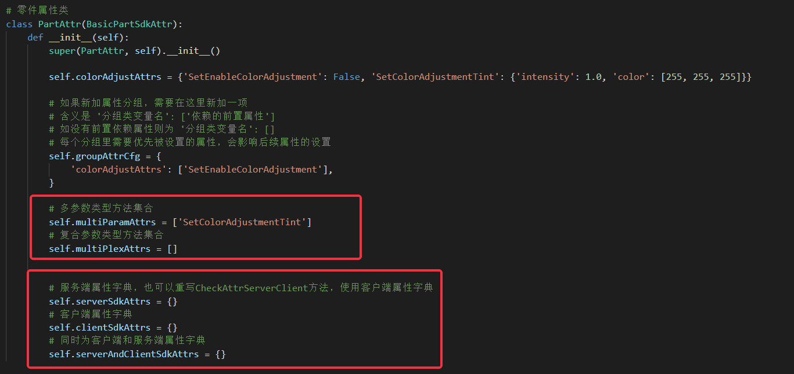
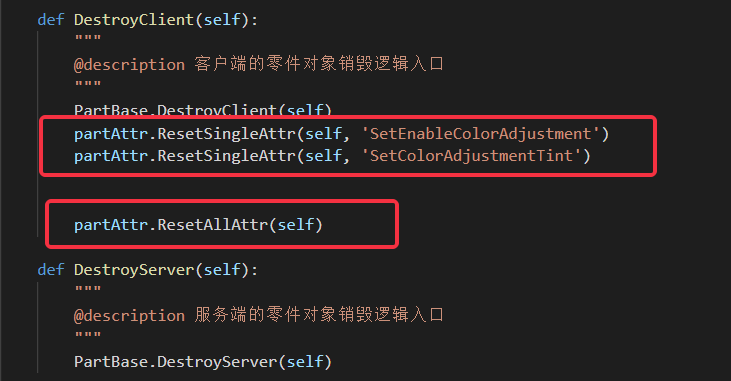
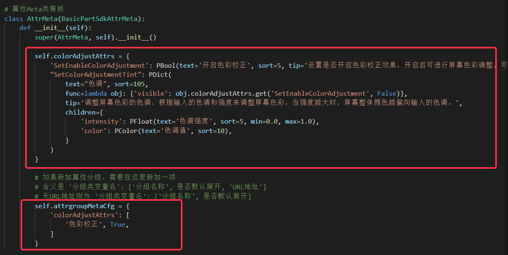
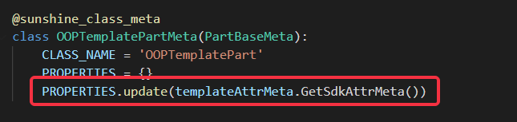
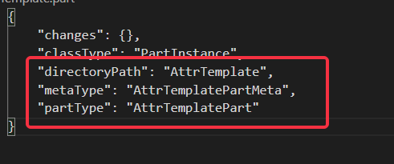
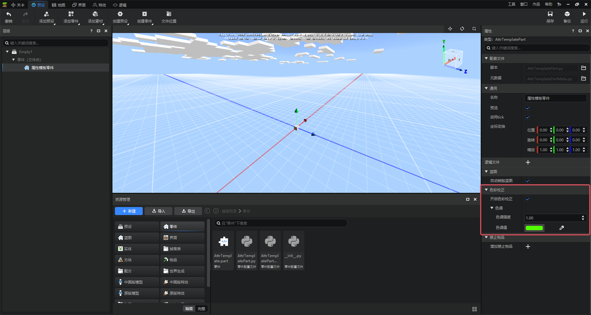
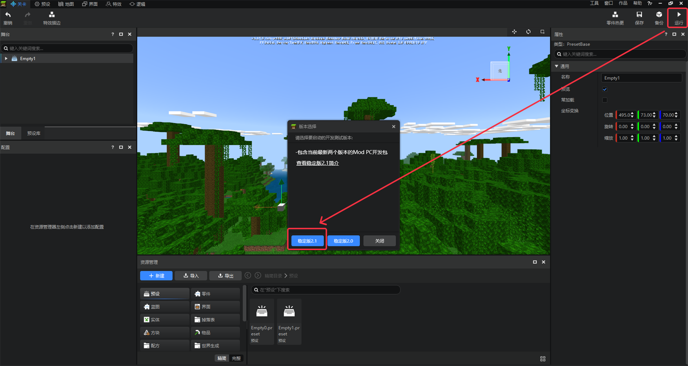

# 自定义属性零件示例模板

- 就目前的零件而言，大多数功能需求仍然要开发者手动编辑零件代码来实现，将功能需求抽象成特定属性，并将此类属性以可视化形式暴露在编辑器中，
开发者可以使用这些零件来实现玩法，可视化的形式提高了开发效率，此类零件也可复用。属性零件的灵感来源于此。

- 同时，在预设编辑器内提供了一个属性模板零件作为编码参考，接下来的内容会围绕此零件的实现过程阐述。

- 强调一点，所有的功能均在新版编辑器内进行，并且相关作品均为新版作品。

## 创建一个属性模板零件

- 属性模板零件的创建入口和其他模板零件一致，在预设编辑器中点击创建零件，弹出的界面中就可以选择该零件，见下图。

- 勾选并二次确认后，属性模板零件成功创建，同时下方文件栏也会打开其目录结构，见下图。

- 在文件系统打开看的更清晰，下图中红圈标注的文件是会涉及修改的内容，AttrTemplate.part为零件主体，包含零件文件路径等；
AttrTemplatePart.py为零件数据属性逻辑主体；AttrTemplatePartMeta.py是零件界面显示逻辑主体，后面会详细介绍。

- 零件功能逻辑的编写可以直接在创建出来的属性模板零件文件内容的基础上进行修改。

## 属性设置框架

- 属性模板零件的实现依赖底层的属性设置框架，框架旨在减少重复逻辑的编写，包含属性管理、属性与默认值不等才修改属性等特性，将属性设置功能
简化为属性配置形式。

- 零件包含数据逻辑和界面逻辑两部分，接下来按照顺序介绍对应内容。

- 零件开发基础教程在官网有详细内容 [零件开发 | 我的世界开发者官网 (163.com)](./0-零件开发.md)

## 数据逻辑

- 数据逻辑包含零件数据，也是逻辑操作的主体，前面文件结构中AttrTemplatePart.py为数据逻辑主体。

- 为减少零件类中代码量，框架增加了属性类的概念，必须继承属性基类BasicPartSdkAttr，属性类中编写属性相关配置，零件类中仅仅调用属性类方法即可。
数据逻辑的py文件中包含零件属性类PartAttr和零件类AttrTemplatePart，见下图。

### 属性组

- 框架定义了属性和属性组的概念，同一类属性归属一个属性组，既是数据上的集合单元，在界面表现上也属于同一属性分栏；
属性实现依赖底层SDK属性，在零件类中需封装对应接口，举例属性为“是否开色彩校正效果”，在零件类中封装了接口SetEnableColorAdjustment，见下图，在属性类中以此接口名作为某一属性，名称需完全一致。

- 上面属性概念捋清晰之后，开始介绍属性组的概念，由上述逻辑知，属性组包含了同一类型的属性，而且每个属性在零件类中均可找到同名
的接口；属性配置逻辑在属性类当中，模板定义了一个colorAdjustAttrs属性组，其包含两个属性，一是上述的SetEnableColorAdjustment属性、
另一是“调整屏幕色彩的色调”属性SetColorAdjustmentTint，见下图。

- 图中可以看到属性组在属性中的存储形式是类变量，数据结构为字典（键为属性名、值为参数默认值），SetEnableColorAdjustment属性参数简单；SetColorAdjustmentTint属性参数为多参数，用一个字典存储其参数；目前受限于底层逻辑，属性组只能写为一行代码结构，后续会思考优化对策。

### 额外的配置信息

- 目前，有三个问题还没解决，同一属性组里属性有前置依赖关系、框架如何区分不同属性接口参数类型、零件代码同时跑在客户端和服务端如何区分。

- 框架原本设计中包含配置数据，用于将属性类中属性映射到对应的零件类当中，见下图，干脆将配置数据增加前置属性依赖顺序，配置数据格式为字典，
元素为 '分组类变量名': ['依赖的前置属性']

- 判定接口参数类型、区分客户端服务端这两个问题，均采用配置数据处理，也许会造成配置数据冗余，但减少了运行时判断的逻辑消耗时间，当零件数目大的情形相对有效

- 判定接口参数类型问题，定义了多参数列表multiParamAttrs和复合参数列表multiPlexAttrs，见下图第一个标注框，分别存储相应参数属性，单参数属性无需处理，复合参数指可多次施加的接口，模板中有“增加禁用物品”属性AddBannedItem，可创建模板参考。

- 区分客户端服务端问题，定义了 服务端属性列表serverSdkAttrs、客户端属性列表clientSdkAttrs、双端列表serverAndClientSdkAttrs，属性基类采用服务端属性列表serverSdkAttrs作为判断依据，将服务端属性填入其中即可，元素格式为'属性名称' ；serverAndClientSdkAttrs是双端属性；clientSdkAttrs列表一般不需要填写，但也可重写CheckAttrServerClient方法来使用客户端属性列表。

### 属性接口调用

- 属性类实例化,在零件类中调用属性类相关方法，属性设置才会生效，见下图第一个标注框。

- 属性的添加通过在零件类的__init__方法中调用SdkAttrsInit方法，参数为零件类本身,见下图第二个标注框。

- 属性的设置，在零件类的InitClient方法和InitServer方法中调用即可，见下图第三个标注框。实际情况中，如零件属性仅包含客户端属性，只需在InitClient方法调用属性设置方法，同理，零件属性只包含服务端属性，只在InitServer方法中调用。

- 零件设置的属性效果，部分跟其挂接的预设相关，而像后处理零件，其设置的属性是画面显示，当零件卸载或销毁时需要将其效果复原，框架提供
重置某一属性方法ResetSingleAttr和重置所有属性方法ResetAllAttr，开发者可以有选择的使用，如下图两次ResetSingleAttr调用和一次ResetAllAttr调用，
实际效果一致，都消除了零件对后处理效果的设置。ResetSingleAttr方法调用顺序也需要遵循前置属性的规则，属性组前置属性在最后才被销毁

## 界面Meta逻辑

- 界面逻辑通过编写Meta类的形式实现，Meta类中将数据逻辑中的数据部分暴露在界面上，详细的Meta类编写逻辑在
官网有相关详细教程[自定义属性面板 | 我的世界开发者官网 (163.com)](./1-自定义属性面板.md)

- 文件结构中的AttrTemplatePartMeta.py文件是属性模板零件的Meta相关逻辑。

- 与数据逻辑相关，界面Meta类同时包含属性Meta类和零件Meta类，属性Meta类中包含数据配置，零件Meta类中调用相关接口，见下图示例，属性Meta类需继承属性Meta基类BasicPartSdkAttrMeta。

- 与数据类设置思路相同，Meta属性类也包含属性配置内容，需实例化后在零件Meta类中使用，见下图。

- 属性配置方面，结构定义和数据逻辑类似，colorAdjustAttrs属性组存储属性的界面控件定义，所有属性名与零件类中的属性一一对应，详见下图第一个标注框。

- 类变量attrgroupMetaCfg存储需要添加到零件Meta中的属性组配置，元素格式为键值对 “ '分组类变量名': ['分组名称', 是否默认展开, 'URL地址'] ”，其中'URL地址'为非必填项，参考见下图中第二个标注框。

### 特殊的URL地址

- 对于上述的URL地址，指同一属性组内都会设置该URL地址，若有特殊需求，如某一属性组有URL地址，但其中一属性
URL为空或独有URL，参照见下图,hrefTip为'Empty'则取消单一属性网址链接，hrefTip为'特定网址'，
则单一属性链接为特定链接，见下图SetEnableColorAdjustment属性。注意，tip为必须内容，其为提示文本内容。

- 属性Meta类实例在零件Meta类中使用相对简单，如下图，在零件Meta类中调用GetSdkAttrMeta方法，将返回值添加到PROPERTIES属性中去。

### 零件配置

- 在前面创建出的属性模板零件目前结构中，有一个名为AttrTemplate.part的文件，其包含零件的基本参数配置，同时也是零件本体，见下图
- 需要手动修改的内容包含文件夹名称directoryPath、零件类名称AttrTemplatePart、零件Meta类名称metaType，一般情况下文件夹名称无需修改，但零件类名称、零件Meta类名称开发者可能会修改，需要重新配置。

## 零件功能验收

### 属性设置

- 上述为零件功能的编码逻辑，零件功能的验收仍然需要在编辑器内进行，验收演示就直接使用属性模板零件，下图中文件结构，零件本体AttrTemplate.part是编辑器内操作主要单位。

- 在编辑器内点击零件本体，右侧界面会出现给该零件添加的属性，也是按属性组分类，见下图

- 修改零件本体属性，零件代码会同步修改，属性默认值也会修改，导致后续属性设置不生效
- 如果右侧属性栏有部分属性未显示，大概率是零件类属性和零件Meta类中属性名称或数据类型不匹配，去检查代码

- 零件挂接到预设上，其中逻辑才会执行，同时，为避免修改零件本体导致代码里默认值被修改，将零件挂接到预设上调试效果，演示里创建了空预设并勾选零件本体直接挂接到空预设上，见下图

- 挂接成功后，点击空预设下的零件，右侧属性栏已经有对应属性，将开启色彩校正属性勾选，并将色调值改为绿色，点击右上角保存

### 运行验收

- 效果的验收需要切到关卡编辑器进行，将挂接属性模板零件的空预设Empty1拖拽到场景中，见下图
- 注意！附加包作品不保存地图，对应预设需要在预设编辑器界面勾选预加载选项，勾选之后不用走上面的拖拽步骤；对于地图作品则不需要，演示内容为地图作品

- 零件效果的调试，点击右上角的运行，同时勾选2.1版本，即开始运行

- 点击运行，在游戏界面，后处理属性成功生效 ，参见下图

