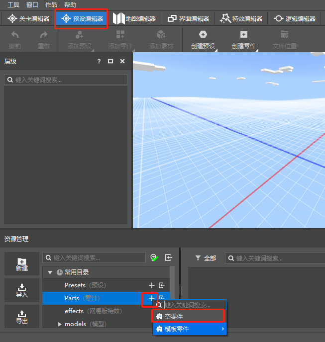
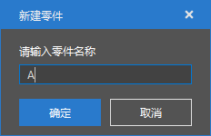
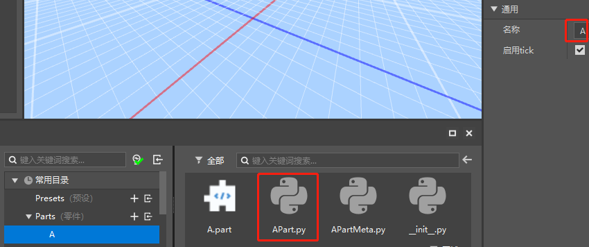
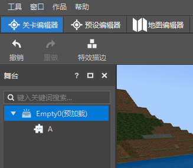
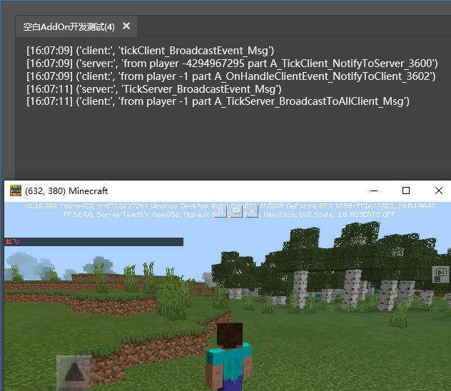
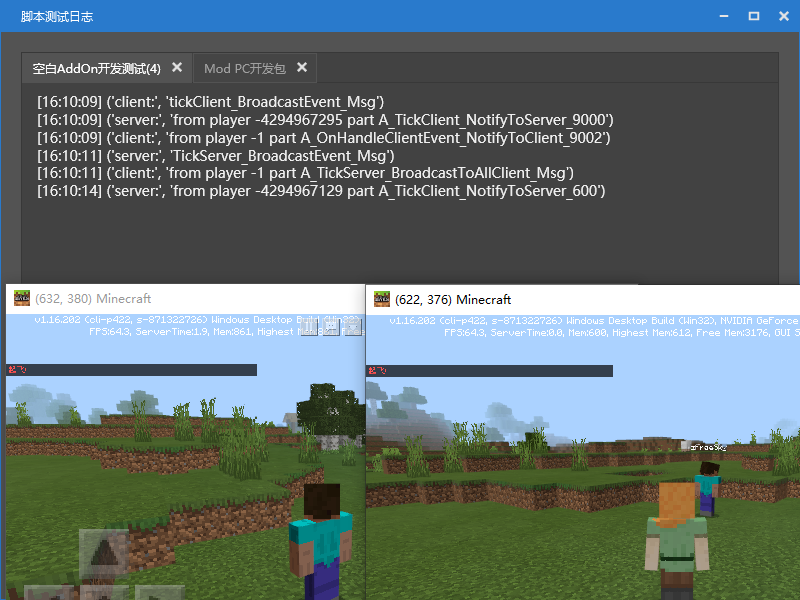
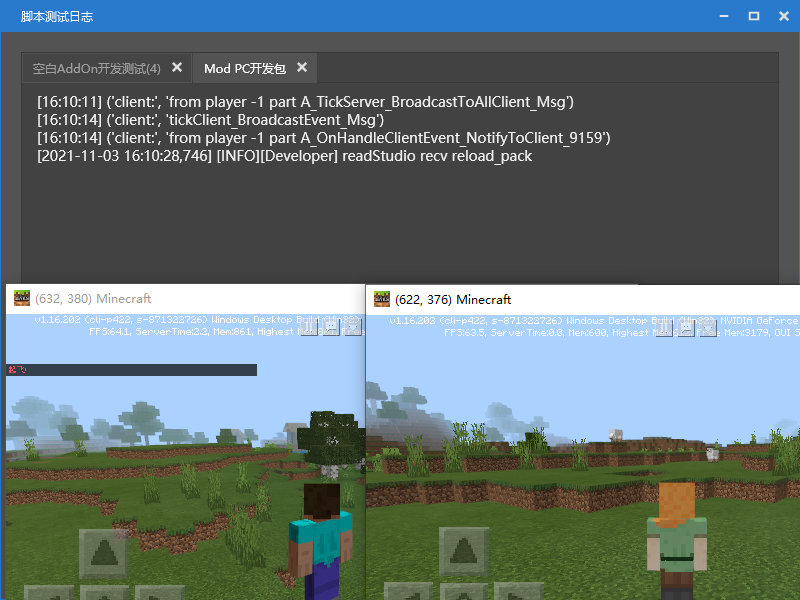
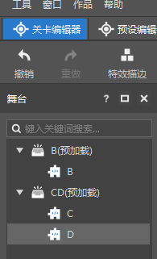

# 零件通信

这个教程将为您来介绍零件的服务端与客户端通信的功能以及如何在编辑器中新建并使用
在此之前, 先推荐先按流程看完之前的样例[教程][预设与零件]并且按步骤实际操作过,也需要了解服务端与客户端的区别,也就是([Client-Server架构][服务端与客户端])

## 前置指引

首先,让我们来先打开一个新版的编辑器,新建一个空白模板,地图或者addon都可以
1. 点击新建
2. 选择空白地图模板
3. 点击升级作品
4. 确认弹出对话框中的内容后点击升级


这样就会进入新版的编辑器界面
1. 点击预设编辑器（方便后续实际使用）
2. 点击资源管理器中零件分类的新建按钮新建一个空零件
3. 样例就命名为A（实际不推荐无意义单词命名）



然后就成功创建了一个零件
1. 在这里我们将零件的运行名称同步改成A，方便后续的结果展示
2. 打开APart.py这个脚本本件就可以开始编写脚本测试了



---


## 样例脚本编写
零件的通讯有多种不同的接口,它们都有对应的使用方式

### 单零件的服务端与客户端的通讯

+ 逻辑说明：每隔20秒(20 * 30 = 600帧)，客户端通知服务端自己需要调整坐标，服务器收到通知后调整客户端玩家坐标向上50格，并在该玩家游戏界面显示"起飞"

+ api说明:
    > [BroadcastEvent][BroadcastEventUrl]  服务端/客户端 广播事件到 服务端/客户端，不支持跨网络
    >
    > [ListenSelfEvent][ListenSelfEventUrl] 监听来自本零件的事件
    >
    > [NotifyToServer][NotifyToServerUrl] 发送事件给服务端,支持跨网络通讯
    >
    > [NotifyToClient][NotifyToClientUrl] 发送事件给指定客户端,支持跨网络通讯
    >
    > [BroadcastToAllClient][BroadcastToAllClientUrl] 通知指所有客户端触发事件,支持跨网络通讯

+ 代码样例： [在此][Code_Url]
    ```python
	class APart(PartBase):
		def __init__(self):
			super(APart, self).__init__()
			# 零件名称(之前步骤中将名称改为了A)
			self.name = "A"
			# 帧数变量用于之后逻辑判断
			self.tickIndex = 0

		def printSelfMsg(self, msg):
			# 区分时客户端零件打印还是服务端的零件打印
			print("client:" if self.isClient else "server:", msg)

		# 逻辑处理函数
		def OnHandleClientEvent(self, msg):
			if "msg" in msg:
				# 打印接收到的消息
				self.printSelfMsg(msg["msg"])
			if "id" in msg:
				# 处理逻辑
				player = msg["id"]
				# 获取发送信息玩家的当前位置
				pos = list(self.GetEntityFootPos(player))
				pos[1] += 50
				# 设置该玩家的位置
				self.SetEntityFootPos(player, tuple(pos))
				# 在发送ClientEvent事件的玩家客户端上显示红色的文字
				self.NotifyOneMessage(player, "起飞!", "§c")
				# 接口使用效果展示，在客户端发送LogicEvent事件给指定的客户端
				self.NotifyToClient(player, "LogicEvent", "from part {}_OnHandleClientEvent_NotifyToClient_{}".format(self.name, self.tickIndex))

		def InitClient(self):
			# 监听自身内部的MsgEvent与LogicEvent事件
			self.ListenSelfEvent("MsgEvent", self, self.printSelfMsg)
			self.ListenSelfEvent("LogicEvent", self, self.printSelfMsg)

		def InitServer(self):
			# 监听自身内部的MsgEvent与LogicEvent事件
			self.ListenSelfEvent("MsgEvent", self, self.printSelfMsg)
			self.ListenSelfEvent("LogicEvent", self, self.OnHandleClientEvent)

		def TickClient(self):
			self.tickIndex += 1
			if self.tickIndex % 600 == 0:
				# 广播MsgEvent事件，用于验证其余另外两个Notify接口不一样的地方
				self.BroadcastEvent("MsgEvent", "tickClient_BroadcastEvent_Msg")
				# 在客户端发送LogicEvent事件给服务端，并且发送本地玩家的id与对应消息
				self.NotifyToServer("LogicEvent", {
					"id": self.GetLocalPlayerId(),
					"msg": "from player {} part {}_TickClient_NotifyToServer_{}".format(self.GetLocalPlayerId(), self.name, self.tickIndex)
				})

		def TickServer(self):
			self.tickIndex += 1
			if self.tickIndex % 600 == 60:
				# 取消到第60帧那一次，保持和客户端的频率同步
				if self.tickIndex > 60:
					# 广播MsgEvent事件，用于验证其余另外两个接口不一样的地方
					self.BroadcastEvent("MsgEvent", "TickServer_BroadcastEvent_Msg")
					# BroadcastToAllClient接口验证测试
					self.BroadcastToAllClient("MsgEvent", "from player {} part {}_TickServer_BroadcastToAllClient_Msg".format(self.GetLocalPlayerId(), self.name))

		def DestroyClient(self):
			# 反监听事件,确保安全退出
			self.UnListenSelfEvent("LogicEvent", self, self.printSelfMsg)
			self.UnListenSelfEvent("MsgEvent", self, self.printSelfMsg)

		def DestroyServer(self):
			# 反监听事件,确保安全退出
			self.UnListenSelfEvent("LogicEvent", self, self.OnHandleClientEvent)
			self.UnListenSelfEvent("MsgEvent", self, self.printSelfMsg)
    ```

+ 使用过程
  1. 新建一个空预设，命名随意
      
  2. 将零件A挂接在预设下（左键点击A.part,按住拖动到左侧层级界面的预设下方即可）
  3. 预设右侧的预加载属性勾选上
	
  4. 切换至关卡编辑器界面,可以看到左侧舞台界面上有预设显示
	   


+ 运行结果
  1. 本地单机运行
     
     1. 现象：
        1. 第一行和第四行日志可以看出，零件的客户端发出的BroadCastEvent事件被客户端接收到，服务端发出的BroadCastEvent事件被服务端接收到（即便他们接收的事件名称一样）。
        2. 第一行和第四行日志则不同，Notify系列的接口，则是在服务端发送的事件被客户端接收到了，客户端发送的被服务端接收到了
     2. 结论：
        1. BroadCastEvent 接口广播的事件是在本客户端/服务端（线程）内部的
        2. Notify系列与BroadcastToAllClient接口通知的事件是可以跨客户端/服务端（线程）的

  2. 多人游戏运行
     
     
     1. 现象：（空白Addon为服务器玩家，Mod Pc开发包为加入的玩家）[多人联机如何测试?][MutiPlayerUrl]
        1. 服务器玩家比单机游玩时多接收到了一条来自加入玩家的零件客户端的消息（使用的是Notify系列的接口）
        2. 客户端玩家的日志只有零件客户端的消息成功打印出来，零件服务端没有反应
     2. 结论：
        1. 零件本体在运行时有服务端和客户端两种实例，单机运行时，两种实例程序都会启动并运行，但是多人游戏时，所有的游戏客户端都会运行零件客户端的代码逻辑，而仅有服务器玩家（多人游戏房主）会运行零件的服务端逻辑
        2. 成功验证了BroadCastEvent接口是不能够跨网络的，而Notify系列的接口则是可以跨网络通讯的

---

### 多零件之间的通讯

+ 逻辑说明: 重新新建B,C,D三个零件修改对应的零件名称,展示同预设下的零件之间的通讯,与跨预设的零件之间的通讯.

+ api说明:
	> [ListenPartEvent][ListenPartEventUrl] 监听来自本零件的事件
	>
	> [ListenPresetSystemEvent][ListenPresetSystemEventUrl] 监听来自预设系统的事件
	>
	> [BroadcastPresetSystemEvent][BroadcastPresetSystemEventUrl] 广播事件给预设系统
	>
	>> 获取预设下指定(类型)/(名称)的(零件列表)/(第一个零件)
	>> [GetPartsByType][GetPartsByTypeUrl], [GetPartByType][GetPartByTypeUrl], [GetPartsByName][GetPartsByNameUrl], [GetPartByName][GetPartByNameUrl].
	>
	>> 预设系统下根据零件类型与零件名称获取(零件列表)/(第一个零件)
	>> [GetGameObjectsByTypeName][GetGameObjectsByTypeNameUrl], [GetGameObjectByTypeName][GetGameObjectByTypeNameUrl]

+ 代码样例： 可导入资源包路径[在此][Code_Url]

	B零件代码，放置在与D不同的预设下，发送事件给D零件
	```python
		def __init__(self):
			super(BPart, self).__init__()
			# 零件名称
			self.name = "B"
			# 帧数变量用于之后逻辑判断
			self.tickIndex = 0

		def TickClient(self):
			self.tickIndex += 1
			if self.tickIndex == 660:
				self.NotifyToServer("PartEventB", "from player {} part {}_TickClient_NotifyToServer_{}".format(self.GetLocalPlayerId(), self.name, self.tickIndex))
				# 用作对比
				self.BroadcastEvent("PartEventB", "from player {} part {}_TickClient_BroadcastEvent_{}".format(self.GetLocalPlayerId(), self.name, self.tickIndex))
				self.BroadcastPresetSystemEvent("PresetSystemEvent", "from player {} part {}_TickClient_BroadcastPresetSystemEvent_{}".format(self.GetLocalPlayerId(), self.name, self.tickIndex))

		def TickServer(self):
			self.tickIndex += 1
			if self.tickIndex % 600 == 60:
				self.BroadcastEvent("PartEventB", "from player {} part {}_TickServer_BroadcastEvent_{}".format(self.GetLocalPlayerId(), self.name, self.tickIndex))
				self.BroadcastPresetSystemEvent("PresetSystemEvent", "from player {} part {}_TickServer_BroadcastPresetSystemEvent_{}".format(self.GetLocalPlayerId(), self.name, self.tickIndex))

	```

	C零件代码，放置在与D相同的预设下，发送事件给D零件
	```python
		def __init__(self):
			super(CPart, self).__init__()
			# 零件名称
			self.name = "C"
			# 帧数变量用于之后逻辑判断
			self.tickIndex = 0

		def TickServer(self):
			self.tickIndex += 1
			if self.tickIndex % 600 == 60:
				self.BroadcastEvent("PartEventC", "from player {} part {}_TickServer_BroadcastEvent_{}".format(self.GetLocalPlayerId(), self.name, self.tickIndex))
				self.BroadcastPresetSystemEvent("PresetSystemEvent", "from player {} part {}_TickServer_BroadcastPresetSystemEvent_{}".format(self.GetLocalPlayerId(), self.name, self.tickIndex))

	```

	D零件代码，接收BC发送的事件
	```python
	def __init__(self):
		super(DPart, self).__init__()
		# 零件名称
		self.name = "D"
		# 帧数变量用于之后逻辑判断
		self.tickIndex = 0

	def printSelfMsg(self, msg):
		# 区分时客户端零件打印还是服务端的零件打印
		print("client:" if self.isClient else "server:", msg)

	def InitServer(self):
		import Preset.Controller.PresetApi as presetApi
		# 在预设系统下获取指定类型(BPart)与指定名称(B)的零件（不用在同一个预设下）
		partB = presetApi.GetGameObjectByTypeName("BPart", "B")

		if partB:
			# 监听来自于的partB事件
			print ("partD listen PartEventB")
			self.ListenPartEvent(partB.id, "PartEventB", self, self.printSelfMsg)

		# 获取父预设的一个名称为(C)的子零件
		partC = self.GetParent().GetPartByName("C")

		if partC:
			# 监听来自于的partC事件
			print ("partD listen PartEventC")
			self.ListenPartEvent(partC.id, "PartEventC", self, self.printSelfMsg)

		# 监听预设系统的事件
		self.ListenPresetSystemEvent("PresetSystemEvent", self, self.printSelfMsg)

	def TickServer(self):
		self.tickIndex += 1
		if self.tickIndex % 600 == 60:
			# 用作对比
			self.BroadcastEvent("PartEventB", "from player {} part {}_TickServer_{}".format(self.GetLocalPlayerId(), self.name, self.tickIndex))
			self.BroadcastEvent("PartEventC", "from player {} part {}_TickServer_{}".format(self.GetLocalPlayerId(), self.name, self.tickIndex))
			self.BroadcastEvent("PresetSystemEvent", "from player {} part {}_TickServer_{}".format(self.GetLocalPlayerId(), self.name, self.tickIndex))

	def DestroyServer(self):
		import Preset.Controller.PresetApi as presetApi
		partB = presetApi.GetGameObjectByTypeName("BPart", "B")
		if partB:
			self.UnListenPartEvent(partB.id, "PartEventB", self, self.printSelfMsg)
		partC = self.GetParent().GetPartByName("C")
		if partC:
			self.UnListenPartEvent(partC.id, "PartEventC", self, self.printSelfMsg)
		self.UnListenPresetSystemEvent("PresetSystemEvent", self, self.printSelfMsg)
	```

+ 使用过程 (预设命名需要一致,原因在之后的注意事项)
  1. 新建一个空预设，命名为B，将B零件放置在B预设下，并勾选预加载
  2. 新建一个空预设，命名为CD，将C零件和D零件放置在CD预设下，并勾选预加载
  3. 切换至关卡编辑器界面,可以看到左侧舞台界面上有预设显示
	


+ 运行结果日志
	因为需要日志前后跨度太大，就复制出后，只展示关键信息，加上序号
	
	```
		。。。
		1. partD listen PartEventB
		2. partD listen PartEventC
		。。。
		3. ('server:', 'from player -1 part B_TickServer_BroadcastEvent_60')
		4. ('server:', 'from player -1 part B_TickServer_BroadcastPresetSystemEvent_60')
		5. ('server:', 'from player -1 part C_TickServer_BroadcastEvent_60')
		6. ('server:', 'from player -1 part C_TickServer_BroadcastPresetSystemEvent_60')
		。。。
		7. ('server:', 'from player -1 part B_TickServer_BroadcastEvent_660')
		8. ('server:', 'from player -1 part B_TickServer_BroadcastPresetSystemEvent_660')
		9. ('server:', 'from player -1 part C_TickServer_BroadcastEvent_660')
		10.('server:', 'from player -1 part C_TickServer_BroadcastPresetSystemEvent_660')
		11.('server:', 'from player -4294967295 part B_TickClient_NotifyToServer_660')
	```
	分析结论:
	1. D零件一直没能收到自己发送的事件，这就是ListenPartEvent中指定id的作用，以及BroadcastEvent与ListenPresetSystemEvent并不能配套使用
	2. 这里的所有日志除了11行都是TickServer发送的，说明BroadcastPresetSystemEvent与BroadcastEvent一样，都不能跨越服务端和客户端(线程)发送消息
	3. 3,5,6,9行表明的消息BroadcastEvent与ListenPartEvent配合可以做到，跨零件或者跨预设通信，但是不能跨越服务端和客户端(线程)发送消息
	4. 11行同时也说明，Notify系列的接口不仅仅可以跨越服务端和客户端(线程)发送消息，同时也可以配合ListenPartEvent跨越零件和预设发送消息
	5. 4,6,8,10行收到的消息BroadcastPresetSystemEvent与ListenPresetSystemEvent配合可以做到，跨零件或者跨预设通信


## 通讯接口使用总结

1. 本零件内部，服务端或者客户端的内部（单线程）通讯，使用ListenSelfEvent与BroadcastEvent配合
2. 本零件内部，服务端与客户端的通讯（跨线程），都可以使用NotifyToServer,NotifyToClient,BroadcastToAllClient 与 ListenSelfEvent配合，同时只这一套接口也可以跨网络通讯。
3. 零件与零件通讯（无论在不在同一个预设下），不跨网络，都可以使用ListenPartEvent与BroadcastEvent配合，或者BroadcastPresetSystemEvent与ListenPresetSystemEvent配合
4. 零件与零件通讯（无论在不在同一个预设下），跨网络，使用NotifyToServer，NotifyToClient，BroadcastToAllClient与ListenPartEvent做到客户端与服务端的通讯


## 注意事项

1. ***注意addon模板只会加载预加载的预设，地图模板则会在加载预加载预设的同时，加载所有在玩家所在区块的预设【关卡编辑器中预设可以拖动至地图的某个坐标上】，详情见[预加载][loadUrl]***
2. ***顺便补充一个设定，关卡编辑器中拖动到地图上的预设，会在玩家靠近时加载，远离时卸载，若勾选了常加载，则在靠近加载后远离也不会卸载，除非重启游戏***
3. ***预设的加载是有顺序的，勾选了预加载的预设，是按照预加载的字母序（关卡编辑器的前后顺序）加载预设的；没有勾选则按照舞台上预设的顺序加载***
4. ***加载过了的预设，其下的所有零件都已初始化，可以通过GetPartsByType或者GetGameObjectByTypeName获取到兄弟零件id，但是无法拿到别的未被加载的预设下的零件id***

## 补充

代码下载后是一个压缩包，解压后，将ABCD4个文件夹拖动到资源管理器Parts分类下右侧的展示界面即可


[BroadcastEventUrl]: /mcguide/20-玩法开发/14-预设玩法编程/13-PresetAPI/预设对象/零件/零件PartBase.md##broadcastevent
[ListenSelfEventUrl]: /mcguide/20-玩法开发/14-预设玩法编程/13-PresetAPI/预设对象/零件/零件PartBase.md##listenselfevent
[NotifyToServerUrl]: /mcguide/20-玩法开发/14-预设玩法编程/13-PresetAPI/预设对象/零件/零件PartBase.md##notifytoserver
[NotifyToClientUrl]: /mcguide/20-玩法开发/14-预设玩法编程/13-PresetAPI/预设对象/零件/零件PartBase.md##notifytoclient
[BroadcastToAllClientUrl]: /mcguide/20-玩法开发/14-预设玩法编程/13-PresetAPI/预设对象/零件/零件PartBase.md##broadcasttoallclient
[MutiPlayerUrl]: /mcguide/12-入门教程/20-MC%20Studio使用说明.md#基岩版组件
[ListenPartEventUrl]: /mcguide/20-玩法开发/14-预设玩法编程/13-PresetAPI/预设对象/零件/零件PartBase.md##listenpartevent
[ListenPresetSystemEventUrl]: /mcguide/20-玩法开发/14-预设玩法编程/13-PresetAPI/预设对象/零件/零件PartBase.md##listenpresetsystemevent
[BroadcastPresetSystemEventUrl]: /mcguide/20-玩法开发/14-预设玩法编程/13-PresetAPI/预设对象/零件/零件PartBase.md##broadcastpresetsystemevent
[GetPartsByTypeUrl]: /mcguide/20-玩法开发/14-预设玩法编程/13-PresetAPI/预设对象/预设/预设基类PresetBase.md##getpartsbytype
[GetPartByTypeUrl]: /mcguide/20-玩法开发/14-预设玩法编程/13-PresetAPI/预设对象/预设/预设基类PresetBase.md##getpartbytype
[GetPartsByNameUrl]: /mcguide/20-玩法开发/14-预设玩法编程/13-PresetAPI/预设对象/预设/预设基类PresetBase.md##getpartsbyname
[GetPartByNameUrl]: /mcguide/20-玩法开发/14-预设玩法编程/13-PresetAPI/预设对象/预设/预设基类PresetBase.md##getpartbyname
[GetGameObjectsByTypeNameUrl]: /mcguide/20-玩法开发/14-预设玩法编程/13-PresetAPI/预设管理/PresetApi.md##getgameobjectsbytypename
[GetGameObjectByTypeNameUrl]: /mcguide/20-玩法开发/14-预设玩法编程/13-PresetAPI/预设管理/PresetApi.md##getgameobjectbytypename

[loadUrl]: /mcguide/20-玩法开发/14-预设玩法编程/11-深入理解预设/2-实例与属性.md#预加载
[Code_Url]: https://g79.gdl.netease.com/Parts.7z

[服务端与客户端]: /mcguide/20-玩法开发/13-模组SDK编程/1-Mod开发简介/3-Mod是如何工作的.md

[预设与零件]: /mcguide/20-玩法开发/14-预设玩法编程/9-第一个预设Mod/6-使用零件编程.md
