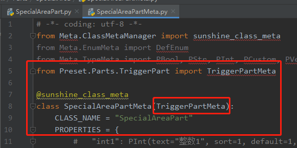

# 零件继承

用户在设计游戏玩法时，偶尔会有需求是可以在编辑器提供已有的内置零件或者资源包零件上进行一些扩展即可做到的，这时就可以用零件继承来更为方便的完成玩法的设计实现，而不用全部重新再来一次

## 样例

建议： 需要理解python的类的继承与方法重写的意义

需求：判定一个区域为特殊的瘴气区域，玩家进入其中时会受伤，僵尸类生物在其中后移速大幅增加

实现：编辑器内置已有触发器零件，能够监听实体进入/停留/离开某个区域，只需要在这之上补充部分逻辑即可

1. 新建一个空地图模板，因为需要指定区域，不要选择addon模板

1. 需要新建一个空零件（样例的零件名为SpecialArea）
    

2. 将零件的脚本与零件对应的属性脚本都继承对应的触发器脚本部分
    

3. 编写逻辑代码, 链接[在此][CodeUrl]，接口可在官方的api文档页面中找到[api][APIUrl]
```python
# -*- coding: utf-8 -*-
from Preset.Model.GameObject import registerGenericClass
from Preset.Parts.TriggerPart import TriggerPart
from mod.common.minecraftEnum import EntityType
from mod.common.minecraftEnum import ActorDamageCause


@registerGenericClass("SpecialAreaPart")
class SpecialAreaPart(TriggerPart):
	def __init__(self):
		super(SpecialAreaPart, self).__init__()
		# 零件名称
		self.name = "空零件"
		self.support = 2

	def InitServer(self):
		# 因为继承了别的零件，若需要重写方法，推荐调用一下基类的方法，保证基类的逻辑不会破坏。
		super(SpecialAreaPart, self).InitServer()
		# 监听基类发送的3个事件，
		self.ListenSelfEvent("OnTriggerEntityEnter", self, self.handleEntityEnter)
		self.ListenSelfEvent("OnTriggerEntityStay", self, self.handleEntityStay)
		self.ListenSelfEvent("OnTriggerEntityExit", self, self.handleEntityExit)

	def handleEntityEnter(self, data):
		# 触发器发送事件自带的参数
		part = data["TriggerPart"]
		entitySet = data["EnterEntityIds"]
		for entity in entitySet:
			# 获取进入实体的实体类型
			entityType = self.GetEntityEngineType(entity)
			if EntityType.Player == EntityType.Player & entityType:
				# 玩家实体则发送通知消息
				self.NotifyOneMessage(entity, "你进入了瘴气之地", "§c")

	def handleEntityStay(self, data):
		part = data["TriggerPart"]
		entitySet = data["StayEntityIds"]
		for entity in entitySet:
			entityType = self.GetEntityEngineType(entity)
			if EntityType.Player == EntityType.Player & entityType:
				# 给玩家一个缓慢的DeBuff效果
				self.AddEffectToEntity(entity, "slowness", 30, 2, True)
				# 每次检测都给区域内的玩家减掉1生命值
				print("SetHurtByEntityNew to Player", self.SetHurtByEntityNew(entity, 1, ActorDamageCause.Override, None, False))

			if EntityType.ZombieMonster == EntityType.ZombieMonster & entityType:
				# 给僵尸类型的生物一个等级3的加速效果（可在官网的api页面搜索对应的接口的参数含义）
				print("AddEffectToEntity to ZombieMonster", self.AddEffectToEntity(entity, "speed", 30, 2, True))

	def handleEntityExit(self, data):
		part = data["TriggerPart"]
		entitySet = data["ExitEntityIds"]
		for entity in entitySet:
			entityType = self.GetEntityEngineType(entity)
			if EntityType.Player == EntityType.Player & entityType:
				self.NotifyOneMessage(entity, "你离开了瘴气之地", "§f")
				# 移除玩家的减速
				self.RemoveEffectFromEntity(entity, "slowness")

			if EntityType.ZombieMonster == EntityType.ZombieMonster & entityType:
				# 移除僵尸的加速
				self.RemoveEffectFromEntity(entity, "speed")

	def DestroyServer(self):
		super(SpecialAreaPart, self).DestroyServer()
		self.UnListenSelfEvent("OnTriggerEntityEnter", self, self.handleEntityEnter)
		self.UnListenSelfEvent("OnTriggerEntityStay", self, self.handleEntityStay)
		self.UnListenSelfEvent("OnTriggerEntityExit", self, self.handleEntityExit)
```
4. 配置属性列表(只用原有的触发器的属性即可满足需求)
```python
# -*- coding: utf-8 -*-
from Meta.ClassMetaManager import sunshine_class_meta
from Preset.Parts.TriggerPart import TriggerPartMeta

@sunshine_class_meta
class SpecialAreaPartMeta(TriggerPartMeta):
	CLASS_NAME = "SpecialAreaPart"
	PROPERTIES = {
	}
```
5. 修改部分属性参数确保效果正确
   1. 将零件放置在预设下，并拖动放置在关卡编辑器的地图上
   2. 设置好起效的区域(设置区域的上方可以点击按钮定位显示选择的区域)
   3. 勾选监听3种状态（我们在逻辑代码监听了并处理了这3种事件）
   4. 因为我们只需要服务端的监听，就修改属性只监听服务端
    

6. 运行测试

    可一看到提示，僵尸怪物都有buff，女巫没有，人物右侧有debuff，可以自行运行感受
    


## 注意事项
1. 继承零件不仅可以继承内置零件，也可以继承自己写的零件，不过由于某些原因，继承自己写的零件时路径需要注意
    
2. 继承多个零件与继承单个零件类似，只需要确保脚本代码与属性代码都继承了即可

3. 下载代码的使用方式与零件通讯中的一致


[CodeUrl]: https://g79.gdl.netease.com/PartsInheritSample_SpecialArea.7z
[APIUrl]: /mcdocs/3-PresetAPI/预设对象/通用/SDK接口封装SdkInterface.md