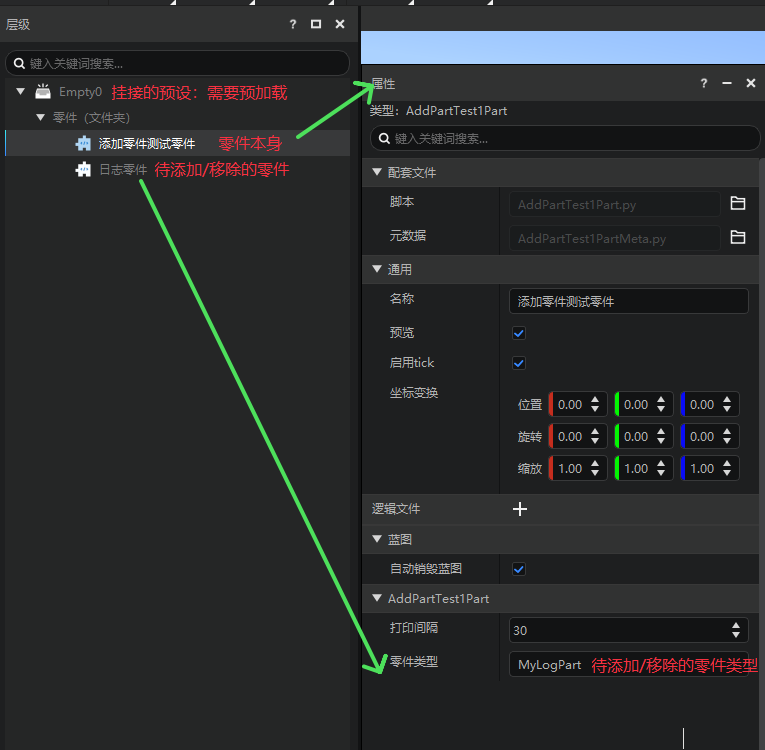

# 内置零件与模板零件
## 什么是零件
1.  零件是预设架构下，与代码绑定的一种玩法逻辑对象，它可以直接挂接到预设下，随着预设的加载而被加载实现零件代码里的逻辑。
2.  空零件和空预设就是没有任何玩法逻辑的空白模板，开发者可以在此进行代码的编写，并在合适的时机加载预设以达成自己的目标。
3.  为了帮助开发者快速上手"预设—零件"的新版开发方式，我们提供内置零件和模板零件两种具有实际玩法功能的零件供开发者使用和参考，希望开发者能使用中了解零件的生效逻辑和编写规范，最后能自己在空零件上自行编写代码，实现想要的功能。
## 什么是内置零件
内置零件就是在游戏引擎中内置好的一些玩法零件，开发者无法对内置零件的代码逻辑进行修改，也无法新建一个内置零件的副本进行编辑，开发者可以为预设添加内置零件，调整该零件的属性，以达到该零件所定义的功能。

目前已有的内置零件可在官网开发指南→玩法开发→预设玩法编程→理解预设系统→[内置零件](../0-理解预设系统/11-内置零件/00-触发器零件.md)找到相关介绍和说明。

## 什么是（模板）零件
（模板）零件是内置在编辑器内内置的一些具有特定功能的零件，开发者可以通过创建模板零件的副本，对该零件进行修改，以达到自己的目标。通俗来讲，模板零件就是为了实现某种功能，在空零件的基础上进行代码的编写，提供给开发者自己在副本上修改该零件的代码逻辑。

目前已有的模板零件有

### 1、添加零件测试零件（AddPartTestPart）
#### 简介：
添加零件测试演示了如何通过代码进行添加和删除零件

#### 逻辑简述：
该零件在TickClient 每隔 self.interval 的时间会执行一次 添加零件或删除零件函数（随机行为），添加的零件类型和执行的时间间隔可通过属性面板设置

#### 使用方法：
	1. 确保要添加的零件存在于存档中
	2. 设置好执行间隔
	3. 启动运行，查看log打印信息

运行游戏后可在测试日志窗口看到对应日志

### 2、零件接口测试零件（ApiTestPart）
#### 零件简介：
零件接口测试零件是提供几个简单的例子说明如何对零件接口进行测试。
#### 主要逻辑描述：
监听服务器ServerChatEvent接口，可以获取聊天窗口的输入，并根据预先实在好的消息分发调用不同的函数。
这里预先设置好调用有：
spawn -> 复制当前所有的实体预设实例
add_part -> 为所有的实体预设实例添加零件
destory_entity_preset -> 销毁所有的预设实例
show_preset_info->控制台打印当前预设实例的信息
#### 使用方法：
	1. 把本零件绑定在一个预加载的空预设上，
	2. 确保关卡中至少有一个实体预设实例
	3. 确保本零件的“零件类型”属性所有指定的零件存在
	4. 点击“运行”，在对话框中输入：spawn、add_part、destory_entity_preset、show_preset_info并查看效果

### 3、日志零件（MyLogPart）
#### 零件简介：
日志零件演示如何打印log输出
#### 逻辑简述：
TickClient函数每个时间间隔会打印日志，时间间隔通过self.interval变量随机控制，日志内容是该零件的路径名和世界坐标
#### 使用方法：
	1.通过属性面板设置好打印间隔区间
	2.启动运行，查看log打印信息
### 4、网络同步零件（NetworkReplicatedPart）
#### 零件简介：
演示如何在零件中快捷实现网络同步的功能
#### 逻辑简述：
在零件类初始化函数中设置需要网络同步的字段在replicated中，运行时会从服务器到客户端同步同步这些字段的值
#### 使用方法：
	把该零件挂接在预加载预设，然后启动游戏，查看log
### 5、分裂零件（ReplicatePart）
#### 零件简介：
 分裂零件主要是配合实体预设达到受伤分裂的玩法功能。
#### 逻辑简述：
1. 初始化时指定实体血量（可配置）
2. 当实体受到实际伤害时，若此次攻击未击杀实体，则在实体附加生成一个新的实体预设
3. 若未勾选循环生成（可配置），则移除新生成实体预设下的分裂零件，否则当新生成的实体受到伤害时，同样会分裂新的实体。

#### 使用方式：
 	挂载在实体预设下，视需要配置零件属性即可。

### 6、变化动画零件（TransformAnimationPart）
#### 零件简介：
	变换动画零件展示了如何通过零件来操作游戏对象的变换

#### 逻辑简述：
1. 此零件在运行时，会动态设置父亲节点的变换（相对位移、旋转与缩放）。
2. 在给定的持续时间和给定的关键帧参数下，此零件会进行线性插值，得出每一帧需要设置的变换，在tick的过程中进行变换设置。
3. 这里选取了特效是为了方便展示效果，由于特效是纯客户端的，因此只需要实现客户端对应的接口即可。
4. 实际上你可以把它挂接到其他类型的预设上，如实体预设，实现移动，放大的一些效果，但需要实现在零件的服务端接口。
5. 你也可以把所有客户端接口，全部改为服务端接口（如InitClient => InitServer等)，也能达到类似的效果，但性能会很差，因为每次变换都需要服务端通知客户端进行变换。

#### 使用方法：
	1. 将此零件挂接在任意特效底下。
	2. 编辑该零件的关键帧属性，控制在动画期间，每个关键帧父亲特效的目标变换（相对位移、旋转与缩放）。
	3. 如果希望特效动画只播放一次，勾选自动销毁，如果希望特效循环播放，勾选循环。
### 7、测试触发器零件（TriggerTestPart）
#### 零件简介：
测试触发器零件，需要和触发器零件配合使用
#### 逻辑简述：
当实体进入、离开、停留在对应触发器零件的区域内时，打印相关日志
#### 使用方法：
	1.将该零件和对应的触发器零件挂接到同一预设下
	2.通过属性面板设置好对应的触发器零件的名称
	3.启动运行，查看log打印信息

### 8、输入绑定零件（InputBindPart）
#### 零件简介：
输入绑定零件提供了通用的系统按键监听广播流程
#### 逻辑简述：
开发者可以在"按键绑定"属性中定义自定义事件以及唤起该事件所需要按下的系统按键。
当某个按键被按下或抬起时，对应的自定义事件就会被广播。
开发者可以在零件代码中调用零件的事件监听函数监听，或在mod代码中调用系统监听函数监听。
#### 使用方法：
	1.通过属性面板设置自定义事件以及绑定的系统按键
	2.在需要的脚本中编写监听函数监听对应的自定义事件
	3.启动运行，查看回调运行情况
### 9、预设测试零件（PresetDebugPart）
#### 零件简介：
预设测试零件用于输出当前指定端的预设信息
#### 逻辑简述：
服务器通过监听ServerChatEvent事件获取玩家聊天窗口的输入,根据输入内容，判断需要打印哪个端的预设信息
#### 使用方法：
	聊天窗口输入下列字符以调用对应的功能：
	preset client --> 输出当前客户端的所有预设实例信息
	preset server --> 输出服务器所有预设实例信息
	preset client <id> --> 输出当前客户端的指定id的变换对象实例信息
	preset server <id> --> 输出服务器的指定id的变换对象实例信息
	输出信息格式为蓝色字体：节点显示路径 [当前节点及递归节点id列表]