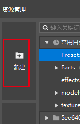
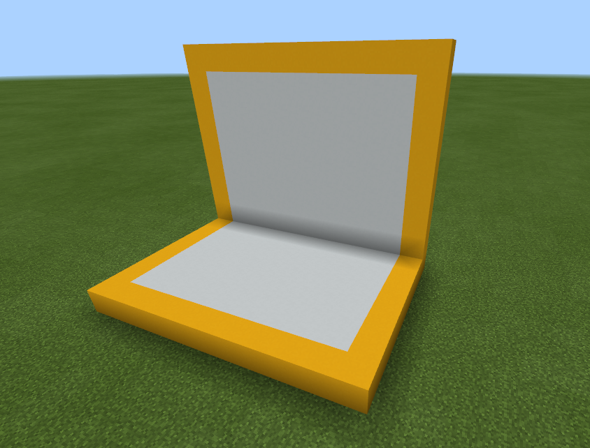
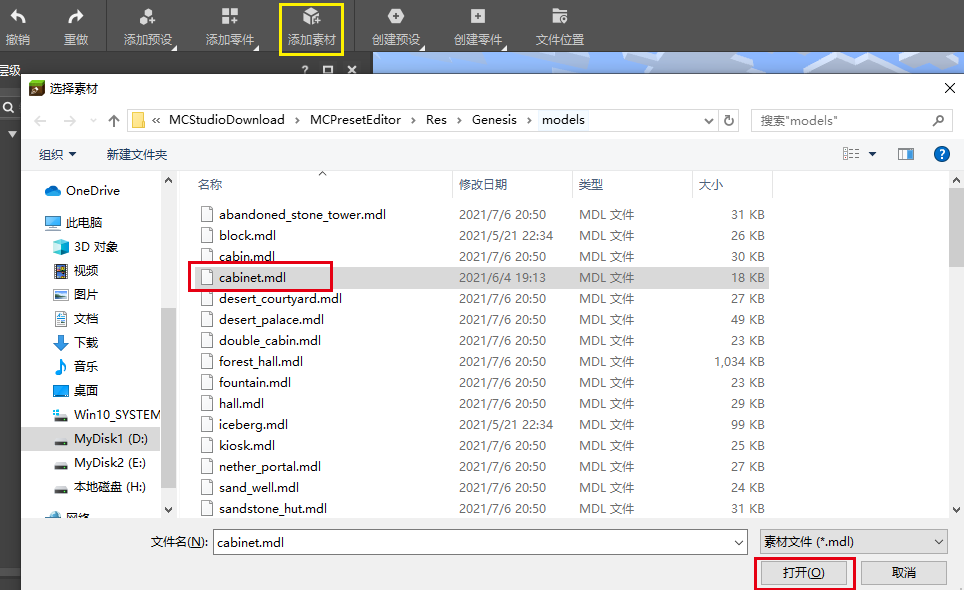
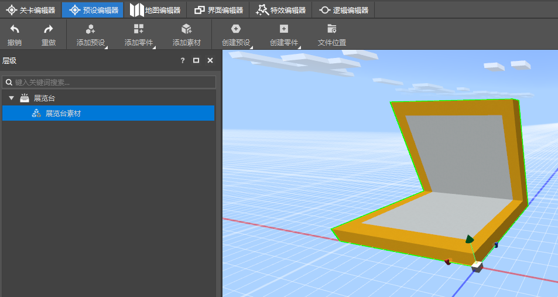

# 新建预设并添加素材

## 什么是预设？

预设（Preset）就是预先设定的意思。即开发者们可以将方块、素材、实体、特效以及玩法逻辑拼装成一个预设。

预设作为文件被保存在行为包的Preset目录中，如下图，在资源管理器的常用目录中，可以找到Preset文件夹。

在使用时，一个预设作为一个整体被放置在游戏中，被放置到游戏中的预设被称为实例。

预设的后缀是.preset，如果你对预设到底是什么感兴趣，可以使用文本编辑器打开预设文件，查看它的结构。

## 创建第一个预设

我们使用资源管理器的新建功能。

这将打开新建文件向导界面，在这个界面中，选择空预设，并点击下一步。

在下一步中，将文件命名为Cabinet，然后点击创建，就创建了一个名称是Cabinet的空预设。你现在可以在前述的Preset文件夹中发现这个预设。

> 由于预设文件的路径是固定的，所以通常在一个作品中不能存在两个同名的预设。
>
> 预设文件的名称中不能出现中文字符。

## 为预设添加素材

首先，使用地图编辑器创建一个如下图的方块建筑，并将其保存为素材（或者点击<a href="https://g79.gdl.netease.com/cabinet.mdl" target="_blank" rel="noopener noreferrer">这里</a>下载）。

在资源管理器中双击之前创建的Cabinet.preset（展览台预设），打开预设编辑器。

下面我们为这个预设添加刚才制作的素材。点击预设编辑器的添加素材按钮，打开选择素材的文件夹，选择刚才制作或下载的素材，点击打开。

素材会被导入作品的BoxData目录（见下图的目录），并且被添加到预设中。

现在，你已完成了一个包含素材的展览台预设，你可以在层级面板中点击节点，并在属性面板中对其名称进行修改。

下面这张图就是展览台预设当前的样子。

