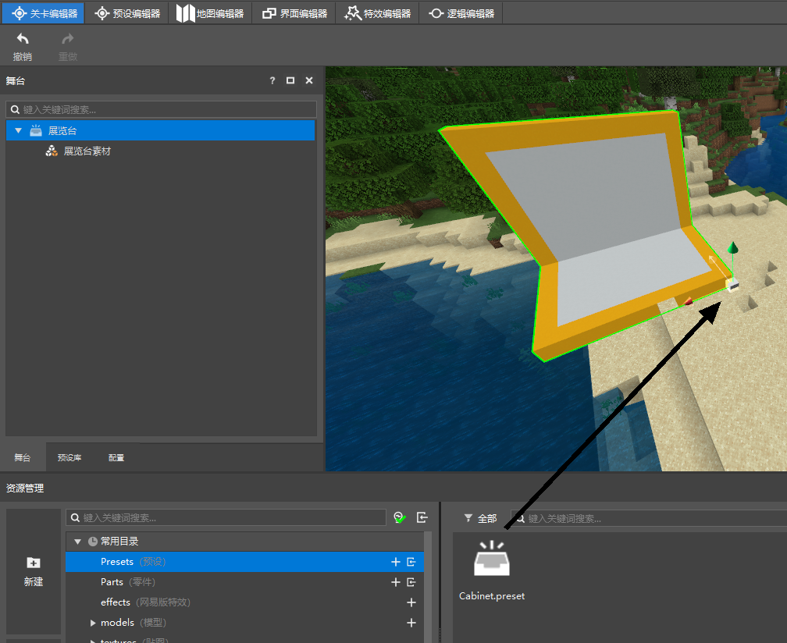
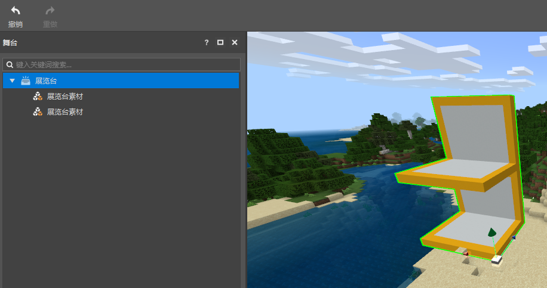
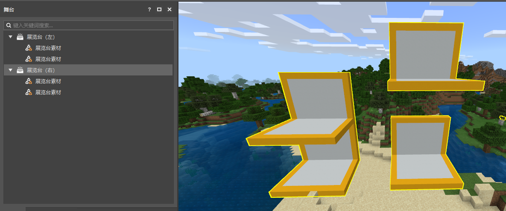
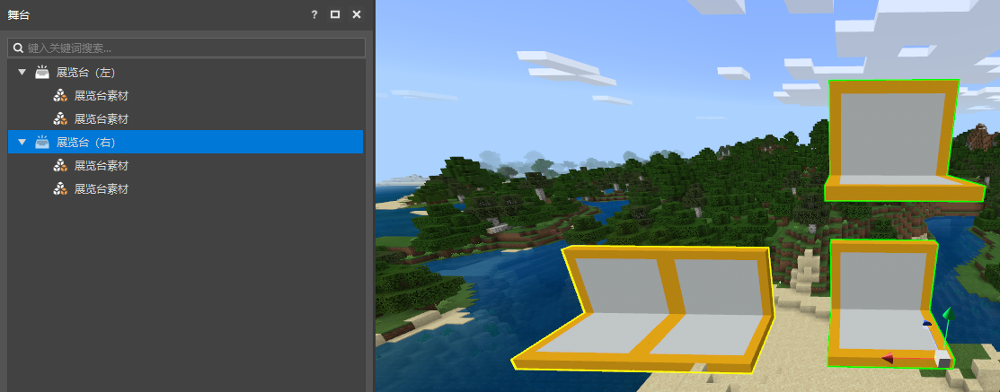

# 在场景中实例化

## 将预设放入场景

打开关卡编辑器，并且在资源管理器中打开我们的预设（Preset）文件夹。

在这里找到我们刚刚创建好的Cabinet预设，并将其拖拽到场景中，调整好位置后松开鼠标，这样你就成功的在场景中创建了一个Cabinet预设的实例，并且在关卡编辑器的舞台中，你可以看到这个实例的结构。

在舞台上选中展览台节点，然后可以在预览窗中通过坐标系拖柄对其的位置进行实时更改。

## 修改预设

现在我们重新在资源管理器中双击Cabinet预设，在预设编辑器中打开它。

然后选中展览台素材，使用Ctrl+D快捷键，或者右键菜单的创建副本功能，创建一个展览台素材的副本，并且调整其的位置如下。

然后保存，返回关卡编辑器。

你可以看到之前放置在场景中的展览台预设也跟着更新了。

在编辑器中，实例与预设是引用关系。场景中所有的实例，都是引用的某个预设的数据，所以，当预设发生改动时，实例也会跟着改动。

一个预设可以在场景中生成任意数量的实例，当你修改预设时，场景中的所有实例都会跟着改变。

## 修改实例

下面，我们在舞台中创建一个展览台实例的副本，将其拖拽到一边，并按照如下方式对这两个实例进行重命名。

然后，我们将展览台（右）实例的其中一个展览台素材抬高一点，最终得到下图的样子。

可以看到，我们可以单独对某个实例进行修改，对实例的修改不会影响到其他实例，并且也不会影响到预设，你的预设依旧是左边这个实例的样子。

此时，如果我们修改预设，比如说将展览台预设上面的素材摆到下面的展览台素材的左侧与他平齐。

然后返回关卡编辑器，你会发现，只有未经改动的实例发生了变化。

即如果实例的某一个节点发生了修改，实例会记录这种修改，并忽略他引用的预设的这个值。

