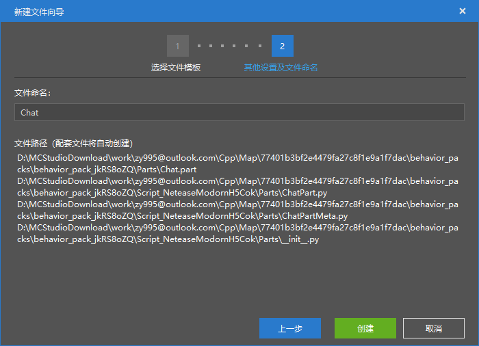
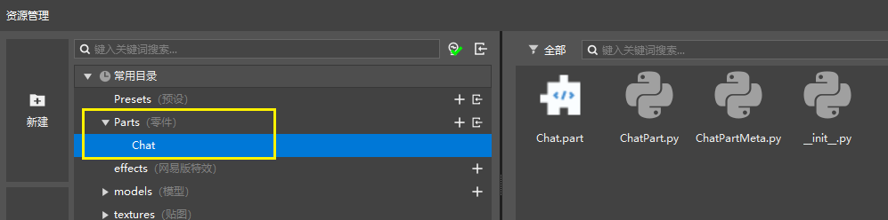

# 创建零件

零件是预设架构下，一种可以挂接到预设下的玩法逻辑对象。

我们首先通过新建文件向导创建一个零件。通过资源管理器左侧的“新建”按钮打开新建文件向导，然后在常用页签里选择空零件，点击下一步。

我们将零件命名为Chat，在这里你会发现，我们在创建零件的时候，同时创建了4个文件。

- Chat.part：零件的本体文件，与.preset的预设类似
- ChatPart.py：这个是零件绑定的python脚本文件，我们后续的逻辑需要写在这个文件里。
- ChatPartMeta.py：这个是ChatPart.py的Meta文件，主要用于将ChatPart.py的属性暴露至属性面板中。
- \_init\_.py：固定的文件结构

点击创建，完成Chat零件的创建，资源管理器自动跳转到刚创建的零件的文件夹。

