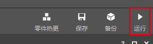
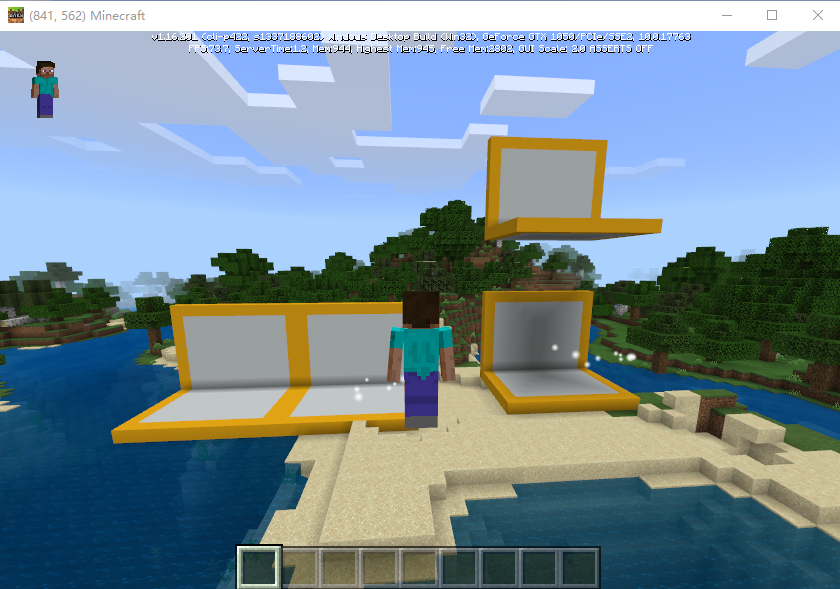
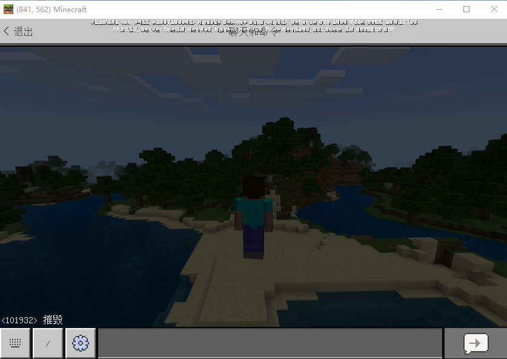
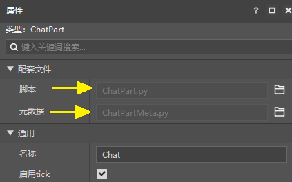
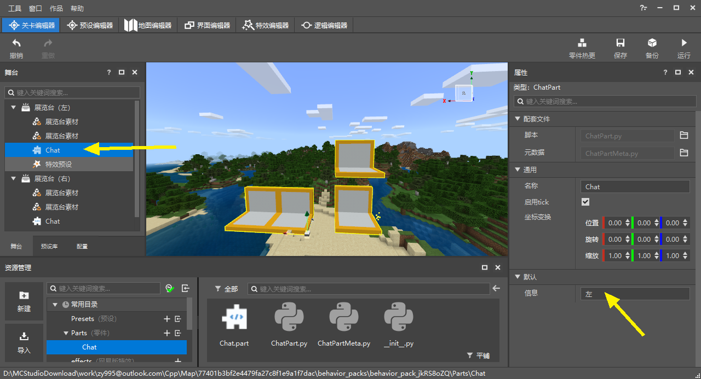
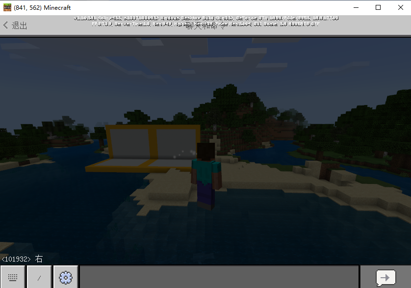

# 使用零件编程

## 内置函数

现在我们已经把零件通过挂接到预设的方式，在场景中实例化了，下面我们可以进行零件的编程了。

当然，你也可以先进行零件的编程，再进行他的挂接和实例化。

我们找到上一步创建的零件的文件夹，然后双击打开ChatPart.py，这里把他的代码粘贴在下方。

你可以发现，在零件的代码中，我们已经为你生成了总计6个内置函数，这些函数就是零件代码的逻辑入口。

```python
# -*- coding: utf-8 -*-
from Preset.Model.PartBase import PartBase
from Preset.Model.GameObject import registerGenericClass


@registerGenericClass("ChatPart")
class ChatPart(PartBase):
	def __init__(self):
		super(ChatPart, self).__init__()
		self.name = "Chat"

	def InitClient(self):
		pass

	def InitServer(self):
		pass

	def TickClient(self):
		pass

	def TickServer(self):
		pass

	def DestroyClient(self):
		pass

	def DestroyServer(self):
		pass
```

他们分别是这些逻辑的入口：

- \_init\_：零件初始化时，一般仅在此声明变量
- InitClient：零件实例的客户端初始化时
- InitServer：零件实例的服务端初始化时
- TickClient：零件实例的客户端每帧调用
- TickServer：零件实例的服务端每帧调用
- DestroyClient：零件实例的客户端销毁时
- DestroyServer：零件实例的服务端销毁时

直接在脚本里重写这些函数就可以在这些时机执行对应的逻辑。


## 零件python编程

接下来，我们使用零件来实现一个简单的逻辑，我们在聊天栏输入“摧毁”时，摧毁这个零件的父预设实例。

当一个实例被摧毁时，挂接在他下面的所有实例也会跟着摧毁，所以，在这种情况下展览台预设下的。

代码如下，由于我们只用到服务端的初始化和销毁时，所以我们可以把其他的内置函数删除。

可以看到，我们在InitServer里监听了ServerChatEvent事件，当系统（我的世界）里发生玩家的聊天框输入时，会调用零件的OnServerChat函数。

然后我们在OnServerChat函数中判断，如果玩家输入的是摧毁，就摧毁父预设。

```python
	def InitServer(self):
		import mod.server.extraServerApi as serverApi
		self.ListenForEvent(serverApi.GetEngineNamespace(), serverApi.GetEngineSystemName(), "ServerChatEvent", self, self.OnServerChat)

	def DestroyServer(self):
		import mod.server.extraServerApi as serverApi
		self.UnListenForEvent(serverApi.GetEngineNamespace(), serverApi.GetEngineSystemName(), "ServerChatEvent", self, self.OnServerChat)

	def OnServerChat(self, args):
		# 生成掉落物品
		# 当我们输入的信息等于摧毁时，摧毁父节点
		if args["message"] == "摧毁":
			self.GetParent().Destroy()
```

> 当前我们已经支持在文件头 import 大部分库/文件。
>
> 如果产生了报错，可以在使用时 import。


## 使用Mod开发包测试结果

点击编辑器右上角的运行，进行本作品的开发测试。



> 使用0.16.12（7月15日更新），或者更高版本的MC Studio新建的作品，只能使用1.23或更高版本的开发包进行开发测试

在运行的开发包中可以看到场景中的2个实例。



按回车调出指令窗，输入：摧毁，此时只有一个展览台实例被摧毁了，但两个展览台是都应该被摧毁的。

MC的事件机制是当一个事件的函数执行完毕时，才会发送下一个事件，而我们在执行的过程中进行了事件的反监听，导致了这一问题。

所以我们修改一下代码，让删除父节点的行为在事件触发的下一帧执行。

在资源管理器里找到Chat零件的文件夹，然后右键空白处，选择打开当前文件夹，我们在Windows的资源管理器内创建一个新的python文件，命名为coroutineMgrGas.py，然后将如下代码复制进去（此部分代码涉及的知识点较深，可以先按步骤操作）：

```python
# -*- coding: utf-8 -*-
import time

# 这个类的作用是延迟执行给定的函数
# 使用参考每个具体使用的地方，yield 正数为时间，负数为帧数
class CoroutineMgr(object):
    coroutines = {}
    globalEnd = []
    addCoroutines = {}

    @classmethod
    def StartCoroutine(cls, iter):
        cls.addCoroutines[iter] = 0
        return iter

    @classmethod
    def StopCoroutine(cls, iter):
        cls.globalEnd.append(iter)

    @classmethod
    def Tick(cls):
        if cls.addCoroutines:
            for c,v in cls.addCoroutines.iteritems():
                cls.coroutines[c] = v
        cls.addCoroutines = {}
        if cls.globalEnd:
            for c in cls.globalEnd:
                if cls.coroutines.get(c):
                    del cls.coroutines[c]
            cls.globalEnd = []
        ended = []
        for c, v in cls.coroutines.iteritems():
            try:
                if v < 0:
                    v += 1
                    cls.coroutines[c] = v
                if v == 0 or (v > 0 and time.time() >= v):
                    newv = c.next()
                    if newv > 0:
                        newv = newv + time.time()
                    cls.coroutines[c] = newv
            except StopIteration:
                ended.append(c)
        for c in ended:
            del cls.coroutines[c]

```

然后修改ChatPart.py的代码如下：

```python
from coroutineMgrGas import CoroutineMgr

    ……

    def TickServer(self):
		CoroutineMgr.Tick()

    def OnServerChat(self, args):
		# 生成掉落物品
		# 当我们输入的信息等于摧毁时，摧毁父节点
		if args["message"] == "摧毁":
			CoroutineMgr.StartCoroutine(self.DelayDestroy())

	def DelayDestroy(self):
		yield -1
		self.GetParent().Destroy()
```

现在我们再进行开发测试，可以看到现象正常了！




## 使用属性面板修改零件

我们在资源管理器中点击Chat.part，可以在他的属性面板中发现它的两个配套文件。除了在ChatPart.py里编程之外，我们还可以利用ChatPartMeta.py将ChatPart.py中的变量暴露到编辑器的属性面板中。

点击配套文件右侧的小图标可以直接打开它。



首先，我们先改造一下ChatPart.py，将“摧毁”作为一个变量使用。

```python
	def __init__(self):
		super(ChatPart, self).__init__()
		self.name = "Chat"
		self.message = "摧毁"

	def OnServerChat(self, args):
		if args["message"] == self.message:
			......
```

改造后的零件在使用上与之前没有什么区别，接下来，我们打开ChatPartMeta.py，这里面已经自动帮我们写好了一些必要的代码，我们在这个文件中键入1行代码，整体效果如下：

```python
@sunshine_class_meta
class ChatPartMeta(PartBaseMeta):
	CLASS_NAME = "ChatPart"
	PROPERTIES = {
		"message": PStr(group="默认", text="信息"),
	}
```

然后返回编辑器，我们可以发现，Chat.part的属性面板中增加了我们自己定义的“信息”变量。


接下来，我们在舞台上找到Chat零件，分别把两个展览台预设的Chat零件的信息更改为“左”和“右”，然后保存并重新点击运行进行开发测试。



我们打开聊天窗口，输入：右。

这次，只有右边的展览台实例被删除了！


