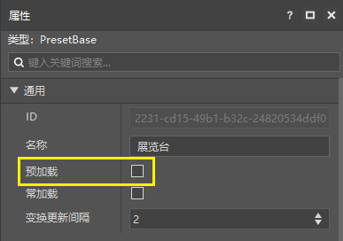
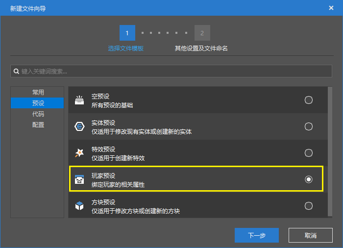

# 使用预设制作AddOn

## 让预设预加载

我们说，无论预设还是零件，只有在场景中实例化才会生效。

对于地图来说，我们只需要把预设从资源管理器拖拽至场景即可。但是对于AddOn（附加包）来说，由于AddOn是不包含地图的，所以无法通过这种方式来使预设和零件的逻辑生效。

对于空预设来说，我们提供了一个叫做预加载的功能。

在资源管理器中选中你的空预设，你可以在它的属性面板中启用这个功能。

启用预加载后，预设会有如下特性：

1. 预设会在区块加载前，在(0,100,0)位置进行加载
2. 不能在这个预设下挂接依赖区块的子节点，如素材，特效预设，EntityBasePart等
3. 预加载的预设会自动出现在舞台中，无需手动放置
4. 修改舞台中后缀带（预加载）的预设，将直接修改预设文件

## 使用玩家预设

我们提供的内置预设中，包括了玩家预设。

玩家预设会在游戏开始时自动实例化并绑定MC的玩家实体。

如果你要写的逻辑与玩家预设相关，你可以将相应的零件和预设挂接到玩家预设下。这样，即使在AddOn中，玩家预设也会正常加载。

> 如果进行多人游戏，每个玩家实体都会绑定一个玩家预设，所以除非你的逻辑真的与玩家相关，否则还是推荐使用预加载。

