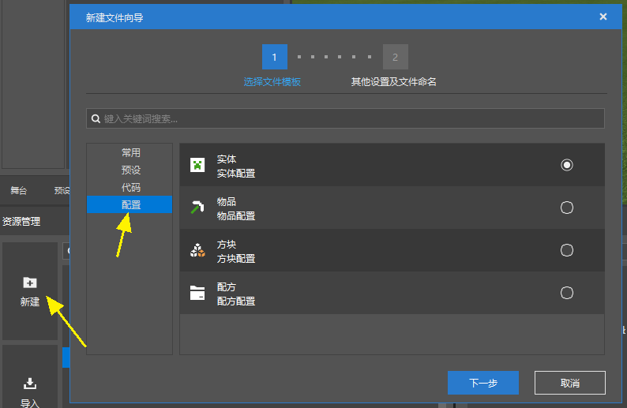
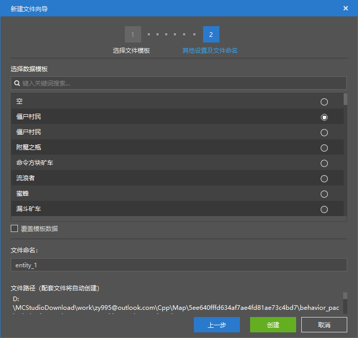
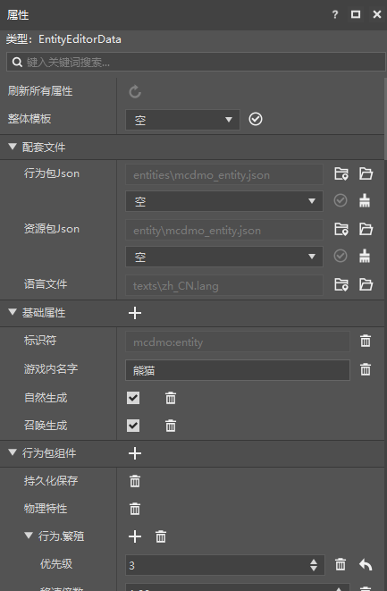
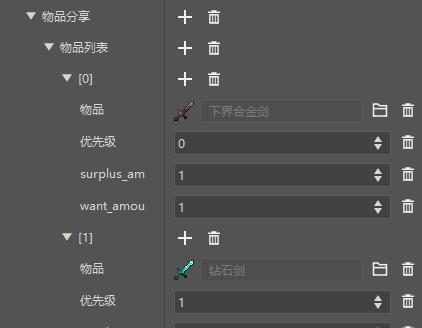
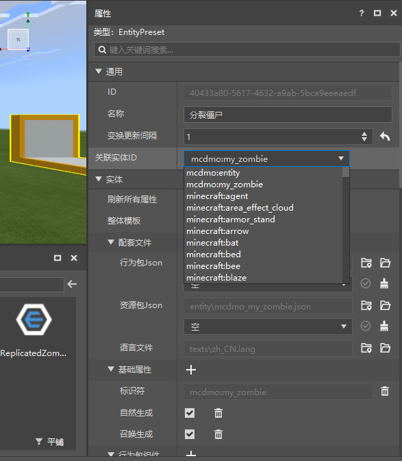
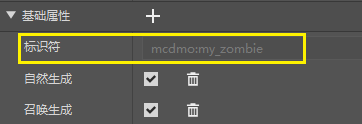

# 配置

## 什么是配置

我的世界基岩版中，你可以使用一系列文件对游戏进行配置来制作附加包。

比如想要制作一个自定义的生物，你可以在如下的3个文件夹中：

- 在行为包的entities文件夹下，添加生物的行为包Json
- 在资源包的entity文件夹下，添加生物的资源包Json
- 在texts文件夹下的zh_CN.lang中添加生物的中文名称

作品文件夹
|--&nbsp;.mcs&nbsp;&nbsp;*//文件夹，保存了编辑器配置信息。*
|--&nbsp;behavior_packs&nbsp;&nbsp;*//文件夹，行为包集合，下面可放置多个行为包。*
|&nbsp;&nbsp;&nbsp;|--&nbsp;behavior_pack_\*\*\*&nbsp;&nbsp;*//文件夹，行为包，命名并没有固定的格式。*
|&nbsp;&nbsp;&nbsp;&nbsp;&nbsp;&nbsp;&nbsp;&nbsp;|--&nbsp;entities&nbsp;&nbsp;*//文件夹，放置实体的JSON文件，配置实体的血量、攻击、行为等。*
|--&nbsp;resource_packs&nbsp;&nbsp;*//文件夹，资源包集合，下面可放置多个资源包。*
|&nbsp;&nbsp;&nbsp;|--&nbsp;resource_pack_\*\*\*&nbsp;&nbsp;*//文件夹，资源包，命名并没有固定的格式。*
|&nbsp;&nbsp;&nbsp;&nbsp;&nbsp;&nbsp;&nbsp;&nbsp;|--&nbsp;entity&nbsp;&nbsp;*//文件夹，放置实体客户端的配置JSON文件。*
|&nbsp;&nbsp;&nbsp;&nbsp;&nbsp;&nbsp;&nbsp;&nbsp;|--&nbsp;texts&nbsp;&nbsp;*//文件夹，放置文本lang文件。*

在新版编辑器中，这一系列的文件就叫做配置，配置功能的本质就是将原本修改Json文件的方法改为可视化图形操作，开发者在编辑器对配置的新建、编辑和删除，都会同步更新到模组的资源文件中。

## 新建配置

你可以使用资源管理器的新建文件向导进行配置的创建，此时会同步创建配套文件
>每种配置都对应着不同的Json文件，具体可以参考[配置与JSON关系说明](./14-配置与JSON文件关系.md)

我们当前提供11种配置可以使用
- 实体配置
- 物品配置
- 方块配置
- 配方配置
- 交易表配置
- 掉落表配置
- 生成规则配置
- 维度配置
- 生物群系配置
- 特征配置
- 特征生成配置
> 旧版关卡编辑器组件的配置类组件会在后续更新中逐渐补全。

在新建配置时（以实体配置为例），你可以为配置选择一个数据模板（或者选空）。

如果你选择了模板，你创建出来的配置将与数据模板的大部分数据相同，通过使用这种方法，你可以很方便的创造出一种实体的变体。

> 当前数据模板几乎包含了所有MC的原版实体。

如果在这里勾选了“覆盖模板数据”，那么创建出来的配置将覆盖原版的数据。

> 比如你在这里选择僵尸，并且勾选覆盖模板数据，那么，你创建出来的僵尸将替换原版的僵尸。
>
> 每个模板最多可以被覆盖1次。

选择数据模板时，可以对数据模板进行搜索。

## 管理配置

所有创建出来的配置都会显示在关卡编辑器的配置面板中。

> 事实上，如果你没有通过新建文件向导创建，而是手动创建了Json文件，且创建正确的话，你创建的结果仍然会显示在这个面板中。

不同种类的配置在配置面板中有不同的标签，你也可以在“全部”标签里找到所有的配置。

- 点击配置，可以在属性面板中对其进行修改。

- 右键某个配置，可以对其进行删除操作。

- 对于实体配置和方块配置来说，每种配置最多可以与一个预设进行绑定，你可以在配置面板中快捷创建绑定这个配置的预设。

> 方块配置和实体配置即使不绑定预设也可以生效，但实体预设和方块预设一定要绑定一个配置才行。

## 修改配置

### 配套文件

以实体预设为例。

- 刷新所有属性：正常情况下，这个按钮是禁用的。但有时，对配置的修改无法立即生效，这个按钮在这时变为可用状态，点击按钮可以完成对配置的刷新。
- 整体模板，行为包Json，资源包Json：你可以在下拉框中选择你需要的模板，并点击√按钮，进行模板数据的整体替换。
- 行为包Json，资源包Json的刷子按钮：点击可以将对应的文件清空。

> 资源包Json情况复杂，我们已经对不能直接应用替换的资源包Json数据模板进行了过滤。

整体模板，行为包和资源包的数据模板的数量较多，我们在这3个下拉框中进行了搜索的支持，参考下面这张动图。

### 添加字段

> 以下针对具体字段的显示和修改（而非整体数据模板的应用）。
>
> 对于实体配置，当前编辑器仅支持行为包的Component的修改。
>
> 对于资源包和行为包的其他字段，需要等待后续支持，当前仍需手动修改Json文件。

配置本质上是Json，属性面板中的每一个属性条目就可以理解为Json中的一个字段。

- 点击属性标签或者属性条目右侧的“+” = 在这个字段下添加一个字段
- 点击属性条目右侧的“垃圾桶图标” = 删除这个字段

在配置中，我们将添加字段称为添加特性。添加特性时，我们会自动为你筛选出可以被添加的特性，并且会过滤重复的特性。

下面这个就是点击“+”后弹出的添加特性界面，里面的每一个条目就是一个可以添加的字段，每一个条目显示如下的信息：

- 特性的英文名称，即字段名
- 特性的数据类型，即字段的数据类型
- 特性中文名称，即我们对字段名的中文翻译
- 特性描述，即该字段的作用

选中特性并点击添加，即可把选中的特性添加至配置中。
>提示：选择框为多选，你可以同时勾选或取消多个字段

MC附加包的字段浩如烟海，我们为此提供了搜索功能，添加特性弹窗的所有文字都被纳入搜索范围。

添加好特性（字段）后，你就可以对特性的值进行编辑了，对于一些特殊的数据类型，编辑器进行了一定程度改进，例如下图的物品，你可以充分发挥编辑器的威力来降低特性编辑出错的概率。

> 了解MC的附加包（Molang，Json字段的含义）是一个大工程，我们强烈推荐您通过数据模板的方式了解MC每个原版实体，生物，物品等等是如何配置出来的，并通过这种方式学习每个字段的含义、和其他字段的搭配、字段的值的取值范围以及具体的使用方法。

## 预设与配置的绑定

如前所述，实体预设和方块预设必须要绑定一个配置才能使用。

通常情况下，在创建预设时，新建文件向导会自动的处理好配套的配置的创建和绑定。如果先创建了配置，也可以通过配置的右键菜单进行绑定这个配置的预设的创建。

但是如果你想切换预设绑定的配置，可以在预设的属性面板中做到这一点，如下图所示。

> 这个下拉框选择的是MC原版的和你新建的所有实体的标识符。并且这个下拉框也提供了搜索功能。

如下图所示，这个就是配置的标识符。

> MC中，包括附加包，Mod，不能有重复的标识符，否则后读取的同标识符的配置会替换之前读取的。

