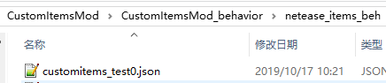
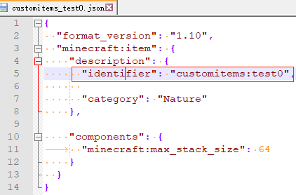
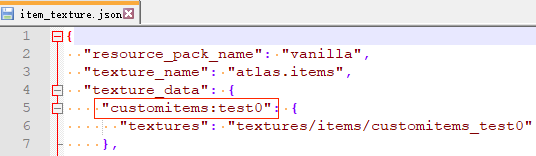

# 自定义基础物品

## 概述

开发者可以通过在addon中配置json来添加自定义物品。添加的自定义物品支持“MOD SDK文档”中与物品相关的所有事件及接口。

## 组件事件流程


**注意：ActorUseItemClientEvent（ActorUseItemServerEvent）与ClientItemTryUseEvent（ServerItemTryUseEvent）的先后顺序与使用的物品有关。**

## 注册

以demo [CustomItemsMod](../../13-模组SDK编程/60-Demo示例.md#CustomItemsMod)为例

1. 在behavior中新建`netease_items_beh`目录

   

2. 在目录下新建一个json，编写物品的定义。

   * json中至少有一个component
   * identifier分为命名空间及物品名，命名空间推荐与mod名称一致，identifier必须全局唯一。mod中其他地方都是用这个identifier与这个自定义物品对应上。**identifier由小写字母以及下划线组成，请勿使用大写字母。**

   

   

3. 下面开始操作resource包。

   将物品的贴图放到`textures\items`中

   

4. 在textures中新建`item_texture.json`，编写资源名与贴图的对应关系。资源名的命名必须满足全局唯一。json格式可参考“Mod PC开发包”的`data\resource_packs\vanilla\textures\item_texture.json`

   

   

5. 在resource中新建一个`netease_items_res`文件夹，在文件夹中添加json，用于配置物品的表现属性，例如贴图。category字段需要与behavior包中的设置一致或者不填，否则可能出现错误。<a name="item_reg_5"></a>

   这个json的identifier需要与behavior中的一致，贴图的值需要与上一步`item_texture.json`中配置的资源名对应。json格式可参考“Mod PC开发包”的`data\resource_packs\vanilla\items`

   

   

6. 在`texts\zh_CN.lang`中配置物品的中文名称。

   键的格式为item.物品identifier.name

   

   

7. 重复1-6编写其他自定义物品

## JSON说明

### format_version

请填写1.10

### description

| 键                      | 类型 | 默认值 | 解释                                                         |
| ----------------------- | ---- | ------ | ------------------------------------------------------------ |
| identifier              | str  |        | 包括命名空间及物品名。需要全局唯一。<br>建议使用mod名称作为命名空间 |
| category                | str  | items  | 注册分类，可选的值有：<br>construction：注册到建筑<br>equipment：注册到装备<br>items：注册到物品<br>nature：注册到自然<br>commands：只有指令和API可获取<br>none：只有API可获取<br>以及<a href="../../../20-玩法开发/15-自定义游戏内容/13-自定义物品分页.html#使用" rel="noopenner">自定义分页</a>名称 |
| custom_item_type        | str  |        | 自定义物品类别，可选值有：<br>weapon<br>armor<br>egg<br>ranged_weapon<br>bucket<br>projectile_item<br>shield |

## 原版components

网易版物品支持的微软原版component包括：（参数及解释见[开发wiki](https://wiki.mcbe-dev.net/p/Manual:%E6%95%B0%E6%8D%AE%E9%A9%B1%E5%8A%A8/%E7%89%A9%E5%93%81)和[微软文档](https://learn.microsoft.com/en-us/minecraft/creator/reference/content/itemreference/examples/itemcomponentlist?view=minecraft-bedrock-stable)）

### minecraft:foil

使物品拥有附魔光效

```json
"minecraft:foil": true,
```

### minecraft:food

[自定义食品](#自定义食品)组件

```json
"minecraft:food": {
	"nutrition": 4,
	"saturation_modifier": "low"
},
```

### minecraft:hand\_equipped

使手持物品按武器的方式渲染，即竖直的拿在手里

```json
"minecraft:hand_equipped": true,
```

### minecraft:hover\_text\_color

> 该组件为资源包组件，需在资源包netease_items_res的物品JSON中定义

设置物品悬浮文本的颜色，需要填对应颜色的名称，详见[颜色代码](https://zh.minecraft.wiki/w/%E6%A0%BC%E5%BC%8F%E5%8C%96%E4%BB%A3%E7%A0%81#%E9%A2%9C%E8%89%B2%E4%BB%A3%E7%A0%81)

```json
"minecraft:hover_text_color": "gold",
````

### minecraft:icon

> 该组件为资源包组件，需在资源包netease_items_res的物品JSON中定义

设置物品的贴图，贴图具体路径需定义在item_texture.json中

```json
"minecraft:icon": "apple",
````

### minecraft:max\_damage

使物品拥有耐久度，范围为[0, 32767]

> 若物品堆叠数量大于1时，耐久度的变化对整一叠的物品生效。并且耐久度为0后，每次消耗耐久度的行为会使数量减1

```json
"minecraft:max_damage": 1561,
````

### minecraft:max\_stack\_size

设置物品最大堆叠数量，**注意：该值无法超过64**

```json
"minecraft:max_stack_size": 16,
````

### minecraft:seed

设置物品的农作物属性

| 键          | 类型          | 默认值 | 解释               |
| ----------- | ------------- | ------ | ------------------ |
| crop_result | string        |        | 种植放置出的方块   |
| plant_at    | array(string) |        | 可被种植的方块列表 |

> plant_at列表中需要保持格式一致，如["minecraft:grass", "minecraft:dirt"]或["grass", "dirt"]，否则在相邻自定义农作物种植新的农作物会导致上一个农作物被破坏

```json
"minecraft:seed": {
	"crop_result": "sweet_berry_bush",
	"plant_at": ["grass", "dirt", "podzol"]
},
```

### minecraft:stacked\_by\_data

设置不同aux值的物品是否能够堆叠，例如aux值为1的燃料无法和aux值为2的燃料堆叠在一起，此外，该组件也会导致不同aux的物品在合成配方中被识别为不同的合成原料。
> 1. 不同aux的物品可以使用<a href="../../../../mcdocs/1-ModAPI/接口/玩家/背包.html#spawnitemtoplayerinv" rel="noopenner">SpawnItemToPlayerInv</a>接口生成到玩家背包。
> 2. 该组件在物品无法和耐久度[minecraft:max_damage](#minecraft-max-damage)组件共存。

```json
"minecraft:stacked_by_data": true,
```

### minecraft:tags

设置物品的标签，用于游戏的逻辑判断

| 键    | 类型          | 默认值 | 解释     |
| ----- | ------------- | ------ | -------- |
| tags  | array(string) |        | tags列表 |

```json
"minecraft:tags": {
	"tags": ["minecraft:transform_templates"]
},
```

### minecraft:use\_animation

> 该组件为资源包组件，需在资源包netease_items_res的物品JSON中定义

定义右键或长按使用物品时播放的动画及声音。可填内容包括eat、drink、bow、block、camera、crossbow、brush。如原版吃苹果时会播放`eat`动画，喝药水时会播放`drink`动画。

```json
"minecraft:use_animation": "eat",
```

### minecraft:use\_duration

设置物品最大使用时长，例如食物要吃多久，蓄力物品最多能蓄力多久，并决定和use_duration有关的molang变量值，如`query.item_remaining_use_duration`、`variable.item_use_normalized`。

```json
"minecraft:use_duration": 32,
```

## 网易components

### netease:allow\_offhand

设置物品是否可以放在副手

| 键    | 类型 | 默认值 | 解释             |
| ----- | ---- | ------ | ---------------- |
| value | bool |        | 是否可以放在副手 |

```json
"netease:allow_offhand": {
	"value": true
},
```

- 备注：格式和微软的component不一样，里面多了一个“value"
- 可以参考CustomItemsMod示例行为包的`netease_items_beh/customitems_test_offhand.json`
- 目前基岩版原版副手功能较弱，大多数时候都无法使用物品，主要用于装饰和在mod中判断副手中是否持有某物品来执行特定逻辑
- 副手不支持一些其他组件，如[minecraft:foil](#minecraft-foil)、[netease:render_offsets](#netease-render-offsets)

### netease:armor

[自定义盔甲](3-自定义盔甲.md#json组件)组件，使用时需要将custom_item_type设为armor。

```json
"netease:armor":{
	"defense": 10,
	"enchantment": 4,
	"armor_slot": 0
},
```

### netease:bucket

[自定义桶](7-自定义桶.md#网易components)组件，使用时需要将custom_item_type设为bucket。

```json
"netease:bucket": {
	"fill_liquid": "flowing_green_water"
},
```

### netease:compostable

设置物品是否可以堆肥，使用形式如：`"netease:compostable": 48`。其中，48表示堆肥成功概率48%。

```json
"netease:compostable": 48,
```

### netease:cooldown

定义物品冷却时间

| 键      | 类型   | 默认值 | 解释                                          |
| ------- | ------ | ------ | --------------------------------------------- |
| category | string | "item" | 物品的冷却类型，同种类型冷却会互相影响 |
| duration | int | 0     | 这个物品能够再次使用前的冷却时间 |

```json
"netease:cooldown": {
	"category": "item",
	"duration": 10
},
```

- 备注：自定义食品(minecraft:food)的冷却时间需定义在minecraft:food中

### netease:customtips

定义物品描述信息

| 键    | 类型   | 默认值 | 解释           |
| ----- | ------ | ------ | -------------- |
| value | string | ""     | 物品的描述信息 |

```json
"netease:customtips": {
	"value": "§8右键可发射"
},
```

### netease:egg

[自定义生物蛋](4-自定义生物蛋.md#网易components)组件，使用时需要将custom_item_type设为egg。

| 键     | 类型 | 默认值 | 解释                 |
| ------ | ---- | ------ | -------------------- |
| entity | str  |        | 生成生物的identifier |

```json
"netease:egg": {
	"entity": "customitems:chicken"
},
```

### netease:enchant\_material

设置物品是否可以当附魔材料

| 键    | 类型 | 默认值 | 解释               |
| ----- | ---- | ------ | ------------------ |
| value | bool | false  | 是否可以当附魔材料 |

- 可以参考CustomItemsMod示例行为包的`netease_items_beh\customitems_test_enchantmaterial.json`

```json
"netease:enchant_material": {
	"value": true
},
```

### netease:fire\_resistant

设置物品是否防火，防火的物品会与下界合金一样，不会被火烧毁，掉进岩浆时会弹走

| 键    | 类型 | 默认值 | 解释     |
| ----- | ---- | ------ | -------- |
| value | bool |        | 是否防火 |

- 可以参考CustomItemsMod示例行为包的`netease_items_beh\customitems_test_sword.json`

```json
"netease:fire_resistant": {
	"value": true
},
```

### netease:frame\_anim\_in\_scene

> 该组件为资源包组件，需在资源包netease_items_res的物品JSON中定义

[自定义物品贴图使用序列帧动画](6-自定义物品贴图使用序列帧动画.md)组件

```json
"netease:frame_anim_in_scene": {
	"texture_path": "textures/items/watch_atlas",
	"ticks_per_frame": 1
},
```

### netease:frame\_animation

> 该组件为资源包组件，需在资源包netease_items_res的物品JSON中定义

[自定义蓄力物品](5-自定义蓄力物品.md#网易components)组件

```json
"netease:frame_animation": {
	"frame_count": 3,
	"texture_name": "bow_pulling",
	"animate_in_toolbar": true
},
```

### netease:fuel

设置物品的燃料属性，允许该物品作为燃料在熔炉中燃烧

| 键       | 类型  | 默认值 | 解释                             |
| -------- | ----- | ------ | -------------------------------- |
| duration | float | 0.0    | 该物品可提供的熔炉燃烧时长（秒） |

```json
"netease:fuel": {
	"duration": 3
},
```

### netease:initial\_user\_data

定义物品初始userData，用于创建自带数据的物品

| 键      | 类型   | 默认值 | 解释                                                         |
| ------- | ------ | ------ | ------------------------------------------------------------ |
| display | object |  | 物品的显示信息。其中可以添加Name、Lore和ShowInHand，Name类型为str，Lore类型为list(string)，ShowInHand类型为bool |
| ench | array(object) |  | 物品的附魔信息。其中的object必须包含id和lvl两个short属性。指定自定义附魔时，需要将id设为255，并添加string类型的modEnchant属性用于传入自定义附魔的identifier |
| minecraft:keep_on_death | bool | false | 物品在死亡时是否保留 |
| minecraft:item_lock | byte | 0 | 物品的锁定模式。0：不锁定，1：无法移动，2：无法丢弃 |
| 其他userData中的键 |  |  | 包括但不限于上方的四种键，详见[基岩版物品格式](https://zh.minecraft.wiki/w/%E5%9F%BA%E5%B2%A9%E7%89%88%E5%AD%98%E6%A1%A3%E6%A0%BC%E5%BC%8F/%E7%89%A9%E5%93%81%E6%A0%BC%E5%BC%8F) |

- 备注：byte和short类型的值需要使用__type__指定类型，byte的__type__为1，short为2

例如，一个自带死亡不掉落、击退10附魔、攻击力为20的物品：

```json
"netease:initial_user_data": {
	"display": {
		"Name": "同铁砧命名",
		"Lore": ["第一行描述", "第二行描述"]
	},
	"ench": [{
		"id": {
			"__type__":2,
			"__value__":12
		},
		"lvl": {
			"__type__":2,
			"__value__":10
		}
	}],
	"minecraft:keep_on_death": true,
	"ModAttackDamage": 20
},
```

可以用以下指令获取对应nbt的物品：

- 冒险放置：`/give @s lever 1 0 {"minecraft:can_place_on":{"blocks":["stone", "grass"]}}`
- 冒险破坏：`/give @s apple 1 0 {"minecraft:can_destroy":{"blocks":["stone", "grass"]}}`
- 无法移动：`/give @s apple 1 0 {"minecraft:item_lock":{"mode":"lock_in_slot"}}`
- 无法丢弃：`/give @s apple 1 0 {"minecraft:item_lock":{"mode":"lock_in_inventory"}}`
- 死亡不掉落：`/give @s apple 1 0 {"minecraft:keep_on_death":{}}`

### netease:projectile

[自定义抛射物](../6-自定义远程武器.md#_3-自定义抛射物)组件，定义右键发射的抛射物id，使用时需要将custom_item_type设为projectile_item。

```json
"netease:projectile": "customrangedweapon:custom_arrow"
```

### netease:render\_offsets

设置右手物品的渲染偏移

| 键                         | 类型  | 默认值        | 解释         |
| -------------------------- | ----- | ------------- | ------------ |
| controller_position_adjust | array | [0.0,0.0,0.0] | 物品位置调整 |
| controller_rotation_adjust | array | [0.0,0.0,0.0] | 物品旋转调整 |
| controller_scale           | float | 1.0           | 物品大小调整 |

```json
"netease:render_offsets": {
	"controller_position_adjust": [0.0, 0.1, 0.0],
	"controller_rotation_adjust": [0.0, -45.0, 0.0],
	"controller_scale": 1
},
```

### netease:shield

[自定义盾牌](8-自定义盾牌.md#网易components)组件，使用时需要将custom_item_type设为shield。

```json
"netease:shield":{
	"defence_damage_source_list": ["drowning"],//防御的伤害类型，如果不配或者配置为空则走原生的格挡伤害逻辑
	"undefence_damage_source_list": ["entity_attack"],//不防御的伤害类型，和上面这个不能有相同元素，如果有相同则优先防御该伤害类型
	"is_consume_damage": false//是否消耗耐久度，false则不消耗
},
```

### netease:show\_in\_hand

设置物品拿在手上时是否显示

| 键    | 类型 | 默认值 | 解释           |
| ----- | ---- | ------ | -------------- |
| value | bool |        | 手持时是否显示 |

- 备注：格式和微软的component不一样，里面多了一个“value"
- 可以参考[CustomItemsMod](../../13-模组SDK编程/60-Demo示例.md#CustomItemsMod)行为包的`netease_items_beh\customitems_test1.json`

```json
"netease:show_in_hand": {
	"value": false
},
```

### netease:weapon

[自定义武器](2-自定义武器及工具.md#网易components)组件，使用时需要将custom_item_type设为weapon。

```json
"netease:weapon":{
	"type": "sword",
	"level": 3,
	"speed": 8,
	"attack_damage": 7,
	"enchantment": 10
},
```

## 附属功能

### python事件及接口

支持“API文档”中所有与物品相关的事件及组件。

### 自定义配方

见[自定义配方](../5-自定义配方.md)文档，材料及结果都支持填写自定义物品的identifier。可参考[CustomItemsMod](../../13-模组SDK编程/60-Demo示例.md#CustomItemsMod)行为包的`netease_recipes`

### 自定义食品

原版apple json结构：

```json
{
  "format_version": "1.10",
  "minecraft:item": {
    "description": {
      "identifier": "minecraft:apple"
    },
    "components": {
	  "minecraft:tags": {
        "tags": ["minecraft:is_food"]
      },
      "minecraft:use_duration": 32,
      "minecraft:food": {
        "nutrition": 4,
        "saturation_modifier": "low"
      }
    }
  }
}
```

食品类的json结构需要包含在minecraft:item -> components中包含minecraft:food组件，下面对minecraft:food组件进行解释说明。

| json字段            | 举例                                                         | 含义                                                         |
| ------------------- | ------------------------------------------------------------ | ------------------------------------------------------------ |
| nutrition           | "nutrition": 2                                               | 营养值                                                       |
| saturation_modifier | "saturation_modifier": "low"                                 | 饱和度等级，有poor，low，normal，good，max，supernatural六个等级，系数分别是0.1，0.3，0.6，0.8，1.0，1.2 |
| using_converts_to   | "using_converts_to": "bowl"                                  | 使用后转化为的物品，如使用甜菜汤后留下碗                     |
| on_use_action       | "on_use_action": "chorus_teleport"                           | 使用食品产生的动作，目前仅支持传送到其他位置                 |
| on_use_range        | "on_use_range": [0, 10, 4]                                   | 传送位置x,y,z的偏移值                                        |
| cooldown_type       | "cooldown_type": "chorusfruit"                               | 冷却类型                                                     |
| cooldown_time       | "cooldown_time": 1                                           | 冷却时间                                                     |
| can_always_eat      | "can_always_eat": true                                       | 是否可以一直使用                                             |
| effects             | "effects": [<br/>          {<br/>            "name": "regeneration",<br/>            "chance": 1.0,<br/>            "duration": 30,<br/>            "amplifier": 4<br/>          },<br/>          {<br/>            "name": "absorption",<br/>            "chance": 1.0,<br/>            "duration": 120, // 2 * 60<br/>            "amplifier": 3<br/>          }] | 使用后的效果                                                 |

饱和度是一个隐藏数值，玩家的各种行动会消耗饱和度，消耗完后，才开始消耗饥饿值。食物回复的饱和度 = 食物增加的饥饿值 * 饱和度系数 * 2，饱和度最大不超过当前饥饿值。

### 村民交易

可将行为包的交易配置中的item修改为自定义物品的identifier。可参考[CustomItemsMod](../../13-模组SDK编程/60-Demo示例.md#CustomItemsMod)行为包的`trading\economy_trades\butcher_trades.json`，里面将新手级屠夫的其中一个交易项替换为绿宝石兑换customitems:test0物品

### loot\_table

自定义物品的identifier可用作loot_table配置掉落物。可参考[CustomItemsMod](../../13-模组SDK编程/60-Demo示例.md#CustomItemsMod)行为包的`loot_tables\entities\zombie.json`，里面将僵尸的掉落物由腐肉改为customitems:test0物品

## demo解释

[CustomItemsMod](../../13-模组SDK编程/60-Demo示例.md#CustomItemsMod)中定义了2个自定义物品：

* customitems:test0

  平平无奇的只替换了贴图的自定义物品。

  演示了“村民交易”， “loot_table”的功能

* customitems:test1

  无法堆叠，拥有耐久度，手持时不渲染的自定义物品

  演示了“自定义配方”的功能

## Mod卸载

若使用了自定义物品的存档卸载mod后再进入时：

1. 对玩家背包中的自定义物品：

   物品会消失。若重新加载mod，对卸载期间登录过的玩家，物品不会恢复；没登录过的玩家，物品可以保留

2. 对地图上容器内的自定义物品：

   物品会消失。若重新加载mod，对卸载期间进行探索过的区域内的容器，物品不会恢复；未探索区域的容器，物品可以保留

3. 对地图上未捡起的掉落物：

   掉落物会消失。若重新加载mod，对卸载期间进行探索过的区域，掉落物不会恢复（除非subchunk内没有其他任何entity）；未探索区域的掉落物可以保留。

## 常见报错

* JSON: xxx has an error

  一般为json格式有问题，检查是否漏写或多写逗号，括号是否对应等

