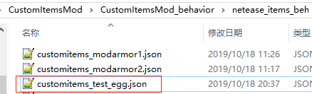

# 自定义生物蛋

## 概述

属于特殊的自定义物品，在支持自定义物品所有特性的基础上，还具有右键可以生成[自定义生物](../3-自定义生物/01-自定义基础生物.md)的功能。

支持刷怪箱和发射器。


## 注册

1. 与自定义基础物品的注册1-6步相同
2. 在behavior/netease_items_beh的json中设置custom_item_type为egg
3. 添加生物蛋相关的定义，包括一个必填的**netease:egg组件**，组件的参数见[json组件](#json组件)



```json
{
  "format_version": "1.10",
  "minecraft:item": {
    "description": {
      "identifier": "customitems:test_egg",
      "register_to_create_menu":true,
      "custom_item_type": "egg"
    },
    "components": {
      "minecraft:max_stack_size":64,
      "netease:egg":{
        "entity":"minecraft:mod{customitems:chicken}"
      }
    }
  }
}
```


## JSON组件

### 网易components

* netease:egg

  | 键     | 类型 | 默认值 | 解释                 |
  | ------ | ---- | ------ | -------------------- |
  | entity | str  |        | 生成生物的identifier |


## demo解释

[CustomItemsMod](../../13-模组SDK编程/60-Demo示例.md#CustomItemsMod)中定义了一个自定义生物蛋：

* customitems:test_egg

  右键时会生成微软自定义生物"customitems:chicken"
