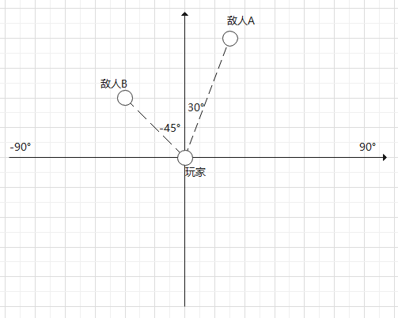

# 自定义盾牌

## 概述

属于特殊的自定义物品，在支持自定义物品所有特性的基础上，还具有盾牌相关的功能，支持自定义盾牌的动画和模型。


## 注册

1. 与自定义基础物品的注册1-6步相同

   **物品名（即identifier冒号后的部分）不可以叫shield，否则会和原版盾牌冲突！！**

1. 如果resource中的icon填写为空，则盾牌的物品形态会渲染为模型（使用default模型与default贴图渲染，不会播放动作）

   如果配置了贴图icon，则物品形态渲染为贴图

   ```python
   {
       "minecraft:item": {
           "description": {
               "identifier": "customshield:test_shield"
           },
           "components": {
               "minecraft:icon": ""
           }
       },
       "format_version": "1.10"
   }
   ```

1. 在behavior/netease_items_beh的json中添加武器/工具相关的定义，包括：

   custom_item_type为shield

   一个netease:shield组件，必填。组件的参数见[json组件](#json组件)

    ```python
    {
        "minecraft:item": {
            "description": {
                "category": "Custom",
                "identifier": "customshield:test_shield",
                "custom_item_type": "shield",
                "register_to_create_menu": true
            },
            "components": {
                "netease:shield":{
                    "defence_damage_source_list":["drowning"],//防御的伤害类型，如果不配或者配置为空则走原生的格挡伤害逻辑
                    "undefence_damage_source_list":["entity_attack"],//不防御的伤害类型，和上面这个不能有相同元素，如果有相同则优先防御该伤害类型
                    "is_consume_damage":false//是否消耗耐久度，false则不消耗
                }
            }
        },
        "format_version": "1.10"
    }
    ```

1. 在resource/netease_item_res中增加json文件，如：

    ```python
    {
        "minecraft:item": {
            "description": {
                "identifier": "customshield:test_shield"
            },
            "components": {
                "minecraft:icon": "shield"
            }
        },
        "format_version": "1.10"
    }
    ```

1. 在resource/attachables中增加json文件，如：

    ```python
    {
        "format_version": "1.10.0",
        "minecraft:attachable": {
          "description": {
            "identifier": "customshield:test_shield",
            "materials": {
              "default": "entity_alphatest",
              "enchanted": "entity_alphatest_glint"
            },
            "textures": {
              "default": "textures/entity/test_shield",  //模型表面的贴图
              "enchanted": "textures/misc/enchanted_item_glint"
            },
            "geometry": {
              "default": "geometry.test_shield"  //模型
            },
            "animations": {
              //我们提供了一个通用的animation controller，他位于vanilla_netease/animation_controllers/shield.animation_controllers.json
              "wield": "controller.animation.default_custom_shield.wield",   
              //普通的拿盾状态使用了自定义动作
              //您也可以复用原版的动作animation.shield.xxx
              "wield_main_hand_first_person": "animation.test_shield.wield_main_hand_first_person",
              "wield_off_hand_first_person": "animation.test_shield.wield_off_hand_first_person",
              "wield_third_person": "animation.test_shield.wield_third_person",
                
              // 如果防御状态的动作复用了原版的动作， 则在举盾状态时盾牌的动画部分将会失效
              // "wield_main_hand_first_person_block": "animation.shield.wield_main_hand_first_person_blocking",
              // "wield_off_hand_first_person_block": "animation.shield.wield_off_hand_first_person_blocking"
    
              // 为了使举盾状态时盾牌的动画部分也能正常运作，防御状态的动作使用了了自定义的动作
              "wield_main_hand_first_person_block": "animation.test_shield.wield_main_hand_first_person_blocking",
              "wield_off_hand_first_person_block": "animation.test_shield.wield_off_hand_first_person_blocking"  
    
            },
            "scripts": {
              "animate": [
                "wield"
              ],
               // 如果复用了原版动作，则需要有以下数值定义
              "initialize": [
                "variable.main_hand_first_person_pos_x =  5.3;",
                "variable.main_hand_first_person_pos_y = 26.0;",
                "variable.main_hand_first_person_pos_z = 0.4;",
                "variable.main_hand_first_person_rot_x = 91.0;",
                "variable.main_hand_first_person_rot_y = 65.0;",
                "variable.main_hand_first_person_rot_z = -43.0;",
                "variable.off_hand_first_person_pos_x = -13.5;",
                "variable.off_hand_first_person_pos_y = -5.8;",
                "variable.off_hand_first_person_pos_z = 5.1;",
                "variable.off_hand_first_person_with_bow_pos_z = -25.0;",
                "variable.off_hand_first_person_rot_x = 1.0;",
                "variable.off_hand_first_person_rot_y = 176.0;",
                "variable.off_hand_first_person_rot_z = -2.5;"
              ],
               // 使用弓时的动作修正
              "pre_animation": [
                "variable.is_using_bow = (query.get_equipped_item_name == 'bow') && (query.main_hand_item_use_duration > 0.0f);"
              ]
            },
            "render_controllers": [ "controller.render.item_default" ]
          }
        }
    }
    ```

1. resource/models/entity中自定义自己的盾牌模型
1. 在resource/animations以及resource/animation_controllers放置自定义的动作与动作控制器（如果有的话）

1. 在python绑定玩家的动画控制器，同时，这个给玩家绑定动画控制器的操作是在一个新增事件的回调函数里完成的，
   事件名称为<a href="../../../../mcdocs/1-ModAPI/事件/世界.html#addplayercreatedclientevent">"AddPlayerCreatedClientEvent"</a>，触发此事件时，会传递一个playerId参数，此事件触发表明该玩家渲染相关资源已加载完毕。

    ```python
    animaComp = clientApi.GetEngineCompFactory().CreateActorRender(playerId)
    # 添加激活盾牌时玩家的动作
    # animationKey需要唯一
    # animationName复用了原版的
    # 如果需要用自定义动作也可以参考player.animation.json编写新的动作
    animaComp.AddPlayerAnimation("shield_block_main_hand_test", "animation.player.shield_block_main_hand")
    animaComp.AddPlayerAnimation("shield_block_off_hand_test", "animation.player.shield_block_off_hand")
    # blocking状态，并且左手上不是原版盾牌与自定义盾牌，并且主手是我们的自定义盾牌
    animaComp.AddPlayerAnimationIntoState("root", "third_person", "shield_block_main_hand_test", "query.blocking && query.get_equipped_item_name('off_hand') != 'shield' && !query.get_equipped_item_is_netease_shield('off_hand') && query.get_equipped_item_full_name == 'customshield:test_shield'")
    # blocking状态，并且左手是我们的自定义盾牌
    animaComp.AddPlayerAnimationIntoState("root", "third_person", "shield_block_off_hand_test", "query.blocking && query.get_equipped_item_full_name('off_hand') == 'customshield:test_shield'")
    ```


## Molang表达式

### 新增molang表达式
- query.get_equipped_item_is_netease_shield

    * 描述
    
    获取主手/副手是否自定义盾牌（原版盾牌不算）
    
    * 参数：
    
    | 键       | 类型 | 默认值    | 解释                                           |
    | -------- | ---- | --------- | ---------------------------------------------- |
    | hand | str  | 'main_hand' | 获取主手(main_hand)/副手('off_hand')是否盾牌 |
    
    * 返回值：
    
    | 说明 |
    | ---- |
    | 主手(main_hand)/副手('off_hand')是否网易自定义盾牌 |

- query.get_equipped_item_full_name

    * 描述
    
    获取主手/副手物品的identifier，仅对自定义物品使用，原版物品请使用query.get_equipped_item_name。
    
    * 参数：
    
    | 键       | 类型 | 默认值    | 解释                                           |
    | -------- | ---- | --------- | ---------------------------------------------- |
    | hand | str  | 'main_hand' | 获取主手(main_hand)/副手('off_hand')是否盾牌 |
    
    * 返回值：
    
    | 说明 |
    | ---- |
    | 主手/副手物品的identifier |

  

### 原版molang表达式

* c.item_slot
	本物品所在的位置
	  **返回值：**
	| 说明 |
	| ---- |
	| "main_hand"：主手；"off_hand"：副手；"head"：头；"torso"：躯干 |

* q.item_slot_to_bone_name
	**返回值：**
	| 说明 |
	| ---- |
	| "rightitem"：主手；"leftitem"：副手； |


## JSON组件

### 网易components

* netease:shield

	| 键       | 类型 | 默认值    | 解释                                           |
	| -------- | ---- | --------- | ---------------------------------------------- |
	| defence_damage_source_list | list  | [] | 防御的伤害类型，如果不配或者配置为空则走原生的格挡伤害逻辑。暂时不支持抵御火烧(fire,fire_tick)，自杀(suicide)，凋零(wither)的伤害 |
	| undefence_damage_source_list | list  | [] | 不防御的伤害类型，和上面这个不能有相同元素，如果有相同则优先防御该伤害类型 |
	| is_consume_damage | bool  | true | 是否消耗耐久度，false则不消耗 |

### 原版components

* minecraft:icon

	贴图名字

* minecraft:attachable

	minecraft:attachable主要健是description，下面介绍description的值

	| 键         | 类型 | 默认值 | 解释                                                 |
	| ---------- | ---- | ------ | ---------------------------------------------------- |
	| identifier | str  |        | 盾牌的id                                             |
	| textures   | dict |        | "default":默认的表面贴图；"enchanted":附魔的表面贴图 |
	| geometry   | dict |        | "default":物品模型                                   |
	| animations | dict |        | 物品动画控制器和动画相关，参考示例的解释             |
	| scripts    | dict |        | "animate": [物品动画控制器名]，参考示例              |
	| materials   | dict |        | "default":默认的表面贴图；"enchanted":附魔的表面贴图 ，参考示例              |
	| render_controllers  | list |        | 参考示例              |


## 新增的事件和接口

### 事件
* <a href="../../../../mcdocs/1-ModAPI/事件/物品.html#onplayerblockedbyshieldbeforeserverevent">OnPlayerBlockedByShieldBeforeServerEvent</a>

	玩家使用盾牌抵挡伤害之前触发

* <a href="../../../../mcdocs/1-ModAPI/事件/物品.html#onplayerblockedbyshieldafterserverevent">OnPlayerBlockedByShieldAfterServerEvent</a>

	玩家使用盾牌抵挡伤害之后触发

* <a href="../../../../mcdocs/1-ModAPI/事件/物品.html#onplayeractiveshieldserverevent">OnPlayerActiveShieldServerEvent</a>

	玩家激活/取消激活盾牌触发的事件


### 接口

* <a href="../../../../mcdocs/1-ModAPI/接口/物品.html#getitemdefenceangle">GetItemDefenceAngle</a>

	服务端接口。获取盾牌物品的抵挡角度范围


* <a href="../../../../mcdocs/1-ModAPI/接口/物品.html#setitemdefenceangle">SetItemDefenceAngle</a>

	服务端接口。设置盾牌物品的抵挡角度范围，参考下面抵挡角度范围的解释


* <a href="../../../../mcdocs/1-ModAPI/接口/玩家/行为.html#setusingshield">setUsingShield</a>

	客户端接口。设置是否激活盾牌


* <a href="../../../../mcdocs/1-ModAPI/接口/玩家/行为.html#getisblocking">GetIsBlocking</a>

	服务端接口。获取玩家是否处于抵挡状态，即盾牌是否被激活


## 新增物品字典参数

**抵挡范围**
| 键       | 类型 | 默认值 | 解释                   |
| -------- | ---- | ------ | ---------------------- |
| shieldDefenceAngleLeft | float  |    -90    | 左边的范围 ,默认是-90，取值范围是[-180,180] |
| shieldDefenceAngleRight | float |   90     | 右边的范围,默认是90,取值范围是[-180,180],且shieldDefenceAngleLeft<shieldDefenceAngleRight |

```python
itemDict1 = {
    'itemName': 'customshield:test_shield',
    'count': 1,
    'shieldDefenceAngleLeft':-45,
    'shieldDefenceAngleRight':30
}
comp = serverApi.GetEngineCompFactory().CreateItem(playerId)
comp.SpawnItemToPlayerInv(itemDict1, playerId)
```
### 关于抵挡范围的解释

如示意图所示，如果一个抵挡范围是[-45°,30°]的盾牌，即shieldDefenceAngleLeft=-45，shieldDefenceAngleRight=30，那么当玩家举起盾牌时，如果伤害来源是一个实体，那么，在玩家前方-45°到30°范围内的伤害可以抵挡，否则不能抵挡。注:原版的盾牌范围是[-90°,90°]




## demo解释

[CustomShieldItemMod](../../13-模组SDK编程/60-Demo示例.md#CustomShieldItemMod)中定义了一个自定义盾牌：

* customshield:test_shield

  自定义盾牌
