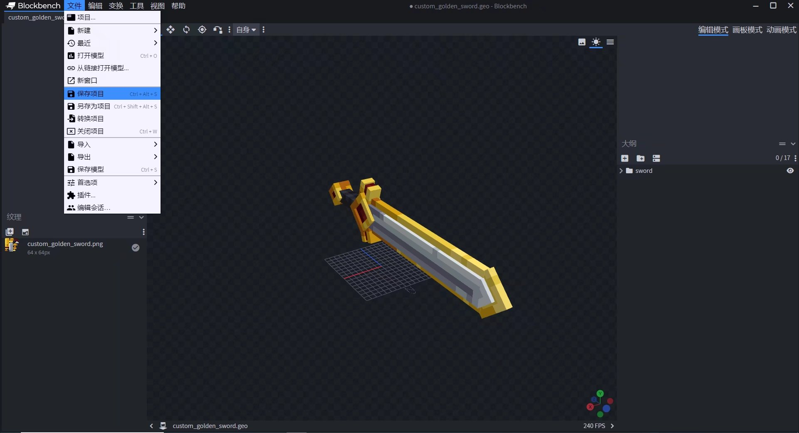
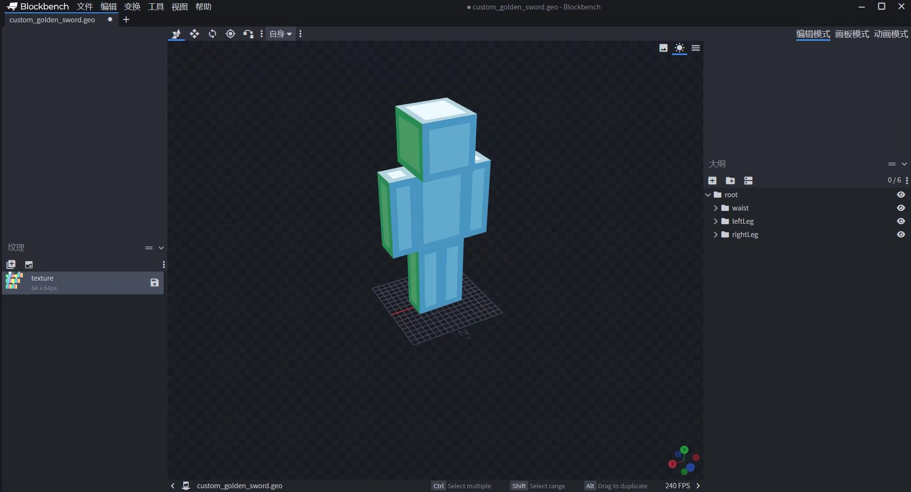
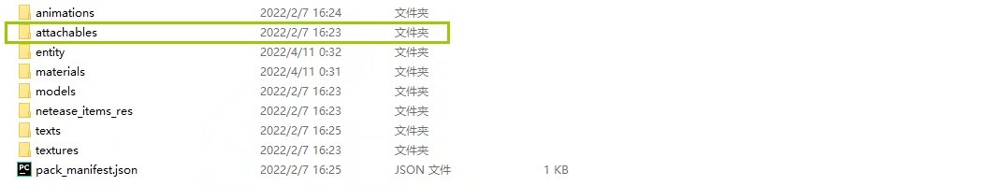

# Json配置自定义3D物品


在本节教程中，我们将围绕**如何自定义一个3D物品**的话题，教给大家如何仅使用JSON配置和附加包开发知识来快速创建你的第一个3D物品。


> 温馨提示：开始读起这篇指南前，我们希望你对《我的世界》基岩版附加包有一定了解，有能力撰写JSON数据格式，并能够独立阅读《我的世界》开发者官网-开发指南或其他技术引用文档。


**通过这节教程，你将学会：**

•如何将一个现有的微软基岩版格式物品模型变为自定义物品的3D模型。

•校对模型在模型空间的相对位置，以匹配并固定在玩家第三人称的手持位置。


## 背景介绍

模组API 2.0 （基岩版版本 1.17.2）开始，在资源包定义物品的附着物（Attachable）文件可以绑定微软原版模型至物品上。


## 制作模型规范

让人型生物（如 溺尸、尸壳、僵尸 或 玩家）手持3D物品模型时，我们推荐使模型骨骼遵守玩家模型骨骼布局。以便模型能优先保证在玩家手持的情况下，能够跟随肢体动画进行正常的幅度摆动。


原版玩家模型使用一条root根骨骼作为基骨骼，子骨骼内使用waist骨骼控制上半身，rightLeg骨骼和leftLeg骨骼控制左腿和右腿。


基岩版标识符推荐以小写数字母搭配下划线，因为在游戏中，使用rightLeg或rightleg效果是一致的。以下是玩家模型的骨骼树状图，锚点即模型格式内的pivot。

```
-root（锚点：[0, 0, 0]）
--waist（锚点：[0, 12, 0]）
---jacket（用于persona）
---cape（披风）
---body（锚点：[0, 24, 0]）
----leftArm（锚点：[5, 22, 0]）
-----leftSleeve（用于persona）
-----leftItem（锚点：[6, 15, 1]）
----rightArm（锚点：[-5, 22, 0]）
-----rightSleeve（用于persona）
-----rightItem（锚点：[-6, 15, 1]）
--leftLeg（锚点：[-1.9, 12, 0]）
---leftPants（用于persona）
--rightLeg（锚点：[1.9, 12, 0]）
---rightPants（用于persona）
```


## 校正模型在空间下对应第三人称手持的位置

先在模型工程内点击 **【文件】** - **【保存项目】** 。



新建一个人型模型工程，并根据骨骼树状图拉出人型模型格式。



选择 **【文件】** - **【导入】** 导入前面保存的3D模型项目。


此时可以看到物品模型的贴图完全丢失。但不用担心，它默认援引了人型模型的材质，只要它的UV在前面的工程内已经分好，这边就无需多管。


将物品模型基骨骼放入 **【root】** - **【waist】** - **【body】** - **【rightArm】** - **【rightItem】** 骨骼下。并删除除右手方块以外的其他模型方块体。


继续调整3D物品模型，直至调整到一个满意的手持角度。此时删去右手模型方块体。这样一个有效的基础第三人称右手手持模型就做好了。


## 将3D模型实装

在附加包的自定义资源包内新建attachables文件夹，新建一个JSON文件。



- 渲染控制器：默认可填  **"controller.render.item_default"**  ，这是原版提供的一个物品渲染控制器。
- 材质：填写  **"controller.render.item_default"**  后，必须新增 **"default"** 和 **"enchanted"** 键，其中前者对应物品模型默认的材质，后者对应附魔时物品携带的材质。  **"default"** 无特殊情况默认填写 **"entity_alphatest"** ，"enchanted"默认填写 **"entity_alphatest_glint"** 。
- 贴图纹理：填写  **"controller.render.item_default"**  后，必须 **"default"** 和 **"enchanted"** 键， 其中前者对应自定义物品模型贴图，后者对应物品附魔时的附魔效果贴图（一般默认填写 **""textures/misc/enchanted_item_glint"** ）。
- 动画：附着物与实体一样可以添加动画和动画控制器，也可以添加粒子，但目前粒子默认会以实体脚底坐标发射粒子，暂时不能在粒子挂点（locator）上发射。
- 几何体：附着物的模型，以自定义3D模型的geometry标识符为准。
- 物品标识符：与行为包的自定义物品标识符一致即可。在这里预先填写一个自定义物品标识符 **"design:custom_golden_sword"** ，稍后将用一个自定义物品行为与之呼应。


```json
{
    "format_version":"1.10.0",
    "minecraft:attachable":{
        "description":{
            "identifier":"design:custom_golden_sword",
            "materials":{
                "default":"entity_alphatest",
                "enchanted":"entity_alphatest_glint"
            },
            "textures":{
                "default":"textures/entity/custom_golden_sword",
                "enchanted":"textures/misc/enchanted_item_glint"
            },
            "geometry":{
                "default":"geometry.custom_golden_sword"
            },
            "render_controllers":[
                "controller.render.item_default"
            ]
        }
    }
}
```

接着在附加包的自定义行为包里，创建netease_items_beh文件夹，并创建子文件custom_golden_sword.json。有关更多自定义物品行为，请查看此链接：[自定义武器及工具](../2-自定义武器及工具.md)

```json
{
    "format_version":"1.10",
    "minecraft:item":{
        "description":{
            "identifier":"design:custom_golden_sword",
            "custom_item_type":"weapon",
            "category":"Equipment"
        },
        "components":{
            "minecraft:max_damage":700,
            "minecraft:max_stack_size":1,
            "netease:weapon":{
                "type":"sword",
                "level":0,
                "attack_damage":7,
                "enchantment":10
            }
        }
    }
}
```

我们还可以继续在资源包内的netease_items_res文件夹，为自定义物品添上2D的物品图标。有关更多自定义物品的基础内容，请查看此链接：[自定义基础物品](../1-自定义基础物品.md)

```json
{
    "format_version":"1.10",
    "minecraft:item":{
        "description":{
            "identifier":"design:custom_golden_sword",
            "category":"Equipment"
        },
        "components":{
            "minecraft:icon":"design:custom_golden_sword",
            "minecraft:render_offsets":"tools"
        }
    }
}
```


现在你就可以在游戏加载附加包完成后，使用这个自定义3D物品了！


可以使用快速格式化Json等在线工具，定位到可能在撰写过程中出现的错误语法或结构。
