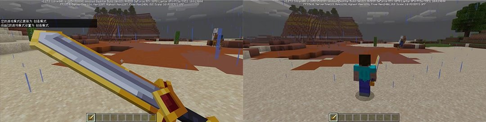
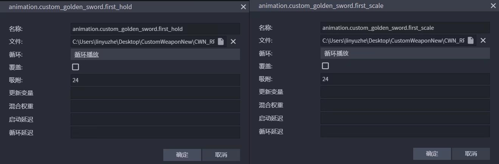
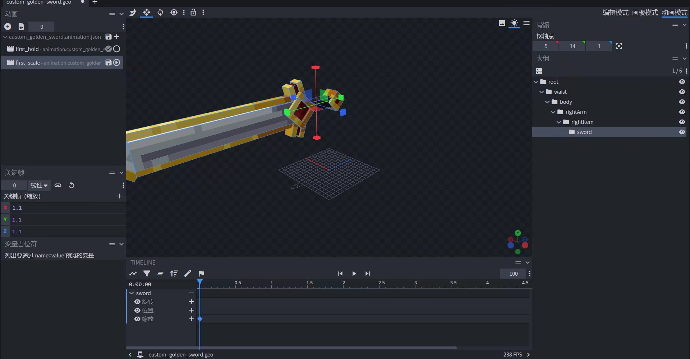
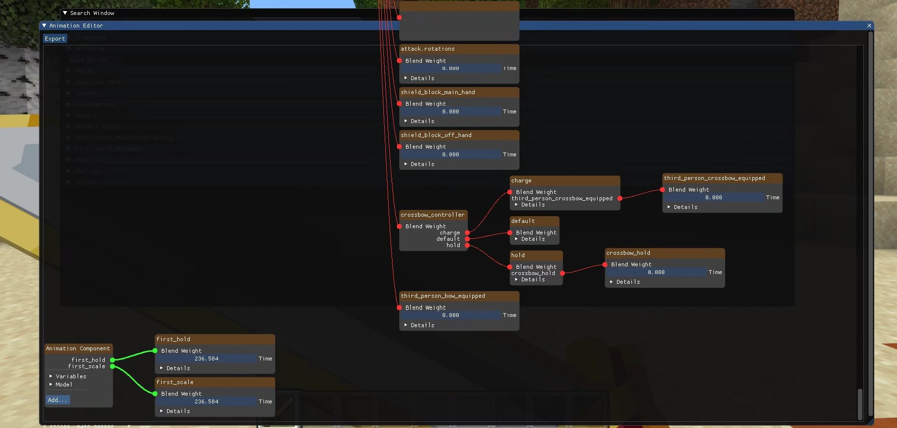

# 自定义3D物品第一人称动画


在上节教程中，我们学会了如何使用微软的Attachable功能实现自定义3D物品，并使用社区工具Blockbench校正模型在第三人称的位置，最后在游戏内实装上一把自定义3D金剑。


**本节课程Demo[戳这里下载](https://g79.gdl.netease.com/CustomWeapon3D.zip)**

**目前我们已经掌握：**

- 如何将一个现有的微软基岩版格式物品模型变为自定义物品的3D模型。（第一节内容）✔

- 校对模型在模型空间的相对位置，以匹配并固定在玩家第三人称的手持位置。（第一节内容）✔

- 借助《我的世界》基岩版电脑开发版，使用开发者工具制作模型的第一人称动画。（本节内容）❌

所以接下来将带领大家借助《我的世界》基岩版电脑开发版，使用开发者工具制作模型的第一人称动画。


我的世界基岩版中，第一人称和第三人称的摄像机存在空间角度区别。因此需要单独为物品模型设计第一人称的手持动画。（下图为第三人称手持正确，但在第一人称显示意外的图例）




启动Blockbench，选择之前预制好的自定义3D物品模型，选择【动画模式】-【添加动画➕】，创建一个用于控制第一人称手持角度位置的动画，一个用于控制第一人称手持3D物品缩放的动画。（我的世界基岩版动画可以叠加，叠加后会对同一时刻下对位移、缩放、旋转的值进行加总）



需要将动画设置为循环播放，并将动画时长长度设置为0。

在对应的第一人称手持缩放动画（以下简称"first_scale"）插入一帧缩放关键帧，任意填入关键帧的缩放参数，这里我们填写XYZ为1.1并保存。



在对应的第一人称手持位置角度动画（以下简称“first_hold”）插入一帧关键帧同时调整位置和旋转值，这里我们任意填写XYZ的位置和旋转值为3，并保存。


接着回到附着物的定义文件，将前面的"first_hold"和"first_scale"动画进行挂载，并加入进scripts/animate根动画中。

```json
{
    "format_version": "1.10.0",
    "minecraft:attachable": {
        "description": {
            "identifier": "design:custom_golden_sword",
            "materials": {
                "default": "entity_alphatest",
                "enchanted": "entity_alphatest_glint"
            },
            "textures": {
                "default": "textures/entity/custom_golden_sword",
                "enchanted": "textures/misc/enchanted_item_glint"
            },
            "animations": {
                "first_hold": "animation.custom_golden_sword.first_hold", //挂载自定义动画“第一人称手持”
                "first_scale": "animation.custom_golden_sword.first_scale" //挂载自定义动画“第一人称剑缩放”
            },
            "geometry": {
                "default": "geometry.custom_golden_sword"
            },
            "render_controllers": [ "controller.render.item_default" ]
        }
    }
}
```


再次回到《我的世界》电脑版基岩开发版，在游戏界面中按F3按键3次或14次，呼出开发者控制台。接着按下F11键呼出鼠标。


打开Animation（动画）列表，点击Open Editor（打开编辑器）。


默认情况下，编辑器窗口会很小。此时点击右下角的伸缩区域进行拉伸。


拉到足够看清楚的大小后，直接往下拉到最底，这里展示着附着物挂载的动画状态。




打开“first_hold”的Details（动画细节），再点击Bone Animation（骨骼动画），就可以看到前面用Blockbench制作的动画的各项值，并且支持直接在编辑器内动态修改，最后直观的体现在游戏内。


这里我们对"first_hold"的position设置值为X为-8，Y为5，Z为-6。再对rotation设置X为-45，Y为15，Z为-135。对"first_scale"的scale设置为0.35。


再按F3按键直到界面消失，就可以在游戏内看到基本合格的第一人称自定义3D物品手持效果了。


请格外注意，在这里调整的动画并不会最终保存进动画Json文件里！因此我们还需要将值背下来，并写入动画文件中。

```json
{
	"format_version": "1.8.0",
	"animations": {
		"animation.custom_golden_sword.first_hold": {
			"loop": true,
			"bones": {
				"sword": {
					"rotation": [-45, 15, 135],
					"position": [-8, 5, -6]
				}
			}
		},
		"animation.custom_golden_sword.first_scale": {
			"loop": true,
			"bones": {
				"sword": {
					"scale": 0.35
				}
			}
		}
	}
}
```


最后，对"first_hold"和"first_scale"的加载模式添加条件，使用"c.is_first_person"来判定动画是否运行在第一人称模式下，是则运行。

```json
{
    "format_version": "1.10.0",
    "minecraft:attachable": {
        "description": {
            "identifier": "design:custom_golden_sword",
            "materials": {
                "default": "entity_alphatest",
                "enchanted": "entity_alphatest_glint"
            },
            "textures": {
                "default": "textures/entity/custom_golden_sword",
                "enchanted": "textures/misc/enchanted_item_glint"
            },
            "animations": {
                "first_hold": "animation.custom_golden_sword.first_hold", //挂载自定义动画“第一人称手持”
                "first_scale": "animation.custom_golden_sword.first_scale" //挂载自定义动画“第一人称剑缩放”
            },
            "scripts": {
                "animate": [ // 挂载动画至根动画中
                    {
                        "first_hold": "c.is_first_person" // 保证“第一人称手持”动画只在第一人称下显示
                    },
                    {
                        "first_scale": "c.is_first_person"// 保证“第一人称剑缩放”动画只在第一人称下显示
                    }
                ]
            },
            "geometry": {
                "default": "geometry.custom_golden_sword"
            },
            "render_controllers": [ "controller.render.item_default" ]
        }
    }
}
```


c是context的缩写，就像可以使用q来代表query一样，query是查询某个活动对象特定状态的查询函数。c.is_first_person将返回附着物是否处于第一人称视角下，在前面加上!运算符即可代表是否处于非第一人称视角，则可能是第三人称前视角或第三人称后视角下。其他的已知context函数还有：

- **context.owning_entity：**返回附着物穿戴的实体，可以使用Molang的->运算符获取该实体身上的属性，假设已知自定义3D物品由玩家手持，则可以使用"c.owning_entity -> q.is_sneaking"返回玩家是否此时手持该附着物并下蹲。

- **context.item_slot：**附着物手持的位置，返回"main_hand"（主手）或者"off_hand"（副手）。


