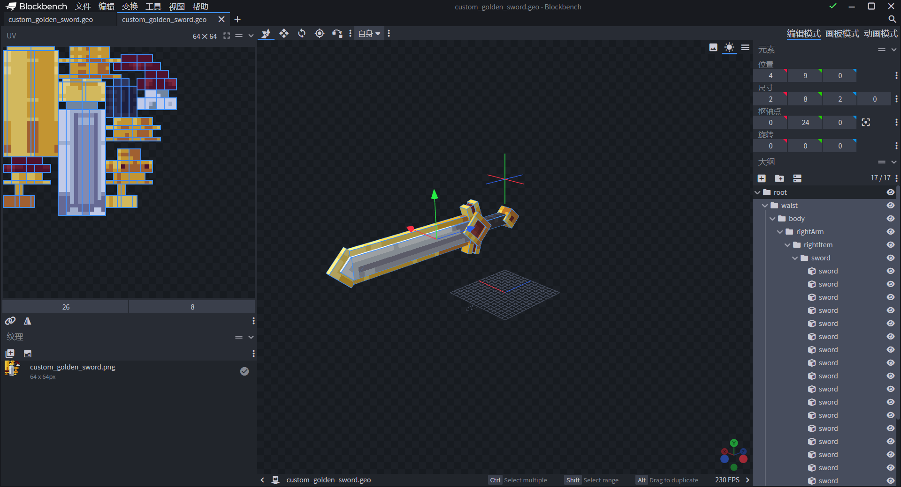
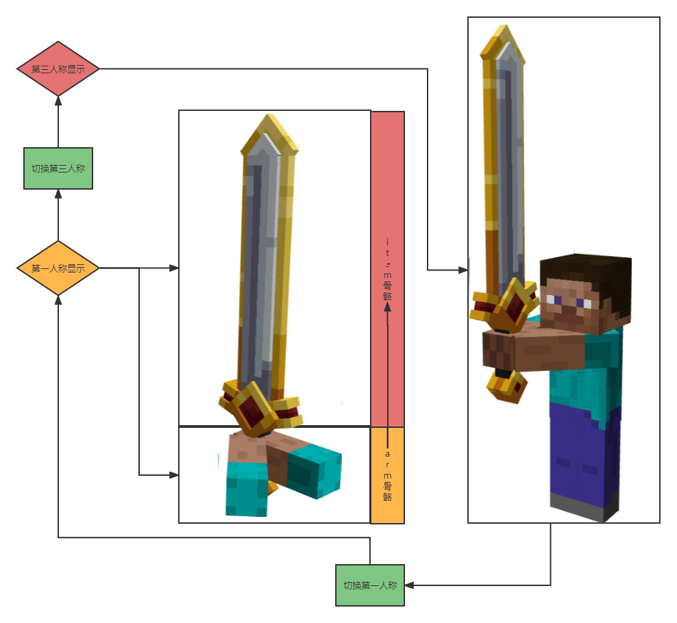
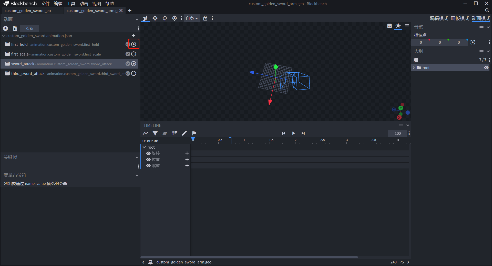
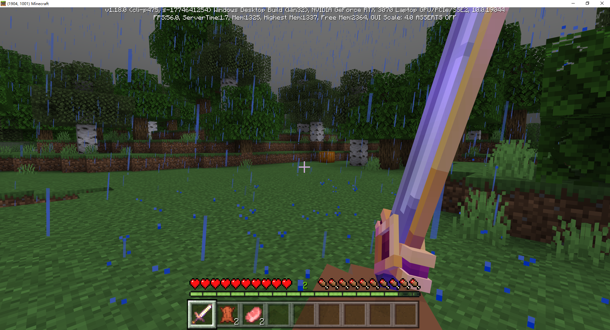

# 自定义3D武器第一人称攻击效果

在前两节自定义3D物品教程结束后，我们学会了如何使用微软的Attachable功能完全实现自定义3D物品功能。

许多武器动作模组在《我的世界》模组体验上占有非常高的地位，自定义3D物品可以在武器方面着重凸显组件的特点。本节课将会带领开发者学习如何使用自定义金剑制作独特的攻击形式，配合模组SDK让作品特色更上一层楼。


**假设你看过前两节自定义3D物品教程，你应该已经学会：**

- 如何将一个现有的微软基岩版格式物品模型变为自定义物品的3D模型。✔

- 校对模型在模型空间的相对位置，以匹配并固定在玩家第三人称的手持位置。✔

- 借助《我的世界》基岩版电脑开发版，使用开发者工具制作3D模型的第一人称动画。✔


**在本节课程你将学会：**

- 使用Blockbench为附着物设计手臂模型并重新调整金剑建模。
- 使用Blockbench和基岩版动画叠加效果制作第一人称手持金剑攻击动画。
- 用额外的渲染控制器挂载手臂模型至附着物。
- 借助模组SDK和自定义Query节点完成第一人称手持金剑攻击效果。

**本节课程的[Demo请戳这里下载](https://g79.gdl.netease.com/CustomWeaponAttackFP.zip)：**


## 设计手臂模型并重新调整金剑建模

打开前一节[自定义3D物品的Demo](https://g79.gdl.netease.com/CustomWeapon3D.zip)，目前金剑的骨骼会按照下列排序：

```
-root（玩家根骨骼）
--waist（玩家上半身骨骼）
---body（玩家身体骨骼）
----rightArm（玩家右手骨骼）
-----rightItem（玩家右手手持物品骨骼）
------sword（金剑骨骼）
```




**我们设法在玩家手持金剑时，会在第一人称下显示两个手臂紧握着金剑。则此时两只手臂是跟随着金剑模型，而不牵扯到玩家模型本身。这样的设计意图给予了一些新的启发与可预料到的挑战。**


首先，金剑的模型直接挂载在右手手持物品骨骼下。为了在之后的动画可以让金剑跟随着挥舞的手臂，需要用arm骨骼取代sword骨骼，用来存放握住金剑把手的手臂，并将原先sword骨骼的体块纳入一个新的骨骼组item，并将它作为arm骨骼的子骨骼。 **为之后做第一人称动画提供便利** ：直接调整arm骨骼的动画参数即可，金剑会跟随arm旋转、偏移或缩放。




除此之外，我们并不希望让arm骨骼会出现在第三人称视角。 **这是因为当玩家手持物品时，玩家模型的手臂会自动消失。但切换回第三人称将重新出现。玩家模型本身的手臂会与金剑的新双臂同时出现，影响观感。**


**最终得出的初步方案里，我们需要使用一个新的渲染控制器挂接arm骨骼至附着物上。一个附着物是可以满足挂载多个渲染控制器，同时在骨骼层级不变的情况下，可以在默认渲染控制器下挂载剑模型，在arm骨骼渲染控制器下挂载arm模型。接着设置渲染控制器只会在第一人称下显示。**


**最终剑模型的骨骼层级如下（Tips：右键对应骨骼点击Resolve Group可在不移动子骨骼的前提下展开父骨骼）**

```
-root（玩家根骨骼）
--waist（玩家上半身骨骼）
---body（玩家身体骨骼）
----rightArm（玩家右手骨骼）
-----rightItem（玩家右手手持物品骨骼）
------arm（金剑双臂骨骼-不放置体块）
------item（金剑骨骼）
```


**最终剑手臂模型的骨骼层级如下（Tips：将原版资源包/models/mobs.json内的humanoid模型的两只手臂直接复制到这里，可以继承原版steve模型的UV展开，并快速对手臂进行建模）**

```
-root（玩家根骨骼）
--waist（玩家上半身骨骼）
---body（玩家身体骨骼）
----rightArm（玩家右手骨骼）
-----rightItem（玩家右手手持物品骨骼）
------arm（金剑双臂骨骼）
------item（金剑骨骼-不放置体块）
```


## 制作第一人称手持金剑攻击动画

切换至动画模式，新建用以表现第一人称攻击动画sword_attack。


选中sword_attack动画，同时勾选first_hold动画，在手持第一人称动画生效的同时，以此视角基础设计挥舞动画。




这里设计了一个0.75秒的攻击动画，在游戏里将实际从右往左挥舞金剑。其他形式可自行创作。


## 挂载手臂模型至附着物

在资源包/render_controllers文件夹下新建一个自定义的剑渲染控制器，用以显示手臂模型。

```json
{
	"format_version": "1.8.0",
	"render_controllers": {
		"controller.render.sword_controller": {
			"geometry": "Geometry.arm",
			"materials": [
				{
					"*": "Material.default"
				}
			],
			"textures": [
				"Texture.arm"
			]
		}
	}
}
```


接着将手臂模型、手臂贴图、渲染控制器和第一人称动画挂载于附着物上。

```json
{
    "format_version": "1.10.0",
    "minecraft:attachable": {
        "description": {
            "identifier": "design:custom_golden_sword",
            "materials": {
                "default": "entity_alphatest",
                "enchanted": "entity_alphatest_glint"
            },
            "textures": {
                "default": "textures/entity/custom_golden_sword",
                "enchanted": "textures/misc/enchanted_item_glint",
                "arm": "textures/entity/steve" // arm键对应渲染控制器内的Texture.arm，贴图路径则是原版内置的steve粗手臂贴图
            },
            "animations": {
                "first_hold": "animation.custom_golden_sword.first_hold",
                "first_scale": "animation.custom_golden_sword.first_scale",
                "attack_rotation_sword": "animation.custom_golden_sword.sword_attack" // 自定义第一人称剑攻击动画
            },
            "scripts": {
                "animate": [
                    {
                        "first_hold": "c.is_first_person"
                    },
                    {
                        "first_scale": "c.is_first_person"
                    }
                ]
            },
            "geometry": {
                "default": "geometry.custom_golden_sword",
                "arm": "geometry.custom_golden_sword_arm" // arm键对应渲染控制器内的Geometry.arm
            },
            "render_controllers": [ "controller.render.item_default",
                {
                    "controller.render.sword_controller": "c.is_first_person" // 只有在第一人称下显示手臂模型和手臂贴图
                }
            ]
        }
    }
}
```


进入游戏后，可以看到拿出金剑时，显示了两支手臂握住剑柄的效果。




## 完成第一人称手持金剑攻击效果

使用自定义Query节点接口，可以最大限度地减少组件冲突的影响。自定义Query接口可以在客户端线程上自定义新的Query查询函数，可以内置在动画或动画控制器中，作为条件改变动画和动画控制器的效果。


在行为包内创建Python脚本目录，取名CustomSwordScripts，并创建服务端系统和客户端系统。有关模组SDK目录创建和系统注册的模块，可以查看[此官网教程链接](https://g.126.fm/00FchC4)。

```
-CustomSwordScripts：文件夹
--client.py：客户端Python文件
---AnimationClient：客户端类
--modMain.py：mod入口
--server.py：服务端Python文件
---AnimationServer：服务端类
```

```python
# -*- coding: UTF-8 -*-
from mod.common.mod import Mod
import mod.server.extraServerApi as serverApi
import mod.client.extraClientApi as clientApi


@Mod.Binding(name="CustomSwordMod", version="0.1")
class CustomSwordMod(object):

    def __init__(self):
        pass

    @Mod.InitClient()
    def init_client(self):
        clientApi.RegisterSystem("CustomSwordMod", "AnimationClient",
                                 "CustomSwordScripts.client.AnimationClient")

    @Mod.InitServer()
    def init_server(self):
        serverApi.RegisterSystem("CustomSwordMod", "AnimationServer",
                                 "CustomSwordScripts.server.AnimationServer")

    @Mod.DestroyClient()
    def destroy_client(self):
        pass

    @Mod.DestroyServer()
    def destroy_server(self):
        pass

```


在客户端类的\__init__函数内，监听OnLocalPlayerStopLoading事件，当玩家客户端加载完毕后，调用Query节点接口并注册query.mod.sword_attack。

```python
# -*- coding: UTF-8 -*-
import mod.client.extraClientApi as clientApi
import time

compFactory = clientApi.GetEngineCompFactory()
ClientSystem = clientApi.GetClientSystemCls()


class AnimationClient(ClientSystem):

    def __init__(self, namespace, system_name):
        ClientSystem.__init__(self, namespace, system_name)
        namespace = clientApi.GetEngineNamespace()
        system_name = clientApi.GetEngineSystemName()
        self.ListenForEvent(namespace, system_name,
                            'OnLocalPlayerStopLoading', self, self.client_init) # 监听事件

    def client_init(self, event):
        player_id = clientApi.GetLocalPlayerId()
        query_comp = compFactory.CreateQueryVariable(clientApi.GetLevelId()) # 创建基于世界的query组件
        query_comp.Register('query.mod.sword_attack_time', 0.0) # 注册自定义Query节点必须以query.mod开头
        query_comp = compFactory.CreateQueryVariable(player_id)
        query_comp.Set('query.mod.sword_attack_time', 0.0) # 对本地玩家再次设置此节点的默认值
```


新增第一人称剑攻击动画控制器controller.animation.sword.first_attack。

```json
{
    "format_version": "1.10.0",
    "animation_controllers": {
		"controller.animation.sword.first_attack": {
			"initial_state" : "default",
			"states" : {
				"default": {
					"transitions" : [
						{
							"first_person" : "c.is_first_person"
						}
					]
				},
				"first_person": {
					"transitions" : [
						{
							"default" : "!c.is_first_person" // 若为非第一人称视角，则返回至默认状态
						},
						{
							"first_person_attack": "query.mod.sword_attack_time" // 当query.mod.sword_attack_time为真时切换至播放攻击动画的状态
						}
					]
				},
				"first_person_attack": {
					"animations": [
						"attack_rotation_sword" // 攻击动画
					],
					"transitions" : [
						{
							"default" : "!c.is_first_person" // 若为非第一人称视角，则返回至默认状态
						},
						{
							"first_person": "!query.mod.sword_attack_time"// 当query.mod.sword_attack_time为假时切换至默认状态
						}
					]
				}
			}
		}
    }
}
```


将第一人称剑攻击动画控制器置入附着物定义文件内。

```json
{
    "format_version": "1.10.0",
    "minecraft:attachable": {
        "description": {
            //...
            "animations": {
                "first_hold": "animation.custom_golden_sword.first_hold",
                "first_scale": "animation.custom_golden_sword.first_scale",
                "attack_rotation_sword": "animation.custom_golden_sword.sword_attack",
                "controller.attack": "controller.animation.sword.first_attack"
            },
            "scripts": {
                "animate": [
                    "controller.attack",
                    {
                        "first_hold": "c.is_first_person"
                    },
                    {
                        "first_scale": "c.is_first_person"
                    }
                ]
            }
            // ...
        }
    }
}
```


紧接着监听LeftClickBeforeClientEvent与TapBeforeClientEvent，分别对应在电脑启动器上使用左键与在手机上点击屏幕的事件，事件回调可指向同一个函数地址，代码解析如下：

1. 在客户端系统上贮存点击的时间戳。
2. 在事件响应时计算当前时间扣去过去时间戳是否大于攻击动画的时间，我们的自定义攻击动画时间为0.75秒，因此判断结果需要大于0.75。
3. 满足条件2时，继续判断是否满足是金剑，是则重新计算时间戳。并执行函数send_attacked_packet。
4. send_attacked_packet函数内的业务逻辑主要是创建定时器任务，用来发送数据至服务端，再依次通过服务端向其他玩家客户端通知本地玩家播放挥舞动画。并在本地客户端设置query.mod.sword_attack的值，帮助动画控制器播放动画效果。

```python
# -*- coding: UTF-8 -*-
import mod.client.extraClientApi as clientApi
import time

compFactory = clientApi.GetEngineCompFactory()
ClientSystem = clientApi.GetClientSystemCls()


class AnimationClient(ClientSystem):

    def __init__(self, namespace, system_name):
        ClientSystem.__init__(self, namespace, system_name)
        namespace = clientApi.GetEngineNamespace()
        system_name = clientApi.GetEngineSystemName()
        self.ListenForEvent(namespace, system_name,
                            'OnLocalPlayerStopLoading', self, self.client_init)
        self.ListenForEvent(namespace, system_name,
                            'LeftClickBeforeClientEvent', self, self.attack_click)
        self.ListenForEvent(namespace, system_name,
                            'TapBeforeClientEvent', self, self.attack_click)
        self.click_cooldown = time.time()

    def client_init(self, event):
        # ...
        pass

    def attack_click(self, event):
        current_time = time.time()
        carried_item = compFactory.CreateItem(clientApi.GetLocalPlayerId()).GetCarriedItem()
        if current_time - self.click_cooldown > 0.75 and carried_item and carried_item['newItemName'] == 'design:custom_golden_sword':
            self.click_cooldown = time.time()
            self.send_attacked_packet(0.0, {# 动画开始的时间点
                'playerId': clientApi.GetLocalPlayerId(),
                'type': 'start'
            })
            self.send_attacked_packet(0.16, {# 动画打击出伤害的时间点，具体以自定义动画的设计形式为准
                'playerId': clientApi.GetLocalPlayerId(),
                'type': 'will_hit'
            })
            self.send_attacked_packet(0.75, { # 动画结束时间点
                'playerId': clientApi.GetLocalPlayerId(),
                'type': 'end'
            })
        else:
            # 正在播放动画时，若重复点击，则取消点击
            if carried_item and carried_item['newItemName'] == 'design:custom_golden_sword':
                event['cancel'] = True

    def send_attacked_packet(self, _time, data):
        game_comp = compFactory.CreateGame(clientApi.GetLevelId())
        game_comp.AddTimer(
            _time,
            self.NotifyToServer, # 发送数据至服务端，用来告知其他客户端当前玩家的播放动画状态，以便在其他客户端上也能看到玩家播放动画的效果
            'AttackedPacket',
            data
        )
        game_comp.AddTimer(
            _time,
            compFactory.CreateQueryVariable(clientApi.GetLocalPlayerId()).Set, # 设置本地玩家客户端播放动画所需的query节点的值
            'query.mod.sword_attack_time',
            1.0 if data['type'] == 'start' or data['type'] == 'will_hit' else 0.0
        )
```


在服务端系统代码上，监听来自客户端的事件AttackedPacket。代码解析如下：

1. 若玩家点击左键播放动画的自定义客户端事件，判断状态为will_hit（动画打击出伤害）时，获取周围的实体，执行扇形攻击函数sector_attack。
2. sector_attack函数内计算了某个实体是否在另一个实体的扇形视角范围内。通过计算攻击者和受害者的坐标距离，与攻击者和受害者的视角差度，判断视角差度在一个固定的扇形角度时，则创建伤害组件对受害者创造伤害。
3. 使用GetRelevantPlayer接口获取周围的玩家ID，并使用NotifyToMultiClients接口向其他玩家传送事件AttackSync告知此名玩家开始播放动画，其他玩家需在自己的本地客户端同样设置该名玩家的query.mod.sword_attack为真，以实现动画效果同步。

```python
# -*- coding: UTF-8 -*-
import mod.server.extraServerApi as serverApi
import math
from mod.common.utils.mcmath import Vector3

compFactory = serverApi.GetEngineCompFactory()
ServerSystem = serverApi.GetServerSystemCls()


class AnimationServer(ServerSystem):

    def __init__(self, namespace, system_name):
        ServerSystem.__init__(self, namespace, system_name)
        namespace = serverApi.GetEngineNamespace()
        system_name = serverApi.GetEngineSystemName()
        self.ListenForEvent('CustomSwordMod', 'AnimationClient',
                            'AttackedPacket', self, self.attacked)

    def attacked(self, event):
        _type = event['type']
        player_id = event['playerId']
        if _type == 'will_hit':
            entities = compFactory.CreateGame(player_id).GetEntitiesAround(player_id, 6,
                                                                  {
                                                                      'any_of': {
                                                                          'test': 'is_family',
                                                                          'subject': 'other',
                                                                          'operator': 'not',
                                                                          'value': 'instabuild'
                                                                      }
                                                                  })
            for entity in entities:
                self.sector_attack(player_id, entity, 65.0, 6.0, 7, attacker_id=player_id)
        elif _type == 'start':
            players = compFactory.CreatePlayer(player_id).GetRelevantPlayer([player_id])
            self.NotifyToMultiClients(players, 'AttackSync', {
                'playerId': player_id,
                'value': 1.0
            })
        else:
            players = compFactory.CreatePlayer(player_id).GetRelevantPlayer([player_id])
            self.NotifyToMultiClients(players, 'AttackSync', {
                'playerId': player_id,
                'value': 0.0
            })

    def sector_attack(self, attacker, victim, between_angle=0.0, radius=0.0, damage=0, cause=serverApi.GetMinecraftEnum().ActorDamageCause.EntityAttack, attacker_id=None, child_attacker_id=None, knock=True):
        attacker_foot_pos = compFactory.CreatePos(attacker).GetFootPos()
        victim_foot_pos = compFactory.CreatePos(victim).GetFootPos()
        delta = Vector3(victim_foot_pos) - Vector3(attacker_foot_pos)
        forward_vector = serverApi.GetDirFromRot(compFactory.CreateRot(attacker).GetRot())
        angle = math.degrees(math.acos(Vector3.Dot(delta.Normalized(), Vector3(forward_vector).Normalized())))
        if angle < between_angle and delta.Length() < radius:
            compFactory.CreateHurt(victim).Hurt(damage, cause, attacker_id, child_attacker_id, knock)
```


最后在客户端上监听来自自定义服务端的AttackSync事件。在本地客户端设置其他玩家播放动画的进度。

```python
# -*- coding: UTF-8 -*-
import mod.client.extraClientApi as clientApi
import time

compFactory = clientApi.GetEngineCompFactory()
ClientSystem = clientApi.GetClientSystemCls()


class AnimationClient(ClientSystem):

    def __init__(self, namespace, system_name):
        ClientSystem.__init__(self, namespace, system_name)
        namespace = clientApi.GetEngineNamespace()
        system_name = clientApi.GetEngineSystemName()
        # ....
        self.ListenForEvent('CustomSwordMod', 'AnimationServer',
                            'AttackedSync', self, self.attacked_sync)
        # ....

    def client_init(self, event):
        # ....
        pass

    def attack_click(self, event):
        # ....
        pass

    def attacked_sync(self, event):
        player_id = event['playerId']
        value = event['value']
        compFactory.CreateQueryVariable(player_id).Set(
            'query.mod.sword_attack_time',
            value
        )

    def send_attacked_packet(self, _time, data):
        # ....
        pass
```


可以看到最后实际效果如预期所示，对羊群造成了范围伤害并播放自定义攻击动画。有条件联机的开发者，也可以验证多人联机下攻击动画的播放效果。


