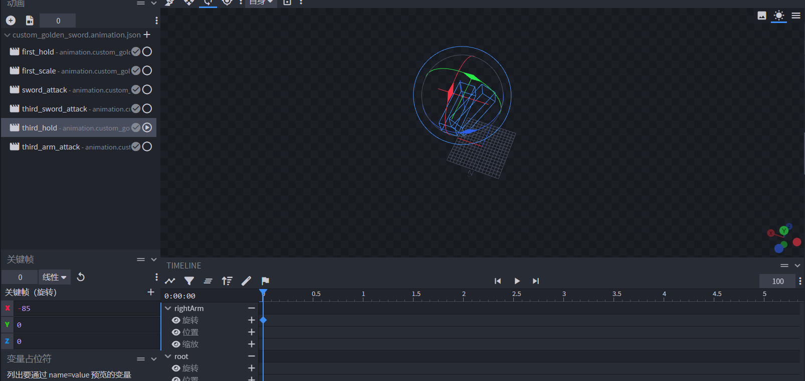

# 自定义3D武器第三人称攻击效果


在上节中，我们初步掌握如何自定义3D武器在第一人称视角下的攻击效果。由于玩家存在第一人称和第三人称，适配第三人称是必不可少的。

第三人称下的自定义3D武器攻击效果需要依赖Python代码，这里使用传统的注册自定义系统的模组开发方式为大家讲解。


**在本章你将学会：**

- 使用Blockbench和基岩版动画叠加效果制作第三人称手持金剑动画与对应的攻击动画。
- 使用模组SDK挂载新的动画资源并重构第三人称动画控制器。

本节课程所使用到的[Demo请戳这里](https://g79.gdl.netease.com/customweaponnew.zip)，以下是最终效果呈现：**


## 创建第三人称所需的动画资源

启动Blockbench，打开custom_golden_sword_arm.geo.json，并切换至动画模式，新建表现第三人称手持动画的third_hold。并将手臂向X轴朝上方旋转。




新建表现第三人称挥舞动画的third_arm_attack，选择third_arm_attack动画并勾选third_hold动画，自定义一段0.75秒的攻击动画。并将关键帧设置为平滑，让动画效果更丝滑。


由于手臂和剑分成两个模型，手臂的动画通道无法影响武器，为了让手臂挥舞时剑能与之轨迹同步，我们需要在剑模型上再多做一个动画。打开custom_golden_sword.geo.json，切换至动画模式，新增third_sword_attack动画，在选中后勾选third_hold动画，也自定义一段和手挥舞时长一样的0.75秒攻击动画，这里可以将third_arm_attack的arm骨骼关键帧拷贝一份过来，并对third_sword_attack的item骨骼打上动画关键帧。最后选择third_sword_attack动画，并勾选third_hold和third_arm_attack动画，可以看到完整的第三人称攻击动画效果。


## 挂载新的动画资源并创建新的动画控制器

新建controller.animation.player.third_person_attack_fixed动画控制器，下设default和third_person_attack两个状态，当满足query.mod.sword_attack_time不等于0时切换至播放第三人称攻击动画的状态，动画播放结束时且对应的query.mod.sword_attack_time为0时切换回default状态，以下是代码示例。

```json
{
    "format_version": "1.10.0",
    "animation_controllers": {
		"controller.animation.player.third_person_attack_fixed" : {
			"states" : {
				"default": {
					"transitions": [
						{
							"third_person_attack": "query.mod.sword_attack_time"
						}
					]
				},
				"third_person_attack": {
					"animations": [
						"third_arm_attack"
					],
					"transitions": [
						{
							"default": "!query.mod.sword_attack_time"
						}
					]
				}
			}
		}
	}
}
```


接着在CustomSwordScripts/client.py内的client_init函数下添加ActorRender组件，在游戏运行时动态添加美术资源至玩家资源定义内。由于第三人称的手臂动画涉及到玩家的资源，这是不得不采取的措施，为了尽量减少冲突的可能性，我们不选择直接修改玩家资源定义内容，而是使用Python代码导入。

```python
class AnimationClient(ClientSystem):
    # ...
    def client_init(self, event):
        # ...
        actor_comp.AddPlayerAnimationController( # 第三人称攻击动画控制器
            'controller.third_person_attack_fixed',
            'controller.animation.player.third_person_attack_fixed'
        )
        actor_comp.AddPlayerAnimation(
            'sword_third_hold',
            'animation.custom_golden_sword.third_hold' # 第三人称手持动画
        )
        actor_comp.AddPlayerAnimation(
            'third_arm_attack',
            'animation.custom_golden_sword.third_arm_attack' # 第三人称手臂动画
        )
        # 添加第三人称手持动画进玩家root动画控制器下的third_person状态里，这里存放的都是玩家在第三人称时会使用到的动画
        # 动画需满足主手手持必须是自定义金剑才会生效
        actor_comp.AddPlayerAnimationIntoState(
            'root', 'third_person', 'sword_third_hold', "query.get_equipped_item_full_name('main_hand') == 'design:custom_golden_sword'"
        )
        # 添加第三人称手持动画控制器进玩家root动画控制器下的third_person状态里，动画控制器同样可以被嵌套在其他动画控制器内
        # 动画控制器需满足主手手持必须是自定义金剑才会生效
        actor_comp.AddPlayerAnimationIntoState(
            'root', 'third_person', 'controller.third_person_attack_fixed', "query.get_equipped_item_full_name('main_hand') == 'design:custom_golden_sword'"
        )
        actor_comp.RebuildPlayerRender() #导入资源后必须重新构建玩家渲染，调用RebuildPlayerRender方法
```


在剑的attachable定义文件内，挂接third_sword_attack动画。这是因为剑挥舞的效果可以转移给剑本身，因此third_sword_attack应该挂在剑的资源定义文件内。

```json
{
    "format_version": "1.10.0",
    "minecraft:attachable": {
        "description": {
            "identifier": "design:custom_golden_sword",
            //materials
			//textures
            "animations": {
                //...
                "attack_rotation_sword": "animation.custom_golden_sword.sword_attack",
                "third_attack_rotation_sword": "animation.custom_golden_sword.third_sword_attack",
                "controller.attack": "controller.animation.sword.attack"
            },
            "scripts": {
                "animate": [
                    "controller.attack",
                    {
                        "first_hold": "c.is_first_person"
                    },
                    {
                        "first_scale": "c.is_first_person"
                    }
                ]
            }
            //geometry
            //render_controlls
        }
    }
}
```


重写controller.attack动画控制器，新增third_person和third_person_attack两个状态。要求在第三人称下状态切换为third_person，攻击开始时状态切换至third_person_attack，并播放第三人称的剑挥舞动画，在query.mod.sword_attack_time为0时切换回third_person状态。在有关第三人称的所有状态下，提供切换至default状态的条件，即满足c.is_first_person（手持实体处于第一人称）时。

```json
{
    "format_version": "1.10.0",
    "animation_controllers": {
        //...
    	"controller.animation.sword.attack": {
			"initial_state" : "default",
			"states" : {
				"default": {
					"transitions" : [
						// first_person
						{
							"third_person": "!c.is_first_person"
						}
					]
				},
				// first_person
				"third_person": {
					"transitions" : [
						{
							"default" : "c.is_first_person"
						},
						{
							"third_person_attack": "query.mod.sword_attack_time"
						}
					]
				},
				"third_person_attack": {
					"animations": [
						"third_attack_rotation_sword"
					],
					"transitions" : [
						{
							"default" : "c.is_first_person"
						},
						{
							"third_person": "!query.mod.sword_attack_time"
						}
					]
				}
                // first_person_attack
			}
		}
	}
}
```


最后进入游戏，可以看到第三人称效果已经生效。


## 一些其他优化

由于我们并没有屏蔽玩家在挥舞时点触方块的逻辑，造成挥舞的区域若离方块较近，会叠加出较为难看的挖掘动画。为了避免这个问题，可以在client.py和server.py文件分别监听StartDestroyBlockClientEvent和StartDestroyBlockServerEvent，根据实际情况判断结果，对挖掘进行取消。

以下是代码示例：

```python
# client.py
class AnimationClient(ClientSystem):
    
    def __init__(self, namespace, system_name):
        #....
        namespace = clientApi.GetEngineNamespace()
        system_name = clientApi.GetEngineSystemName()
        self.ListenForEvent(namespace, system_name,
                            'StartDestroyBlockClientEvent', self, self.attack_click_block)
    #....
    def attack_click_block(self, event):
        player_id = event['playerId']
        if player_id != clientApi.GetLocalPlayerId():
            return
        current_time = time.time()
        if current_time - self.click_cooldown < 0.75:
            event['cancel'] = True
```

```python
# server.py
class AnimationServer(ServerSystem):

    def __init__(self, namespace, system_name):
        ServerSystem.__init__(self, namespace, system_name)
        #....
        namespace = serverApi.GetEngineNamespace()
        system_name = serverApi.GetEngineSystemName()
        self.ListenForEvent(namespace, system_name,
                            'StartDestroyBlockServerEvent', self, self.attack_click_block)
        self.player_attacked_cache = {}
        self.attack_type = ['start', 'will_hit', 'end']
    
    #...
    def attack_click_block(self, event):
        player_id = event['playerId']
        if self.player_attacked_cache.get(player_id, '') != 'end':
            event['cancel'] = True
```


