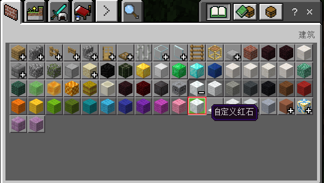

# 自定义物品分组

## 概述

用于扩展原版背包分组，让自定义物品展示更加清晰

## 原版分组拓展

支持将自定义物品放入原版分组之后，需在behavior文件夹下建立netease_group文件夹，并在netease_group目录下添加任意名称json,例如:group_config.json，配置如下：

```json
{
    "groups":[
        {
            "group_name":"itemGroup.name.wool", //分组名称，注：如需加入到原版分组之后，需填写固定的group_name，下方会列出所有原版group的名称，自定义物品的json中category必须和原版分组的category一致，例如需要将自定义物品放入羊毛分组之后，那么自定义物品的category字段必须为："Nature"
            "icon" : "customblocks:customblocks_redstone", //分组的图标，填写自定义物品的identifier,注：如果group_name为原版group，则icon字段无法生效
            "list":[ //分组所包含自定义物品的identifier，如果group_name为原版group，自定义物品会加入到原版物品之后，自定义物品的顺序按list中数组序排列
                "customblocks:customblocks_redstone", 
            ]
        },
        ...
    ]
}
```



## 原版保留分组名称

```json
itemGroup.name.planks  //木板
itemGroup.name.walls  //墙
itemGroup.name.fence  //围墙
itemGroup.name.fenceGate  //围墙门
itemGroup.name.stairs  //楼梯
itemGroup.name.door  //门
itemGroup.name.glass  //玻璃
itemGroup.name.glassPane  //玻璃板
itemGroup.name.slab  //台阶
itemGroup.name.stoneBrick  //装饰石头
itemGroup.name.sandstone  //沙石
itemGroup.name.wool  //羊毛
itemGroup.name.woolCarpet  //羊毛地毯
itemGroup.name.concretePowder  //混凝土粉末
itemGroup.name.concrete  //混凝土
itemGroup.name.stainedClay  //陶瓦
itemGroup.name.glazedTerracotta  //带釉陶瓦
itemGroup.name.dye  //染料
itemGroup.name.ore  //矿石
itemGroup.name.stone  //石头
itemGroup.name.log  //原木
itemGroup.name.leaves  //树叶
itemGroup.name.sapling  //树苗
itemGroup.name.seed  //种子
itemGroup.name.crop  //农作物
itemGroup.name.grass  //地表植物
itemGroup.name.flower  //花
itemGroup.name.rawFood  //生食
itemGroup.name.cookedFood  //熟食
itemGroup.name.miscFood  //其他食物
itemGroup.name.mushroom  //蘑菇
itemGroup.name.monsterStoneEgg  //被虫蚀的石头
itemGroup.name.mobEgg  //生物蛋
itemGroup.name.helmet  //头盔
itemGroup.name.chestplate  //胸甲
itemGroup.name.leggings  //护腿
itemGroup.name.boots  //靴子
itemGroup.name.horseArmor  //马甲
itemGroup.name.sword  //剑
itemGroup.name.axe  //斧头
itemGroup.name.pickaxe  //镐
itemGroup.name.shovel  //锹
itemGroup.name.hoe  //锄头
itemGroup.name.arrow  //箭
itemGroup.name.potion  //药水
itemGroup.name.splashPotion  //喷溅药水
itemGroup.name.lingeringPotion  //滞留药水
itemGroup.name.bed  //床
itemGroup.name.anvil  //铁砧
itemGroup.name.chest  //箱子
itemGroup.name.shulkerBox  //潜影盒
itemGroup.name.record  //唱片
itemGroup.name.skull  //生物模型
itemGroup.name.boat  //船
itemGroup.name.rail  //铁轨
itemGroup.name.minecart  //矿车
itemGroup.name.pressurePlate  //压力板
itemGroup.name.trapdoor  //活板门
itemGroup.name.enchantedBook  //附魔书
itemGroup.name.banner  //旗帜
itemGroup.name.firework  //烟花火箭
itemGroup.name.fireworkStars  //烟火之星
itemGroup.name.coral  //珊瑚块
itemGroup.name.coral_decorations  //珊瑚装饰
itemGroup.name.buttons  //按钮
itemGroup.name.sign  //告示牌
itemGroup.name.wood  //树林
itemGroup.name.banner_pattern  //旗帜图案
```

## 自定义分组

​	自定义分组与原版分组拓展类似，只需修改group_name为非原版保留分组名称即可

```json
{
    "groups":[
        {
            "group_name":"itemGroup.name.groupTest1", //分组名称，需避免和原版分组重名，可将group_name填入zh_CN.lang中设置中文名称
            "icon" : "customblocks:customblocks_redstone_consumer", //分组的图标，填写自定义物品的identifier(仅支持填写当前分组内的自定义物品)
            "list":[ //分组内所包含自定义物品identifier，分组中的顺序按如下数组序排列
                "customblocks:customblocks_redstone", 
                "customblocks:customblocks_redstone_consumer"
            ]
        },
        ...
    ]
}
```


## 注意点

1.如果自定义分组"list"中物品数量最少为两个，否则将注册失败

2.同一个自定义物品只可放到一个分组中

