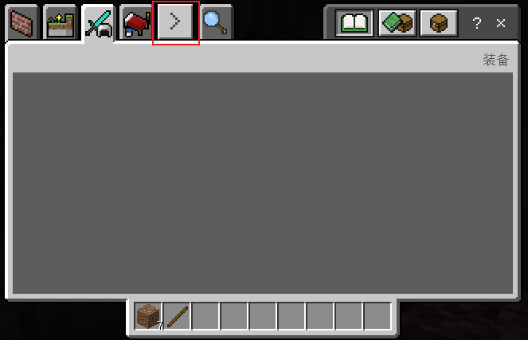
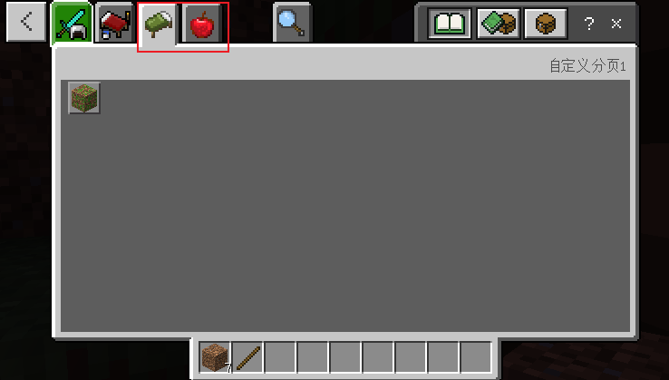

---
front:
hard: 入门
time: 分钟
---

# 自定义物品分页

## 概述

用于扩展原版背包分页，让同一mod的自定义物品统一展示

## 注册

在 behavior 文件夹下新建 netease_tab 文件夹，并在其目录下添加任意名称json 文件，例如 category_config.json，配置如下：

```json
{
    "category":[
        {
            "name":"custom1", //分页名称，自定义物品的json中category的值
            "labelText":"itemCategory.name.custom1", //分页描述，可在zh_CN.lang中设置中文名称
            "icon": "textures/items/bed_green", //分页图标路径
            "sort_by_identifier" : true //分页内的item是否进行排序（选填，默认false）
        },
        {
            "name":"custom2",
            "labelText":"itemCategory.name.custom2",
            "icon":"textures/items/apple"
        }
        ...
    ]
}
```

 **注：**

**1.name由小写字母组成，请勿使用大写字母（支持下划线）**

**2."sort_by_identifier"排序规则如下：**

- **分页中全部为未分组item，则按照item的identifier进行排序**
- **分页中全部为具有分组的item，则按照分组中第一个item的identifier进行排序**
- **分页中既有分组item和未分组item，则按照分组中第一个item的identifier和未分组item的identifier进行排序**

效果如下图，自定义分页将排列在原版分页之后，分别对应custom1，custom2，排列在原版分页之后，点击右箭头即可展示下一组分页，自定义分页的顺序按照category数组顺序排列。






## 使用

在 behavior 文件夹下的自定义物品的 json 里，修改 `category` 值为 custom1。

```json
{
	"format_version": "1.10.0",
	"minecraft:block": {
		"description": {
			"identifier": "customblocks:test_block1",
			"category":"custom1" //修改为custom1
		},
		"components": {
		}
	}
}
```


## 注意事项

从2.6版本开始，当多个mod都配置了自定义分页时，引擎会将name和labelText字段都完全相同的物品合并到同一个分页。