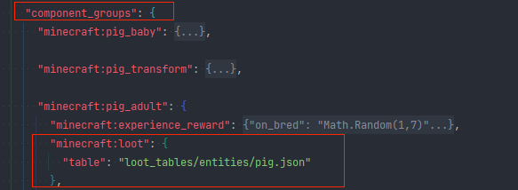
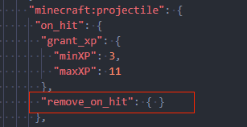

## 配置已知问题说明

配置的一些json字段可能导致表现异常，此处给出一些已知的问题说明。

### 1.实体配置组件的覆盖

实体配置中除components字段可以定义组件外，也可以使用component_groups来定义组件的动态增删。因此，部分components中定义的组件可能被动态覆盖。如原生生物猪的掉落表配置会因为幼年或成年替换成对应的掉落表。

### 2.实体的突然消失

部分抛射物类实体，如附魔之瓶，在接触地面后会破裂消失，这是由于抛射物组件决定的，如果自己的实体有使用这个组件，也会产生类似的现象。

