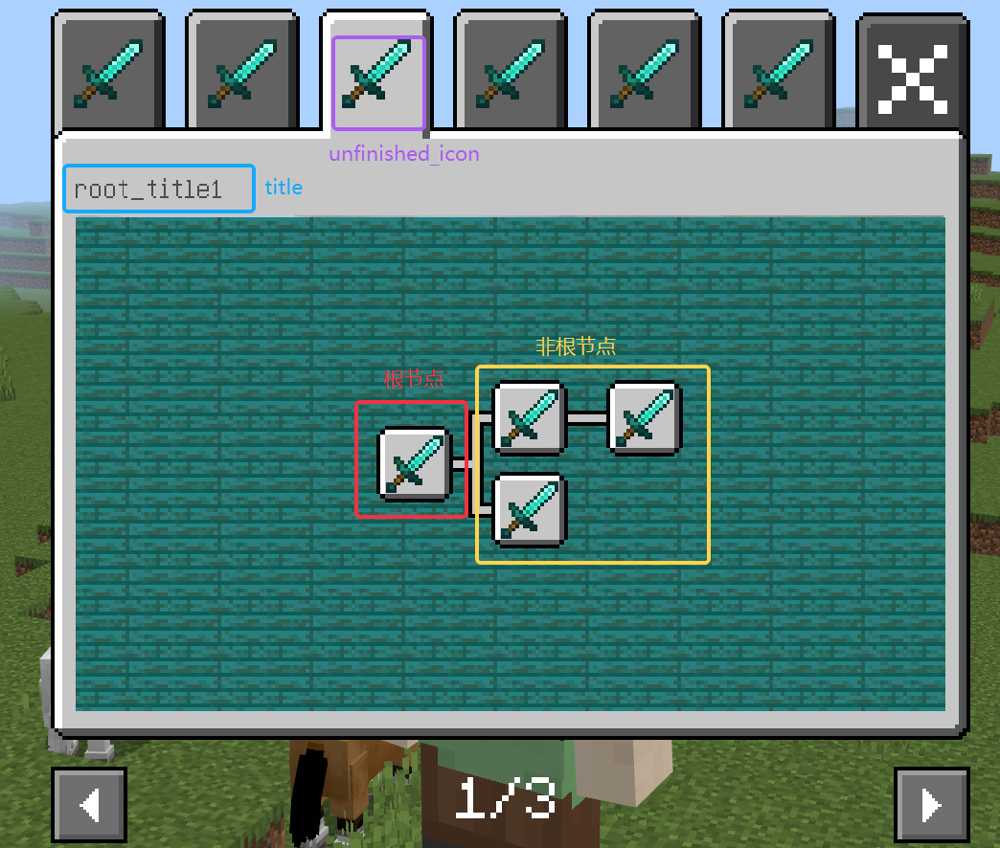
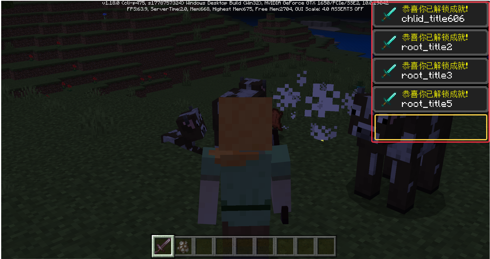
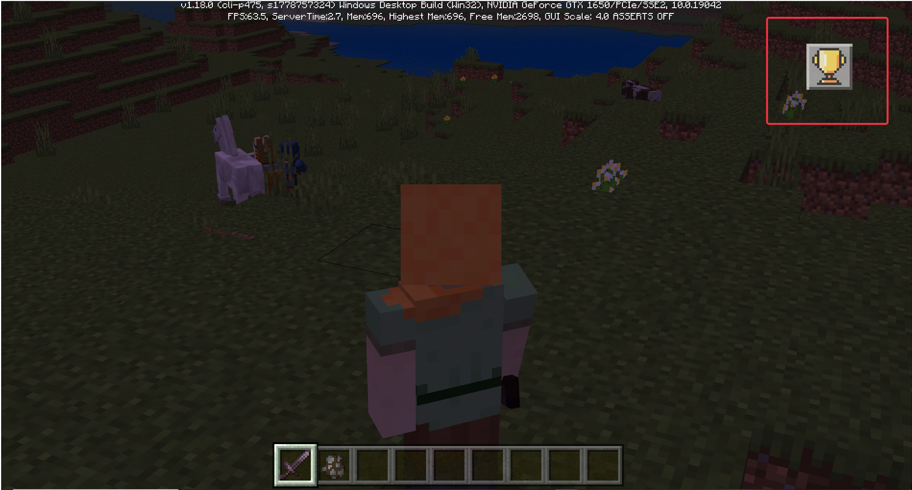

# 自定义成就系统

## 1.概述

自定义成就系统是提供给开发者用于创建一套符合自己要求的成就系统，开发者可通过配置json来定义自己独特的成就事件。

目前给开发者提供了两种内嵌成就类型分别为[击杀生物事件](#击杀)和[获得物品事件](#获得)，开发者也可通过自己监听事件来判断玩家是否达成成就。

该系统还提供了自动调用的奖励机制，开发者只需在serverSystem编写奖励函数，在json中配置对应的命名空间与系统名，自定义成就系统即可在玩家完成成就时，自动调用对应的函数。（详见示例[CustomAchievementMod](./../13-模组SDK编程/60-Demo示例.md#CustomAchievementMod)）


## 2.json配置成就节点

### 2.1 创建成就节点

- 一个成就节点对应一个json文件，必须放在“**behavior_pack/customAchievements**”文件夹下
- 如果修改已经发布的节点目标值"goal_number"，请注意奖励函数的调用。如原先进度5，目标进度10，将目标进度改为3，将不会触发奖励函数。如原先进度5，目标进度5，已经触发了奖励函数，这时将目标进度改为10，当进度为10时将再一次触发奖励函数的调用。
- 节点的排序方式是按照python的sort函数进行排序，将node_ID字母按从A到Z，数字按从小到大，逐位排序，如果对节点位置有要求，请按照该规则编写节点ID

### 2.2 编写json

#### 	1）根节点json

```json
{
	"node_ID": "rootNode",
	"title": "奶牛爱好者",
	"unfinished_icon": "textures/ui/item/diamond_sword",
	"finished_icon": "textures/ui/item/diamond_sword",
	"use_default_icon_background": true,
	"goal_details":{
		"goal_type":"default_kill",
		"entity_identifier":"minecraft:cow"
	},
	"goal_number":3,
	"node_description":"杀死3只奶牛",
	"window_background":"textures/ui/background/sign_warped",
	"reward":[
		{
			"function_name":"fun1",
			"name_space":"namespce:systemname",
			"data":{
				"EXP":20,
				"string":"hellowerld"
			}
		},
		{
			"function_name":"fun2",
			"name_space":"namespce:systemname",
			"data":{
				"EXP":20,
				"string":"hellowerld"
			}
		}
	],
	"is_hidden":false,
	"finish_tip":true,
	"is_cloud" :false,
	"auto_sent_cloud":true
}
```

|            属性             | 解释                                                         |
| :-------------------------: | ------------------------------------------------------------ |
|           node_ID           | 必选，成就节点的唯一标识符，不可重复出现，使用多个MOD前，请检查各个MOD下的成就节点是否有该属性重复 |
|            title            | 必选，成就节点标题，根节点的标题会在对应窗口显示时作为该窗口的主标题，该标题在点击节点时也会展示，也会用于完成成就时的弹框展示，[支持颜色代码](https://minecraft-zh.gamepedia.com/%E6%A0%B7%E5%BC%8F%E4%BB%A3%E7%A0%81) |
|       unfinished_icon       | 必选，成就未达成前的图标，路径为resource文件下的“texture/../..”，仅支持png格式，根节点的unfinished_icon将作为该成就分页的标题图标 |
|        finished_icon        | 必选，成就达成后的图标，路径为resource文件下的“texture/../..”，仅支持png格式 |
| use_default_icon_background | 可选，是否使用提供的图标背景，默认为True，如果开发者想使用自己的背景图标，可设置为False，然后在上述的unfinished_icon/finished_icon中设置自己想要的图标样式，即一张图标中包括Icon与Icon的背景 |
|        goal_details         | 可选，如果是想使用提供的“击杀事件”或“获得事件”，需要按照要求进行内容填写。详参**3.两个基础预设的成就类型** |
|         goal_number         | 必选，成就的目标值，例如“击杀3头牛”则为3，“获得5个苹果”则为5，如果是特殊事件如”进入下界“则玩家可自行设置为1 |
|      node_description       | 必选，用于描述该节点的具体信息，建议在这里写上成就目标与成就奖励，[支持颜色代码](https://minecraft-zh.gamepedia.com/%E6%A0%B7%E5%BC%8F%E4%BB%A3%E7%A0%81) |
|      window_background      | 必选，**根节点特有属性**，该根节点对应的成就分页的背景图，当图片小于背景板大小时，会进行平铺。如果不想使用平铺效果，可设置与背景板大小一致的图片，背景板的大小是随开发者提供的节点形成的树的高度与宽度决定的。计算公式为： 宽度 = 树的深度 * 30 px，如果宽度小于227，贴图宽度应为227， 高度 = 树的最大宽度 *24 px，如果宽度小于129，贴图宽度应为129。 |
|           reward            | 可选，注册可调用的奖励函数，“function_name”：函数名，“name_space”：nameSpace：systemName（即Mod注册RegisterSystem时填写的nameSpace和systemName，这里为serverSystem，不可为clientSystem），data为调用这个函数时传入的参数dict，该dict参数还会添加一个“playID”用于传输触发奖励的玩家ID |
|          is_hidden          | 可选，是否隐藏，默认为False，如果设置为True，根节点设置为隐藏时，会将整个成就分页隐藏，只有当这个节点或该节点的某个子节点完成时才可见。 |
|         finish_tip          | 可选，完成该成就时是否弹出提示框，默认为True                 |
|          is_cloud           | 可选，是否为云成就，默认为False，即成就进度是否上传开发者平台，如果为云成就每次进入都会从服务器读取对应的成就进度进行初始化，**仅联机大厅与Apollo有用** |
|       auto_sent_cloud       | 可选，是否自动上传云成就，默认为True，当“is_cloud”也为True时才有作用，如果设置为自动上传会在每次调用<a href="./../../../mcdocs/1-ModAPI/接口/自定义UI/自定义成就系统.html#addnodeprogress" rel="noopenner">AddNodeProgress</a>修改成就进度的时候，将属于云成就的节点进度上传。如果为False，由开发者自行选择上传时机。可以用<a href="./../../../mcdocs/1-ModAPI/接口/自定义UI/自定义成就系统.html#addnodeprogress" rel="noopenner">AddNodeProgress</a>接口更新本地数据，并用一个变量存储相加每次的Delta，使用云成就上报接口<a href="./../../../mcdocs/1-ModAPI/接口/成就.html#lobbysetachievementstorage" rel="noopenner">LobbySetAchievementStorage</a>，**仅联机大厅与Apollo有用** |



#### 2）非根节点json

```json
{
	"node_ID": "Node5",
	"parent_node":"rootNode",
	"title": "111111",
	"unfinished_icon": "textures/ui/item/book_enchanted",
	"finished_icon": "textures/ui/item/book_enchanted",
	"use_default_icon_background": true,
	"goal_details":{
		"goal_type":"default_get",
		"item_dict":{
				"newItemName":"minecraft:apple"
			}
	},
	"goal_number":2,
	"node_descriptrion":"111111111",
	"reward":[
		{
			"function_name":"fun1",
			"name_space":"namespce:systemname",
			"data":{
				"EXP":20,
				"string":"hellowerld"
			}
		},
		{
			"function_name":"fun2",
			"name_space":"namespce:systemname",
			"data":{
				"EXP":20,
				"string":"hellowerld"
			}
		}
	],
	"is_hidden":false,
	"finish_tip":true,
	"is_cloud" :false,
	"auto_sent_cloud":true,
	"depend_parent":false
}
```

|            属性             | 解释                                                         |
| :-------------------------: | ------------------------------------------------------------ |
|           node_ID           | 必选，成就节点的唯一标识符，不可重复出现，使用多个MOD前，请检查各个MOD下的成就节点是否有该属性重复 |
|         parent_node         | 必选，**非根节点特有属性**，填写该节点的父节点node_ID        |
|        depend_parent        | 可选，**非根节点特有属性**，是否依赖父节点，默认为False，如为True，该节点的进度只有当其父节点完成时才能开始记录 |
|            title            | 必选，成就节点标题，该标题在点击节点时会展示，也会用于完成成就时的弹框展示，[支持颜色代码](https://minecraft-zh.gamepedia.com/%E6%A0%B7%E5%BC%8F%E4%BB%A3%E7%A0%81) |
|       unfinished_icon       | 必选，成就未达成前的图标，路径为resource文件下的“texture/../..” |
|        finished_icon        | 必选，成就达成后的图标，路径为resource文件下的“texture/../..” |
| use_default_icon_background | 可选，是否使用提供的图标背景，默认为True，如果开发者想使用自己的背景图标，可设置为False，然后在上述的unfinished_icon/finished_icon中设置自己想要的图标样式，即一张图标中包括Icon与Icon的背景 |
|        goal_details         | 可选，如果是想使用提供的“击杀事件”或“获得事件”，需要按照要求进行内容填写，详参*[3.两个基础预设的成就类型](#两个基础预设)* |
|         goal_number         | 必选，成就的目标值，例如“击杀3头牛”则为3，“获得5个苹果”则为5，如果是特殊事件如”进入下界“则玩家可自行设置为1 |
|      node_description       | 必选，用于描述该节点的具体信息，建议在这里写上成就目标与成就奖励，[支持颜色代码](https://minecraft-zh.gamepedia.com/%E6%A0%B7%E5%BC%8F%E4%BB%A3%E7%A0%81) |
|           reward            | 可选，注册可调用的奖励函数，“function_name”：函数名，“name_space”：nameSpace：systemName（即Mod注册RegisterSystem时填写的nameSpace和systemName，这里为serverSystem，不可为clientSystem），data为调用这个函数时传入的参数dict，该dict参数还会添加一个“playID”用于传输触发奖励的玩家ID |
|          is_hidden          | 可选，是否隐藏，默认为False，如果设置为True，则这个节点在对应的成就分页中隐藏，只有当这个节点或者该节点的某个子节点完成时才可见 |
|         finish_tip          | 可选，完成该成就时是否弹出提示框，默认为True                 |
|          is_cloud           | 可选，是否为云成就，默认为False，即成就进度是否上传开发者平台，如果为云成就每次进入都会从服务器读取对应的成就进度进行初始化，**仅联机大厅与Apollo有用** |
|       auto_sent_cloud       | 可选，是否自动上传云成就，默认为True，当“is_cloud”也为True时才有作用，如果设置为自动上传会在每次调用<a href="./../../../mcdocs/1-ModAPI/接口/自定义UI/自定义成就系统.html#addnodeprogress" rel="noopenner">AddNodeProgress</a>修改成就进度的时候，将属于云成就的节点进度上传。如果为False，由开发者自行选择上传时机。可以用<a href="./../../../mcdocs/1-ModAPI/接口/自定义UI/自定义成就系统.html#addnodeprogress" rel="noopenner">AddNodeProgress</a>接口更新本地数据，并用一个变量存储相加每次的Delta，使用云成就上报接口<a href="./../../../mcdocs/1-ModAPI/接口/成就.html#lobbysetachievementstorage" rel="noopenner">LobbySetAchievementStorage</a>，**仅联机大厅与Apollo有用** |

## 3.两个基础预设的成就类型<span id="两个基础预设"></span>

### 3.1 击杀生物成就<span id="击杀"></span>

1）在成就节点的json文件中，将“goal_details”的"goal_type"属性设置为"default_kill"，系统将进行自动的监听

2）在成就节点的json文件中，将“goal_details”的"entity_identifier"属性设置为对应生物的identifier ，如"minecraft:cow"

3）该事件中一个成就节点只能监听一种生物，无法在一个节点中监听多种生物

4）当监测到目标事件，会自动添加节点进度。

示例：

```json
"goal_details":{
		"goal_type":"default_kill",
		"entity_identifier":"minecraft:cow"
	}
```

### 3.2 获得物品成就<span id="获得"></span>

1）在成就节点的json文件中，将“goal_details”的"goal_type"属性设置为"default_get"，系统将进行自动的监听

2）在成就节点的json文件中，将“goal_details”的"item_dict"属性设置为对应的[物品信息字典](https://mc.163.com/dev/mcmanual/mc-dev/mcguide/20-%E7%8E%A9%E6%B3%95%E5%BC%80%E5%8F%91/10-%E5%9F%BA%E6%9C%AC%E6%A6%82%E5%BF%B5/1-%E6%88%91%E7%9A%84%E4%B8%96%E7%95%8C%E5%9F%BA%E7%A1%80%E6%A6%82%E5%BF%B5.html#%E7%89%A9%E5%93%81%E4%BF%A1%E6%81%AF%E5%AD%97%E5%85%B8#%E7%89%A9%E5%93%81%E4%BF%A1%E6%81%AF%E5%AD%97%E5%85%B8)

- 如果检查信息涉及enchantData和modEnchantData的附魔属性，需将list中的()改为为[]，可参考[示例1](#示例1)。
- “item_dict”必须配置“newItemName”，不可配置“count”。
- 检查信息不包括“userdata”里面的信息，如配置羊毛时，获得任意羊毛都能触发成就监测，参考[示例2](#示例2)。
- 另外如果配置了“userdata”将导致无法触发监测，请勿配置该信息。

3）该事件中一个成就节点只能监听一种物品，无法在一个节点中监听多种物品

4）触发监测事件是当玩家物品栏发生改变的时候，统计玩家物品栏中符合要求的物品数量

5）对于需要云成就，本地会保存两份数据，一份是从云端获得的成就进度，一份是本地该节点的进度，如云端的进度为8，本地的进度为3，只有当玩家物品栏的目标物品数量大于3的时候才会触发成就进度更新

6）当监测到目标事件，会自动添加节点进度。

示例1<span id="示例1"></span>：

```json
"goal_details": {
    	//获得一把具有锋利I、自定义附魔3II的钻石剑
        "item_dict": {"newItemName":"minecraft:diamond_sword", 
					  "enchantData": [[9,1]],
					  "modEnchantData":[["customenchant3",2]]
		},
        "goal_type": "default_get"
    }
```

示例2<span id="示例2"></span>：

```json
"goal_details": {
		//获得任意颜色羊毛时触发
        "item_dict": {
            "newItemName": "minecraft:wool"
        },
        "goal_type": "default_get"
    }
```

## 4.提示框

1）只有该节点的Json文件中的“finish_tip”选择为true才有提示框

2）一共设计有5个提示框槽位，当五个提示框槽位都播放有动画时，会将待播放的提示缓存，等待有空槽位的时候才弹出提示框

3）提示框左边的Icon会读取“finished_icon”属性下的图片路径

4）白色文本是对应节点的title

5）提示框的层级为150，高于入口按钮层级



## 5.入口图标

1）入口图标只有当有可以显示的节点时才会初始化，如果没有节点，或者所有根节点隐藏不可见时，该图标不会显示

2）该图标支持拖拽，拖动释放时不会调用按钮事件

3）入口图标层级为110，会被提示框覆盖



## 6.成就接口与事件

### 6.1接口

- <a href="./../../../mcdocs/1-ModAPI/接口/自定义UI/自定义成就系统.html#getnodedetailinfo" rel="noopenner">GetNodeDetailInfo</a>：获取对应玩家的对应节点信息
- <a href="./../../../mcdocs/1-ModAPI/接口/自定义UI/自定义成就系统.html#setnodefinish" rel="noopenner">SetNodeFinish</a>：设置对应玩家的对应成就节点完成
- <a href="./../../../mcdocs/1-ModAPI/接口/自定义UI/自定义成就系统.html#addnodeprogress" rel="noopenner">AddNodeProgress</a>：增加对应玩家的对应成就节点的成就进度
- <a href="./../../../mcdocs/1-ModAPI/接口/自定义UI/自定义成就系统.html#getchildrennode" rel="noopenner">GetChildrenNode</a>：获得该成就节点的下一级所有孩子节点的list

### 6.2成就事件

- <a href="./../../../mcdocs/1-ModAPI/事件/世界.html#achievementcompleteevent">AchievementCompleteEvent</a>：玩家完成自定义成就时触发该事件