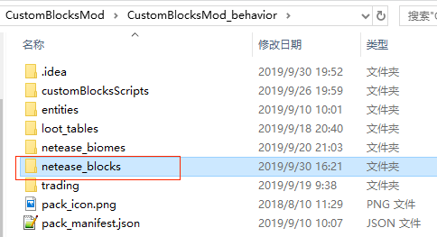
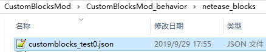
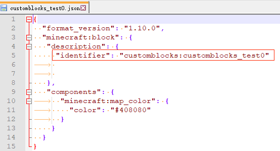
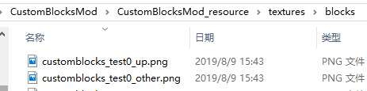
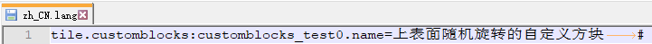

---
front:
hard: 入门
time: 分钟
---

# 自定义方块概述

该功能不需要开启实验性玩法。

开发者可以通过在addon中配置json来添加自定义方块。添加的自定义方块支持ModAPI中与方块及物品相关的所有事件及接口。

## 注册

以demo [CustomBlocksMod](../../13-模组SDK编程/60-Demo示例.md#CustomBlocksMod)为例：

1. 在行为包中新建`netease_blocks`目录

   

2. 在目录下新建一个json用于编写方块的定义。

   

   

   - json中至少有一个component
   - **identifier**的格式为：命名空间[冒号]方块名。identifier必须全局唯一，命名空间推荐与mod名称一致。
   - **mod中其他地方都是用这个identifier与这个自定义方块对应上**。

3. 将方块的贴图放到`textures\blocks`中

   可以支持高于16×16分辨率的高清贴图，但需要注意过高的分辨率会导致手机端（尤其是低端机）上无法进入游戏。

   

4. 在textures中新建`terrain_texture.json`，编写资源名与贴图的对应关系。资源名的命名必须满足全局唯一。json格式可参考“Mod PC开发包”的`data\resource_packs\vanilla\textures\terrain_texture.json`

   

   

5. 在resource中新建一个`blocks.json`，编写方块贴图及声音，贴图的值需要与上一步`terrain_texture.json`中配置的资源名对应。json格式可参考“Mod PC开发包”的`data\resource_packs\vanilla\blocks.json`

   

   

6. 在`texts\zh_CN.lang`中配置方块中文名称：

   键的格式为`tile.方块identifier.name`

   

   

7. 重复1-6编写其他自定义方块

## 卸载

若使用了自定义方块的存档卸载mod后再进入时：

1. 对地图上已存在的自定义方块：

   （1）自定义方块会变为未知的方块。如果用GetBlockNew接口获取它的信息，indentifier是之前的自定义方块。生存模式下，玩家可以用手瞬间破坏这个未知的方块，生成掉落物，且可以拾取。拾取到背包后显示的物品名字为”未知“，且无法放置到世界中。

   （2）若某个subchunk未进行过方块更新，那么重新加载mod时，自定义方块会保留。但一旦subchunk进行了方块更新，即使重新加载mod，自定义方块会永远消失。

2. 对玩家背包中的自定义方块：

   物品会消失。若重新加载mod，对卸载期间登录过的玩家，物品不会恢复；没登录过的玩家，物品可以保留。

3. 对地图上容器内的自定义方块：

   物品会消失。若重新加载mod，对卸载期间进行探索过的区域内的容器，物品不会恢复；未探索区域的容器，物品可以保留。

4. 对地图上未捡起的掉落物：

   掉落物会消失。若重新加载mod，对卸载期间进行探索过的区域，掉落物不会恢复（除非subchunk内没有其他任何entity）；未探索区域的掉落物可以保留。
