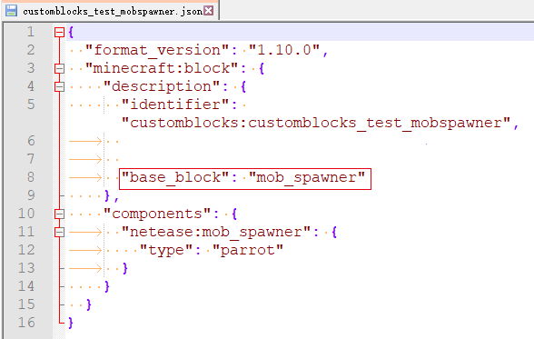

---
front:
hard: 入门
time: 分钟
---

# 特殊方块概述

开发者可通过在方块定义json中添加base_block来修改方块的基础行为。

base_block包括：

* mob_spawner 自定义刷怪箱
* portal 自定义传送门
* custom_crop_block 自定义农作物
* custom_heavy_block 自定义重力方块
* liquid 自定义静态流体方块
* flowing_liquid 自定义动态流体方块

如下图为自定义刷怪箱的base_block配置：

