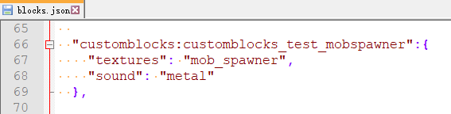

# 自定义刷怪箱

## base_block设置

- **自定义刷怪箱方块的base_block需要设为mob_spawner，**
- **还应在blocks.json中进行如下设置：**

## netease:mob_spawner

可在netease:mob_spawner组件中设置刷怪的类型，目前支持原生生物、微软自定义生物。

| 键   | 类型   | 默认值 | 解释                             |
| ---- | ------ | ------ | -------------------------------- |
| type | string |        | 必须设置，用于控制生成的生物类型 |

- 原生生物type为"minecraft:Namespaced ID"，如"minecraft:parrot"，Namespaced ID可参考[官方wiki](https://minecraft.gamepedia.com/Mob#List_of_mobs)中各Mob的详细信息。
- 微软自定义生物type为"minecraft:entity"中"description"的"identifier"项，可参考[自定义生物文档](../../3-自定义生物/01-自定义基础生物.md)及[CustomBlocksMod](../../../13-模组SDK编程/60-Demo示例.md#CustomBlocksMod)中的customblocks_test_mobspawner1.json。