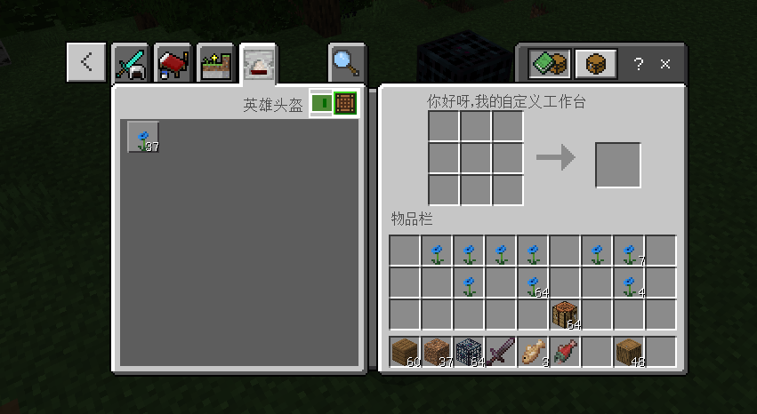

# 自定义工作台

## 概述

自定义工作台组件支持将一个方块改造成一个指定配方的自定义工作台。

需设置以下组件

## netease:block_crafting_table

可在netease:block_crafting_table组件中为工作台命名并指定允许在这个工作台使用的配方

| 键                 | 类型   | 默认值 | 解释                                                         |
| ------------------ | ------ | ------ | ------------------------------------------------------------ |
| custom_description | string |        | 可选，不填为自定义方块的identifier。pocket模式下存在字数限制，限制为9个中文字符。 |
| crafting_tags      | list   |        | 必填，用于该自定义工作台的配方的tag，不填无法打开工作台，原版工作台的tag是crafting_table     |

### 示例
```json
//自定义工作台方块的json,相关内容都在component里面添加
{
  "format_version": "1.16.100",
  "minecraft:block": {
    "description": {
      "identifier": "customblocks:customblocks_test_mobspawner1",
	  "category": "items"
    },
    "components": {
      "netease:block_crafting_table": {
        "custom_description": "你好呀，我的自定义工作台",
        "crafting_tags": [
          "customTag"
        ]
      }
    }
  }
}
```

效果如下图



```json
//自定义配方例子，其中的tags对应上文工作台中的crafting_tags
{
	"format_version": "1.12",
	"minecraft:recipe_shaped": {
		"description": {
			"identifier": "customblocks:customblocks_model_flower"
		},

		"tags": ["customTag"],
		"pattern": [
			"X",
			"#"
		],
		"key": {
			"#": {
				"item": "customblocks:customblocks_test0"
			},
			"X": {
				"item": "minecraft:dirt"
			}
		},
		"result": {
			"item": "customblocks:customblocks_model_flower"
		}
	}
}
```


## 注意

目前国际版也有一套自定义工作台，两者是冲突的，网易版自定义工作台会覆盖微软版的自定义工作台，请勿一起使用
