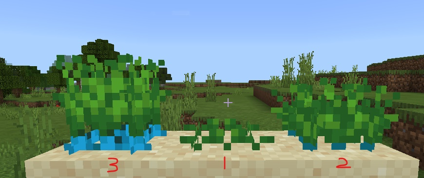

# 自定义农作物

## 概述

开发者可以通过以下两种方式实现自定义农作物，详见demo [CustomCropMod](../../../13-模组SDK编程/60-Demo示例.md#CustomCropMod)

1）通过[netease:transform组件](#netease_transform)定义农作物之间的转换规则；

2）通过python脚本监听<a href="../../../../../mcdocs/1-ModAPI/事件/物品.html#serveritemuseonevent" rel="noopenner"> ServerItemUseOnEvent </a>、<a href="../../../../../mcdocs/1-ModAPI/事件/方块.html#blockrandomtickserverevent" rel="noopenner"> BlockRandomTickServerEvent </a>、<a href="../../../../../mcdocs/1-ModAPI/事件/方块.html#blockneighborchangedserverevent" rel="noopenner"> BlockNeighborChangedServerEvent </a>等事件控制方式。


## 公共组件说明

### base_block设置

- **自定义农作物方块的base_block需要设为custom_crop_block**


<span id="netease_transform"></span>
### netease:transform

该组件用于自定义农作物方块之间的转换

| 键         | 类型 | 默认值 | 解释                                                       |
| ---------- | ---- | ------ | ---------------------------------------------------------- |
| conditions | dict |        | 农作物方块转换的条件，三个条件同时满足时会转化为result方块 |
| result     | str  |        | 农作物方块转换后的方块名称                                 |

例如：

 ```json
  "netease:transform": {
      "conditions": {
          "brightness": { # 农作物生长必须满足的光照条件
              "max": 15,
              "min": 9
          },
          "random_tick_count": { # 转化需要经过的随机tick次数
              "value": 2  # 2表示在第三次随机tick时转化，不允许小于等于0的值
          },
          "surrouding": { # 转化需要的周围方块
              "value": "minecraft:sand",
              "radius": 1 # 半径
          }
      },
      "result": "minecraft:egg" # 转化为哪种方块
  }
 ```

### minecraft:seed

自定义种子，详见[minecraft:seed](../../1-自定义物品/1-自定义基础物品.md#minecraft_seed)


## 自定义农作物方式一

该方式适用于纯配置json，不需要写任何python脚本逻辑。

这种方式包括一个种子（自定义物品）与三种自定义农作物的状态（自定义方块）。

### 1）自定义种子

参照[自定义基础物品](../../1-自定义物品/1-自定义基础物品.md)，自定义一个农作物种子customcrop:custom_wheat_seeds。

```json
{
  "format_version": "1.10",
  "minecraft:item": {
    "description": {
      "identifier": "customcrop:custom_wheat_seeds",
	    "register_to_create_menu":true,
	    "category": "Nature"
    },
    "components": {
      "minecraft:seed": {
        "crop_result": "customcrop:customcrop_stage0",# 种子生成的方块
        "plant_at": "minecraft:sand" #种植条件
      }
    }
  }
}
```

json说明：

该种子的标识为customcrop:custom_wheat_seeds，它包含一个minecraft:seed组件，其中

| 字段        | 值                           | 说明                                                         |
| ----------- | ---------------------------- | ------------------------------------------------------------ |
| crop_result | customcrop:customcrop_stage0 | 种子将生长为customcrop:customcrop_stage0自定义方块           |
| plant_at    | minecraft:sand               | 该种子只能在“沙子”上种植，种植后其所有的生长状态的下方方块也必须为“沙子”，如果底部的方块被破坏，农作物也将被破坏 |


### 2）自定义三种农作物状态

参照[自定义方块](../0-自定义方块概述.md)，我们将自定义三种农作物状态，分别为：customcrop:customcrop_stage0、customcrop:customcrop_stage1、customcrop:customcrop_stage2，其中部分json如下所示：

#### customcrop:customcrop_stage0

```json
{
  "format_version": "1.10.0",
  "minecraft:block": {
   "description": {
     "identifier": "customcrop:customcrop_stage0",
      "register_to_creative_menu": true,
      "is_experimental": false,
      "base_block": "custom_crop_block"
   },
   "components": {
      ...
      "netease:transform": {
        "conditions": {
          "brightness": { # 光照条件
            "max": 15,
            "min": 9
          },
          "random_tick_count": { # 随机tick次数条件
            "value": 1
          },
          "surrouding": { # 在半径为1的周围需要存在“沙子”
            "value": "minecraft:sand",
            "radius": 1
          }
        },
        "result": "customcrop:customcrop_stage1" # 成长下一阶段的方块
      },
      ...
    }
  }
}
```


#### customcrop:customcrop_stage1

```json
{
  "format_version": "1.10.0",
  "minecraft:block": {
   "description": {
     "identifier": "customcrop:customcrop_stage1",
      "register_to_creative_menu": true,
      "is_experimental": false,
      "base_block": "custom_crop_block"
   },
   "components": {
      ...
      "netease:transform": {
        "conditions": {
          "brightness": {
            "max": 15,
            "min": 9
          },
          "random_tick_count": {
            "value": 1
          },
          "surrouding": {
            "value": "minecraft:sand",
            "radius": 1
          }
        },
        "result": "customcrop:customcrop_stage2" # 成长下一阶段的方块
      },
      ...
    }
  }
}
```


#### customcrop:customcrop_stage2

```json
{
  "format_version": "1.10.0",
  "minecraft:block": {
   "description": {
     "identifier": "customcrop:customcrop_stage2",
      "register_to_creative_menu": true,
      "is_experimental": false,
      "base_block": "custom_crop_block"
    },
    "components": {
      ...
      "minecraft:loot": {
        "table": "loot_tables/blocks/customcrop_stage2.json"
      }
      ...
    }
  }
}
```

该阶段为农作物的成熟阶段，可以通过minecraft:loot的方式获得收获。

### 3）成长过程



其中中间为阶段一（customcrop:customcrop_stage0），最右边为阶段二（customcrop:customcrop_stage1），左边为阶段三（customcrop:customcrop_stage2）。

## 自定义农作物方式二

该方式适用于配置json+python脚本控制。

这种方式包括一个物品（自定义物品）与三种自定义农作物的状态（自定义方块）。

这种方式需要配置[netease:random_tick](../1-JSON组件.md#netease_random_tick)和[netease:block_entity](../1-JSON组件.md#netease_block_entity)，使得<a href="../../../../../mcdocs/1-ModAPI/事件/方块.html#blockrandomtickserverevent" rel="noopenner"> BlockRandomTickServerEvent事件 </a>发送到脚本层并且支持[自定义方块实体](../4-自定义方块实体.md)，从而实现方块转换的控制以及方块状态的存档。

#### 1）自定义物品

​       在示例mod中，该自定义物品为customcrop:custom_item，在该物品的使用时，通过监听事件<a href="../../../../../mcdocs/1-ModAPI/事件/物品.html#serveritemuseonevent" rel="noopenner"> ServerItemUseOnEvent </a>来判断是否可以在当前位置种植该物品（类似customcrop:custom_wheat_seeds的minecraft:seed中的plant_at功能），并且通过<a href="../../../../../mcdocs/1-ModAPI/接口/世界/方块管理.html#setblocknew" rel="noopenner"> SetBlockNew </a>设置农作物阶段一（customcrop:customcrop_1_stage0）。

#### 2）自定义三种农作物状态

##### customcrop:customcrop_1_stage0

```json
{
  "format_version": "1.10.0",
  "minecraft:block": {
   "description": {
     "identifier": "customcrop:customcrop_1_stage0",
      "register_to_creative_menu": true,
      "is_experimental": false
   },
   "components": {
      ...
      "netease:random_tick": { # 该方块会触发BlockRandomTickServerEvent事件
        "enable": true,
        "tick_to_script": true
      },
      "netease:redstone_property": {
        "value": "break_on_push"
      },
      "netease:neighborchanged_sendto_script": {# 该方块会触发BlockNeighborChangedServerEvent事件
        "value": true
      },
      "netease:block_entity": { # 方块实体数据存储
        "tick": false,
        "movable": true
      }
    }
  }
}
```

##### customcrop:customcrop_1_stage1

```json
{
  "format_version": "1.10.0",
  "minecraft:block": {
   "description": {
     "identifier": "customcrop:customcrop_1_stage1",
      "register_to_creative_menu": true,
      "is_experimental": false
    },
    "components": {
      ...
      "netease:random_tick": {
        "enable": true,
        "tick_to_script": true
      },
      "netease:redstone_property": {
        "value": "break_on_push"
      },
      "netease:neighborchanged_sendto_script": {
        "value": true
      },
      "netease:block_entity": {
        "tick": false,
        "movable": true
      }
    }
  }
}
```


##### customcrop:customcrop_1_stage2

```json
{
  "format_version": "1.10.0",
  "minecraft:block": {
   "description": {
     "identifier": "customcrop:customcrop_1_stage2",
      "register_to_creative_menu": true,
      "is_experimental": false
    },
    "components": {
     ...
      "netease:neighborchanged_sendto_script": {
        "value": true
      },
      "netease:block_entity": {
        "tick": false,
        "movable": true
      }
    }
  }
}
```

#### 3）生长过程


其中左边为阶段一（customcrop:customcrop_1_stage0），中间为阶段二（customcrop:customcrop_1_stage2），右边为阶段三（customcrop:customcrop_1_stage2）。

#### 4）脚本简要说明

##### 物品使用条件限定

在自定义物品customcrop:custom_item使用生成农作物第一阶段方块（customcrop:customcrop_1_stage0）时，可以通过监听事件<a href="../../../../../mcdocs/1-ModAPI/事件/物品.html#serveritemuseonevent" rel="noopenner"> ServerItemUseOnEvent </a>来限制，例如：

```python
def OnServerItemUseOnEvent(self, args):
    if args["itemName"] == "customcrop:custom_item":
        # 使用自定义物品时生成自定义方块
        comp = self.CreateComponent(self.playerId, "Minecraft", "blockInfo")
        belowPos = (args["x"], args["y"], args["z"]) # below
        blockDict = comp.GetBlockNew(belowPos)
        if blockDict["name"] == "minecraft:dirt": # 底下为泥土才能种植，这里同种子的plant_at判断
            blockDict = {
                'name': 'customcrop:customcrop_1_stage0',
                'aux': 0
            }
            comp.SetBlockNew((args["x"], args["y"] + 1, args["z"]), blockDict)
```


##### 农作物转换条件

在示例mod中，我们通过监听事件<a href="../../../../../mcdocs/1-ModAPI/事件/方块.html#blockrandomtickserverevent" rel="noopenner"> BlockRandomTickServerEvent </a>来判断是否可以转换到下一个阶段的自定义农作物，判断条件不限定于netease:transform中描述的光照、tick数量以及周边环境。同时，我们还可以借助blockEntityData组件来存储数据。

```python
def OnStage0BlockTick(self, args):
    pos = (args["posX"], args["posY"], args["posZ"])
    comp = self.CreateComponent(self.playerId, "Minecraft", "blockInfo")
    lightlevel = comp.GetBlockLightLevel(pos)
    if (15 >= lightlevel >= 0): # 光照条件判断
        dimension = args["dimensionId"]
        blockEntitycomp = self.CreateComponent(self.playerId, "Minecraft", "blockEntityData")
        blockEntityData = blockEntitycomp.GetBlockEntityData(dimension, pos)
        if not blockEntityData:
            return
        growth = blockEntityData["growth"]
        if not growth:
            growth = 0
            growth += 1
            # 使用blockEntity保存tick count数据
            blockEntityData["growth"] = growth

            if (growth >= 1): # tick数量条件判断
                comp = self.CreateComponent(self.playerId, "Minecraft", "blockInfo")
                blockDict = {
                    'name': 'customcrop:customcrop_1_stage1',
                    'aux': 0
                }
                comp.SetBlockNew(pos, blockDict) # 切换到农作物的下一个阶段
```


##### 农作物收获

开发者可以根据需要，通过监听事件<a href="../../../../../mcdocs/1-ModAPI/事件/方块.html#destroyblockevent" rel="noopenner"> DestroyBlockEvent </a>以及<a href="../../../../../mcdocs/1-ModAPI/接口/世界/实体管理.html#spawnitemtolevel" rel="noopenner"> SpawnItemToLevel </a>来实现农作物的掉落。


## 自定义农作物外观

- 可使用[自定义方块模型](../5-自定义方块模型.md)配置农作物的外观。

  demo的`resource/bbmodel`下有demo中农作物的模型工程，demo中所有农作物都共用一个工程，只是贴图不一样。

  

## Q&A

1）什么时候需要把自定义方块base_block配置成custom_crop_block：

​	  需要[netease:transform组件](#netease_transform)驱动方块之间的转换时

2）如何限制农作物的种植条件？

​      使用“自定义农作物方式一“的方式可以通过种子的”plant_at“字段进行限制；

​      使用“自定义农作物方式二”的方式可以通过监听<a href="../../../../../mcdocs/1-ModAPI/事件/物品.html#serveritemuseonevent" rel="noopenner"> ServerItemUseOnEvent </a>来限制种植时的条件。

3）自定义农作物下方的方块被破坏、被替换、被推动时如何检测？

​      监听<a href="../../../../../mcdocs/1-ModAPI/事件/方块.html#blockneighborchangedserverevent" rel="noopenner"> BlockNeighborChangedServerEvent </a>事件监听周围方块的变化，并做响应的处理。

