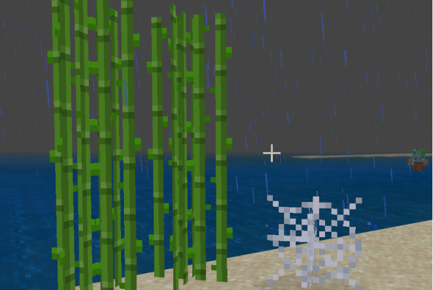

# 自定义交叉贴图方块

## 概述

自定义交叉贴图方块支持使用引擎预设的交叉贴图模型，自己配置物品贴图和模型贴图，制作出类似于甘蔗、蜘蛛网的模型方块。



## model_item_texture

可在model_item_texture中设置使用的物品贴图。

| 类型   | 默认值 | 解释                                            |
| ------ | ------ | ----------------------------------------------- |
| string |        | 使用的物品贴图，必须设置"netease_model"才能生效 |

## model_texture

可在model_texture中设置使用的模型贴图。

| 类型  | 默认值 | 解释                                            |
| ----- | ------ | ----------------------------------------------- |
| array |        | 使用的模型贴图，必须设置"netease_model"才能生效 |

- model_texture和model_item_texture必须同时设置才能生效

## 使用交叉贴图模型

- 在resource_packs\blocks.json下面，添加自定义的方块identifier的配置
- 在"netease_model"里配置"customblocks:web_preset"，"model_item_texture"和"model_textures"根据需求配置自己的物品贴图和模型贴图

### blocks.json示例
```json
{
  "format_version": [
    1,
    1,
    0
  ],
  "customblocks:web_preset": {
		"netease_model": "customblocks:web_preset",
    	"model_item_texture": "customblocks:reeds_item",
 		"model_textures": [
      		"customblocks:reeds"
  		]
  }
}
```


