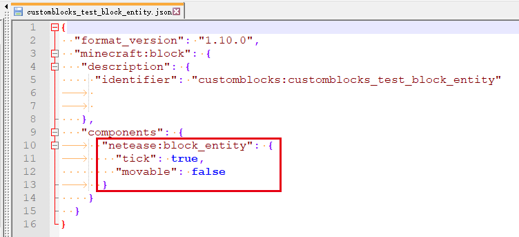

---
front:
hard: 入门
time: 分钟
---

# 自定义方块实体

## 概念

方块实体的概念详见[官方wiki](https://zh.minecraft.wiki/w/方块实体)


## 添加自定义方块实体

需要添加netease:block_entity组件才能为自定义方块添加自定义方块实体。

| 键      | 类型 | 默认值 | 解释                                                         |
| ------- | ---- | ------ | ------------------------------------------------------------ |
| tick    | bool | false  | 为true时，当玩家进入方块tick范围时，该方块每秒会发送**20次**ServerBlockEntityTickEvent事件<br>为false时，该方块不会发送ServerBlockEntityTickEvent事件 |
| client_tick    | bool | false  | 为true时，当玩家进入方块tick范围时，该方块每秒会发送**20次**ModBlockEntityTickClientEvent事件<br>为false时，该方块不会发送ModBlockEntityTickClientEvent事件 |
| movable | bool | true   | 为true时，该方块可被粘性活塞拉回<br>为false时，该方块不可被粘性活塞拉回 |

- **对于已有方块实体的方块，如[自定义刷怪箱](./3-特殊方块/1-自定义刷怪箱.md)，将无法再添加自定义方块实体。**

- 添加了自定义方块实体的方块，可通过**服务端blockEntityData组件**来管理方块实体内的数据。


## 相关组件与事件

- <a href="../../../../mcdocs/1-ModAPI/接口/方块/方块实体.html#getblockentitydata" rel="noopenner"> GetBlockEntityData接口 </a>

  可用于管理方块实体内的数据。

- <a href="../../../../mcdocs/1-ModAPI/事件/方块.html#serverplaceblockentityevent" rel="noopenner"> ServerPlaceBlockEntityEvent事件 </a>

  当玩家手动放置含自定义方块实体的自定义方块时触发，此时可向该方块实体中存储数据。

- <a href="../../../../mcdocs/1-ModAPI/事件/世界.html#chunkgeneratedserverevent" rel="noopenner"> ChunkGeneratedServerEvent事件 </a>

  通过自定义特征放置含自定义方块实体的自定义方块时，在区块生成完毕时触发，其中包含了该区块中自定义方块实体信息列表，此时可向该方块实体中存储数据。

- <a href="../../../../mcdocs/1-ModAPI/事件/方块.html#serverblockentitytickevent" rel="noopenner"> ServerBlockEntityTickEvent事件 </a>

  若在netease:block_entity组件中配置tick为true，则当该自定义方块位于模拟范围内时触发。该事件触发频率为**每秒20次**


<span id="demo"></span>
## demo解释

- 方块配置

  [CustomBlocksMod](../../13-模组SDK编程/60-Demo示例.md#CustomBlocksMod)中，`customblocks:customblocks_test_block_entity`方块配置了自定义方块实体，具体配置如下：

  即该方块在距离玩家不远时会每秒发送20次ServerBlockEntityTickEvent事件，且无法被粘性活塞拉回。



- 方块放置

  customBlocksServer.py中注册了对ServerPlaceBlockEntityEvent事件的监听，在回调里通过blockEntityData组件向每个由玩家手动创建的自定义方块实体中写入数据：

  ```python
  def ServerPlaceBlockEntityEvent(self, args):
  		print 'ServerPlaceBlockEntityEvent  ', args
  		dimension = args['dimension']  # 该自定义方块实体所在的维度
  		blockPos = (args['posX'], args['posY'], args['posZ'])  # 该自定义方块实体所处位置
  		blockName = args['blockName']  # 含该自定义方块实体的方块名称

          # 创建blockEntityData组件
  		comp = self.CreateComponent(self.levelId, "Minecraft", "blockEntityData")
          # 获取可操作该自定义方块实体的对象
  		blockEntityData = comp.GetBlockEntityData(dimension, blockPos)
          # 在对自定义方块实体内数据进行操作前，要先进行判空处理
          if blockEntityData:
              # 使用与dict类似的操作方式存入键为"abc"、值为{"1":True,"2":None,"3":"123"}的数据
  			blockEntityData['abc'] = {"1": True, "2": None, "3": "123"}
  ```

- 方块交互

  监听了ServerBlockUseEvent，在其中判断玩家是否在与customblocks:customblocks_test_block_entity方块进行交互。是则向其中写入数据：

  ```python
  def ServerBlockUseEvent(self, args):
  		blockName = args['blockName']  					# 方块名称
  		blockPos = (args['x'], args['y'], args['z'])    # 方块位置
  		playerId = args['playerId']						# 玩家id
  		dimensionComp = serverApi.CreateComponent(playerId, "Minecraft", "dimension")
  		dimension = dimensionComp.GetPlayerDimensionId() # 获取玩家所在维度
          # 判断交互的方块类型
  		if blockName == 'customblocks:customblocks_test_block_entity':
  			comp = self.CreateComponent(self.levelId, "Minecraft", "blockEntityData")
  			blockEntityData = comp.GetBlockEntityData(dimension, blockPos)
              if blockEntityData:
                  # 向方块实体中写入键为"key"、值为[1, 2, 3]的数据
  				blockEntityData['key'] = [1, 2, 3]
  ```

- 方块实体tick

  ```python
  def OnBlockEntityTick(self, args):
  		# 避免在Tick中频繁打印输出，易造成卡顿
  		# print 'blockEntityTick ', args
  		pass
  ```

  监听了ServerBlockEntityTickEvent事件，netease:block_entity组件中配置tick为true的自定义方块每秒会触发20次其自定义方块实体tick事件。

  - **应避免在诸如tick事件回调等高频函数中进行打印输出，易造成卡顿。**

  - **应避免在地图中放置过多netease:block_entity组件配置tick为true的自定义方块，频繁事件调用也可能造成卡顿**


- 方块销毁

  监听了ServerPlayerTryDestroyBlockEvent事件，当有玩家尝试摧毁customblocks:customblocks_test_block_entity方块时，会尝试从其自定义方块实体中读取数据并输出。

  ```python
  def ServerPlayerTryDestroyBlockEvent(self, args):
  		pos = (args["x"], args["y"], args["z"])
  		playerId = args['playerId']
  		dimensionComp = serverApi.CreateComponent(playerId, "Minecraft", "dimension")
  		dimension = dimensionComp.GetPlayerDimensionId()
  		comp = self.CreateComponent(self.levelId, "Minecraft", "blockEntityData")
  		blockEntityData = comp.GetBlockEntityData(dimension, pos)
  		if blockEntityData:
              # 根据key获取方块实体中对应的value
              value1 = blockEntityData['key']
              value2 = blockEntityData['abc']
              print 'value of "key" is', value1
              print 'value of "abc" is', value2
  ```

  - 对于从未进行过交互的customblocks:customblocks_test_block_entity方块，当玩家尝试摧毁它时，会输出：

    ```python
    # 不存在于方块实体中的数据将返回None
    'value of "key" is None'
    'value of "abc" is {"1": True, "2": None, "3": "123"}'
    ```

  - 若玩家曾经与该方块进行过交互，会输出：

    ```python
    'value of "key" is [1, 2, 3]'
    'value of "abc" is {"1": True, "2": None, "3": "123"}'
    ```

