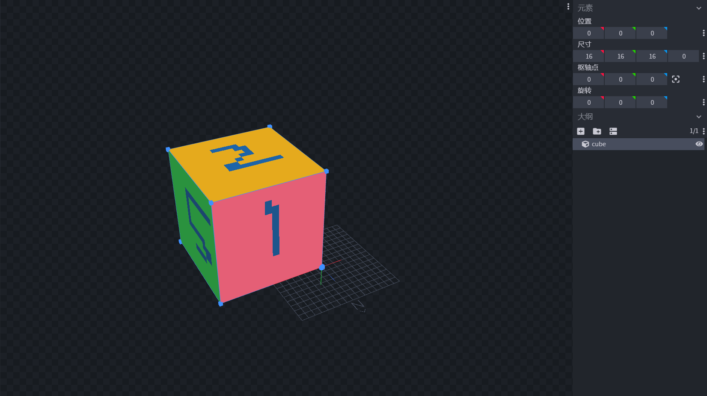
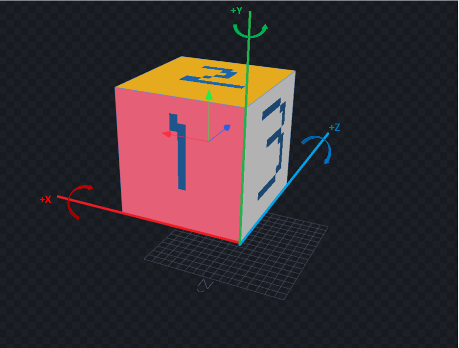
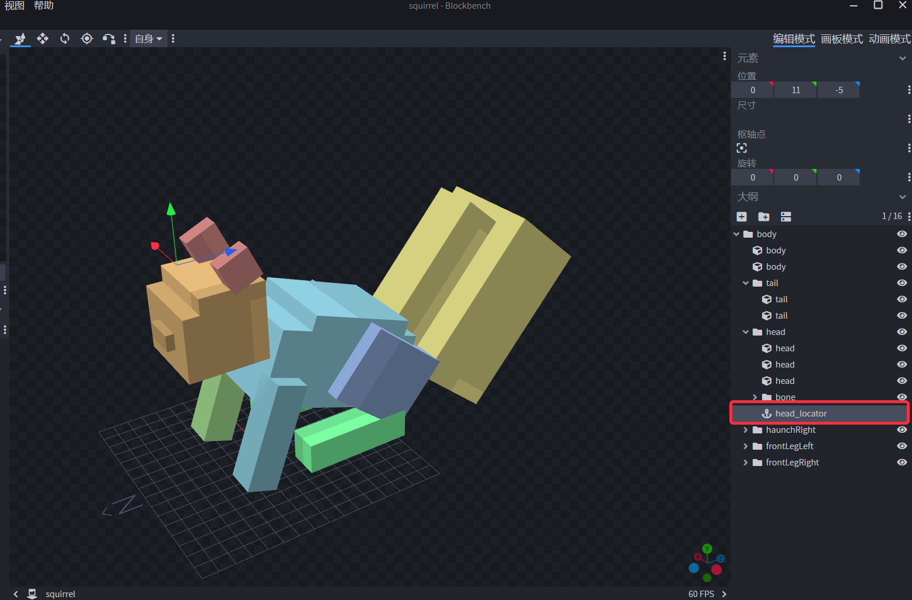

---
front:
hard: 入门
time: 分钟
---

# 自定义方块实体外观

## 概述

根据[自定义方块实体](./4-自定义方块实体.md)以及[自定义方块实体模型](./5-自定义方块模型.md)这两个步骤，我们可以做出具有个人特色的自定义方块实体，如果希望这个自定义方块实体能够具有更强的表现力，能够像原版方块实体如附魔台那样动起来，又或是具有更酷炫的特效，那么则可遵循本教程来进一步扩展我们的自定义方块实体。


自定义方块实体的扩展功能包含两个方面：

   （1） **为自定义方块实体添加动画功能**。支持使用由BlockBench制作的原版模型或者是游戏原版模型，并支持这些模型附带的动画，可以使自定义方块实体具有动画效果。

   （2） **为自定义方块实体添加特效功能**。通过配置或者接口可为自定义方块实体附加网易版粒子特效及序列帧特效，并且支持使用特效及序列帧等系列接口来进行控制和管理。自定义方块实体还支持配置微软原版粒子特效及音效。

接下来我们将讲解如何为我们的自定义方块实体使用以上两个扩展功能，并制作一个小松鼠自定义方块实体，用户可同时参考[CustomBlocksMod](../../13-模组SDK编程/60-Demo示例.md#CustomBlocksMod)示例中的自定义方块实体-小松鼠（custom_block_squirrel）学习。


注意： 自定义方块实体外观由于需要方块实体渲染功能支持，因此，如果通过原版特征例如minecraft:ore_feature等方式进行放置，由于原版特征无法正常放置方块实体（会缺失方块实体功能），因此自定义方块实体外观不能正常显示。 如果想要通过特征放置方块实体，可以尝试使用[结构特征](../4-自定义维度/4-自定义特征.md#结构)来进行放置。


## 为自定义方块实体添加动画功能

在这一节，我们将讲述如何为自定义方块实体添加动画功能


#### 1. 准备粒子特效或者序列帧特效文件

​        我们首先需要一个原版实体模型，这个可以通过BlockBench软件进行制作，这一步用户可以参考[自定义方块实体模型](./5-自定义方块模型.md)中的使用BlockBench制作小蓝花步骤，但需要注意的是，制作好的模型bbmodel文件**不需要通过MC Studio导入模型来生成模型的json文件**，而是只需要在制作好模型后，点击**文件-导出-导出基岩版几何体**即可，如下图所示：


与此同时，我们可以利用BlockBench为该模型制作动画，在制作好动画后，我们通过软件右上方切换到动画模式，然后点击左上方的**动画-Export Animations**，即可导出该模型的动画json文件。如下图所示：


关于模型的制作以及动画的制作，用户也可以参考[原版模型制作指南](../../../16-美术/6-模型和动作/01-原版模型制作指南.md)来进行制作。制作好的模型json文件放在resource_pack/models/entity目录下， 动画json文件则放在resource_pack/animations目录下，这些都与原版实体生物相同。

#### 1.1 BlockBench模型调整

​		在使用BlockBench制作模型时，往往需要知道所制作的模型在游戏中的实际大小和偏移，以此为基准来调节模型的大小及位置。目前自定义方块实体外观功能所表现出的模型大小、旋转、尺寸与BlockBench里的位置、尺寸、旋转的表现效果是一致的。

如下图所示，我们在BlockBench里制作一个**位置（0,0,0），尺寸（16,16,16），旋转（0,0,0）**且**粉红色贴图的表面正对着北方**的方块



则这个方块在游戏的表现如下图所示：


该方块在游戏中同样以粉红色贴图正对着北方，且大小正好为一个普通方块大小。同时，如果用户在BlockBench中调整方块的旋转及尺寸，那么在游戏中会有与BlockBench相同的旋转及尺寸调整效果。在使用<a href="../../../../mcdocs/1-ModAPI/接口/方块/索引.html" rel="noopenner"> **技术手册-ModAPI-方块** </a>中的自定义方块实体模型调整接口时，也与BlockBench中调整参数所带来的效果相同。

但需要注意的是，用户在使用接口调整模型y轴方向的缩放时，会与BlockBench的拉伸方向相反，同时会在缩放模型的同时带有一段y轴方向的位置平移。

总的来说，模型调整要点可以归结如下：

​	（1） 实体json文件中scale没有定义或者定义为1时，BlockBench中尺寸为16等于游戏中一个普通方块的边长长度。 实体json文件的scale定义可查看下一节介绍。

​	（2） BlockBench中模型的面向、尺寸拉伸方向（y轴除外）与游戏中的表现一致。使用缩放接口调整的效果也与BlockBench中调整参数的效果一致。

​	（3） BlockBench中位置为（0,0,0）时对应游戏中自定义方块实体实际的位置，方块面向的南北方向、BlockBench中的坐标轴方向也与游戏中一致。

用户可在BlockBench中调整好预期的效果，大部分模型的调整可在BlockBench中完成，再在游戏中进行测试，以减少在游戏中反复调整模型的效果所带来的时间消耗。


使用接口对模型进行缩放、旋转时的特性归结如下：

​	（1） 对模型使用<a href="../../../../mcdocs/1-ModAPI/接口/方块/渲染.html#setblockentitymodelrotation" rel="noopenner"> SetBlockEntityModelRotation </a>接口旋转

​			   对模型使用接口进行旋转时，旋转以方块位置的西北方向的下顶点作为原点的坐标轴作为旋转轴来进行旋转，如下图所示：

​				

​			  假设使用接口旋转30度，绕x轴旋转时会以上图中的**粗红线**作为旋转轴，以看向**x轴正方向的顺时针**旋转30度。

​              绕z轴旋转时会以上图中的**粗蓝线**作为旋转轴，以看向**z轴正方向的顺时针**旋转30度。

​			  绕Y轴旋转时会以上图中的**粗绿线**作为旋转轴，以看向**y轴正方向的顺时针**旋转30度。

   （2） 对模型使用<a href="../../../../mcdocs/1-ModAPI/接口/方块/渲染.html#setblockentitymodelscale" rel="noopenner"> SetBlockEntityModelScale </a>接口缩放

​			 对模型使用接口进行旋转时，旋转以方块位置的西北方向的下顶点作为原点的坐标轴作为起始轴来进行拉伸，如下图所示：

​			

​			假设使用接口放大2倍，x轴方向放大时会以上图中的**粗蓝线**作为起始轴，向**x轴正方向**拉伸为原来的2倍长。

​            z轴方向放大时会以上图中的**粗红线**作为起始轴，向**z轴正方向**拉伸为原来的2倍长。

​			y轴方向放大时会向**y轴负方向**拉伸为原来的2倍长。


#### 1.2 方块实体的多面向

​			自定义方块实体外观支持四面向或六面向。如果方块实体定义了[netease:face_directional](2-功能.md#duomianxiang)组件后，方块实体具有多面向功能。在没有定义该组件时，方块实体的面向与BlockBench中一致，即默认朝向北方。定义该组件后，方块实体的面向会根据玩家放置的方向或者利用接口<a href="../../../../mcdocs/1-ModAPI/接口/世界/方块管理.html#setblocknew" rel="noopenner"> SetBlockNew </a>设置时所设定的auxValue来决定。

方块实体的面向改变后，

​        （1） 方块的面向改变**不会**影响旋转轴的改变，因为旋转轴是以世界坐标系为准。利用接口旋转方块时的旋转轴**仍然为未改变面向之前的旋转轴**，即默认朝向北方时方块的西北方向的下顶点作为原点的坐标轴。

​		（2） 方块的面向改变**会**影响拉伸方向改变，因为拉伸方向是以方块的本身的模型坐标系为准。因此面向改变后，会以面向改变后的模型坐标系来进行拉伸。例如， 方块面向默认朝向北面时，x方向的拉伸方向为从西到东拉伸，当方块面向变为朝向东时，利用接口进行x方向的拉伸则变为从北到南，可以看成模型坐标系顺时针旋转了90度。


### 2. 配置模型及动画

在准备好模型及动画文件后，我们需要进行模型及动画的配置。这一步其实与原版生物的配置相同，如果用户熟悉原版生物的配置，可以跳过这一步。

首先我们需要准备一个控制实体动画及渲染的entity.json文件，这个文件在resource_pack/entity目录下创建，命名为xxx.entity.json，xxx为用户自定义的文件名称。这个文件可以参考[自定义基础生物](../3-自定义生物/01-自定义基础生物.md)中的资源包生物定义进行创建。有一定的外语阅读能力的用户还可以参考基岩版百科中的[实体创建说明](https://bedrock.dev/zh/docs/stable/Entities)以及[实体动画](https://bedrock.dev/zh/docs/stable/Animations)

我们的实体custom_block_squirrel.entity.json创建如下：

```json
{
  "format_version": "1.10.0",
  "minecraft:client_entity": {
    "description": {
       // 自定义方块实体的identitfier
      "identifier": "customblocks:custom_block_squirrel",
       // 指定使用的实体模型,位于resource_pack/models/entity目录下
      "geometry": {
        "default": "geometry.squirrel"
      },
       // 指定使用的模型贴图,位于resource_pack/textures/entity目录下
      "textures": {
				"red": "textures/entity/squirrel/red"
			},
       // 指定使用的模型材质
	  "materials": {
				"red": "entity_alphatest"
      },
       // 指定使用的模型渲染控制器,位于resource_pack/render_controllers目录下
      "render_controllers": [ "controller.render.squirrel" ],
      "scripts": {
        // 模型的缩放值
        "scale": "0.9375",
        // 实体Molang变量初始化，用于切换动画状态
        "initialize": [
          "variable.mod_is_moving = 2.0;"
        ],
        // 运行的动画，general为我们创建的自定义动画控制器，表示该模型会一直运行该动画控制器。
        "animate": [
          "general"
        ]
      },
        // 该模型包含的动画，general为动画控制器，定义在resource_pack/animations_controllers目录下
        // move,idle,look_at_target为动画，定义在resource_pack/animations目录下
      "animations": {
		"move": "animation.squirrel.move",
		"idle": "animation.squirrel.idle",
        "general": "controller.animation.squirrel.general"
		}
    }
  }
}
```


以上文件创建了一个使用”geometry.squirrel”模型文件的实体，该实体包含了一个名为”general“的动画控制器，默认运行该动画控制器，该动画控制器包含了2个动画：“move”以及”idle”，这些都可以参考resource_pack/animations_controllers/squirrel.animation_controllers.json中的示例：

```json
{
	"format_version": "1.10.0",
	"animation_controllers": {
		"controller.animation.squirrel.general": {
			"initial_state" : "default",
			"states": {
                // 默认待机动画状态
				"default": {
					"animations": [	"idle" ],
					"transitions": [
                        // 由实体Molang变量：variable.mod_is_moving控制动画状态切换，初始值在entity.json中的sripts字段中进行定义。
						{ "squMove": "variable.mod_is_moving==1" }
					]
				},
                // 行走动画状态
				"squMove": {
					"animations": ["move"],
					"transitions": [
                        // 由实体Molang变量：variable.mod_is_moving控制动画状态切换，初始值在entity.json中的sripts字段中进行定义。
						{ "default": "variable.mod_is_moving==2" }
					]
				}
			}
		}
	}
}
```

我们定义了一个实体Molang变量：”variable.mod_is_moving“，该Molang变量用于在控制”general“的动画状态切换，它的初始值为2.0，表示实体模型的默认动画状态为“default”，该动画状态运行的动画为”idle”。


### 3. 将实体模型与方块实体联系起来

在配置好实体模型以及动画之后，我们需要将这个模型与方块实体联系起来。

在resource_pack/blocks.json文件中，找到我们想要对其添加实体模型和动画的方块实体，在这里我们是”customblocks:custom_block_squirrel”，并加入“client_entity”的字段，表示这个方块实体将会用到实体模型，如下所示：

```json
{
  "format_version": [
    1,
    1,
    0
  ],
  ///...

 "customblocks:custom_block_squirrel": {
    "sound": "grass",
     // 可与netease_model字段一起使用
    "netease_model": "customblocks:customblocks_model_decoration",

     // --- 实体模型配置 ---
     // 这个方块实体将会使用到实体模型
    "client_entity": {
       // 对应custom_block_squirrel.entity.json里面的identifier
      "identifier": "customblocks:custom_block_squirrel",
       // 这个方块实体的手持模型或掉落时模型是否使用该实体模型。
      "hand_model_use_client_entity": true,
       // 这个方块实体的物品icon贴图
      "block_icon": "test_block_icon",
       // 方块实体被破坏时使用的贴图
      "destroyed_textures":"destroy_squirrel"
    },
  },
  ///...
}
```

“client_entity”的字段中包含了四个字段，他们的作用分别如下表格所示：

| 字段名称                     | 说明                                                         |
| ---------------------------- | ------------------------------------------------------------ |
| identifier                   | 对应custom_block_squirrel.entity.json里面的identifier，用于指定使用resource_pack/entity目录下的哪个entity.json文件 |
| hand_model_use_client_entity | 这个方块实体的手持模型或掉落时模型是否使用该实体模型。定义为true时，玩家手持这个方块实体或者方块实体掉落在地上时，显示所定义的这个实体模型。定义为false时根据用户是否定义了“netease_model”这个字段会出现两种情况：<br />（1）定义了netease_model字段，手持模型和掉落模型会显示netease_model所定义的方块模型；<br />（2）没有定义netease_model字段，手持模型和掉落模型会显示由block_icon所定义的贴图所组成的方块模型，同时放置在地上的方块实体也会出现该贴图组成的方块模型。 |
| block_icon                   | 这个方块实体的物品icon贴图，定义了这个字段后，方块实体的icon贴图将会使用这个字段中的贴图，贴图的路径定义resource_pack/textures/terrain_texture.json文件中。以下情况需要定义这个字段：<br />（1）在"hand_model_use_client_entity"为true的情况，否则将看不到这个方块实体的物品icon。<br />（2）在"hand_model_use_client_entity"为false并且没有定义“netease_model”字段的情况。否则将看不到这个方块实体的物品icon。 |
| destroyed_textures           | 可选项。方块实体被破坏时产生的粒子所取样的贴图，贴图的路径定义resource_pack/textures/terrain_texture.json文件中。方块被破坏时粒子的取样贴图，按照如下优先顺序来决定：<br /> （1）destroyed_textures   (2) block_icon   (3) netease_model里面的贴图 （4）textures字段<br />   即（1）有定义就优先使用（1），（1）没有定义就使用（2），如此类推。 |


通过以上步骤的配置，我们就可以实现一个具有动画效果的方块实体了：


### 4. 使用接口来控制动画及调整模型

我们为用户提供了一些可用的接口来调整模型的大小，旋转及相对位置，也提供了一些用于控制动画播放的接口。这些接口可以在<a href="../../../../mcdocs/1-ModAPI/接口/方块/索引.html" rel="noopenner"> **技术手册-ModAPI-方块** </a>中查看。


| 接口                                                         | 所属端                                                   | 用处                                             |
| ------------------------------------------------------------ | -------------------------------------------------------- | ------------------------------------------------ |
| <a href="../../../../mcdocs/1-ModAPI/接口/方块/渲染.html#setblockentitymodelposoffset" rel="noopenner"> SetBlockEntityModelPosOffset </a> | <span style="display:inline;color:#7575f9">客户端</span> | 设置自定义方块实体的实体模型位置偏移值。         |
| <a href="../../../../mcdocs/1-ModAPI/接口/方块/渲染.html#setblockentitymodelrotation" rel="noopenner"> SetBlockEntityModelRotation </a> | <span style="display:inline;color:#7575f9">客户端</span> | 设置自定义方块实体的实体模型在各个轴上的旋转值。 |
| <a href="../../../../mcdocs/1-ModAPI/接口/方块/渲染.html#setblockentitymodelscale" rel="noopenner"> SetBlockEntityModelScale </a> | <span style="display:inline;color:#7575f9">客户端</span> | 设置自定义方块实体的实体模型大小的缩放值。       |
| <a href="../../../../mcdocs/1-ModAPI/接口/方块/方块实体.html#setenableblockentityanimations" rel="noopenner"> SetEnableBlockEntityAnimations </a> | <span style="display:inline;color:#7575f9">客户端</span> | 设置是否开启自定义方块实体的动画效果。           |
| <a href="../../../../mcdocs/1-ModAPI/接口/方块/方块实体.html#setblockentitymolangvalue" rel="noopenner"> SetBlockEntityMolangValue </a> | <span style="display:inline;color:#7575f9">客户端</span> | 设置自定义方块实体的Molang变量。                 |
| <a href="../../../../mcdocs/1-ModAPI/接口/方块/方块实体.html#getblockentitymolangvalue" rel="noopenner"> GetBlockEntityMolangValue </a> | <span style="display:inline;color:#7575f9">客户端</span> | 获取自定义方块实体的Molang变量的值。             |


## 为自定义方块实体添加特效功能

在这一节，我们将讲述如何为方块实体添加特效功能。特效功能分为网易版特效以及微软原版特效。

### 添加网易版特效

#### 1. 准备粒子特效或者序列帧特效文件

这一步用户可以参考[粒子特效制作](../../../16-美术/9-特效/30-中国版特效创建与使用.md#制作一个中国版粒子特效)或者[序列帧特效制作](../../../16-美术/9-特效/30-中国版特效创建与使用.md#制作一个中国版序列帧特效)进行特效制作。

- 粒子特效资源中的json文件放于resource_pack/effects目录下，贴图文件放于resource_pack/textures/particle目录下。

- 序列帧特效支持使用由Texture Packer导出的贴图和json序列帧文件，也支持使用由MC Studio导出的序列帧json文件。如果是由Texture Packer导出的贴图和json序列帧文件，均放在resource_pack/textures/sfx目录下。如果是由MC Studio导出的序列帧json文件，则放于resource_pack/effects目录下。


#### 2. 配置粒子特效或者序列帧特效

与实体模型的配置相同，特效的配置同样在resource_pack/blocks.json文件中进行配置。

在resource_pack/blocks.json文件中，找到我们想要对其添加特效的方块实体，在这里我们同样是”customblocks:custom_block_squirrel”，并加入“netease_particle_effects”的字段或者是“netease_frame_effects”的字段，表示这个方块实体将会用到特效，如下所示：

```json
{
  "format_version": [
    1,
    1,
    0
  ],
  ///...

 "customblocks:custom_block_squirrel": {
    "sound": "grass",
     // 可与netease_model一起使用
    "netease_model": "customblocks:customblocks_model_decoration",

     // --- 实体模型配置 ---
     // 这个方块实体将会使用到实体模型
    "client_entity": {
       // 对应custom_block_squirrel.entity.json里面的identifier
      "identifier": "customblocks:custom_block_squirrel",
       // 这个方块实体的手持模型或掉落时模型是否使用该实体模型。
      "hand_model_use_client_entity": true,
       // 这个方块实体的物品icon贴图
      "block_icon": "test_block_icon",
       // 方块实体被破坏时使用的贴图
      "destroyed_textures":"destroy_squirrel"
    },

     // --- 特效配置 ---
     // 使用网易粒子特效
    "netease_particle_effects": {
        // 粒子特效
        "particle1": { "path": "effects/xy_electro_fpA_gangqinlizu.json", "pos": [1.0,0.5,1.0]},
        "particle2": { "path": "effects/yx_electro_fpA_02.json", "pos": [-1.0,0.5,-1.0]}
        //... 可以定义多个，注意性能消耗
    },
    // 使用网易序列帧特效
    "netease_frame_effects": {
        // 序列帧特效
        "frame1": { "path": "effects/yx_electro_fzb_waiquan2.json", "pos": [1.0,1.0,1.0]},
        "frame2": { "path": "textures/sfx/zhishujie_fz01", "pos": [-1.0,1.0,-1.0]}
         //... 可以定义多个，注意性能消耗
    }
  },
  ///...
}
```

粒子特效或者是序列帧特效，我们使用以下格式来配置：

```json
 "particle1": { "path": "effects/xy_electro_fpA_gangqinlizu.json", "pos": [1.0,0.5,1.0]}
```

其中，

- "particle1": 特效的自定义键值名称，可由用户自由决定

- "path"：特效的相对路径位置，对于粒子特效，则该路径应该是以”effects/”开头的相对路径。对于序列帧特效，有两种情况：

    （1）由Texture Packer导出的序列帧特效，则是以“textures/“开头的相对路径，并且不需要添加.json后缀名。

    （2）由MC Studio导出的json文件，则是以”effects/”开头的相对路径，并且需要添加.json后缀名。

- "pos": 该特效的位置，是相对于方块实体位置的位置偏移，即以方块实体位置为原点的坐标系下的坐标。


通过以上两个步骤的配置，我们就可以为方块实体添加粒子特效以及序列帧特效了：


#### 3. 使用接口来控制粒子及序列帧特效

我们提供了一些接口来供用户进行方便的特效添加、删除及调整功能。这些接口可以在<a href="../../../../mcdocs/1-ModAPI/接口/方块/索引.html" rel="noopenner"> **技术手册-ModAPI-方块** </a>中查看。

同时，用户可以通过定义好的特效键值名称，获取在自定义方块实体上创建好的特效Id，利用这个Id，用户可以使用<a href="../../../../mcdocs/1-ModAPI/接口/特效/粒子.html" rel="noopenner"> **技术手册-ModAPI-特效-粒子** </a>中的粒子系列接口及<a href="../../../../mcdocs/1-ModAPI/接口/特效/序列帧.html" rel="noopenner"> **技术手册-ModAPI-特效-序列帧** </a>中的序列帧系列接口进行特效的一系列操作。

**序列帧**：

| 接口                                                         | 所属端                                                   | 用处                                                         |
| ------------------------------------------------------------ | -------------------------------------------------------- | ------------------------------------------------------------ |
| <a href="../../../../mcdocs/1-ModAPI/接口/方块/方块实体.html#createframeeffectforblockentity" rel="noopenner"> CreateFrameEffectForBlockEntity </a> | <span style="display:inline;color:#7575f9">客户端</span> | 在自定义方块实体上创建序列帧特效，创建后该接口返回序列帧特效的Id。 |
| <a href="../../../../mcdocs/1-ModAPI/接口/方块/方块实体.html#getframeeffectidinblockentity" rel="noopenner"> GetFrameEffectIdInBlockEntity </a> | <span style="display:inline;color:#7575f9">客户端</span> | 获取在自定义方块实体中已创建的指定序列帧特效的Id。           |
| <a href="../../../../mcdocs/1-ModAPI/接口/方块/方块实体.html#removeframeeffectinblockentity" rel="noopenner"> RemoveFrameEffectInBlockEntity </a> | <span style="display:inline;color:#7575f9">客户端</span> | 移除在自定义方块实体上创建的序列帧特效。移除后的特效Id将会失效。 |
| <a href="../../../../mcdocs/1-ModAPI/接口/方块/渲染.html#setblockentityframeposoffset" rel="noopenner"> SetBlockEntityFramePosOffset </a> | <span style="display:inline;color:#7575f9">客户端</span> | 设置自定义方块实体中序列帧特效位置偏移值，用于调整序列帧特效相对于方块位置的偏移。 |

**粒子**：

| 接口                                                         | 所属端                                                   | 用处                                                         |
| ------------------------------------------------------------ | -------------------------------------------------------- | ------------------------------------------------------------ |
| <a href="../../../../mcdocs/1-ModAPI/接口/方块/方块实体.html#createparticleeffectforblockentity" rel="noopenner"> CreateParticleEffectForBlockEntity </a> | <span style="display:inline;color:#7575f9">客户端</span> | 在自定义方块实体上创建粒子特效，创建后该接口返回粒子特效的Id。 |
| <a href="../../../../mcdocs/1-ModAPI/接口/方块/方块实体.html#getparticleeffectidinblockentity" rel="noopenner"> GetParticleEffectIdInBlockEntity </a> | <span style="display:inline;color:#7575f9">客户端</span> | 获取在自定义方块实体中已创建的指定粒子特效的Id。             |
| <a href="../../../../mcdocs/1-ModAPI/接口/方块/方块实体.html#removeparticleeffectinblockentity" rel="noopenner"> RemoveParticleEffectInBlockEntity </a> | <span style="display:inline;color:#7575f9">客户端</span> | 移除在自定义方块实体上创建的粒子特效。移除后的特效Id将会失效。 |
| <a href="../../../../mcdocs/1-ModAPI/接口/方块/渲染.html#setblockentityparticleposoffset" rel="noopenner"> SetBlockEntityParticlePosOffset </a> | <span style="display:inline;color:#7575f9">客户端</span> | 设置自定义方块实体中粒子特效位置偏移值，用于调整粒子特效相对于方块位置的偏移。 |

### 添加微软原版粒子特效及音效
微软动画功能支持在动画控制器json文件中或者动画json文件中配置粒子特效或者音效。自定义方块实体外观功能同样也支持这种配置方式。

有一定外语阅读能力的用户，可以查看[原版wiki](https://wiki.bedrock.dev/visuals/custom-particles.html)来了解关于在实体动画控制器或动画中定义粒子特效和音效的方式。

#### 1. 使用原版粒子

原版粒子的资源可以采用游戏自带的粒子资源，也可以进行自行制作，游戏自带的粒子资源可参考[Wiki中对Particles部分](https://wiki.bedrock.dev/documentation/particles.html)的罗列。自定制作的方法也可参考[这个Wiki中的介绍](https://wiki.bedrock.dev/visuals/custom-particles.html)。本指引在这里就不再叙述。

制作好的粒子资源可在游戏中使用

```
/particle <namespace:particle_id> ~ ~2 ~
```

该指令来测试是否生效。

当拥有了一些粒子资源后，我们就需要在entitiy.json文件中进行声明以及在animation_controllers.json文件中进行配置。配置的方式实际上与在生物实体中配置原版粒子的方法相同，如果用户对这部分的内容熟悉，就可以跳过这部分的指引。

以resource_pack/entity/custom_block_squirrel.entity.json为例，我们在现有的基础上增加一个particle_effects的组件：

```json
{
  "format_version": "1.10.0",
  "minecraft:client_entity": {
    "description": {
       // 自定义方块实体的identitfier
      "identifier": "customblocks:custom_block_squirrel",

       /// ... 省略中间的文件内容

       // 该模型包含的动画，general为动画控制器，定义在resource_pack/animations_controllers目录下
       // move,idle,look_at_target为动画，定义在resource_pack/animations目录下
      "animations": {
		"move": "animation.squirrel.move",
		"idle": "animation.squirrel.idle",
        "general": "controller.animation.squirrel.general"
		},

        // 该模型所包含的微软原版粒子
       "particle_effects": {
        "headsmoke":  "minecraft:water_fog"
       }
    }
  }
}
```

 并添加了一个键值为headsmoke的粒子，粒子使用的是粒子资源minecraft:water_fog。

接着，我们使用BlockBench对模型添加一个名为head_locator的Locator定位器，来决定我们的粒子在模型中的位置，我们可以对模型的head组件右键点击添加定位器，导出保存即可：



有了定位器及粒子定义后，我们就可以打开animation_controllers.json文件来决定我们的粒子在哪个动画状态进行播放了：

以squirrel.animation_controllers.json为例，我们对default动画状态配置这个粒子，在default动画状态中添加一个名为particle_effects的序列：

```json
{
	"format_version": "1.10.0",
	"animation_controllers": {
		"controller.animation.squirrel.general": {
			"initial_state" : "default",
			"states": {
				// 默认待机动画状态
				"default": {
					"animations": [	"idle" ],
					// 该动画状态所播放的原版粒子效果
					"particle_effects": [
						{
							// entity.json中定义的粒子名称
							"effect": "headsmoke",
							// geometry中定义的定位器
							"locator": "head_locator"
                        }
                        //,
                        //... 可配置多个原版粒子
					],
					"transitions": [
						// 由实体Molang变量"variable.mod_is_moving"控制动画状态切换，初始值在entity.json中的sripts字段中进行定义。
						{ "squMove": "variable.mod_is_moving==1" }
					]
				}
                ///, ... 其他动画状态
			}
		}
	}
}
```

至此，我们就完成了一个微软原版粒子效果的配置了。

另外，粒子的配置不仅可以在animation_controllers.json中进行配置，也可以直接在对应的动画文件animations.json中进行配置。

以squirrel.animation.json为例，我们直接对idle动画进行粒子配置，配置方式是在动画定义中添加一个particle_effects的序列，同时以动画时间为键值，来决定我们的粒子效果在动画播放到什么时候进行播放：

```json
{
	"format_version": "1.8.0",
	"animations": {
		"animation.squirrel.idle": {
			"loop": true,
			"animation_length": 2,
            "bones": {
            /// ... 省略骨骼内容
            },
            /// 原版粒子
            "particle_effects": {
                /// 在0.4833这个动画帧播放粒子效果
				"0.4833": {
					// entity.json中定义的粒子名称
                    "effect": "headsmoke",
                    // geometry中定义的定位器
                    "locator": "head_locator"
				}
			}
      }
}
```


#### 2.使用原版音效

音效的定义及配置方式实际上与原版粒子特效的方式类似，用户也可以参考这个[指引](https://wiki.bedrock.dev/concepts/sounds.html)来进行。

我们首先需要在resource_pack/sounds/sound_definitions.json定义好我们的音效，如果没有这个json文件，则需要自己创建。它的内容如下：

```json
{
	"format_version": "1.14.0",
	"sound_definitions": {
    // 定义一个自定义音效
		"squirrel.idle.thunder": {
          "category": "music",
          "min_distance": 0.0,
           "max_distance": 5.0,
          "sounds": [
            {
            "name": "sounds/music/blocks",
            "pitch": 1,
            "volume": 1,
            "load_on_low_memory": true
            }
          ]
	  }
  }
}
```

在这个文件中，我们定义了一个名叫squirrel.idle.thunder的自定义音效。

接下来，与原版粒子特效的配置类似，我们需要在entity.json文件中声明这个音效：

```json
{
  "format_version": "1.10.0",
  "minecraft:client_entity": {
    "description": {
       // 自定义方块实体的identitfier
      "identifier": "customblocks:custom_block_squirrel",

       /// ... 省略中间的文件内容

       // 该模型包含的动画，general为动画控制器，定义在resource_pack/animations_controllers目录下
       // move,idle,look_at_target为动画，定义在resource_pack/animations目录下
      "animations": {
		"move": "animation.squirrel.move",
		"idle": "animation.squirrel.idle",
        "general": "controller.animation.squirrel.general"
		},

        // 该模型所包含的微软原版粒子
       "particle_effects": {
         "headsmoke":  "minecraft:water_fog"
       },
       // 该模型所包含的自定义音效
        "sound_effects": {
         "thunder": "squirrel.idle.thunder"
       }
    }
  }
}
```

在entity.json中声明了该音效之后，我们就可以在animation_controllers.json或者animations.json中使用这个音效了。

注意，format_version为1.8.0的版本的animation_controller.json**不支持**sounds_effects组件的配置，否则会报错。用户需要改成1.10.0的版本。

以squirrel.animation_controllers.json为例，我们对default动画状态配置这个音效，实际就是增加一个"sound_effects"的序列：

```json
{
	"format_version": "1.10.0",
	"animation_controllers": {
		"controller.animation.squirrel.general": {
			"initial_state" : "default",
			"states": {
				// 默认待机动画状态
				"default": {
					"animations": [	"idle" ],
					// 该动画状态所播放的原版粒子效果
					"particle_effects": [
						{
							// entity.json中定义的粒子名称
							"effect": "headsmoke",
							// geometry中定义的定位器
							"locator": "head_locator"
                        }
                        //,
                        //... 可配置多个原版粒子
					],
                    // 该动画状态所播放的自定义音效
                    "sound_effects": [
                      {
                        // 使用thunder这个自定义音效
                        "effect": "thunder"
                      }
                    ],
					"transitions": [
						// 由实体Molang变量"variable.mod_is_moving"控制动画状态切换，初始值在entity.json中的sripts字段中进行定义。
						{ "squMove": "variable.mod_is_moving==1" }
					]
				}
			    ///, ... 其他动画状态
			}
		}
	}
}
```

以squirrel.animation.json为例，我们直接对idle动画进行音效配置，配置方式与粒子特效也类似。注意，format_version为1.8.0的版本的animations.json**支持**sounds_effects组件的配置。

```json
{
	"format_version": "1.8.0",
	"animations": {
		"animation.squirrel.idle": {
			"loop": true,
			"animation_length": 2,
            "bones": {
            /// ... 省略骨骼内容
            },
            /// 原版粒子
            "particle_effects": {
                /// 在0.4833这个动画帧播放粒子效果
				"0.4833": {
					// entity.json中定义的粒子名称
                    "effect": "headsmoke",
                    // geometry中定义的定位器
                    "locator": "head_locator"
				}
			},
            /// 自定义音效
            "sound_effects": {
                "0.4833": {
                    "effect": "thunder"
                }
            }
      }
}
```

至此，我们就完成了自定义音效的配置。