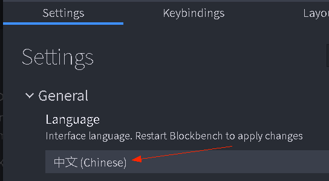
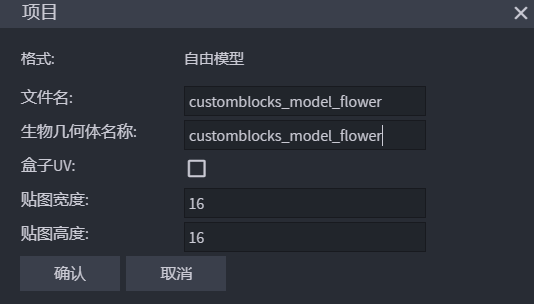
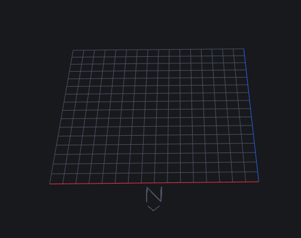
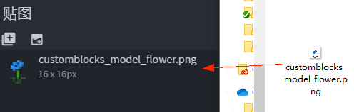
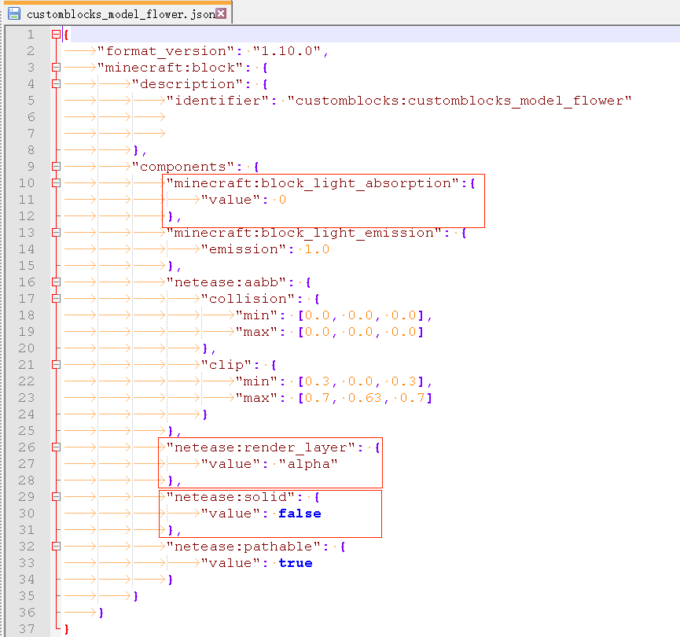
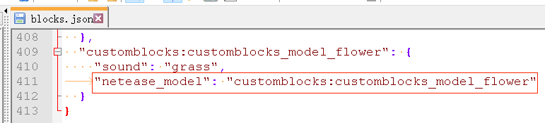
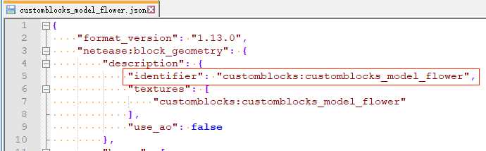
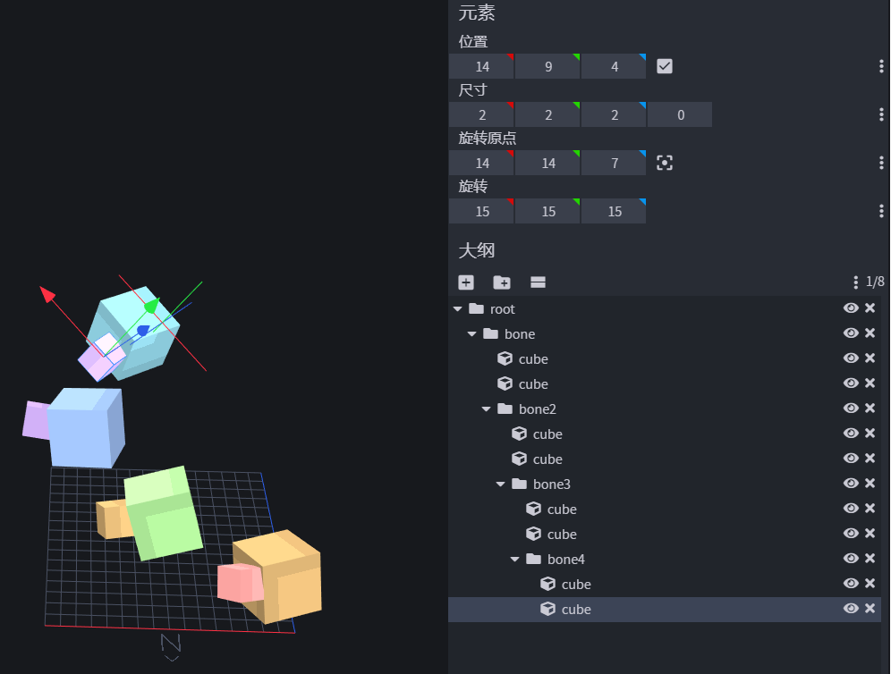
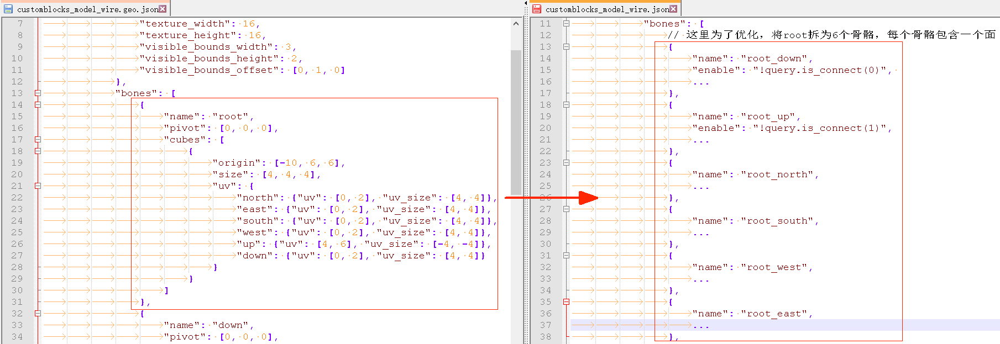

# 自定义方块模型

## 概述

下面将按照[CustomBlocksMod](../../13-模组SDK编程/60-Demo示例.md#CustomBlocksMod)示例中的三个自定义模型方块，由浅入深讲述如何借助BlockBench以及MCStudio搭建自定义方块的模型。

## 从零开始制作方块模型 - 小蓝花

手把手指导如何制作[CustomBlocksMod](../../13-模组SDK编程/60-Demo示例.md#CustomBlocksMod)示例中的小蓝花（customblocks_model_flower）。

在示例中的`resource/bbmodel/flower`中提供了小蓝花的工程文件。

### 使用BlockBench制作模型

1. 找个地方新建一个文件夹作为工作路径，并准备好小蓝花的贴图

   

1. 打开blockbench（这里使用的版本为3.3.1）。

   在File->Settings->General可设置为中文，重启blockbench生效。

   

1. 新建一个“自由模型”项目，填写文件名以及几何体名称。

   盒子UV不要勾选；贴图长宽最大不能超过64。在下面示例中我们使用16x16的贴图。

   

1. 游戏里一个方块的大小对应为16 x 16 x 16，即面板上网格的大小。网格上的N标识了北面的朝向

   

1. 为了避免光照影响预览，可以打开文件->设置->预览，把“阴影”去掉

   

1. 打开文件->设置->默认，把“自动UV“勾上，这样调整cube大小时，各个面的uv大小也会自动跟着调整

   

1. 将小蓝花贴图拖进来

   

1. 添加一个cube，调整其大小，位置及旋转，使其的north面位于16 x 16网格的对角线上

   

1. 选择北面，然后把小蓝花贴图拖上去。这样这个cube的北面就应用了小蓝花贴图

   

1. 点击插件目录-移除空白面。这样这个cube就会只显示北面

   

1. 重复上面三步，添加另一个垂直的面片

   

1. 点击文件-保存工程，保存到我们刚才放贴图的路径。

   

### 使用MCStudio导入模型

1. 打开MCStudio，新建一个AddOn，或者导入已有的，然后启动编辑

   

1. 设置好命名空间

   

1. 在资源管理器中选择导入方块模型

   

1. 选择我们刚才保存的BlockBench工程文件

   

   这一步导入的背后，MCStudio做了这些操作：

   * 将bbmodel工程文件转换为自定义方块模型格式的json，并放到`resourcepack/models/netease_block`
   * 将贴图拷贝到了`resourcepack/textures/blocks`
   * 将贴图配置到了`resourcepack/textures/terrain_texture.json`

### 配置其他需要的文件

​	MCStudio帮我们做了一些工作，接下来还有几个文件需要手动配置

1. 编写behavior的定义

   

2. 在`resourcepack/blocks.json`中，添加该方块

   

   其中使用“netease_model”配置为`resourcepack/models/netease_block`中生成的模型json的identifier。

   

3. 完成一个自定义模型方块所涉及的路径汇总：

   

## 制作更复杂的模型 - 装饰品

​	大致流程与小蓝花类似，比较重复的内容不再赘述，不同之处只在于blockbench中的操作。

​	这里讲述当单张16x16贴图不足以满足需求时，如何制作具有多张贴图的模型，以及uv翻转及uv旋转的使用

​	**注意，我们使用多张16x16贴图来解决贴图大小的需求，而不是使用高分辨率的贴图** 

​	在[CustomBlocksMod](../../13-模组SDK编程/60-Demo示例.md#CustomBlocksMod)示例中的`resource/bbmodel/decoration`中提供了装饰品的工程文件。

### 多贴图模型

​	对一些比较复杂的模型，单张16x16的贴图不够用时，可以把不同的骨骼，立方体，或者面绘制到多张贴图上。

1. 新建一个自由模型的工程，搭好骨骼与cube

   

2. 新建一个工作目录，准备好要用到的贴图，并且全部拖进BlockBench。

   

3. 给每个cube的每个面配置UV

   熟悉BlockBench的开发者也可以使用右上角的画板模式来绘制方块模型

   

### uv的翻转与旋转

​	可以直接使用BlockBench的UV旋转以及UV镜像功能。贴图的右上角会显示该面使用的旋转与翻转。

## 制作可变化的模型 - 电线

​	大致流程与小蓝花类似，比较重复的内容不再赘述，不同之处只在于blockbench中的操作，对导出模型json的调整，以及behavior中方块json的定义。

​	这里讲述如何制作会随周围方块不同而发生改变的模型。

​	在[CustomBlocksMod](../../13-模组SDK编程/60-Demo示例.md#CustomBlocksMod)示例中的`resource/bbmodel/wire`中提供了电线的工程文件。

1. 在behavior的定义中使用[netease:connection](./1-JSON组件#netease:connection)配置与其他方块的“连接”属性

   示例中的电线，与熔炉，草方块，以及电线自身具有“连接"属性

   

2. 分析电线的效果：当六个方向都没有可连接的方块时，只显示一个中间小方块；当某个方向上的方块可以连接时，则从中间”长“出一个长方体与其连接。

   

3. 那么当六个方向都有可连接的方块时，电线的模型将由一个中心正方体，六个长方体构成。于是在blockbench中将他们搭好。（这里为了显示出层次感，把设置中的“阴影”启用了）

   

4. 如果细心观察可以发现，那六个长方体中的每一个，都会有其中两个面是永远看不到的，可以进行优化，把他们设置为透明。跳过这一步不会影响实际效果，但还是推荐开发者们进行性能优化。

   

5. 使用MCStudio导入后，打开`resourcepack/models/netease_block`中导出的json，在六个长方体的骨骼中添加enable字段，该字段的详细解释见[模型文件结构](#模型文件结构)

   

6. 示例中，将中间root骨骼的正方体手动拆成了六个骨骼，每个骨骼分别只有其中的一个面。这是因为如果某些方向连接了其他方块时，中间正方体的某些面是看不到的，不需要渲染。跳过这一步不会影响实际效果，但还是推荐开发者们进行性能优化。

   

7. 额外制作一张用于物品形式渲染的贴图，并配置到模型json中。

   对于可变模型，物品形式下，具有enable条件的骨骼都不会绘制，一般需要使用单独的物品贴图。

   

   

8. 开启环境光遮蔽，可以与自身相连的方块模型一般需要开启，可以改善在室内或夜晚时，相邻方块亮度不一样时的情况。

   

9. 在behavior的方块json中，将aabb同样拆分为中间一个正方体以及周围的六个长方体。该组件的详细解释见[netease:aabb](./1-JSON组件#netease:aabb)

   

## 模型文件结构

- `resource/models/netease_block`中模型json的详细参数解释：

| 键                     | 类型   | 解释                                         |
| ---------------------- | ------ | -------------------------------------------- |
| format_version         | string | 目前为1.13.0，对应blockbench 3.3.1及以上版本 |
| netease:block_geometry | object |                                              |

- netease:block_geometry结构：

| 键          | 类型          | 解释                   |
| ----------- | ------------- | ---------------------- |
| description | object        | 模型的基本信息         |
| bones       | array(object) | 模型的骨骼及立方体信息 |

- description结构：

| 键                    | 类型          | 解释                                                         |
| --------------------- | ------------- | ------------------------------------------------------------ |
| identifier            | string        | 模型的标识符，建议使用命名空间加名称的方式命名               |
| textures              | array(string) | 该模型用到的贴图，与terrain_texture.json中对应               |
| item_texture          | string        | 可选 该方块的物品形态的贴图，与terrain_texture.json中对应。 配置了该项时，手持、UI物品格子、掉落物等物品形态使用该贴图渲染，而非方块模型 |
| use_ao                | bool          | 可选，是否启用环境光遮蔽。 启用时方块的亮度会更加自然，但总体会比不启用时要暗一点 默认不开启 |
| textures_descriptions | array(dict)   | 每张模型贴图的实际分辨率的长和宽配置，长宽最大不能超过64，超过则会使用64。与textures数组中的同一下标位置的贴图一一对应。即第一张贴图的长宽配置为"textures_descriptions"中第一个长宽对，第二张贴图的长宽配置对应"textures_descriptions"中第二个长宽对，如此类推。如果textures中定义的贴图没有在"textures_descriptions"找到对应的贴图长宽配置，则会使用默认值width = 16， length = 16。 填写示例： `"textures_descriptions":[ { "width": 32, "length":32} , { "width": 64, "length":64} , { "width": 16, "length":16} ]` **width和length的值请根据贴图的实际分辨率进行填写。** |

- bones每个元素的结构：

  除了texture及enable项需要另外配置，其余均可使用blockbench生成。

| 键       | 类型          | 解释                                                         |
| -------- | ------------- | ------------------------------------------------------------ |
| name     | string        | 该骨骼的名称                                                 |
| parent   | string        | 父骨骼的名称                                                 |
| pivot    | array(float)  | 该骨骼的旋转中心                                             |
| rotation | array(float)  | 该骨骼绕旋转中心的旋转                                       |
| texture  | int           | 可选 该骨骼使用的贴图，对应description中textures数组的下标。 默认为0 |
| enable   | molang        | 可选。控制该骨骼是否渲染。默认返回true 目前仅支持is_connect查询，详见[netease:connection](./1-JSON组件.md#netease_connection) |
| cubes    | array(object) | 该骨骼所包含的立方体的信息                                   |

- cubes每个元素的结构：

  除了texture需要另外配置，其余均可使用blockbench生成。

| 键       | 类型         | 解释                                                         |
| -------- | ------------ | ------------------------------------------------------------ |
| origin   | array(float) | 该立方体最小点的位置                                         |
| size     | array(float) | 该立方体的大小                                               |
| pivot    | array(float) | 该立方体的旋转中心                                           |
| rotation | array(float) | 该立方体绕旋转中心的旋转                                     |
| texture  | int          | 可选。该立方体使用的贴图，对应description中textures数组的下标。 缺省时会继承所在骨骼使用的贴图 |
| uv       | object       | 该立方体包含的面的信息 可选的面包括up，down，north，south，west，east 可以只选其中若干个面渲染。 |

- uv中每个元素的结构：

  除了texture需要另外配置，其余均可使用blockbench生成。

| 键      | 类型       | 解释                                                         |
| ------- | ---------- | ------------------------------------------------------------ |
| uv      | array(int) | 起始uv坐标                                                   |
| uv_size | array(int) | uv的大小                                                     |
| texture | int        | 可选。该立方体使用的贴图，对应description中textures数组的下标。 缺省时会继承所在立方体使用的贴图 |
| rot     | int        | 将uv顺时针旋转的角度 可选90，180，270                     |

## 注意事项

- 目前每张贴图尺寸不能超过64x64

- **[特殊方块](./3-特殊方块/0-特殊方块概述.md)不支持自定义方块模型**（农作物除外）

- **使用模型的方块支持[netease:face_directional](./1-JSON组件.md#netease_face_directional)中的四面向，但不支持六面向**。当使用多面向时，is_connect查询会根据当前的面向自动匹配

- 使用自定义方块模型时，需要配合[minecraft:block_light_absorption](./1-JSON组件.md#minecraft_block_light_absorption)使用，否则模型会变黑

- 需要用到全透明或半透明时，可配合[netease:render_layer](./1-JSON组件.md#netease_render_layer)使用，但是属性会应用到整个模型

- 请勿将自定义模型方块用于自定义群系的构成中，也避免在频繁出现的自定义特征中放入大量自定义模型方块

- 立方体不支持inflate功能

  

  

