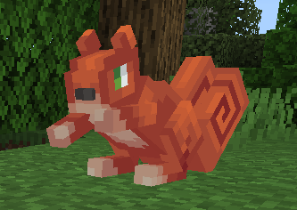
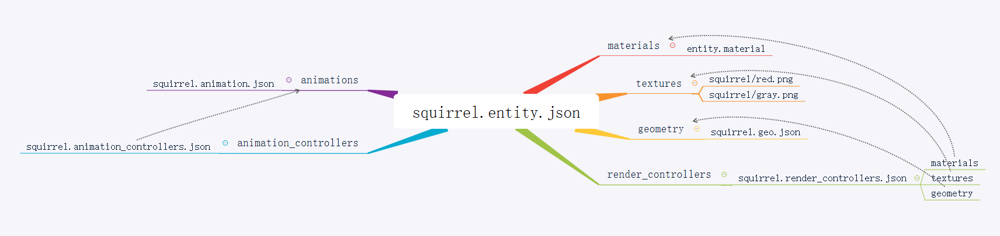
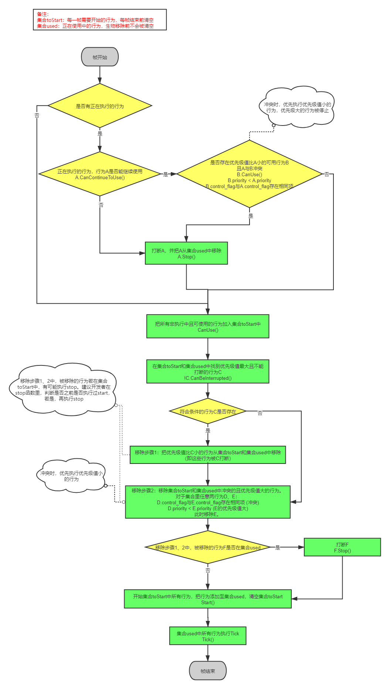
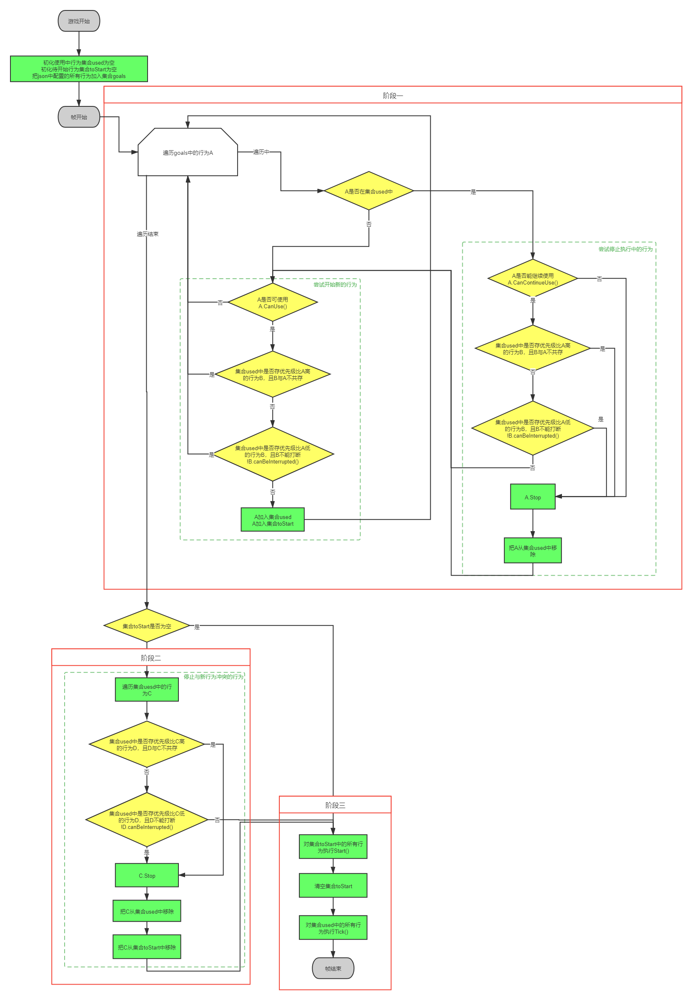

---
front:
hard: 入门
time: 分钟
---

# 自定义生物

## 1.概述

自定义生物涉及材质（material）、贴图（texture）、模型（model）、几何建模（geometry）、动画（animation）、动画控制器（animation controller）和渲染控制器（render controller）等概念，在阅读本文档时希望你对这些专业名词有所了解。

开发者可以通过在addon中配置json来添加自定义生物，添加的自定义生物支持“MOD SDK文档”中与生物/实体相关的所有事件与接口。

下面将通过定义一个松鼠（squirrel）来展现如何定义一个生物。（详见示例[CustomEntityMod](../../13-模组SDK编程/60-Demo示例.md#CustomEntityMod)）



自定义的松鼠包括以下json文件：

* behavior_pack/entities/squirrel.json  服务端实体定义
* resource_pack/entity/squirrel.entity.json 客户端实体定义
* resource_pack/animations/squirrel.animation.json 动画定义
* resource_pack/animation_controllers/squirrel.animation_controllers.json 动画控制器定义
* resource_pack/models/entity/squirrel.geo.json 模型定义
* resource_pack/render_controllers/squirrel.render_controllers.json 渲染控制器定义
* resource_pack/textures/entity/squirrel/red.png 贴图
* resource_pack/textures/entity/squirrel/gray.png 贴图
* resource_pack/materials/entity.material 材质

下图是上述文件之间的关系图：




## 2. 行为包实体定义

### 2.1 示例

在行为包behavior_pack/entities目录下增加squirrel.json

```json
{
	"format_version": "1.10.0",
	"minecraft:entity": {
		"description": {
			"identifier": "netease:squirrel", # 实体标识
			"is_summonable": true, # 是否可以使用命令召唤
			"is_spawnable": true, # 该实体可不可以使用创造模式界面的刷怪蛋生成
			"runtime_identifier": "minecraft:squirrel" # 基于此构建自定义的entity
		},
		"component_groups": {
			"minecraft:color_red": {
				"minecraft:type_family": {
					"family": [
						"red_squirrel",
						"squirrel"
					]
				},
                # 定义一个变量，该变量在render_controller中选择不同的贴图和材质
				"minecraft:variant": {
					"value": 0
				}
			},
			"minecraft:color_gray": {
				"minecraft:type_family": {
					"family": [
						"gray_squirrel",
						"squirrel"
					]
				},
				"minecraft:variant": {
					"value": 1
				}
			}
		},
		"components": {
			...
		},
		"events": {
			"minecraft:entity_spawned": {
				"sequence": [
					{
						"randomize": [
							{
								"weight": 1, # 权重
								"add": {
									"component_groups": [
										"minecraft:color_red"
									]
								}
							},
							{
								"weight": 1, # 权重
								"add": {
									"component_groups": [
										"minecraft:color_gray"
									]
								}
							}
						]
					}
				]
			}
		}
	}
}
```

创建松鼠时有50%的概率生成红色松鼠，另外50%的概率生成灰色松鼠。

### 2.2 components

定义每一种实体独立的行为特性，如minecraft:identitier和minecraft:type_family等。

更多的组件介绍请请查阅微软文档（https://zh.minecraft.wiki/w/基岩版实体组件文档）

**注：在2.2以及之后的版本，我们对自定义生物的移动流量进行了优化，距离玩家较远的生物会出现瞬移的情况，如果感觉效果较差，可在components手动添加netease:ban_bandwidth_optimization:{}组件来主动关闭此优化**


### 2.3 component_groups

将多个components放在一个集合内，便于增加和删除多个components，比如实体的boby和adult两个不同的阶段，很多属性不同，那么就可以在合适的事件中增加或移除对应阶段的component group。

在本例子中，定义了红色松鼠（minecraft:color_red）与灰色松鼠（minecraft:color_gray）两个分组，并且在创建生物进行添加。


### 2.4 事件events

#### minecraft:entity_spawned

触发时机：当entity被放置在地图中时

#### minecraft:entity_transformed

触发时机：当entity转化为另外一个entity时

#### minecraft:entity_born

触发时机：当entity繁殖时

#### minecraft:on_prime

触发时机：当entity被点燃将要爆发时


## 3.自定义材质

### 3.1 示例

#### 3.1.1 原生材质

MC原生的材质定义都在"/data/resource_packs/vanilla/materials"下，生物的材质都在这个目录下的"entity.material"文件中。

材质可通过继承达到复用的效果，原生材质中，常被继承的基础生物材质entity定义如下：

```json
"entity:entity_static": {  # 继承材质entity_static的材质entity，entity_static的定义可在上述"entity.material"文件中找到
  "+defines": [ "USE_OVERLAY" ],  # 渲染时添加USE_OVERLAY宏定义
  "msaaSupport": "Both"  # 使用MSAA抗锯齿技术
},
```

#### 3.1.2 添加自定义材质

在资源包resource_pack/materials目录下创建json文件：entity.material。

```json
{
  "materials": {
    "version": "1.0.0",
    "custom_entity1:entity": {  # 继承原生材质entity的自定义材质custom_entity1
      "+defines": [ "USE_ONLY_EMISSIVE", "USE_UV_ANIM"]  # 渲染时添加USE_ONLY_EMISSIVE和USE_UV_ANIM宏定义
      "-defines": [ "USE_OVERLAY" ],  # 因为原生的entity材质在"+defines"中添加了USE_OVERLAY宏定义，在这里可以使用"-defines"去掉USE_OVERLAY宏定义，原生的entity材质已在3.1.1中列出
      "msaaSupport": "NonMSAA"  # 不使用MSAA抗锯齿技术
    },
    "custom_entity2:custom_entity1": {  # 继承自定义材质custom_entity1的自定义材质custom_entity2
      "msaaSupport": "Both"  # 使用MSAA抗锯齿技术
    }
  }
}
```

在同一目录resource_pack/materials下创建common.json，将上面文件路径填入。common.json列出的文件才会被正确读取作为自定义材质。

```python
[
	{"path":"materials/entity.material"}
]
```

在自定义生物的资源包实体定义中添加以下字段使用上述自定义材质。

```json
{
  "format_version": "1.8.0",
  "minecraft:client_entity": {
    "description": {
      "identifier": "netease:squirrel",
      "min_engine_version": "1.8.0",
      "materials": {
        "default": "custom_entity1",  # 默认材质
        "charged": "custom_entity2"  # charged状态时使用的材质，类似闪电苦力怕与普通苦力怕使用了两套材质，SDK暂不支持设置该状态，一般使用一套default材质即可。(见下注)
      },
      ...
    }
  }
}
```

注：
- 生物默认使用key值为default的材质,因此在需要修改生物材质时，使用类似如下的接口：
	```
	# 把松鼠的渲染材质修改为custom_entity2
	import mod.client.extraClientApi as clientApi
	comp = clientApi.GetEngineCompFactory().CreateActorRender(levelId)
	comp.AddActorRenderMaterial('netease:squirrel', 'default', 'custom_entity2')
	comp.RebuildActorRender('netease:squirrel')
	```
- 目前SDK暂不支持设置生物的材质key值，如"把key值从default修改为charged",因此，一般使用default字段即可

### 3.2 字段说明

#### 3.2.1 宏定义（defines）

MC渲染器在不同的宏定义下会采取不同的策略，因此这些宏定义类似开关式的配置选项。通过"+defines"，"-defines"可在继承的材质的基础上添加或者去掉对应的宏定义，支持的宏定义如下：

```
ALPHA_TEST
COLOR_SECOND_TEXTURE
COLOR_BASED
DISABLE_TINTING
FANCY
ENABLE_FOG
ENABLE_LIGHT
GLINT
ITEM_IN_HAND
MULTI_COLOR_TINT
MULTIPLICATIVE_TINT
NO_TEXTURE
TINTED_ALPHA_TEST
UI_ENTITY
USE_COLOR_MASK
USE_EMISSIVE
USE_MULTITEXTURE
MASKED_MULTITEXTURE
USE_ONLY_EMISSIVE
USE_OVERLAY
USE_SKINNING
USE_UV_ANIM
```

#### 3.2.2 其他字段

材质除了宏定义这类开关形式的配置外，还支持其他如字符串形式的配置，如示例中的”msaaSupport“，可在“NonMSAA”，“MSAA”，“Both”选择一个作为配置的值。自定义材质支持的各种配置如下：

| 字段名           | 待选值                                                       | 描述          |
| ---------------- | ------------------------------------------------------------ | ------------- |
| msaaSupport      | NonMSAA，MSAA，Both                                          | MSAA抗锯齿    |
| depthFunc        | Always，Equal，NotEqual，Less，Greater，GreaterEqual，LessEqual | 深度测试      |
| blendSrc         | DestColor，SourceColor，Zero，One，OneMinusDestColor，OneMinusSrcColor，SourceAlpha，DestAlpha，OneMinusSrcAlpha | blend混合模式 |
| blendDst         | 同上                                                         | blend混合模式 |
| vertexShader     | 一般使用“shaders/entity_hide.vertex”即可                     | 顶点着色器    |
| vrGeometryShader | 一般使用“shaders/entity.geometry”即可                        | 几何着色器    |
| fragmentShader   | 一般使用“shaders/entity_hide.fragment“即可                   | 片元着色器    |

## 4. 自定义动画

自定义的动画应该放在resource_pack根目录下的animations文件夹内。

动画是基于旋转角度、位置和大小的变化的帧动画。

开发者可以引用vanilla的动画或者创建自定义的动画。

可以通过blockbench制作动画。

#### 4.1 示例

resource_pack/animations/squirrel.animation.json

```python
{
	"format_version": "1.8.0",
	"animations": {
		"animation.squirrel.idle": {
			"loop": true,
			"animation_length": 2,
			"bones": {
				"rearFootLeft": {
					"rotation": {
						"0.0": [0, 0, 0],
						"0.4833": [15, 0, 0],
						"1.6": [10, 0, 0],
						"1.8833": [-10, 0, 0],
						"2.0": [0, 0, 0]
					}
				},
                ...
			}
		},
		"animation.squirrel.move": {
			"loop": true,
			"animation_length": 0.48,
			"bones": {
				"rearFootLeft": {
					"rotation": {
						"0.0": [5, 0, 0],
						"0.1667": [125, 0, 0],
						"0.4333": [5, 0, 0]
					}
				},
				...
			}
		}
	}
}
```

#### 4.2 说明

该动画有2种动作，分别是空闲（idle）、移动（move）


## 5. 自定义动画控制器

自定义动画控制器应该放在resource_pack/animation_controllers目录下。

动画控制器被用来控制动画如何转换，何时进行转换。每一个动画控制器包含多个状态（states），每一个state播放一个或者多个动画。

自定义的动画控制器可以引用vanilla中的动画，如示例中的look_at_target。

#### 5.1 示例

resource_pack/animation_controllers/squirrel.animation_controllers.json

```json
{
	"format_version": "1.8.0",
	"animation_controllers": {
		"controller.animation.squirrel.general": {
			"initial_state" : "default",
			"states": {
				"default": {
					"parameters": [ "query.ground_speed" ],
					"animations": [
						...
					],
					"transitions": [
						{ "move": "query.mod.is_moving" }
					]
				},
				"move": {
					"parameters": [ "query.ground_speed" ],
					"animations": [
						...
					],
					"transitions": [
						{ "default": "!query.mod.is_moving" }
					]
				}
			}
		}
	}
}
```

默认动画为default，default中使用idle和look_at_target动画，其中look_at_target为vanilla定义的动画。

transitions为动画转移条件，当query.mod.is_moving为True时，从default转移到move，反之从move转移到default。query.mod.is_moving的使用[后面](#molang_node)会讲到。

## 6. 自定义模型

模型定义了实体的几何形状，自定义的模型放在resource_pack/models/entity目录下。

可以通过blockbench制作模型。

### 6.1 示例

resource_pack/models/entity/squirrel.geo.json

```json
{
	"format_version": "1.12.0",
	"minecraft:geometry": [
		{
			"description": {
				"identifier": "geometry.squirrel",
				"texture_width": 64,
				"texture_height": 64,
				"visible_bounds_width": 4,
				"visible_bounds_height": 1,
				"visible_bounds_offset": [0, 0.5, 0]
			},
			"bones": [
				{
					"name": "body",
					"pivot": [0, 5, 8],
					"rotation": [-20, 0, 0],
					"mirror": true,
					"cubes": [
						{"origin": [-3, 2, -2], "size": [6, 5, 10], "uv": [0, 0], "mirror": false},
						{"origin": [-3, 7, 1], "size": [6, 1, 7], "uv": [22, 0], "mirror": false}
					]
				},
				...
			]
		}
	]
}
```

### 6.2 定位器（locators）

定位器偏移在模块空间中指定。

定位器的例子有 "lead“；定位器用于显示指引将附加到何处。

```json
"locators": {
  "lead": {
    "head": [ 0.0, 14.0, -6.0 ]
  }
}
```


## 7. 自定义渲染控制器

渲染控制器负责生物实体的渲染控制流程，包括使用的材质、贴图、几何模型等。

### 7.1 示例

资源包resource_pack/render_controllers目录下增加squirrel.render_controllers.json

```json
{
	"format_version": "1.8.0",
	"render_controllers": {
		"controller.render.squirrel": {
			"arrays": {
				"textures": {
				  "Array.base": [
					"Texture.red",
					"Texture.gray"
				  ]
				},
				"materials": {
					"Array.skin": [
					  "Material.red",
					  "Material.gray"
				  ]
				}
			},
			"geometry": "Geometry.default",
			"materials": [ { "*": "Array.skin[query.variant]" }],
			"textures": ["Array.base[query.variant]"]
		},
		"controller.render.squirrel_more": {
			"materials": [ { "*": "query.mod.is_enchanted ? Material.gray : Material.red" } ],
		},
		"controller.render.squirrel_multi": {
			 "materials": [
				{ "*": "Material.gray" },
				{ "head": "Material.red" }
			 ]
		}
	}
}
```

说明：

1）在controller.render.squirrel_more中，对于材质的选用，使用python的变量[query.mod.is_enchanted](#molang_node)进行了控制，注意Material.gray必须在资源包minecraft:client_entity中进行声明，否则渲染时会找不到对应的material。

2）在controller.render.squirrel_multi中：

​     首先对模型的所有部件使用材质Material.gray；

​     然后对模型中的head部件使用Material.red

3）更多用法请参考微软官方文档


**注意：如果存在多个渲染控制器，其中的渲染顺序并不保证顺序。**


### 7.2 玩家渲染控制器

下面通过举例vanilla玩家的渲染控制器说明渲染控制器。

首先我们看player.entity.json下面一段json:

```json
"render_controllers": [
        {"controller.render.player.first_person_spectator": "variable.is_first_person && query.is_spectator"},
        {"controller.render.player.third_person_spectator": "!variable.is_first_person && !variable.map_face_icon && query.is_spectator"},
        {"controller.render.player.first_person": "variable.is_first_person && !query.is_spectator"},
        {"controller.render.player.third_person": "!variable.is_first_person && !variable.map_face_icon && !query.is_spectator"},
        {"controller.render.player.map": "variable.map_face_icon"}
      ],
```

在render_controllers数组中，玩家存在五个渲染控制器。

| 渲染控制器名称                              | 渲染控制器应用条件                                   | 说明                             |
| ------------------------------------------- |  ---------------------------------------------------- | -------------------------------- |
| controller.render.player.first_person_spectator       | variable.is_first_person && query.is_spectator                             | 第一人称且旁观者模式下该渲染控制器生效       |
| controller.render.player.third_person_spectator       | !variable.is_first_person && !variable.map_face_icon && query.is_spectator | 非第一人称、非地图图标、旁观者模式下生效 |
| controller.render.player.first_person                | variable.is_first_person && !query.is_spectator                               | 第一人称且非旁观者模式下生效               |
| controller.render.player.third_person | !variable.is_first_person && !variable.map_face_icon && !query.is_spectator                             | 非第一人称、非地图图标、非旁观者模式下生效       |
| controller.render.player.map | variable.map_face_icon | 地图图标下生效 |

**其中，以上五个渲染控制器在渲染过程中并不保证顺序。**


## 8.资源包实体定义

### 8.1 概述

客户端实体（client_entity）的定义在resource_pack当中。

在resource_pack目录下创建文件夹“entity”，然后在该文件夹中创建json文件，如squirrel.entity.json，此json文件需要一个“format_version”和“minecraft:client_entity”的信息。

其中“minecraft:client_entity”部分只包含一个节点description，description下包含一些实体的详细定义，一般而言都会包括材质、贴图、动画、几何、渲染控制器等部分。


### 8.2 示例

resource_pack/entity/squirrel.entity.json

```json
{
	"format_version": "1.8.0",
	"minecraft:client_entity": {
		"description": {
			"identifier": "netease:squirrel",
			"spawn_egg":{
                "base_color":"#1778D2",
                "overlay_color":"#1778D2"
            },
			"render_controllers": [
				"controller.render.squirrel"
			],
			"geometry": {
				"default": "geometry.squirrel"
			},
			"textures": {
				"red": "textures/entity/squirrel/red",
				"gray": "textures/entity/squirrel/gray"
			},
			"materials": {
				"red": "entity_alphatest",
				"gray": "custom_entity"
			},
			"animations": {
				"move": "animation.squirrel.move",
				"idle": "animation.squirrel.idle",
				"look_at_target": "animation.common.look_at_target"
			},
			"animation_controllers": [
				{ "general": "controller.animation.squirrel.general"}
			]
		}
	}
}

```

#### 说明

##### animations

对应于resource_pack/animations/squirrel.animation.json

##### animation_controllers

对应于resource_pack/animation_controllers/squirrel.animation_controllers.json

##### render_controllers

对应于resource_pack/render_controllers/squirrel.render_controllers.json

##### 贴图

资源包resource_pack/textures/entity目录下增加squirrel贴图，包括red.png和gray.png


### 8.3 Spawn Egg

用于设置实体刷怪蛋的颜色或者纹理。

当一个文件中包含多张纹理时，可以使用texture_index指定（默认为0），如：

```json
"spawn_egg": {
  "texture": "spawn_egg",
  "texture_index": 2
}

```

另外也可以指定刷怪蛋的颜色，如：

```json
"spawn_egg": {
  "base_color": "#53443E",
  "overlay_color": "#2E6854"
}

```

### 8.4  enable_attachables

指定实体是否可以穿戴装备，这允许实体渲染盔甲，如：

```json
"enable_attachables": true

```

### 8.5 脚本

脚本允许开发者使用*MoLang*来计算和存储数据，该数据可以被重复利用而不是不断重复地计算。

目前，脚本支持初始化（initialize）、设置父实体（parent_setup）、预动画（pre_animation）、动画（animate）、放大缩小（scale），后续将会支持更多。

我们简单通过如下示例来了解一下：


**示例1（史莱姆）：**

```json
"scripts": {
    "pre_animation": [
        "variable.squish_factor = (query.previous_squish_value + (query.current_squish_value - query.previous_squish_value) * query.frame_alpha);",
        "variable.bounce = 1 / ((variable.squish_factor / (query.variant * 0.5 + 1)) + 1);",
        "variable.horizontal_scale_amount = variable.bounce * query.variant;",
        "variable.vertical_scale_amount = (1 / variable.bounce) * query.variant;"
    ],
    "scaleX": "variable.horizontal_scale_amount",
    "scaleY": "variable.vertical_scale_amount",
    "scaleZ": "variable.horizontal_scale_amount"
},

```

**示例2（羊）：**

```json
"scripts": {
    "animate": [
        "setup",
        "look_at_target",
        "move",
        { "baby_transform": "query.is_baby" }
    ]
},
```


## 9 创建自定义生物

```python
self.CreateEngineEntityByTypeStr("netease:squirrel", pos, rot)
```


## 10 脚本注册驱动节点<span id="molang_node"/>

```python
import mod.client.extraClientApi as clientApi
ClientSystem = clientApi.GetClientSystemCls()

class AnimationTestClientSystem(ClientSystem):
    def __init__(self, namespace, systemName):
        ClientSystem.__init__(self, namespace, systemName)
        self.mRotating = False # 脚本状态
        # 这里注册了"query.mod.is_moving"的计算节点，调用self.UpdateScriptVariable更新状态值
        self.queryVariableName = 'query.mod.is_moving'
		comp = self.CreateComponent('', "Minecraft", "queryVariable")
		result = comp.Register(self.queryVariableName, 0.0)

    def UpdateScriptVariable(self):
        comp = self.CreateComponent('', "Minecraft", "queryVariable")
		result = comp.Set(self.queryVariableName, 1.0)
```

## 11 自定义生物行为<span id="molang_node"/>
### 11.1 概述
开发者通过配置behaviorpack\entities中生物json的behavior，增加自定义behavior节点，并在python实现对应节点的逻辑，以实现自定义的生物行为。以下逐步讲解如何实现squirrel使用tnt攻击玩家的行为

### 11.2 behaviorpack\entities的生物json中配置behavior
CustomEntityMod_behavior/entities/squirrel.json
```json
...
"minecraft:behavior.python_custom:avoid_tnt": {
                "priority": 2,
                "module_path": "customEntityModScripts.avoidTntGoal",
                "class_name": "AvoidTntGoal",
                "arg_dict": {},
                "control_flags": [ "move"]
            },
"minecraft:behavior.python_custom:place_tnt_to_target": {
                "priority": 3,
                "module_path": "customEntityModScripts.placeTntToTarget",
                "class_name": "PlaceTntToTarget",
                "control_flags": [ "move"]
            },
...
```
格式说明：
behaviorName:{
	"priority":int
	"module_path":string
	"class_name":string
	"arg_dict":dict
}
**其中behaviorName必须以 minecraft:behavior.python_custom: 为前缀**

字段说明：
| 字段名      | 类型                | 必填项| 描述          |
| ----------- | ------------ | -- | ------------- |
| priority    | int | 是 |行为的优先级 |
| module_path | string  | 是 | 行为的python模块路径，以 "." 分隔      |
| class_name  | string  | 是 | 行为的python类名 |
| arg_dict  | dict | 否 | 行为的参数，会被传至python实例中 |
| control_flags  | list(string) | 否 | 控制标志，包含相同控制标志的行为被为冲突，**同一时刻下冲突的行为最多只有一个会被执行**。可用的标志有move, look, jump |

### 11.3 mod的scripts脚本中实现生物自定义行为的逻辑
CustomEntityMod_behavior/customEntityModScripts/placeTntToTarget.py - 生物向目标放置tnt
CustomEntityMod_behavior/customEntityModScripts/avoidTntGoal.py - 生物远离tnt
以placeTntToTarget.py为例：

```python
import mod.server.extraServerApi as serverApi
CustomGoalCls = serverApi.GetCustomGoalCls()
class PlaceTntToTarget(CustomGoalCls):
    def __init__(self, entityId, argsJson):
        CustomGoalCls.__init__(self, entityId, argsJson)
        print "PlaceTntToTarget init, entityId:", self.GetEntityId()
        print "PlaceTntToTarget init, args:", self.GetArgs()

    def CanUse(self):
        # return True or False
        pass

    def CanContinueToUse(self):
        # return True or False
        pass

    def CanBeInterrupted(self):
        # return True or False
        pass

    def Start(self):
        pass

    def Stop(self):
        pass

    def Tick(self):
        pass
```
函数说明：
| 函数名      |    返回值     | 描述          |
| ----------- | ------------- | ---------- |
| CanUse | bool   | 行为能否使用，行为未被执行时，引擎每帧调用。返回True时，若没有其他低优先级值的冲突行为且正在执行的高优先级值行为能被打断时，则开始执行此行为，调用Start函数 |
| CanContinueToUse | bool   |行为能否被继续使用，行为被执行时，每帧判断。是行为是否能继续使用的判断条件之一      |
| CanBeInterrupted | bool   | 行为能否被其他行为打断，行为在执行状态时，引擎每帧调用。运行时不能动态修改返回值，必须一直返回True或False |
| Start | 无 |行为开始时执行的函数 |
| Stop |  无 |行为停止时执行的函数 |
|  Tick | 无 |行为执行状态下，每秒执行最多20次，机器性能差时会降频 |
**注意：**
1）文件路径（即模块路径）必须与json配置中的**module_path**匹配
2）自定义行为的类名必须与json中配置的**class_name**匹配
3）自定义行为的类必须继承自**serverApi.GetCustomGoalCls()**， 并调用父类的__init__函数
4）所有函数，均在**服务器线程（server）**调用

### 11.4 自定义AI执行流程图



### 11.5 自定义AI代码流程图



**注意：**

1）若两个CanUse的行为不冲突，且正在执行的高优先级值行为能被打断时，两个行为同时执行

2）生物的行为通道有两条，一条为普通行为通道，一条为敌对对象选择通道，两条通道可同时存在，每条通道仅可执行一种行为组件，目前存在七个选择对象的行为组件：

minecraft:behavior.defend_village_target

minecraft:behavior.owner_hurt_by_target

minecraft:behavior.vex_copy_owner_target

minecraft:behavior.hurt_by_target

minecraft:behavior.nearest_attackable_target

minecraft:behavior.wither_target_highest_damage
