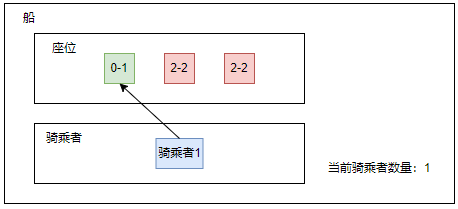
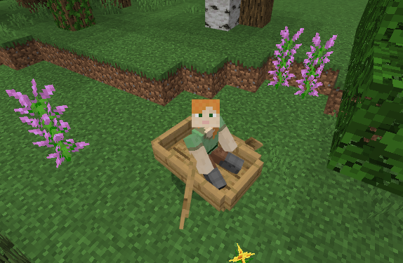
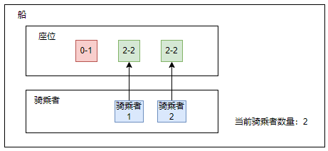
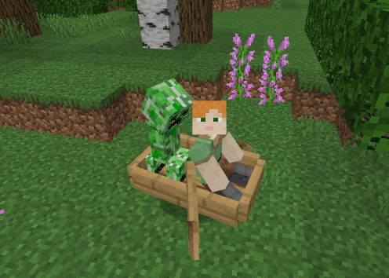
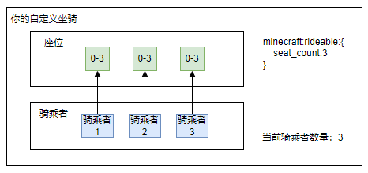
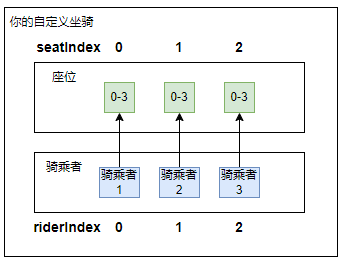
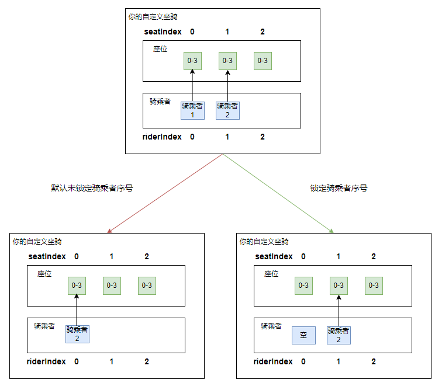
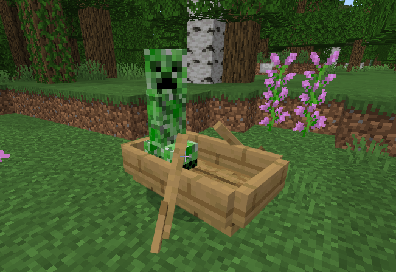
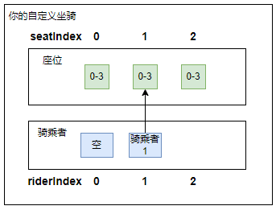

# 使用坐骑拓展接口
## 概述

通过API控制坐骑的骑乘者和座位，开发者可指定骑乘者坐到任意座位，并且能够对坐骑上的座位进行动态的修改

## 前置知识

在新增自定义坐骑的时候，需要在json文件中为实体添加`minecraft:rideable`组件。以游戏中的船为例，下面是船的`minecraft:rideable`组件定义，忽略了该组件的一些参数：

```json
"minecraft:rideable": {
        "seat_count": 2,
        "seats": [
          {
            "position": [ 0.0, -0.2, 0.0 ],
            "min_rider_count": 0,
            "max_rider_count": 1,

            "rotate_rider_by": -90,
            "lock_rider_rotation": 90
          },
          {
            "position": [ 0.2, -0.2, 0.0 ],
            "min_rider_count": 2,
            "max_rider_count": 2,

            "rotate_rider_by": -90,
            "lock_rider_rotation": 90
          },
          {
            "position": [ -0.6, -0.2, 0.0 ],
            "min_rider_count": 2,
            "max_rider_count": 2,
            "lock_rider_rotation": 90
          }
        ]
      },
```

**参数解释**

- seat_count：表示同时能有多少个骑乘者在这个坐骑上，默认为1
- seats：座位的定义，包含如下内容
  - position：该座位相对于坐骑的位置，默认为 [0, 0, 0]
  - rotate_rider_by：该座位上的骑乘者相对于坐骑的转向，默认为0
  - lock_rider_rotation：在该座位上的骑乘者视角允许转动的角度，默认为181，不设置即不限制角度
  - min_rider_count：定义该座位在骑乘者最少有多少个的时候启用，默认为0
  - max_rider_count：定义该座位在骑乘者最多有多少个的时候启用，默认为seat_count
- controlling_seat：默认为0，一般不需要修改，即默认`riderIndex`为0的骑乘者来控制坐骑，`riderIndex`的含义见下文

**座位与乘客队列**

可以看到，原版的船定义了三个座位，并且最多只能有两个骑乘者同时在船上，为了便于理解，可以将座位与骑乘者看成两个独立的队列来理解

当第一个骑乘者上船时，当前的骑乘者数量变为1，依次检查`seats`参数中的座位是否满足条件。第二个和第三个座位因为不满足`min_rider_count`需要为2的条件，所以不会启用。骑乘者上船以后，会让船上所有的骑乘者依次寻找启用的座位



于是第一个骑乘者就坐到了一号位上，表现上就是骑乘者坐在了船的正中间



当第二个骑乘者上船时，当前的骑乘者数量变为2，依次检查`seats`参数中的座位是否满足条件。第一个座位因为不满足`max_rider_count`需要为1的条件，所以不会启用。骑乘者上船以后，会让船上所有的骑乘者依次寻找启用的座位



于是第一个骑乘者就坐到了二号位上，新加入的第二个骑乘者就坐到了三号位上，表现上就是两个骑乘者坐在了船的前后两边



**自定义坐骑**

在定义自定义坐骑的过程中，如果没有特殊的需求，一般不需要定义座位的`min_rider_count`和`max_rider_count`，即任何座位的启用条件都是默认值0~`seat_count`个，在这种情况下骑乘者和座位其实是一一对应的，也就是第一个乘客会坐到一号位，第二个乘客会坐到二号位



但为了适应原版的特性，在接口里仍然对这两个部分进行分开处理，分别用`seatIndex`和`riderIndex`表示座位的序号和骑乘者的序号，但大部分情况这两者是相同的。



## 使用

**获取坐骑上所有骑乘者的信息**

使用<a href="../../../../mcdocs/1-ModAPI/接口/实体/行为.html#getriders" rel="noopenner">GetRiders</a>接口来获取坐骑上所有骑乘者的信息，包括实体ID、在骑乘者队列中所处的位置以及当前的座位编号

示例：

```python
import mod.server.extraServerApi as serverApi
comp = serverApi.GetEngineCompFactory().CreateRide(entityId)
riders = comp.GetRiders()
```

### 骑乘者相关

**锁定坐骑上骑乘者队列，骑乘者上下坐骑不会影响其他骑乘者**

在原版坐骑中，当一个骑乘者离开坐骑时，后面的所有骑乘者会往前移动一位，使用<a href="../../../../mcdocs/1-ModAPI/接口/实体/行为.html#setentitylockriders" rel="noopenner">SetEntityLockRider</a>可以屏蔽这种逻辑，当一个骑乘者离开时不会变动坐骑上已有乘客的骑乘者序号。利用该接口可以实现类似车辆载具的效果，驾驶位上的司机下车以后，副驾驶的玩家依旧在原来的位置上





坐骑锁定后，实体骑乘坐骑的逻辑将发生变化（前提是未通过接口指定实体成为第n个骑乘者，下方会介绍）：

**开始骑乘**

- **情况A-坐骑被锁定**：实体将在骑乘者者队列中从队首开始寻找是否有空的位置，如果有则成为该位置的骑乘者；如果没有则插入队尾，成为当前骑乘者队列中最后一位
- **情况B-坐骑未锁定**：坐骑首先会将骑乘者队列中的所有空位删除，然后按照原版的逻辑来执行添加骑乘者操作
  - 如果当前待骑乘的实体是玩家，则会检测队列中第一个实体是否为玩家，如果不是玩家则会将待骑乘的玩家插到队首，成为队列中第一个骑乘者，否则插入队尾
  - 如果当前待骑乘的实体不是玩家，则插入队尾，成为当前骑乘者队列中的最后一位

**结束骑乘**

- **情况A-坐骑被锁定**：实体离开坐骑，实体原先在骑乘者队列中的位置将会变为空，当前坐骑上所有其他的骑乘者在骑乘者队列中的位置不会发生变化
- **情况B-坐骑未锁定**：实体离开坐骑，在该坐骑的骑乘者队列中，位于该实体后面的所有骑乘者，在骑乘者队列中的位置往前移动一位

**注意**：如果坐骑未锁定，则重载存档后空的位置将被删除，并且坐骑上如果有玩家，同原版逻辑一样玩家会移动到最前面

示例：

```python
import mod.server.extraServerApi as serverApi
comp = serverApi.GetEngineCompFactory().CreateRide(entityId)
comp.SetEntityLockRider(True)
```

**让玩家或实体骑乘坐骑并且成为队列中指定序号的骑乘者（建议搭配锁定骑乘者接口使用）**

在<a href="../../../../mcdocs/1-ModAPI/接口/玩家/行为.html#setplayerrideentity" rel="noopenner">SetPlayerRideEntity</a>或<a href="../../../../mcdocs/1-ModAPI/接口/实体/行为.html#setriderrideentity" rel="noopenner">SetRiderRideEntity</a>接口中可以通过参数`riderIndex`设定玩家或实体在骑乘时直接成为骑乘者队列中指定序号的骑乘者，不会受到实体是否通过接口<a href="../../../../mcdocs/1-ModAPI/接口/实体/行为.html#setentitylockriders" rel="noopenner">SetEntityLockRider</a>锁定的影响

若玩家或实体当前已处在另一个坐骑上，则会先离开当前的坐骑并骑乘到目标坐骑上。注意，目标坐骑指定的序号必须没有骑乘者

示例：

```python
import mod.server.extraServerApi as serverApi
comp = serverApi.GetEngineCompFactory().CreateRide(entityId)
comp.SetRiderRideEntity(playerId,rideEntityId,1)
```

设定以后玩家或实体会成为队列中第二个骑乘者，于是该骑乘者会找到坐骑上第二个可以坐的位置，此时坐骑的情况如下：



**改变坐骑上骑乘者在队列中的所处的位置（建议搭配锁定骑乘者接口使用）**

接口<a href="../../../../mcdocs/1-ModAPI/接口/实体/行为.html#changeriderseat" rel="noopenner">ChangeRiderSeat</a>可以改变骑乘者的`riderIndex`，若指定的`riderIndex`上已经有骑乘者，则交换两个骑乘者的位置。注意，该接口需要对应的实体已经在骑乘状态下才能使用

示例：

```python
import mod.server.extraServerApi as serverApi
comp = serverApi.GetEngineCompFactory().CreateRide(entityId)
comp.ChangeRiderSeat(1)
```

### 座位相关

**增加坐骑上的座位**

接口<a href="../../../../mcdocs/1-ModAPI/接口/实体/行为.html#addentityseat" rel="noopenner">AddEntitySeat</a>可以在坐骑上增加一个座位，并设定座位的位置和转向。该接口同时也会使`minecraft:rideable`组件中的`seat_count`变量+1，新增的座位默认的`min_rider_count`和`max_rider_count`默认为0和新的`seat_count`，即表示该新增的座位不管坐骑上的骑乘者有几人都会处于启用状态

示例：

```python
import mod.server.extraServerApi as serverApi
comp = serverApi.GetEngineCompFactory().CreateRide(entityId)
seatIndex = comp.AddEntitySeat((1.0, 1.0, 1.0), 90.0, 90.0)
```

**修改坐骑上的座位**

接口<a href="../../../../mcdocs/1-ModAPI/接口/实体/行为.html#setentityseat" rel="noopenner">SetEntitySeat</a>可以修改一个已有座位的位置、转向以及玩家可旋转角度范围，处在该位置上的玩家在接口调用后也会移动到修改后的位置

**注意**：只能修改通过接口添加的座位

示例：

```python
import mod.server.extraServerApi as serverApi
comp = serverApi.GetEngineCompFactory().CreateRide(entityId)
comp.SetEntitySeat(3, (1.0, 1.0, 1.0), 90.0, 90.0)
```

**删除坐骑上的座位**

接口<a href="../../../../mcdocs/1-ModAPI/接口/实体/行为.html#deleteentityseat" rel="noopenner">DeleteEntitySeat</a>可以删除一个已有座位，处于该座位上的骑乘者会被强制离开坐骑

**注意**：只能删除通过接口添加的座位

示例：

```python
import mod.server.extraServerApi as serverApi
comp = serverApi.GetEngineCompFactory().CreateRide(entityId)
comp.DeleteEntitySeat(3)
```

