---
front:
hard: 入门
time: 分钟
---

# 群系地貌

## 1.概述

群系地貌：

​	群系：世界中群系的布局

​	地貌：地形的高低起伏

这篇文章主要讲述了如何通过json修改世界中的群系地貌

如果你还不了解什么是"生物群系"，可以先阅读一下[wiki](https://zh.minecraft.wiki/w/%E7%94%9F%E7%89%A9%E7%BE%A4%E7%B3%BB)。


关于<span id ="jump_to_terrant">自定义维度</span>：

- 每个维度对应一个id，原生维度中主世界为0，地狱为1，末地为2。旧版自定义维度的id从3开始，一直到20，[新版自定义维度](./1-自定义维度.md#jump_to_custom_dimension)可以自主设置。
- 自定义维度的名称为"dm"前缀加数字id。如id为3的维度，则命名为"dm3"。


## 2.术语介绍

- 陆地生物群系：表面被实心方块覆盖的群系。

- 海洋生物群系：表面被水覆盖的群系。json中会带有"ocean"的标签（例如ocean.json）

- 深海生物群系：json中会带有"deep"的标签（例如deep_ocean.json）

- 基础生物群系：原版第一阶段生成的群系，后续会分化为其他变种。例如陆地的有丛林，森林，沙漠，平原等，海洋的有海洋，深海。json中"minecraft:world_generation_rules"下会带有"generate_for_climates"的键值（例如plains.json）

- 山地生物群系：指以下生成山地阶段中可以转化成的群系。即json中"hills_transformation"的值。

	例如在plains.json中

	```json
	"minecraft:overworld_generation_rules": {
		"hills_transformation": [
		  [ "forest_hills", 1 ],
		  [ "forest", 2 ]
		],
		...
	},
	```

	则forest及forest_hills为plains的山地群系变种。

- 突变生物群系：指以下生成山地阶段中，有较低概率会转化成的变种。即json中"mutate_transformation"的值。并且对应群系的json中会有"mutated"的标签。

	例如在jungle.json中

	```json
	"minecraft:overworld_generation_rules": {
		"mutate_transformation": "jungle_mutated",
		...
	},
	```

	则jungle_mutated为jungle的突变群系。

- 河流生物群系：

	主要指river及frozen_river。在生成河流时，ice_plains会变成frozen_river，其他群系变成river。

- 海岸生物群系：

	陆地群系与海洋群系相邻时，相邻处会生成的过渡群系。json中一般会带有shore或者beach的标签。


## 3.群系开发模板

[CustomBiomesMod](../../../20-玩法开发/13-模组SDK编程/60-Demo示例.md#CustomBiomesMod)中的`tools\template`中提供了模板工具生成符合编写格式最低要求的自定义维度。生成的自定义群系有以下特征：

1. 对两种transformation都进行了对应当前维度群系的重写
2. 保留了原有generate_for_climates的字段
3. 给每个群系添加了与维度名相同的标签
4. 对每个自定义群系，都可以找到一个与之对应的去掉维度名称前缀的原版群系（见参考资料3）

开发者在编写自己的维度时，可以以此为模板进行开发。

使用方法：

1. 在`CustomBiomesMod\customBiomesBehaviorPack\tools`目录打开命令行，输入

   ```
   python .\remake.py [维度名称]
   ```

​	维度名称为自定义维度的名称，例如要更改dm6自定义维度的群系，则输入

	```
	python .\remake.py dm6
	```

​	然后tools文件夹下会生成一个维度命名的文件夹。

2. 在行为包中新建一个netease_biomes文件夹。
3. 将生成的文件夹拷贝到您的mod的netease_biomes下


## 4.群系文件配置

通过步骤3，我们在behavior_pack/netease_biomes目录下获得了自定义维度的所有群系配置文件，这里以dm3举例

（注：自定义生物群系需要有一个以维度命名的文件夹，例如dm3群系配置文件都在dm3目录下）

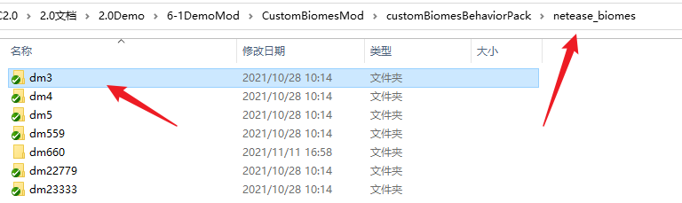

dm3目录下文件结构：

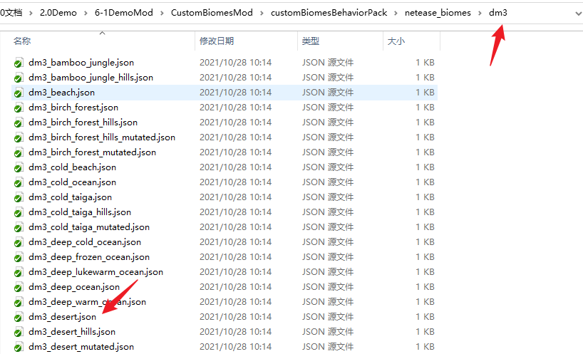

接下来我们需要在文件夹中编写需要重写的生物群系。对每个自定义群系，命名为原版群系加上维度名字及下划线为前缀。例如dm3维度的desert群系命名为"dm3_desert"。

对每个自定义群系，必须继承一个原版的生物群系，在description中用inherits表示，新群系的identifier需要与文件名相同。例如dm3维度重写desert群系，则需要编写dm3_desert.json：

### 4-1.群系文件编写格式

```json
{
   "format_version": "1.14.0",
   "minecraft:biome": {
	   "description": {
		   "identifier": "dm3_desert",
		   "inherits": "desert"
	   },
	"components": {
		   ...
	   }
   }
}
```

对每个自定义维度，每个原版群系都会有一个对应了继承他的自定义群系。在生成群系时，流程不会改变，但是生成时取到的是当前维度中继承后的群系。

4. 在新群系中重写属性来覆盖原版群系的属性。

	**没有进行重写的属性会使用原版群系的属性。**

	**没有进行重写的群系，会自动生成一个所有属性与原版群系相同的，带维度名称前缀的群系**

	- 目前支持的原版biomes json的字段包括：
		- minecraft:overworld_height [【minecraft:overworld_height Wiki】](https://zh.minecraft.wiki/w/%E5%9F%BA%E5%B2%A9%E7%89%88%E7%94%9F%E7%89%A9%E7%BE%A4%E7%B3%BB%E6%96%87%E6%A1%A3)
		- minecraft:overworld_surface [【minecraft:overworld_surface Wiki】](https://zh.minecraft.wiki/w/%E5%9F%BA%E5%B2%A9%E7%89%88%E7%94%9F%E7%89%A9%E7%BE%A4%E7%B3%BB%E6%96%87%E6%A1%A3)
		- 不支持带有[block entity](https://zh.minecraft.wiki/w/%E6%96%B9%E5%9D%97%E5%AE%9E%E4%BD%93)的方块，也不支持门，床等占多个位置的方块
		- 可使用[nbt](https://zh.minecraft.wiki/w/NBT%E6%A0%BC%E5%BC%8F)设置带有auxvalue的方块。目前仅支持设置特殊沙子及特殊泥土类型。可参考原版群系的`mesa_plateau_stone`以及`savanna_mutated`
		- minecraft:world_generation_rules 可控制群系的突变和生成比例，在下方[原版群系生成流程](2-群系地貌.md#7.原版群系生成流程)中会重点讲
		- 自定义tag

	在新群系中添加新的标签，可用于生物生成等功能。

	在"[群系开发模板中](2-群系地貌.md#3.群系开发模板)"，默认给所有自定义维度添加了一个与维度名称一样的标签，便于开发。

	开发者可以按需添加其他标签。
	<span id="jump_to_no_spawn_dragon"></span>

	```json
	{
	   "format_version": "1.14.0",
	   "minecraft:biome": {
		   "description": {
			   "identifier": "dm4_ice_plains",
			   "inherits": "ice_plains"
		   },
		   "components": {
			   "dm4": {},	//群系开发模板自动添加的标签
			   "my_dm4_tag": {}	//添加其他自定义标签
			   //"netease:no_spawn_end_dragon":{} //不生成末影龙和相关战斗逻辑，仅末地（包含自定义末地）维度可用
		   }
	   }
	}
	```
	注:由于末影龙生物本身是存盘的，所以一旦进入过末地（包含自定义末地）维度创建了末影龙之后，后续再添加`netease:no_spawn_end_dragon`组件也无法删除末影龙，仅屏蔽部分相关逻辑。


### 4-2.配置群系的客户端显示部分

在resource资源包的根目录下新建`biomes_client.json`，为自己想定制的群系id配置。（注：自定义群系如果不配置的话会有个默认配置，此默认配置并非父群系的配置，而是一种类似通用主世界的颜色）

```json
{
	"biomes": {
		"dm22779_hell": {
			"water_surface_color": "#905957",//水面颜色
			"water_fog_color": "#905957",//水下雾效颜色
			"fog_color": "#4B0082"//空气雾效颜色
			//"water_surface_transparency": 1.0//水下不透明度
			//"water_fog_distance": 60//水下可见距离
		},
		"dm559_the_end": {
			"water_surface_color": "#62529e",
			"water_fog_color": "#62529e",
			"fog_color": "#0B080C"
		}
	}
}

```


## 5.自定义群系高度（网易版）

原版的群系只能使用"minecraft:surface_parameters"、"minecraft:mesa_surface"、"minecraft:swamp_surface"等组件，在原有的模板基础上微调群系表面的生成，无法更加灵活控制一个区块中方块的类型，所以在2.3版本，我们引入了自定义高度，来解决原版hardcode群系高度的问题


**注：**

**1.MC地形的生成流程：群系->高度->feature，所以高度的控制在feature之前，自定义高度无法影响到feature生成**

**2.现阶段自定义维度高度区间为[0, 256]**


### 5-1.自定义高度简介

自定义高度生成流程可以理解为一条流水线，每个阶段通过配置不同的高度控制节点来生成最终的高度布局，当前阶段的输入是上个阶段的输出，通过不同类型的高度节点相互组合，可以更加灵活的控制整个区块的高度，例如使用sin函数来生成连绵起伏的地表，如下图：（这里使用群系源将此维度全部设置为一种群系）


### 5-2.自定义高度编写格式

1.根据[群系开发步骤](2-群系地貌.md#4.群系文件配置)，创建自定义群系文件，这里不再赘述

2.在自定义群系文件下的"components"下添加"netease:overworld_surface"组件

3.具体配置如下：

```json
{
   "format_version": "1.14.0",
   "minecraft:biome": {
	   "description": {
		   "identifier": "dm111_plains",
		   "inherits": "plains"
	   },
	"components": {
        //自定义高度组件
        "netease:overworld_surface": {
            "adjustments": [
            {
                "type": "fill",   // 必填：高度控制节点类型。目前仅支持：填充节点（fill），移动节点（move）
                "min_height": 90,   // 必填：选取的最小高度，支持molang字符串。如果超过自定义维度的最小高度，则进游戏时会弹出断言窗口
                "max_height": "110 + (math.sin(variable.worldx * 180 / math.pi / 10) * 10)",   // 必填：选取的最大高度，支持molang字符串。如果超过自定义维度的最大高度，则进游戏时会弹出断言窗口（因为mc中的sin使用弧度进行计算，所以这里我们 * 180 / π 圆周度数进行计算）
                "pool": [   // fill类型必填：填充的方块池，根据权重，对选中的区域进行填充
                    {
                        "fill_block": "minecraft:grass",   // "fill_block"是填充的方块名称
                        "weight": 10   // "weight"是填充的方块的生成权重
                    },
                    {
                        "fill_block": {
                            "name": "minecraft:wool",
                            "states": { //支持方块附加值
                                "color": "yellow"
                            }
                        },
                        "weight": 10
                    }
                ]
            },
            {
                //其他节点类型
            }
	   }
   }
}
```

对自定义高度控制可以理解为，在每个**高度控制节点**内通过"min_height"，"max_height"，选一段高度区间，然后对其填充，移动等等


### 5-3.高度控制节点类型

#### 1.fill

简介：使用min_height和max_height选中一段高度区间，使用pool中的方块类型进行填充

示例代码（将高度为 90 <= y <= 95 的部分按照10（玻璃）：1（金块）的比例填充)：

```json
 {
    "type": "fill",   // 必填：高度控制节点类型，填充节点（fill）
    "min_height": 90,   // 必填：选取的最小高度，支持molang字符串。如果超过自定义维度的最小高度，则进游戏时会弹出断言窗口
    "max_height": 95,  // 必填：选取的最大高度，支持molang字符串。如果超过自定义维度的最大高度，则进游戏时会弹出断言窗口
    "pool": [   // fill类型必填：填充的方块池，根据权重，对选中的区域进行填充
        {
            "fill_block": "minecraft:glass",   // "fill_block"是填充的方块名称，支持附加值
            "weight": 10   // "weight"是填充的方块的生成权重
        },
        {
            "fill_block": "minecraft:gold_block",   // "fill_block"是填充的方块名称，支持附加值
            "weight": 1   // "weight"是填充的方块的生成权重
        }
    ]
}
```

游戏内效果：

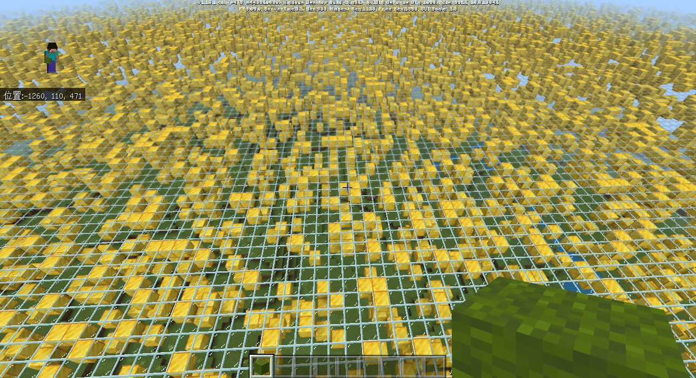


**注：pool中方块类型无法填写"床"，"附魔台"，"自定义方块实体外观"等特殊的方块类型**

"min_height"和"max_height"中可使用以下variable属性：

| 变量            | 解释                        |
| --------------- | --------------------------- |
| variable.worldx | 实际位置的x轴的实际坐标     |
| variable.worldz | 实际位置的z轴的实际坐标     |
| variable.height | 实际位置最高非空气方块y坐标 |

"min_height"、"max_height"中可使用以下query属性：

| 变量        | 解释                                                         |
| ----------- | ------------------------------------------------------------ |
| query.noise | 用于产生伪随机数，传入两个数，返回一个 -1~1 之间的浮点数。当传入的两个参数相同时，query.noise得到的结果也相同。 |

#### 2.move

简介：使用min_height和max_height选中一段高度区间，使用offset将选中区域进行上下移动

示例代码1（选中[最高非空气方块 - 3，最高非空气方块]区间，将其向上移动5格）：

```json
{
    "type": "move",   // 必填：高度控制节点类型，移动节点（move）
    "min_height": "variable.height - 3",   // 必填：选取的最小高度，支持molang字符串。如果超过自定义维度的最小高度，则进游戏时会弹出断言窗口
    "max_height": "variable.height",   // 必填：选取的最大高度，支持molang字符串。如果超过自定义维度的最大高度，则进游戏时会弹出断言窗口
    "move_offset": 5   // move类型必填：上下移动偏移量（正整数表示向上移动，负整数表示向下移动），使用固定数值
}
```

地下效果图：


地上效果图：

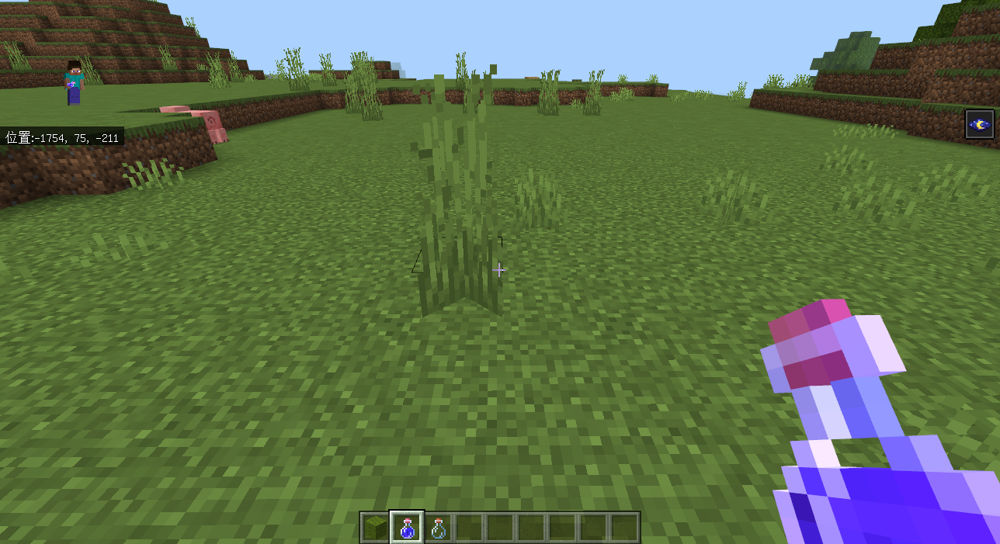

"min_height"、"max_height"，"move_offset"中可使用以下variable属性：

| 变量            | 解释                        |
| --------------- | --------------------------- |
| variable.worldx | 实际位置的x轴的实际坐标     |
| variable.worldz | 实际位置的z轴的实际坐标     |
| variable.height | 实际位置最高非空气方块y坐标 |

"min_height"、"max_height"、"move_offset"中可使用以下query属性：

| 变量        | 解释                                                         |
| ----------- | ------------------------------------------------------------ |
| query.noise | 用于产生伪随机数，传入两个数，返回一个 -1~1 之间的浮点数。当传入的两个参数相同时，query.noise得到的结果也相同。 |

示例代码2（选中[最高非空气方块 - 10，最高非空气方块]区间，根据对x坐标计算sin值来决定移动距离）：

```json
{
    "type": "move",   // 必填：type类型。目前仅支持：填充节点（fill），移动节点（move）
    "min_height": "variable.height - 10",   // 必填：选取的最小高度，支持molang字符串。如果超过自定义维度的最小高度，则进游戏时会弹出断言窗口
    "max_height": "variable.height",   // 必填：选取的最大高度，支持molang字符串。如果超过自定义维度的最大高度，则进游戏时会弹出断言窗口
    "move_offset": "math.sin(variable.worldx * 180 / math.pi / 10) * 10 + 20"   // 必填：上下移动偏移量，使用molang语句
 }
```

效果图：

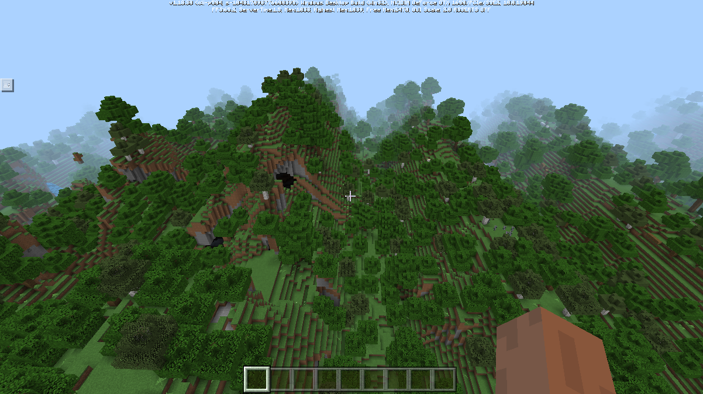

#### 3.replace

简介：使用min_height和max_height选中一段高度区间，将其中的某些方块类型替换为其他方块类型

示例代码：（选中[最高非空气方块 - 3，最高非空气方块]区间，将空气和草方块的百分之50替换为黑色羊毛和金块）

```json
{
    "type": "replace",   // 必填：高度控制节点类型，替换节点（replace）
    "min_height": "variable.height - 3",   // 必填：选取的最小高度，支持molang字符串。如果超过自定义维度的最小高度，则进游戏时会弹出断言窗口
    "max_height": "variable.height",   // 必填：选取的最大高度，支持molang字符串。如果超过自定义维度的最大高度，则进游戏时会弹出断言窗口
    "percentage" : 0.5,                //repalce类型必填，被替换比例，范围(0, 1],代表被替换池中所有方块总数的被替换比率
    "from_block_pool":[                //replace类型必填，被替换池，方块类型支持附加值
        "minecraft:air",
        "minecraft:grass"
    ],
    "to_block_pool":[ //replace类型必填，根据权重，对选中的区域进行比例替换
        {
            "fill_block": { //"fill_block"替换的方块名称，支持附加值
                "name": "minecraft:wool",
                "states": {
                    "color": "black"
                }
            },
            "weight": 10 // "weight"替换的方块的生成权重
        },
        {
            "fill_block": "minecraft:gold_block", //"fill_block"替换的方块名称，支持附加值
            "weight": 10 // "weight"替换方块的生成权重
        }
	]

}
```

替换前：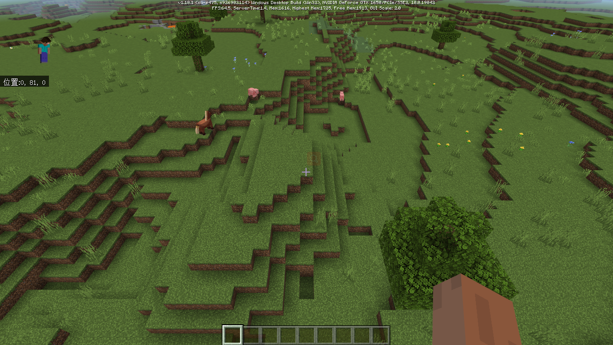

替换后：

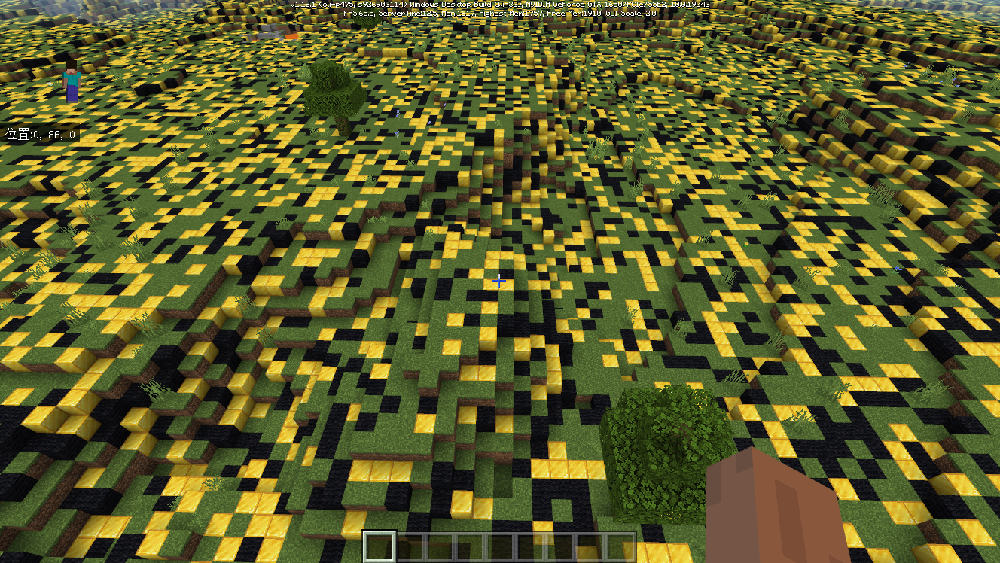

## 6.生物群系生成简介

生物群系生成控制了MC世界整个群系的布局

现阶段群系生成流程分为[原版群系生成流程](2-群系地貌.md#7.原版群系生成流程)和[自定义群系生成流程](2-群系地貌.md#8.自定义群系生成流程（网易版）)，两者互斥，如果使用了自定义群系生成流程则默认关闭原版群系流程


## 7.原版群系生成流程

目前基岩版生物群系生成的管线还处于硬编码的阶段，为了让开发者对配置自定义群系有一个基本的思路，先简单描述一下生物群系生成的各个步骤。如果有兴趣或者想有更深入的了解可以参考java版的源码以及网上的一些解析

1. 将地图划分为海洋及陆地，并决定不同地区的温度。

   温度类型包括：

   ` frozen, cold, medium, lukewarm, warm `

2. 将海洋部分变为ocean，然后将部分ocean变为deep_ocean

3. 将陆地的部分根据温度分化为基础陆地群系

4. 一些硬编码的生成：

   - 添加蘑菇岛群系

     因此所有情况下都会有mushroom_island及mushroom_island_shore生成

   - 将一些热带雨林群系变异为竹林

     因此如果jungle被允许生成，那么bamboo_jungle也会生成

   - 将一些平原变异为向日葵平原

     因此如果plains被允许生成，那么sunflower_plains也会生成

5. 进行山地及突变变异（根据json中配置的hills_transformation及mutate_transformation）

6. 进行河流变异（硬编码）

7. 进行海岸变异（硬编码）

8. 将海洋的部分根据温度分化为基础海洋群系


我们可以通过群系配置文件中"minecraft:overworld_generation_rules"来配置原版群系的布局（突变，出现概率）

dm3_desert.json:配置如下：

```json
{
    "format_version": "1.14.0",
    "minecraft:biome": {
        "description": {
            "identifier": "dm3_desert",
            "inherits": "desert"
        },
        "components": {
            "minecraft:overworld_generation_rules": {
                "hills_transformation": "dm3_desert_hills",  //保持原版突变逻辑
                "mutate_transformation": "dm3_desert_mutated",  //保持原版突变逻辑
                "generate_for_climates": [
                    ["warm", 3] //权重为3，则在warm温度下，概率生成（3/warm权重的总和）
                ]
            },
            "dm3": {}
        }
    }
```

注意：

- 所有的hills_transformation，mutate_transformation，值必须为当前维度的群系。

- 若原版群系带有这两个transformation，都需要重写为当前维度的群系，所以如果有带这两个transformation的原版群系没被重写，属于未定义行为，会使部分地方表现的不符合预期，例如使用GetBiomeName接口获取到的名字不正确。

- 例如原版desert群系，hills_transformation为desert_hills，mutate_transformation为desert_mutated，那么在自定义维度中，配置需和上方dm3_desert.json相同


如果想要删除群系的hills_transformation，mutate_transformation，generate_for_climates属性，可以参考以下方法：

```json
{
   "format_version": "1.14.0",
   "minecraft:biome": {
	   "description": {
		   "identifier": "dm4_ice_plains",
		   "inherits": "ice_plains"
	   },
	   "components": {
		   "minecraft:overworld_generation_rules": {
			   "hills_transformation": "dm4_ice_plains", 	//若设置为自己，则不会变异为其他群系
			   "mutate_transformation": "dm4_ice_plains", 	//若设置为自己，则不会变异为其他群系
			   "generate_for_climates": [
				   ["frozen", 0]	//若权重设置为0，则不会生成
			   ]
		   }
	   }
   }
}
```

需要注意，修改后的维度，陆地（不含ocean的tag）、海洋（含ocean的tag，但没有deep的tag）、深海（同时包含ocean及deep的tag）三种类型，每种类型的五种温度必须至少有1点权重


## 8.自定义群系生成流程（网易版）

原版的群系只能在"minecraft:overworld_generation_rules"中改变群系的突变，以及根据温度来划分群系出现的概率，无法更加灵活的控制群系的布局，所以在2.0版本，我们引入了自定义群系源，用来解决原版hardcode群系布局的问题


**注：使用自定义群系生成流程之后将无法生成原版要塞**

### 8-1.什么是群系源？

群系源规定了MC世界中群系的布局，群系源并不会影响群系的温度，高度，湿度，以及feature，它只影响维度群系的布局


### 8-2.群系源生成简介

MC 群系源的生成流程可以理解为一条流水线，每个阶段通过配置不同的群系源节点来生成最终的群系布局，当前阶段的输入是上个阶段的输出，通过不同的群系源节点相互组合，可以更加灵活的控制整个群系的布局，例如让群系成棋盘布局，如下图：

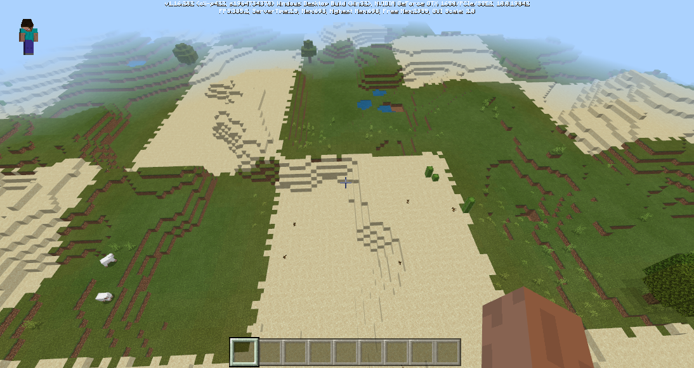

​																											                【图】1


### 8-3.群系源编写格式

1.在行为包中新建一个netease_dimension文件夹

2.新增dmXXX.json文件，其中 XXX 指的是想要配置的维度id

3.如果想生成[图1](2-群系地貌.md#群系源生成简介)棋盘群系，那么群系源配置流程如下：


4.具体配置如下：

```json
{
  "format_version": "1.14.0",
  "netease:dimension_info": {
    "components": {
      "netease:dimension_type": "minecraft:overworld", //维度类型，当前自定义群系源只支持minecraft:overworld
      "netease:biome_source":[ //群系源配置，有此参数则代表使用自定义群系布局，netease:biome_source是一个数组，数组中的每个元素代表一个阶段，每个阶段会有不同的type，通过不同的type相互协作，来共同创造千变万化的群系
        {
          "type":"random_with_weight",  //在16*16的区域内将一些坐标点根据pool中的元素进行填充，weight可以改变该群系出现的比例
          "pool":[
            {"biome_type":"dm660_plains", "weight": 1},
            {"biome_type":"dm660_desert", "weight": 1}
          ]
        },
        {
          "type":"fixed_zoom_2x" //将群系布局等比放大2倍
        },
        {
          "type":"fixed_zoom_2x" //将群系布局等比放大2倍
        },
        {
          "type":"fixed_zoom_2x" //将群系布局等比放大2倍
        },
        {
          "type":"fixed_zoom_2x" //将群系布局等比放大2倍
        },
        {
          "type":"fuzzy_zoom_2x" //将群系布局模糊放大2倍
        }
      ]
    }
  }
}
```

### 8-4.群系源节点类型

#### 1.random_with_weight

简介：在16*16的区域内根据pool中的元素进行填充，对于区域内每一个坐标点，都会进行一次随机，weight可以改变该群系出现的概率，下面假设pool中只填入平原（plains）和沙漠（desert）

**注：暂不支持末地和地狱维度的群系**

示例代码：

```json
{
	"type":"random_with_weight",  //在16*16的区域内将一些坐标点根据pool中的元素进行填充，weight可以改变该群系出现的比例
    "pool":[
		{"biome_type":"dm660_plains", "weight": 1}, //biome_type为该维度的群系类型（不可填写其他维度群系种类）weight代表该群系出现的权重
     	{"biome_type":"dm660_desert", "weight": 1},
   	]
}
```

坐标和群系布局示意图（未进行任何放大）：

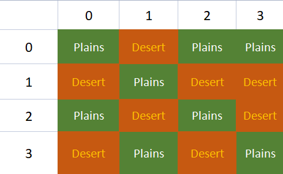

游戏内效果：

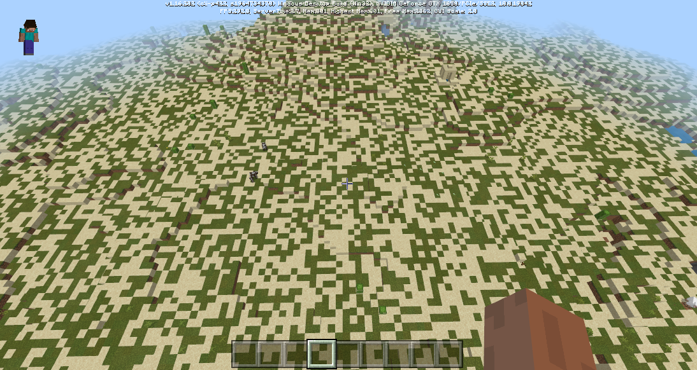

#### 2.fixed_zoom_2x

简介：等比放大两倍，假如现在有2×2的区域都是平原，那么等比放大2倍之后，4×4的区域内就全部变成了平原

示例代码：

```json
{//这里放大两次
	"type":"fixed_zoom_2x"
},
{
    "type":"fixed_zoom_2x"
}
```

坐标和群系布局示意图：

放大前:


放大后：


游戏内效果：


#### 3.fuzzy_zoom_2x

简介：将群系布局模糊放大两倍

示例代码：

```json
{
	"type":"fuzzy_zoom_2x"
},
{
    "type":"fuzzy_zoom_2x"
}
```

坐标和群系布局示意图：

放大前:


放大后（会有一定的随机性）：

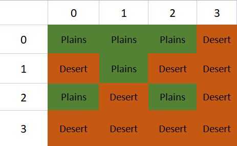

游戏内效果：


#### 4.vanilla_zoom_2x

简介：mc原版放大逻辑，如果想要拥有和原版地图一样的放大算法，可以使用vanilla_zoom_2x，原版放大的逻辑有点类似模糊放大，不过还做了许多优化操作，比如一个点的左边（←）上边（↑）左上（↖）是相同群系，那么将同化这个点的群系和他们保持一致

示例代码：

```json
{
	"type":"vanilla_zoom_2x"
},
{
    "type":"vanilla_zoom_2x"
}
```

坐标和群系布局示意图：

放大前:


放大后（在原有随机放大的基础上，对群系做了更多处理，例如黄色部分应该是沙漠，但是被同化成了平原）：

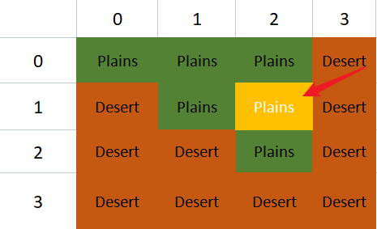

游戏内效果：


#### 5.replace

简介：将某个群系(from_biome)的部分(percentage)替换成另外一个群系(to_biome)

示例代码：

```json
{
	"type":"replace",
    "from_biome":"dm660_plains",
    "to_biome":"dm660_ice_plains",
    "percentage":0.1 //将平原随机替换为冻原，替换比率是10%,percentage取值范围[0,1]
}
```

坐标和群系布局示意图：


**注:percentage取值范围[0, 1]**

游戏内效果：


#### 6.transition

简介：当群系A与群系B相邻时，则在他们中间生成过渡群系，比如在沙漠和平原之间生成海洋

示例代码：

```json
{
    //在沙漠和平原之间生成海洋过渡群系
    "type":"transition",
    "biome_a":"dm660_plains",
    "biome_b":"dm660_desert",
    "biome_transition":"dm660_ocean"
}
```

坐标和群系布局示意图：

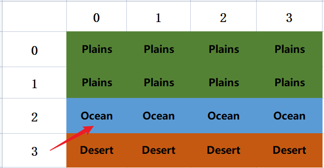

游戏内效果(图中效果经过了放大)：

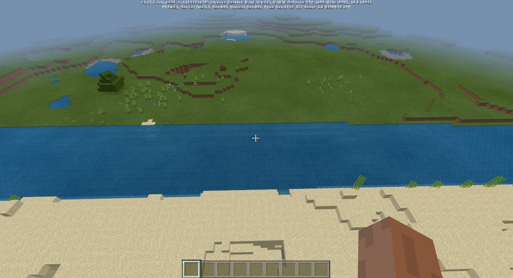

#### 7.associated

简介：在核心群系(core_biome)的周围生成伴生群系(associated_biomes)

示例代码：

```json
{
    //沙漠群系的[0,1],[-1,0],[1,0]位置会伴生有冰原群系
    "type":"associated",
    "core_biome":"dm660_desert",
    "associated_biomes":[
        {"biome_type":"dm660_ice_plains", "relative_pos":[0, 1]},//relative_pos:[x,z],x和z类型为int
        {"biome_type":"dm660_ice_plains", "relative_pos":[-1, 0]},
        {"biome_type":"dm660_ice_plains", "relative_pos":[1, 0]}
    ]
}
```

**注:**

**1.relative_pos中x,z的取值范围为[-1,1]，如果填写x<-1，x>1或者z<-1，z>1会取到错误的值而导致群系生成混乱**

**2.relative_pos中x，z类型为int**

坐标和群系布局示意图：

伴生群系生成前：

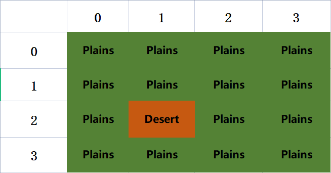

伴生群系生成后：


游戏内效果(图中效果经过了放大):


#### 8.gen_key_biomes

简介：用于关键群系配置，在一个固定长(len_x)，宽(len_z)的范围内,随机选择一个点放置关键群系，可以设置这个点到边缘的最小距离(border_x,border_z)

示例代码：

```json
{
    //在长和宽5*5的范围内，在离边缘至少为1的区域内，随机选择一点放置pool中的群系
	"type":"gen_key_biomes",
    "len_x":5, //x轴长度范围,len_x >= 1
    "len_z":5, //z轴长度范围,len_z >= 1
    "border_x":1, //关键群系距离x轴边缘长度,0 <= border_x < len_x / 2
    "border_z":1, //关键群系距离z轴边缘长度,0 <= border_z < len_z / 2
    "pool":[ //关键群系随机池
        {"biome_type":"dm660_ice_plains", "weight": 1},
        {"biome_type":"dm660_desert", "weight": 1}
    ]
}
```

**注：**

**1.len_x，len_z的值必须为>=1的整数，否则无法生成关键群系**

**2.border_x，border_z必须为非负整数，并且需要满足以下条件**

​	**0 <= border_x < len_x / 2**

​	**0 <= border_z < len_z / 2**

群系布局示意图：

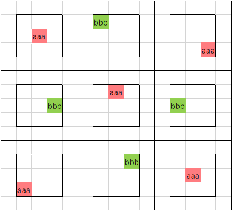

游戏内效果：


#### 9.condition

简介：根据molang语句来实现群系源控制

群系源节点类型的实现原理是根据**坐标**，**周围的群系类型**(query.is_neiborhood_at)来决定当前坐标(variable.worldx，variable.worldz)是什么群系，在type:condition中，开发者可以使用这两个变量，来创造更加不可思议的世界！

**注：condition中的molang语句尽量不要太复杂，使用太多此类型或太复杂的molang语句可能会导致性能问题**

1.首先我们创建一个当x，z坐标的绝对值都大于15时为沙漠群系，否则为平原的群系源类型

示例代码：

```json
{
    //当x，z坐标的绝对值都大于15时为沙漠群系，否则为平原
    "type":"condition",
    "condition":"(math.abs(variable.worldx) > 15) && (math.abs(variable.worldz) > 15) ? 0:1", //判断条件，返回一个下标，指向pool中对应的群系
    "pool":[
        "dm660_desert",
       	"dm660_plains"
    ]
}
```

游戏内效果展示：

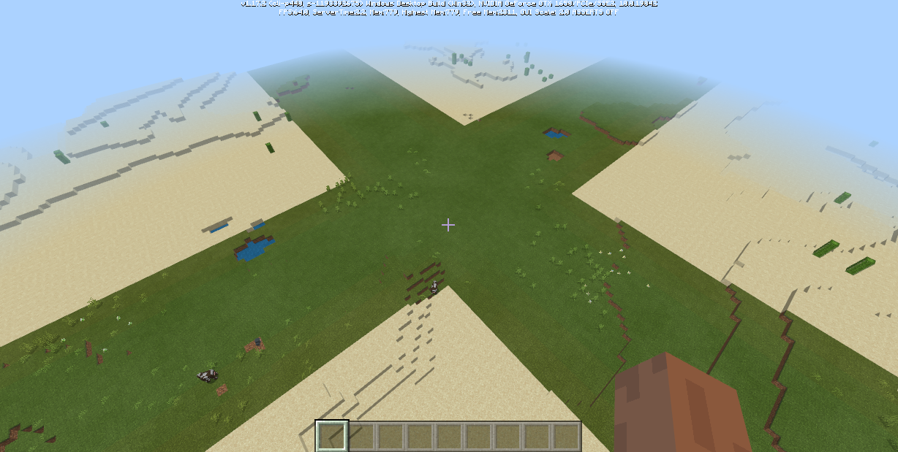

2.我们在上图的基础上使用query.get_neighborhood_is_biome(0, 0, 1)来判断当前渲染的节点是否是平原，如果是则让他变为海洋

示例代码：

```json
{
    //当x，z坐标的绝对值都大于15时为沙漠群系，否则为平原
    "type":"condition",
    "condition":"(math.abs(variable.worldx) > 15) && (math.abs(variable.worldz) > 15) ? 0:1", //判断条件，返回一个下标，指向pool中对应的群系
    "pool":[
        "dm660_desert",
       	"dm660_plains"
    ]
},
{
    "type":"condition",
    "condition":"query.get_neighborhood_is_biome(0, 0, 1) ? 0:-1", //query.get_neighborhood_is_biome(0, 0, 1)用来判断需要渲染的坐标点是否是平原;-1代表群系源节点类型不变
    "pool":[
        "dm660_ocean"
    ]
}
```

游戏中效果：


**注:**

**群系源节点是在群系进行初始布局时执行，所以无法使用query.get_is_biome字段来根据坐标获取群系类型**

condition中可使用以下variable属性：

| 变量             | 解释                    |
| ---------------- | ----------------------- |
| variable.worldx  | 实际位置的x轴的实际坐标 |
| variable.worldz  | 实际位置的z轴的实际坐标 |
| variable.originx | 该区块的最小x坐标       |
| variable.originz | 该区块的最小z坐标       |

query.get_neighborhood_is_biome

- 描述

  判断当前渲染坐标附近是否为目标生物群系

- 参数

| 参数名 | 参数类型 | 说明                                                         |
| ------ | -------- | ------------------------------------------------------------ |
| x      | int      | 附近节点相对当前节点的x轴偏移，取值[-1,1]                    |
| z      | int      | 附近节点相对当前节点的z轴偏移，取值[-1,1]                    |
| biomes | Args...  | 生物群系的枚举值int，可参照minecraft枚举值文档中的<a href="../../../../mcdocs/1-ModAPI/枚举值/BiomeType.html">BiomeType</a> |

**注：query.get_neighborhood_is_biome的x，z参数不要超出[-1,1]的范围，否则会出现判断错误的问题**

## 9.群系设置接口

为了群系有更自由的变化，现在支持游戏运行时修改方块坐标的群系。
<a href="../../../../mcdocs/1-ModAPI/接口/世界/地图.html#setbiomebypos" rel="noopenner">接口详情</a>

### 基岩版群系分为两大类：2D群系、3D群系。

1. 基岩版2D群系

        2D群系是只有在x和z轴上存在不同群系，即同一个(x,z)坐标上所有方块坐标的群系都相同。

        举例：设置(x,z)坐标(111, 222)群系为A群系，那么任何x = 111 且 z = 222的方块坐标群系都是A群系，如方块坐标(111,1,222),(111,123,222)都是A群系。

2. 基岩版3D群系

        3D群系指(x,y,z)为最小设置单位，y轴上可以存在多个不同群系。

        举例：可以设置(111, 1, 222)为A群系，同时设置(111, 123, 222)为B群系。

### 3D群系是特殊
3D群系特殊概念：(以下描述的高度指的是y轴的值)

      表面高度：初次生成的地形中，从最高往下，遇到的第一个非空气方块所在的高度。

      表面子区块：表面高度所在的子区块。

      表面群系：表面子区块中高度最高的方块坐标的群系。

      特殊子区块：坐标高度大于表面子区块高度的区块，特殊子区块中的所有方块坐标群系等于相同(x,z)坐标的表面群系。

假设当前要设置某个方块坐标(x,y,z)的群系为群系A，会有如下情况：

1. 当(x,y,z)位于**特殊子区块**中：从**表面子区块**到**方块坐标所在特殊子区块**中的**所有特殊子区块**(不包括表面子区块，方块坐标所在的特殊子区块)的群系设置为当前的表面群系，设置方块坐标所在的**表面子区块**为群系A。然后更新**表面高度**，**表面子区块**，**表面群系**：**表面子区块**更新为方块坐标所在的子区块，**表面高度**更新为方块坐标所在子区块中最高的方块坐标，**表面群系**更新为方块坐标所在子区块中高度最高的方块坐标的群系。

2. 当(x,y,z)位于非特殊子区块中且不属于**表面高度**的方块：只影响(x,y,z)方块坐标的群系。

3. 当(x,y,z)位于非特殊子区块中但是属于**表面高度**的方块：影响(x,y,z)方块坐标的群系，同时相同x,z坐标的特殊子区块中的方块的群系也被设置为A群系。

## 自定义群系示例demo

示例[CustomBiomesMod](../../../20-玩法开发/13-模组SDK编程/60-Demo示例.md#CustomBiomesMod)中定义了3个自定义维度，python脚本实现了玩家输入维度名称时把他传送到对应维度的功能。

- dm3

	使用模板工具生成，未作任何修改的维度，生成的地形与主世界完全一致。

- dm4

	只会生成ice_plains及frozen_ocean的维度。

	1. 把dm4_ice_plains及dm4_frozen_ocean的generate_for_climates属性都设置为所有温度都拥有1点生成权重，然后把所有其他群系的权重都改为0。

		这样在生成基础群系时仅会生成这两种群系。

	2. 把dm4_ice_plains的hills_transformation及mutate_transformation设置为自身。frozen_ocean没有这两个属性，则不用设置。

		这样在进行山地变异及突变变异时不会生成其他群系

	注意：

	因为目前一些硬编码的生成过程，除了ice_plains及frozen_ocean，还会生成mushroom_island，mushroom_island_shore（蘑菇岛的海岸变种），cold_beach（冰原的海岸变种），frozen_river（冰原的河流变种），以及river（cold_beach的河流变种）。因此该维度一共会有7种群系生成。

- dm5

	只会生成ice_plains及frozen_ocean，并且地面又矿石方块构成。

	1. 参考dm4的第一及第二步

	2. 修改生成的7种群系（见dm4的注意）的方块构成。例如dm5_ice_plains中

	```json
	"minecraft:surface_parameters": {
		"sea_floor_depth": 7,
		"sea_floor_material": "minecraft:emerald_block",
		"foundation_material": "minecraft:iron_block",
		"mid_material": "minecraft:gold_block",
		"top_material": "minecraft:diamond_block",
	    "sea_material": "minecraft:water"
	}
	```

	则群系的表面为钻石块，中间为金块，下面为铁块。

- dm660

  使用自定义群系源定义了一个棋盘布局的群系

- dm770

  使用自定义群系模拟了"暮色森林"群系的布局

- dm111

  使用自定义高度中**填充节点**将高度为 90 <= y <= 95 的部分按照10（玻璃）：1（金块）的比例填充，并使用**替换节点**选中[最高非空气方块 - 3，最高非空气方块]区间，将草方块和空气的百分之50替换为黑色羊毛和末地石，然后使用**移动节点**选中[最高非空气方块 - 3，最高非空气方块]区间，将其向上移动5格

- dm880

​	使用**移动节点**选中[最高非空气方块 - 10，最高非空气方块]区间，根据对x坐标计算sin值来决定移动距离

- dm990

  使用自定义高度中的填充节点和以及噪声函数(query.noise)制作空岛地形

  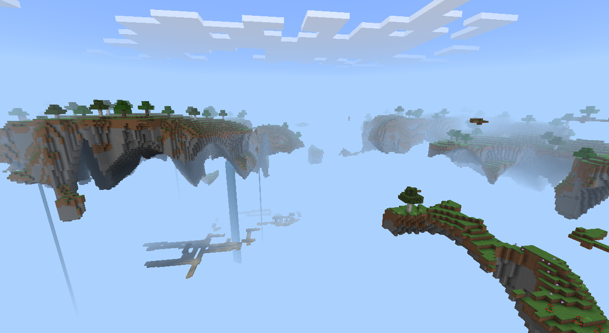

## 参考资料

1. [官网wiki](https://learn.microsoft.com/en-us/minecraft/creator/documents/biomes/biomeoverview?view=minecraft-bedrock-stable)上有更多的自定义生物群系json格式及说明：
2. 原版生物群系的json可以在"Mod PC开发包"的`data/definitions/biomes`目录找到

## 注意事项

1. 通过该方法定义的自定义维度不可以与"MirrorDimension"接口一起使用

2. 当存档卸载带自定义生物群系的mod时，地图的已探索区域会保持自定义的形态，但卸载后新探索的区域会变回原版生物群系。

   若对存档重新加载mod，卸载后新探索的区域会保持原版群系的形态。

3. 如果您不是首次使用自定义生物群系，那么在修改旧版mod时，需要留意json中的format_version。

   从网易1.21版本开始，生物群系的format_version从1.13.0升级为1.14.0，并且json的结构发生了如下改变：

   - minecraft:overworld_surface改名为minecraft:surface_parameters

   - minecraft:surface_parameters，minecraft:swamp_surface，minecraft:mesa_surface，minecraft:frozen_ocean_surface中的属性作以下调整：

     floor_depth改名为sea_floor_depth

     floor_material改名为sea_floor_material

     新增了sea_material

   - minecraft:world_generation_rules改名为minecraft:overworld_generation_rules

   - minecraft:surface_material_adjustments/adjustments/materials下，floor_material改名为sea_floor_material

   如果您需要升级json版本来使用新的功能，可以使用群系开发模板生成最新的1.14.0版本的json，然后合并修改，又或者手动根据以上规则升级您的json。无论您采用哪种方式，请确保json的结构与format_version一致。

4. 如果使用了自定义群系源，那么群系文件中"minecraft:overworld_generation_rules"将会失效


## 常见问题及报错

1. JSON: xxx has an error

	一般为json格式有问题，可以检查一下逗号时候漏写或多写，括号是否对应。

	图为多写逗号的报错

	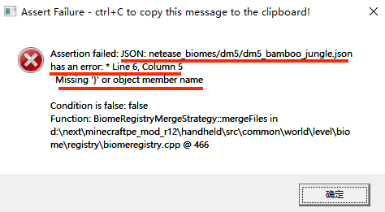

2. lookupByName can not find biome

	一般为两种transform填写的群系名有问题

	图为群系名多写了一个s

	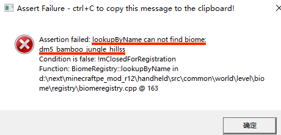

3. different Dimension between

	一般为没有重写原版的transform，或者填写的群系与当前群系不是同一维度。

	若使用"群系开发模板"进行开发，检查是否漏了第2步

	图为在dm5的bamboo_jungle群系中，把hillsTransformation误填为dm3的群系

	

4. total weight of xxx is zero

	某个温度的总权重为0。检查generate_for_climates属性的编写

	图为陆地的medium温度的权重为0

	

5. empty Biome in xxxTransformation

	transformation填写了空字符串

6. Definition of biome xxx is invalid!

	继承关系有问题，检查是否继承不带维度前缀的原版群系

7. value of json is not valid

	检查json的内容是否合法，例如component的拼写，各个属性的拼写等

8. 在2.0以及之后的版本，洞穴将不在硬编码在引擎中，而是作为大型feature出现在游戏中，导致如果在群系地貌中使用微软原版属性"[minecraft:ignore_automatic_features](https://bedrock.dev/docs/1.17.0.0/1.17.10.22/Biomes)"会将洞穴以及大型feature屏蔽，如果只想屏蔽原版小型feature，保留原版大型feature，可以使用["netease:ban_vanilla_feature"](./1-自定义维度.md#维度配置)，后续版本，我们将推出屏蔽大型feature的属性字段，敬请期待...

9. lookupByName can not find biome:dmxxx_plains

​	  使用自定义群系源需要在behaviorPack/netease_biome路径下定义一个dmxxx_plains群系，否则加载时会出现如下断言

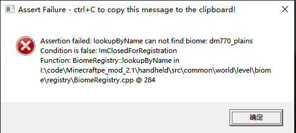

