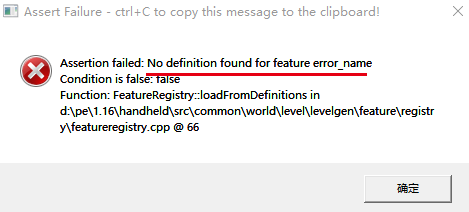
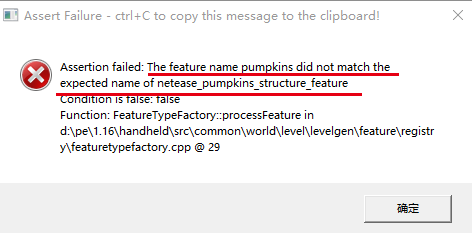

---
front:
hard: 入门
time: 分钟
---

# 自定义特征

## 1.概述

该功能仅在结构保存时需要开启实验性玩法。

开发者可以通过配置特征(features)与特征规则(feature_rules)控制自定义群系的区块生成时，基础地形生成完毕后的后处理阶段。

特征可以理解为一些方块的组合，例如原版的矿物或树木；特征规则定义如何将这些特征放置到地形中。

除了支持原版addon的特征类型，我们还新增了一种基于结构方块导出结构的特征。

Netease Structure Feature和Feature Rules的方式，在地形生成时自动在区块上放置多个由结构方块导出的结构。

**下界和超平坦世界无法生成自定义特征**

**自网易1.21版本起，features与feature_rules的identifier需要添加命名空间，且自定义特征相关格式版本更新至1.14.0**

**本示例中的命名空间为custombiomes，开发者可以自定义命名空间，推荐与mod名称一致**

## 2.参考资料

1. [官方文档](https://learn.microsoft.com/en-us/minecraft/creator/reference/content/featuresreference/examples/featuresintroduction?view=minecraft-bedrock-stable#json-format)对特征及特征规则的解释与示例

2. 原版features的json：见“Mod PC开发包”的`data/definitions/features`目录

3. 原版feature rules的json：见“Mod PC开发包”的`data/definitions/feature_rules`目录

## 3.特征（features）

特征的json文件应放在行为包的 netease_features 目录下

原版特征（见参考资料1）可以直接在此目录下定义，下面主要讲解如何利用结构方块制作**结构特征**。


注意： 原版特征例如minecraft:ore_feature等方式不支持放置方块实体，通过这种方式放置的方块实体会缺失原有方块实体功能，也会导致部分方块实体缺失部分外观，例如箱子，活塞或者自定义方块实体外观等等。如果想要通过特征放置方块实体，可以尝试使用下文结构特征来进行放置。

### 3-1.结构

结构指使用[结构方块](https://zh.minecraft.wiki/w/%E7%BB%93%E6%9E%84%E6%96%B9%E5%9D%97)保存的地图模板，结构的编辑和导出需要玩家处于创造模式下，并开启实验性玩法。

#### 3-1-1.结构方块的获取与放置

可通过指令`/give @p structure_block`获取结构方块

结构方块放置后，可在世界中看到结构的白色轮廓。使用结构方块可打开其GUI，可在GUI中编辑结构的大小、距离结构方块的偏移。

结构中红、蓝、绿三线交汇点为该结构方块的坐标最小点，结构的放置都是从该点所在方块开始的。

若不希望结构中的空气方块在放置时覆盖掉其他方块，可通过指令`/give @p structure_void`获取[结构空位](https://zh.minecraft.wiki/w/%E7%BB%93%E6%9E%84%E6%96%B9%E5%9D%97#.E7.BB.93.E6.9E.84.E7.A9.BA.E4.BD.8D)，并放置在相应的空气方块上。


#### 3-1-2.结构的导出

结构特征支持的单个结构最大尺寸为一个区块的大小（及16x255x16），若超过最大尺寸，超出范围的方块可能不会成功放置；若方块在世界中的高度超过255也不会成功放置，建议结构高度不要设置过高。

结构特征**不支持包含实体**功能，即使结构中保存了实体，也不会生成。

在结构方块GUI界面模式选择"保存"，点击导出即可导出该结构了。

导出后将mcstructure文件放在behavior/structures/xxx目录下，xxx目录一般可以使用mod名称。

然后在后续的使用中，“文件夹名:文件名”即为该结构的identifier

例如下图中的结构，identifier为test:grayWool


若结构中包含火方块，通过NeteaseStructureFeature放置的火与[永恒之火](https://zh.minecraft.wiki/w/%E7%81%AB#.E6.B0.B8.E6.81.92.E4.B9.8B.E7.81.AB)相似，不会熄灭、不会扩散，但依旧有燃烧伤害。

#### 3-1-3.原版测试指令

**仅供测试，仅在pc开发包上可以使用**，如需要在python代码中放置结构，见[python事件及接口](#python事件及接口)

通过`/placefeature featureName x y z`指令可直接放置结构

### 3-2.结构特征的json结构

**特征的identifier必须为小写，并且文件名要与identifier中冒号后的部分一致**

```json
netease_pumpkins_structure_feature.json：

{
  "format_version": "1.14.0",  // 格式版本为1.14.0
  "netease:structure_feature": {  // feature类型必须为netease:structure_feature
  "rotation":0,  //可选项，将结构体按照结构的(0,0)点旋转，默认为0，可选值为90，180，270
    "description": {
      "identifier": "custombiomes:netease_pumpkins_structure_feature"  // 该feature的identifier，custombiomes为其命名空间，开发者可以自行定义
    },
    "places_structure": "test:pumpkins"  // 放置的结构的identifier
  }
}
```

## 4.特征规则（feature_rules）

特征规则的json文件应放在行为包的 netease_feature_rules 目录下

**特征规则的identifier必须为小写，并且文件名要与identifier中冒号后的部分一致**

### 4-1.基本流程

结合一个简单的特征规则json来理解特征是如何生成到世界的：

```json
overworld_pumpkins_feature.json：

{
  "format_version": "1.14.0",  // 格式版本为1.14.0
  "minecraft:feature_rules": {
    "description": {
      "identifier": "custombiomes:overworld_pumpkins_feature",  // 该feature_rule的identifier，custombiomes为其命名空间，开发者可以自行定义
      "places_feature": "custombiomes:netease_pumpkins_structure_feature"  // 该feature_rules所放置的feature的identifier
    },
    "conditions": {  // 控制feature生成条件
      "placement_pass": "surface_pass",		// 控制feature_rules的执行顺序
      "minecraft:biome_filter": [  // 控制feature会在哪些生物群系中生成
        ...
      ]
    },
    "distribution": {  // 控制featuer的分布
      "iterations": 1,
      "coordinate_eval_order": "xzy",
      "scatter_chance": 100.0,
      "x": 0,
      "y": 100,
      "z": 0
    }
  }
}
```

一个feature_rule可以理解为对一个feature如何生成的定义。如果想将一个feature_rule应用到多个feature，可以使用原版的Aggregate Feature（见参考资料1）

feature的生成是与单个区块绑定的，因此单个feature的体积不应超过当前区块的范围，对于结构特征也是如此，但是下面会讲到，如何利用其他方法生成大体积的建筑。

当一个区块生成基本地貌后，会进行一个后处理阶段，例如添加原版的矿物，植被等，feature_rules也是在这个时候生效。

feature_rule中的conditions决定了这个feature会在哪些群系中生成，以及生成的先后顺序

而distribution定义了对于每个群系类型符合的区块，是否要生成这个feature，生成的次数，以及生成的位置

	1. 根据iterations的数值进行迭代
	2. 每次迭代中会进行一次随机，大于scatter_chance的概率则进行第3步
	3. 根据coordinate_eval_order以及xyz的内容决定该次迭代所生成的feature的实际位置。

### 4-2.参数解释

conditions中的参数解释

| 参数 | 类型 | 解释 |
| --- | ---| --- |
| placement_pass | str |后处理阶段一共分为若干个步骤，依次按顺序进行，处理完一个步骤的feature_rules后再处理下一个步骤的。这些步骤按顺序分别为：<br>first_pass<br>before_underground_pass<br>underground_pass<br>after_underground_pass<br>before_surface_pass<br>surface_pass<br>after_surface_pass<br>before_sky_pass<br>sky_pass<br>after_sky_pass<br>final_pass |
|minecraft:biome_filter|array|哪些群系可以应用该feature_rule|

distribution中的参数解释

| 参数 | 类型 | 解释 |
| --- | ---| --- |
|iterations|molang|该区块尝试生成feature的次数|
|scatter_chance|float|每次迭代生成feature的概率|
|coordinate_eval_order|str|实际位置xyz三个坐标的生成顺序，默认为xzy|
|x/y/z|molang或object|实际位置各个坐标的计算方法，返回相对区块最小坐标的值（即x和z应在0-15内）|

在iterations以及x/y/z中可以使用的variable：

| 变量 | 解释 |
| --- | ---|
|variable.originx|该区块的最小x坐标|
|variable.originz|该区块的最小z坐标|

如果在coordinate_eval_order中，y轴排在最后，则“y”字段的molang有可以额外使用的variable：

| 变量 | 解释 |
| --- | ---|
|variable.worldx|实际位置的x轴的实际坐标|
|variable.worldz|实际位置的z轴的实际坐标|

在distribution中的molang，可使用以下query：

- query.get_height_at(x, z)

	- 描述

		根据x、z坐标获取其上最高非空气方块的高度，可传入当前区块之外的坐标。通常用于y轴实际坐标的生成

	- 参数

	| 参数名 | 数据类型 | 说明      |
	| ------ | -------- | --------- |
	| x      | int      | x世界坐标 |
	| z      | int      | z世界坐标 |

- query.is_biome(x, z, biomes...)

	- 描述

		判断在x、z坐标上的生物群系是否为目标生物群系，可传入当前区块之外的坐标。一般用于由多个结构组成的大型结构的生成

	- 参数

	| 参数名 | 数据类型 | 说明                                                         |
	| :----- | :------- | :----------------------------------------------------------- |
	| x      | int      | x世界坐标                                                    |
	| z      | int      | z世界坐标                                                    |
	| biomes | Args...  | 生物群系的枚举值int，可参照minecraft枚举值文档中的<a href="../../../../mcdocs/1-ModAPI/枚举值/BiomeType.html" rel="noopenner"> BiomeType </a> |

	- 示例

        如果我们要获取当前区块是否在沙漠或树林，可以写成

        ```json
        query.is_biome(variable.originx + 15, variable.originz + 15, 2 ,4)
        ```

	- 备注

	  1.一个区块内可能存在多个生物群系类型，不管是水平方向还是竖直方向，例如**繁茂洞穴群系、平原群系**可能在**同一区块的不同高度**；**沙漠群系**、**平原群系**可能在同一区块同一高度的不同区块内位置

	  2.query.is_biome函数暂不支持传入y坐标，默认判断y坐标为0时的群系

- query.noise(num1, num2)<a name="query.noise"></a>

	- 描述

		用于产生伪随机数，传入两个数，返回一个 -1~1 之间的浮点数。当传入的两个参数相同时，query.noise得到的结果也相同。

		可用于控制由多个结构组成的大型结构的概率生成。

	- 参数

	| 参数名 | 参数类型 | 说明       |
	| ------ | -------- | ---------- |
	| num1   | float    | 传入参数一 |
	| num2   | float    | 传入参数二 |

### 4-3.示例

```json
{
  "format_version": "1.14.0",  // 格式版本为1.14.0
  "minecraft:feature_rules": {
    "description": {
      "identifier": "custombiomes:overworld_pumpkins_feature",  // 该feature_rule的identifier
      "places_feature": "custombiomes:netease_pumpkins_structure_feature"  // 该feature_rule所放置的feature的identifier
    },
    "conditions": {  // 设置feature生成条件
      "placement_pass": "surface_pass",
      "minecraft:biome_filter": [  // 设置feature会在哪些生物群系中生成
        {
          "all_of": [
            {
              "any_of": [
                {
                  "test": "has_biome_tag",
                  "operator": "==",
                  "value": "dm4"  // 自定义维度4
                },
                {
                  "test": "has_biome_tag",
                  "operator": "==",
                  "value": "dm5"  // 自定义维度5
                },
                {
                  "test": "has_biome_tag",
                  "operator": "==",
                  "value": "the_end"  // 末地
                }
              ]
            }
          ]
        }
      ]
    },
    "distribution": {  // featuer放置规则
      "iterations": "math.mod(variable.originx - 48, 96) == 0 && math.mod(variable.originz - 48, 96) == 0 && query.is_biome(variable.originx - 17, variable.originz - 17, 0, 1, 2, 9, 12, 46)?3:0", // 迭代放置次数，本句含义为X、Z方向每隔96个方块（6个区块）且尝试放置三次。variable.originx为准备放置feature的区块内最小的x坐标，variable.originz同理
      "coordinate_eval_order": "xzy",  // 放置feature的坐标决定顺序，下文最终y坐标与x、z坐标存在依赖，故顺序为xzy
      "scatter_chance": 100.0,  // 放置featuer概率，应满足0 < scatter_chance ≤ 100
      "x": {
        "distribution": "uniform",  // 在一定范围内随机选取一个整数值
        "extent": [ 0, 16 ]  // 选取范围，不包括最大值
      },
      "y": "query.get_height_at(variable.worldx, variable.worldz)", // variable.worldx为最终放置feature的x坐标，variable.worldz同理
      "z": {
        "distribution": "uniform",
        "extent": [ 0, 16 ]
      }
    }
  }
}
```


## 5.python事件及接口

- PlaceNeteaseStructureFeatureEvent事件(

结构特征生成的事件，详见<a href="../../../../mcdocs/1-ModAPI/事件/世界.html#placeneteasestructurefeatureevent" rel="noopenner"> MOD SDK文档 </a>。

- PlaceStructure接口

手动在世界中放置结构，详见<a href="../../../../mcdocs/1-ModAPI/接口/世界/地图.html#placestructure" rel="noopenner"> MOD SDK文档 </a>。


## 6.大型结构特征的生成

大于16x16的特征，我们需要按照一个区块16x16为大小来将其分割成多个子特征。

以CustomBiome示例中的羊毛特征为例，假设我们需要设计一个48x48大小的大型特征，那将会分割出3x3一共9个子结构，并为每个结构编写对应的feature以及feature_rule。

重点在于通过feature_rule的配置使得9个子结构在生成时按照原来的顺序排列，如何保证大型特征在群系边缘生成时的完整性，以及如何使生成的高度不会错位。

排列以及完整性主要通过将scatter_chance都设为100，然后靠iterations的配置实现，通过一些方法使9个子结构在合适的位置同时为0或同时为1。高度主要通过y的配置实现，需要使9个子结构的输出相同。


### 6-1.控制多个特征的排列

这里我们求余的特性来达到这种效果。如果以左下特征（粉色羊毛）的最小坐标点为原点(0, 0)，那么中央特征（黄色羊毛）的最小坐标点就是(16, 16)

那么如果我们设定一个数值，当左下特征最小点的x和z轴除以该值的余数为0，那么中央特征最小点的x和z轴除以该值的余数就是16，以此类推。

该数值的意义可以理解为每隔一段距离尝试生成一个大型特征，而且为了让16*16的结构恰好填充在一个区块内，该数值需要为16的倍数。这里我们假设为96，那么我们可以写出这两个特征的iterations的条件:

```json
左下特征：
    "iterations": "math.mod(variable.originx, 96) == 0 && math.mod(variable.originz, 96) == 0 ? 1:0"
中央特征：
    "iterations": "math.mod(variable.originx - 16, 96) == 0 && math.mod(variable.originz - 16, 96) == 0 ? 1:0"
```

### 6-2.处理群系边缘的情况

这里分为两种情况有不同的解决方法。

1. 特征生成后不需要用到群系特征，例如刷怪

这种情况意味着不需要整个特征都坐落在特定的群系上，允许部分越过群系边缘。CustomBiome示例中的羊毛特征使用的是这种方法。

首先minecraft:biome_filter只添加维度的过滤，不可以写具体群系的过滤，即允许子特征在所有群系都可能生成。

然后我们通过在iterations中使用query.is_biome来限制特征所在的群系以及完整性。

还是以3x3羊毛特征为例，假设我们规定左下特征必须落在沙漠群系内，而其他子特征不作限制，则可以得出，左下特征最小点的群系为沙漠，而中央特征最小点的x和z轴减去16后所在的群系也是沙漠，以此类推。

所以我们把iterations写成

```json
左下特征：
    math.mod(variable.originx, 96) == 0 && math.mod(variable.originz, 96) == 0
      && query.is_biome(variable.originx + 15, variable.originz + 15, 2) ? 1:0
中央特征：
    math.mod(variable.originx - 16, 96) == 0 && math.mod(variable.originz - 16, 96) == 0
      && query.is_biome(variable.originx - 1, variable.originz - 1, 2) ? 1:0
```

2. 特征生成后需要用到群系特征

这意味着每个子特征都需要在正确的群系上，首先在minecraft:biome_filter中添加特性群系的过滤器

对于每个子特征，我们需要判断3x3整个区域都落在指定群系上，才进行生成。

所以我们把iterations写成

```json
左下特征：
    math.mod(variable.originx, 96) == 0 && math.mod(variable.originz, 96) == 0
      && query.is_biome(variable.originx+15, variable.originz+15, 2)
      && query.is_biome(variable.originx+31, variable.originz+15, 2)
      && query.is_biome(variable.originx+47, variable.originz+15, 2)
      && query.is_biome(variable.originx+15, variable.originz+31, 2)
      && query.is_biome(variable.originx+31, variable.originz+31, 2)
      && query.is_biome(variable.originx+47, variable.originz+31, 2)
      && query.is_biome(variable.originx+15, variable.originz+47, 2)
      && query.is_biome(variable.originx+31, variable.originz+47, 2)
      && query.is_biome(variable.originx+47, variable.originz+47, 2) ? 1 : 0
中央特征：
    math.mod(variable.originx - 16, 96) == 0 && math.mod(variable.originz - 16, 96) == 0
      && query.is_biome(variable.originx-1, variable.originz-1, 2)
      && query.is_biome(variable.originx+15, variable.originz-1, 2)
      && query.is_biome(variable.originx+31, variable.originz-1, 2)
      && query.is_biome(variable.originx-1, variable.originz+15, 2)
      && query.is_biome(variable.originx+15, variable.originz+15, 2)
      && query.is_biome(variable.originx+31, variable.originz+15, 2)
      && query.is_biome(variable.originx-1, variable.originz+31, 2)
      && query.is_biome(variable.originx+15, variable.originz+31, 2)
      && query.is_biome(variable.originx+31, variable.originz+31, 2) ? 1 : 0
```

### 6-3.控制高度

通常特征的y轴我们会使用某个坐标上最高非空气方块的高度，那需要每个子特征获取的坐标一致，才能使各个子特征在高度上不会错位。

还是以3x3羊毛特征为例，假设我们规定整个特征都以左下特征最小点的高度为准，那对于中央特征则需要获取最小点坐标各减去16后的位置的高度，以此类推

最后写成

```json
左下特征：
    "y": "query.get_height_at(variable.originx, variable.originz)"
中央特征：
    "y": "query.get_height_at(variable.originx-16, variable.originz-16)"
```

### 6-4.控制生成的随机性

我们可以让特征按照一定的间距的基础上添加一点随机性，需要用到伪随机函数query.noise。为了保证特征的完整性，需要保证每个子特征传入相同的参数。

还是以3x3羊毛特征为例，方便起见我们直接使用左下特征最小点坐标为参数，那对于中央特征则是最小点坐标各减去16为参数，以此类推。

假设想要以50%的概率的概率生成，那么需要在[处理群系边缘的情况](#处理群系边缘的情况)的基础上加上这样的条件：

```json
左下特征：
    ... && math.abs(query.noise(variable.originx, variable.originz))<0.5
中央特征：
    ... && math.abs(query.noise(variable.originx-16, variable.originz-16))<0.5
```


## demo解释

CustomBiome示例中存放了10种结构，见`behavior/structures/test`，其中有9种结构为由16x3x16的玻璃-羊毛-玻璃方块（下面简称为羊毛结构），区别仅在于羊毛颜色不同。剩余一种结构为尺寸为2x2x2的四个南瓜灯方块（简称为南瓜结构），并且在空气方块位置均放置了结构空位避免覆盖该位置的方块。

然后每个结构都对应了一个结构特征，见`behavior/netease_features`，以及一个特征规则，见`behavior/netease_feature_rules`

在末地以及dm4维度中，这十个特征共同组成了一个大型特征，并且整个大型特征在X、Z方向上每隔96格（6个区块）放置一次。九种羊毛会在同一个高度上，按照固定的顺序排列；而南瓜特征则会尝试放置三次，且x和z坐标偏移在[0, 16]内随机，高度为最终x、z坐标所在最高非空气方块的高度。

此外南瓜特征还会在dm5维度中单独生成。

下图展示了整个大型特征实际放置在末地的结构：


在feature_rule的iterations中根据区块最小坐标判断是否应放置该feature，9个羊毛结构放置时均会判断最中间黄色羊毛所在区块的生物群系是否在  0（oceans）、1（plains）、2（desert）、9（末地）、12（冰原）、46（冻洋）中，是则会尝试放置结构一次，并且放置高度均为黄色羊毛结构所在区块坐标最小点的最高非空气方块的高度。

对于[处理群系边缘的情况](#处理群系边缘的情况)，示例采用的是第一种解决方法，即只要黄色羊毛所在群系符合，则会生成整个结构，不在乎周围其他羊毛所在的群系。

下面以粉色羊毛结构、浅蓝色羊毛结构为例解释distribution的配置：

* 粉色羊毛结构

  均在x、z方向上每隔96格（6个区块）放置，通过math.mod来控制生成间隔。

  如上图的坐标系，粉色羊毛位于(x=0, z=0)位置，因此使用math.mod(variable.originx,96)==0控制x坐标，math.mod(variable.originz,96)==0控制z坐标。

  上面提到所有结构放置时均会判断黄色羊毛所在区块的生物群系类型（由区块内坐标最大点决定）。而本demo中各羊毛结构放置时的偏移均为0，即结构坐标最小点与区块坐标最小点重合，与区块坐标最大点之间存在(x=15, z=15)的偏移。粉色羊毛结构坐标最小点与黄色羊毛结构坐标最小点之间的距离为(x=16, z=16)，故query.is_biome中前两个参数分别为variable.originx + 15 + 16（黄色羊毛所在区块坐标最大点的x坐标）以及variable.originz + 15 + 16（黄色羊毛所在区块坐标最大点的z坐标）。

  同时整个结构的高度以黄色羊毛结构所在区块坐标最小点的最高非空气方块的高度为准，因此计算y坐标时query.get_height_at使用的参数为variable.originx + 16和variable.originz + 16。

  ```json
  "distribution": {
        "iterations": "math.mod(variable.originx, 96) == 0 && math.mod(variable.originz, 96) == 0 && query.is_biome(variable.originx + 31, variable.originz + 31, 0, 1, 2, 9, 12, 46) ? 1:0",
        "coordinate_eval_order": "xzy",
        "scatter_chance": 100.0,
        "x": 0,
        "y": "query.get_height_at(variable.originx + 16, variable.originz + 16)",
  	  "z": 0
  }
  ```

* 浅蓝色羊毛结构

  如上图的坐标系，浅蓝色羊毛位于(x=0, z=16)位置，因此使用math.mod(variable.originz - 16, 96) == 0来控制z坐标。

  浅蓝色羊毛所在区块坐标最小点与黄色羊毛所在区块坐标最小点之间的距离为(x=16, z=0)，因此其query.is_biome中前两个参数分别为variable.originx + 15 + 16、variable.originz + 15 + 0，query.get_height_at参数为variable.originx + 16、variable.originz。

  ```json
  "distribution": {
        "iterations": "math.mod(variable.originx, 96) == 0 && math.mod(variable.originz - 16, 96) == 0 && query.is_biome(variable.originx + 31, variable.originz + 15, 0, 1, 2, 9, 12, 46) ? 1:0",
        "coordinate_eval_order": "xzy",
        "scatter_chance": 100.0,
        "x": 0,
        "y": "query.get_height_at(variable.originx + 16, variable.originz)",
  	  "z": 0
  }
  ```


## 常见报错

1. Feature rule identifier xxx does not match filename yyy

   一般为Feature Rules文件名与文件中的identifier不匹配。

   图为文件名为overworld_gray_wool_feature的Feature Rules文件配置identifier为overworld_graywool_feature的报错。


2. No definition found for feature xxx

   一般为找不到Feature Rules文件中填写的"places_feature"项对应的feature文件

   图为将Feature Rules中"places_feature"值填写为error_name的报错。



3. The feature name XXX did not match the expected name of YYY

    一般为Feature文件名与文件中的identifier不匹配。

    图为文件名为netease_pumpkins_structure_feature的Feature文件配置identifier为pumpkins的报错。



4. Failed to load feature XXX

    一般为Feature文件中places_structure项对应的结构名称填写错误，或结构文件放错了目录。

    图为将test:pumpkins写为test:pumpkin导致无法正常加载结构的报错。


