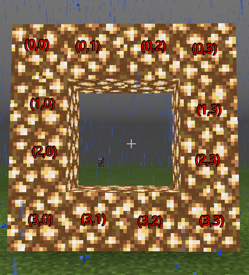
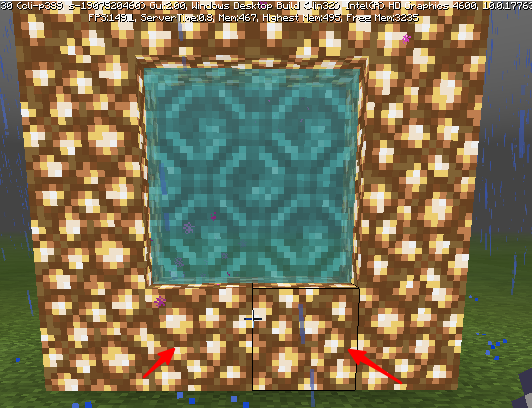
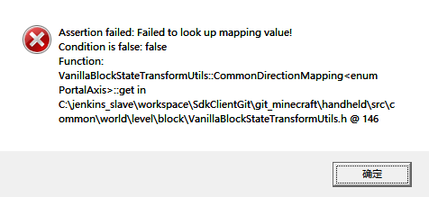

---
front:
hard: 入门
time: 分钟
---

# 自定义传送门DEMO

传送门demo为[portalGateDemo](../../13-模组SDK编程/60-Demo示例.md#portalGateDemo)，并结合自定义维度使用。

### 玩法介绍

1. 用萤石围成一个4x4的方框，对指定点的萤石使用骨粉，会消耗1个骨粉，然后方框内布满传送门方块，进入传送门方块将传送到新自定义维度。

2. 传送完毕portal  forcer功能：

   如果附近有自定义传送门，把玩家移动到传送门附近；

   否则，在玩家附近创建一个传送门，并且把数据保存到level extraData中；

   在地图中敲坏传送门同时删除level extraData中的传送门信息。

### Mod配置说明

1. DEMO配置两个带有传送组件的[自定义方块](../2-自定义方块/0-自定义方块概述.md#customBlockJump)，一个目标设置为自定义维度，一个设置到主世界

2. 按照本文档配置自定义维度

3. 传送门配置解释：

   - 设置门形状:

     ```python
      self.pattern =[
          '####',
          '#**#',
          '#**#',
          '####',
       ]
     ```

   - 设置门方块定义：

     ```
      self.defines ={
          '#':'minecraft:glowstone',
          '*':'minecraft:air'
      }
     ```

   - 设置传送门激活物品信息（骨粉）

     ```
     self.useOnItemName = 'minecraft:dye'
     self.useOnItemAux = 15
     ```

   - 设置传送门边框可激活的位置

     相对之前的pattern中定义的位置

     

     ```
     self.touchPos =[(3,1),(3,2)]
     ```

4. 激活检测

   当玩家使用物品时监听 **ServerItemUseOnEvent** 事件，检测是否为设置的物品，如果是的话就进行传送门搭建的检测，具体的匹配算法接口见<a href="../../../../mcdocs/1-ModAPI/接口/世界/地图.html#detectstructure" rel="noopenner"> DetectStructure接口 </a>

   对位置(3,1)或者(3,2)使用骨粉可以激活传送门，如下图所示。

   

5. Portal Forcer功能

   通过监听事件<a href="../../../../mcdocs/1-ModAPI/事件/玩家.html#dimensionchangefinishserverevent" rel="noopenner"> DimensionChangeFinishServerEvent </a>完成引擎内类似Portal Forcer功能（进地狱门传到地狱之后的逻辑）。

   主要流程如下：

   切换维度完成之后，在玩家附近寻找传送门，如果找到，那么把玩家移到找到的传送门附近；

   否则在玩家附近创建一个传送门，并且把传送门信息保存到level extraData中。

   该功能请查阅传送门demo。

6. 自定义传送门方块相关特性：

   - 若通过服务端blockInfo组件的SetBlockNew接口放置传送门方块：

     - 附加值'aux'设为1时，该方块延伸方向与X轴相同，播放particle_north_south对应的粒子；
     - 附加值'aux'设为2时，该方块延伸方向与Z轴相同，播放particle_east_west对应的粒子。
     - **避免将附加值'aux'设为0。**

   - 还可以在游戏内通过指令/setblock放置方块，**注意'aux'值应设为1或2。**

     如下为在(0, 65, 0)处放置aux值为2的customblocks_test_portal_blue方块的指令：

     `/setblock 0 65 0 customblocks_test_portal_blue 2`

   - 手动放置的传送门方块附加值'aux'始终为0，无论它朝向哪里，**不建议开发者手动放置传送门方块。**

   - 目标维度与当前维度相同时，将不会进行传送。

   - 只有玩家才能够通过自定义传送门方块进行传送。

   - 同一玩家存在一定的传送冷却时间，不会连续传送。

   - 传送前后玩家坐标不发生改变。


### 常见问题

1.PC开发包出现如下断言



原因：由于手动摆放的附加值(aux)为0，所以通过结构方块加载具有手动摆放的传送门方块时，会出现此断言

解决方案：可使用/setBlock指令设置传送门方块位置来解决此问题，注意'aux'值应设为1或2。
