---
front:
hard: 入门
time: 分钟
---

# 自定义大型特征

## 0.预备知识：

### 0-1.拼图方块简介：

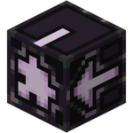

拼图方块（线锯方块）是用于生成一些结构的技术性方块，拼图方块不会生成在世界中，部分结构包含拼图方块（掠夺者前哨站和村庄等），但这些拼图方块在自然生成时被转换为了其他结构，使拼图方块不会生成在世界中（在游戏中可以使用 /give @s jigsaw 指令获取拼图方块）。

将拼图方块放置到游戏中，点击，会出现UI界面，如下图:


### 0-2.拼图方块属性介绍：

1.目标池：

- 指此拼图方块用于选取结构的结构池
- 结构池的定义可查看[1-4-2.结构池](#1-4-2.结构池配置)配置
- 默认值为"minecraft:empty"

2.名称：

- 此拼图方块的名称
- 默认值为"minecraft:empty"

3.目标名称：

- 当结构从目标池中生成时要对接拼图方块的名称
- 默认值为"minecraft:empty"

4.变为：

- 指的是拼图方块在整个功能被放置后会转变的方块状态
- 默认值为"minecraft:air"

5.接点类型：
- 只在方块朝上或朝下时有效。
- 含有两种连接类型（可旋转和固定）：

  1.可旋转：生成时，拼图方块会随机将目标结构或实体置于与该拼图方块处于同一XZ轴的结构方块的边界内。默认为此类型。

  2.固定：生成时，拼图方块会直接把目标结构或实体置于自身所朝的方向（上方或下方）。可用于连接结构和固定的实体。


## 1.自定义大型特征的生成

在2.7版本之前，想要在游戏中生成大型结构必须通过在[特征规则](./4-自定义特征.md#6大型结构特征的生成)中通过调整位置等参数控制iterations，来将一个个16*16的小型结构拼接为大型结构，

其中iterations的配置有时会相当复杂，并且随机性不高，生成结构较为生硬。为解决以上问题，在2.7版本，我们引入了自定义大型结构特征来解决上述问题。

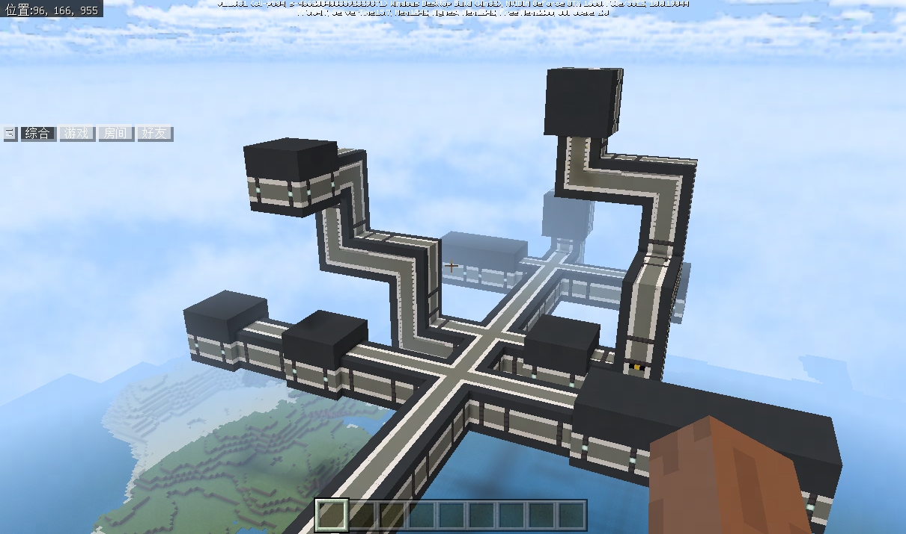


### 1-1.什么是自定义大型结构特征？

自定义大型特征参考了原版村庄的生成逻辑，允许开发者通过配置结构池，大型结构特征生成规则来控制生成，并且在不同的位置，不同的群系，不同种子的情况下，生成不同的大型结构特征。

大型结构特征的原理就是通过放置一定数量的带有拼图方块的小型结构，再根据拼图方块的规则去随机生成符合规则的下一个结构，不断进行深度递归拼接而成的大型结构。


### 1-2.自定义大型结构特征简介

自定义大型结构特征的生成是一个递归的过程，首先从中心结构池抽取一个中心结构摆放，这个中心结构带有拼图方块，则会根据拼图方块设定的目标结构池，寻找下一个需要摆放的结构，拼接成功后再遍历第二个结构中的拼图方块来寻找可以拼接的结构，依次递归，直至满足最大递归深度或找不到新的可拼接结构，则会从终结结构池选择一个终结结构进行收尾，类似下图。

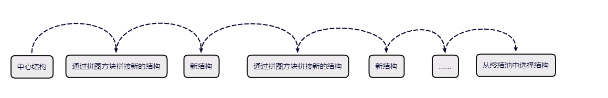


### 1-3.MCStudio中放置拼图方块并导出结构

1. 打开MCStudio，并切换到地图编辑器


2. 制作好用于拼接的结构，并将其放置到地图中

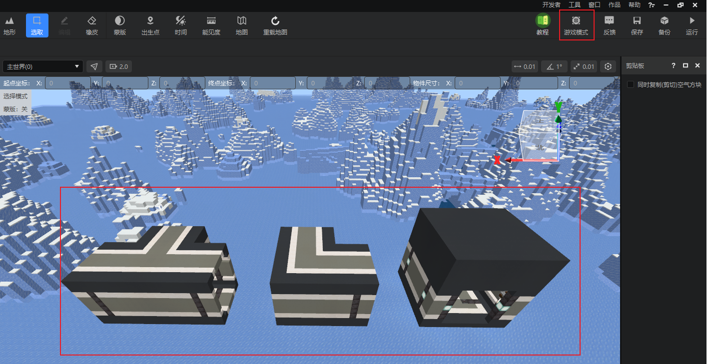


3. 选择笔刷→拼图方块笔刷，正确配置拼图方块的属性，并使用笔刷放置到地图中，如下图所示：

  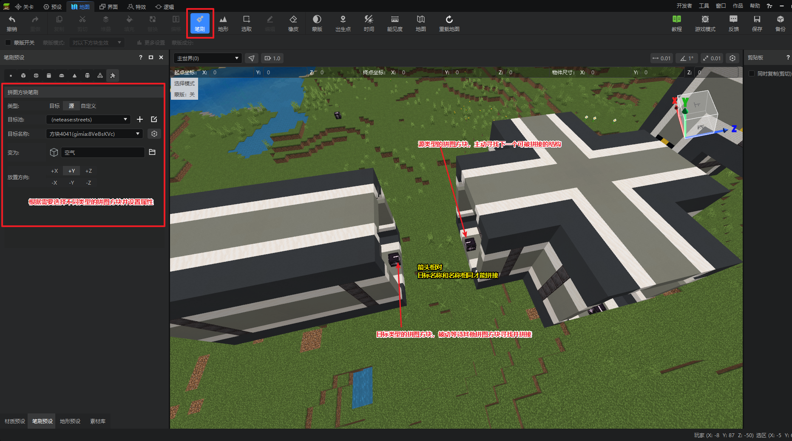

> 注1：关于拼图方块笔刷的属性，你可以参考[拼图方块笔刷属性说明](../../../14-地图制作/6-笔刷工具.md#_9-拼图方块笔刷)。

> 注2：拼图方块有方向属性，摆放时拼图方块的箭头会指向玩家所在方向，拼图方块会根据方向属性对接其他结构中的拼图方块（**例如方向朝右的拼图方块，会对接方向朝左的拼图方块**）

> 注3：除了直接使用拼图方块笔刷进行放置，开发者也可以在拼图方块摆放完成后，进入游戏模式，再右击拼图方块会弹出UI界面，并填写配置，完成后点击完成。

> 注4：因为拼图方块既可以从结构池中选择生成结构，又可以作为被选出结构的连接点，为降低复杂度，我们在对拼图方块笔刷做了类型区分
> 1. 源方块类型： 假设此拼图方块用来从结构池寻找下一个可拼接结构并生成，只需填写【目标池】（可参考[结构池](#1-4-2.结构池配置)定义）和【目标名称】。
> 2. 目标方块类型：假设此拼图方块用来充当被选出结构的连接点，只需填写【名称】。
> 3. 自定义类型：实际上同一个拼图方块可以同时是源类型和目标类型的，只需要根据需要填写对应的属性值。

4. 在中心结构上放置源类型的拼图方块

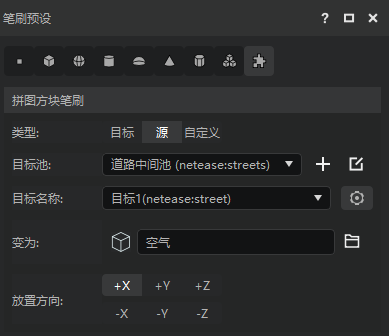

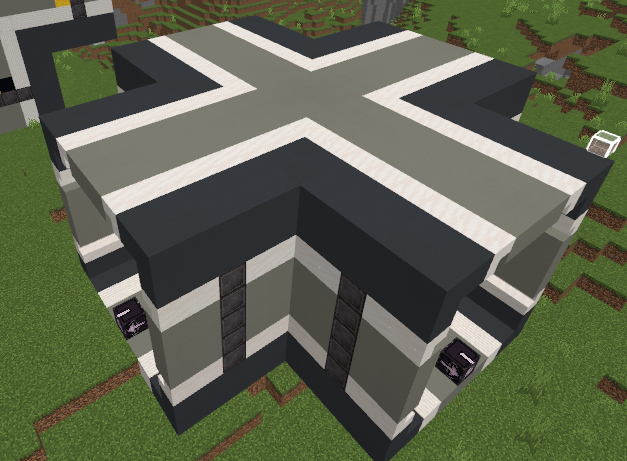


5. 在其他结构中放置拼图方块，并填写好配置

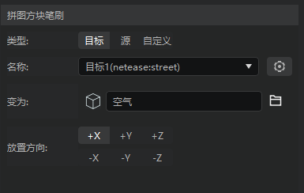

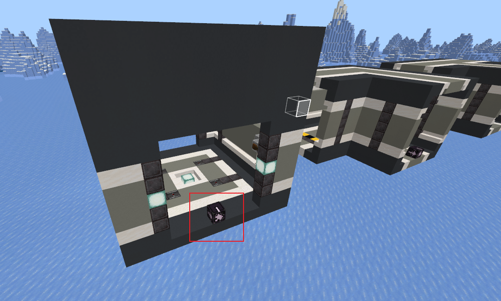

6. 重复上述步骤，将结构中所有需要连接的地方都放入拼图方块，并填写好配置

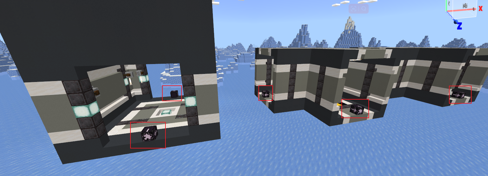

7. 在MCStudio地图编辑器下选中“选取”，选中结构并点击“保存为结构”


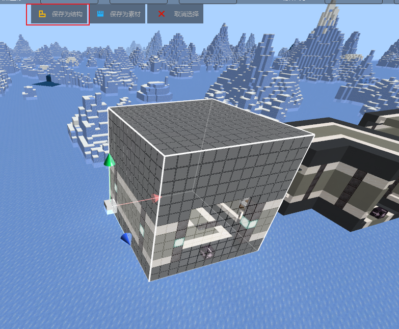

8. 输入结构名称后点击保存即可（保存的结构即可在[结构池](#1-4-2.结构池配置)配置中使用），重复上述步骤，将所有结构导出保存。

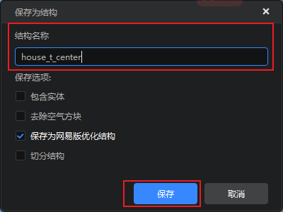

9. 切换到关卡编辑器配置对应的结构池和大型特征生成规则配置，将之前导出的结构配置到对应的中心池、道路中间池、终结池中。

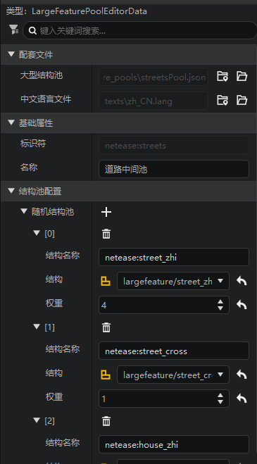

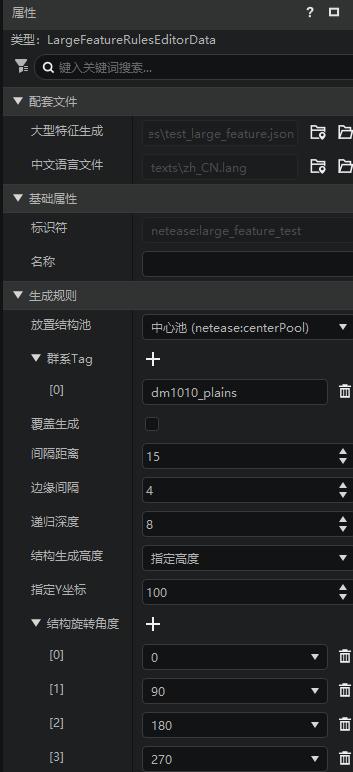


10. 运行游戏，进入对应的维度和群系，查看结构生成效果


11. 为了方便开发者调试，地图编辑器在地形工具内新增了大型结构工具，用于快速放置结构池的结构，便于开发者快速验证自己的配置效果，详情可以参考[大型结构工具](../../../14-地图制作/7-地形工具.md#_8大型结构)。


### 1-4.自定义大型结构配置相关

#### 1-4-1.文件结构

- behavior_back
  - netease_large_feature_pools（结构池配置）
    - xxx_pools.json
    - ...
  - netease_large_feature_rules（大型结构生成规则配置）
    - xxx_feature_rules.json
    - ...
  - structures
    - test(文件夹名称)
      - xxx.mcstructure
      - ...
    - ....

#### 1-4-2.结构池配置<span id = "1-4-2.结构池配置"></span>

简介：结构池主要用于存储结构，在需要时可以根据权重从池子中选出合适的结构进行拼接

举例：原版村庄中不同位置也会有类似池子，比如房屋池，中心点池，道路池等等，主要用于结构的随机

在behavior_back/netease_large_feature_pools文件夹下创建xxx.json文件（xxx为文件名）

```json
{
    "format_version": "1.18.0",
    "netease:large_feature_pool": {
        "description": {
            "identifier": "netease:centerPool" //结构池的identifier,用于拼图方块中目标池的填写（必填）
        },
        "pool": [
            { //结构池配置
            	"structure_name": "netease:house_t_center", //结构名称（必填）
            	"path": "test:house_t", //结构的路径（必填）
            	"weight": 1, //结构的随机权重（必填）
            	"match_terrain" : false //此结构是否贴地面，类似村庄的道路（选填，默认值为false）（如为true，则大型结构特征生成规则中height必须为"variable.height"才可生效）
            },
            {
                ...
            }
        ],
        "end_pool":"minecraft:empty" //终结池的identifier，当大型结构递归到最大深度时，将从终结池中选取结构进行拼接，例如村庄道路的尽头（选填，默认值为"minecraft:empty"）
    }
}
```

> 开发者可以在编辑器中创建和编辑结构池配置，如下图：

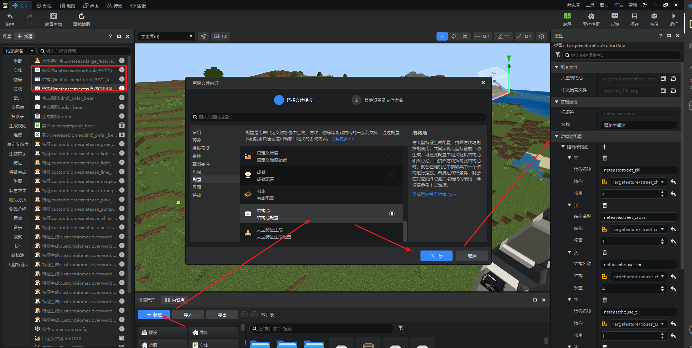


#### 1-4-3.大型结构特征生成规则配置：

简介：大型结构特征生成规则配置主要用于规定大型结构的初始摆放位置

举例：原版村庄生成时候先生成村庄中心，根据中心向四周伸展生成道路以及其他房屋等，此配置可理解为村庄中心摆放规则

```json
{
  "format_version": "1.14.0",
  "netease:large_feature_rules": {
    "description": {
      "identifier": "netease:large_feature_test", //大型结构摆放规则identifier（必填）
      "place_pool": "netease:centerPool" //结构池的identifier（必填）
    },
    "allowed_biomes":[ //允许产生的群系(群系的tag)（必填）
      "plains",
      "desert",
      "ocean"
    ],
    "town_spacing":8, //间隔距离：比如8，则 8 * 8个区块的正方形内，选择一个点摆放（必填）
    "min_town_separation":1, //距离边缘距离：比如1，则在8 * 8个区块的正方形内圈出6 * 6的正方形，并在正方形内部选取一个点进行摆放（必填）
    "max_depth": 8, //递归深度越多，生成的结构越多，比如村庄的道路，调高之后，村庄道路变长（必填）
    "height" : 100,  //中心结构的生成高度（选填，默认值为"variable.height"）
    "ignore_fit_in_context" : false, //允许生成过结构的地方是否可以继续生成结构（选填，默认值为false）
    "center_pool_rotation" : [0] //允许中心结构旋转的角度（数组内数字仅支持0、90、180、270）（选填，默认值为[0, 90, 180, 270]）
  }
}
```


"height"中可使用以下variable属性：

| 变量            | 解释                        |
| --------------- | --------------------------- |
| variable.worldx | 实际位置的x轴的实际坐标     |
| variable.worldz | 实际位置的z轴的实际坐标     |
| variable.height | 实际位置最高非空气方块y坐标 |

**注：2.9版本后大型结构支持在末地和下界摆放，在下界中，variable.height是一个固定值128（最高非空气方块）**


"height"中可使用以下query属性：

| 变量        | 解释                                                         |
| ----------- | ------------------------------------------------------------ |
| query.noise | 用于产生伪随机数，传入两个数，返回一个 -1~1 之间的浮点数。当传入的两个参数相同时，query.noise得到的结果也相同。 |

> 开发者可以在编辑器中创建和编辑大型特征生成规则配置，如下图：

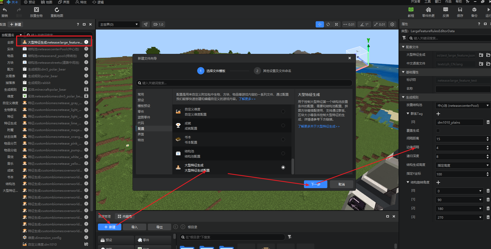


## 2.demo解释

- dm1010维度

  - 使用大型结构特征规则在高度100生成许多大型结构

    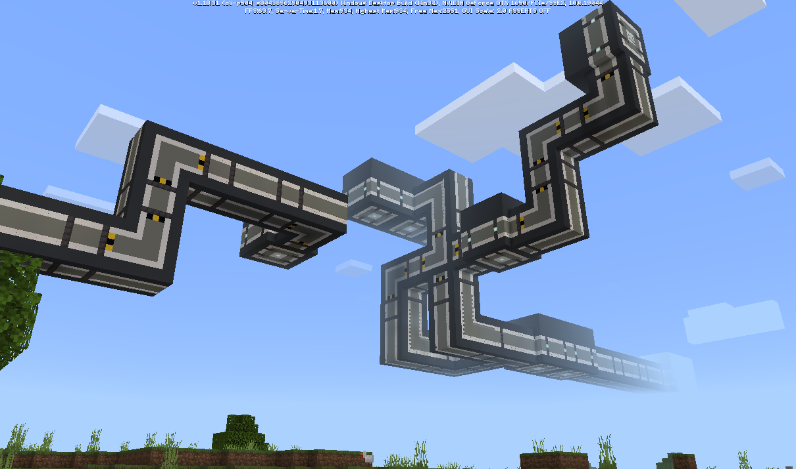

  - demo获取途径：内容库→作品模板→搜索**自定义地形特征**

    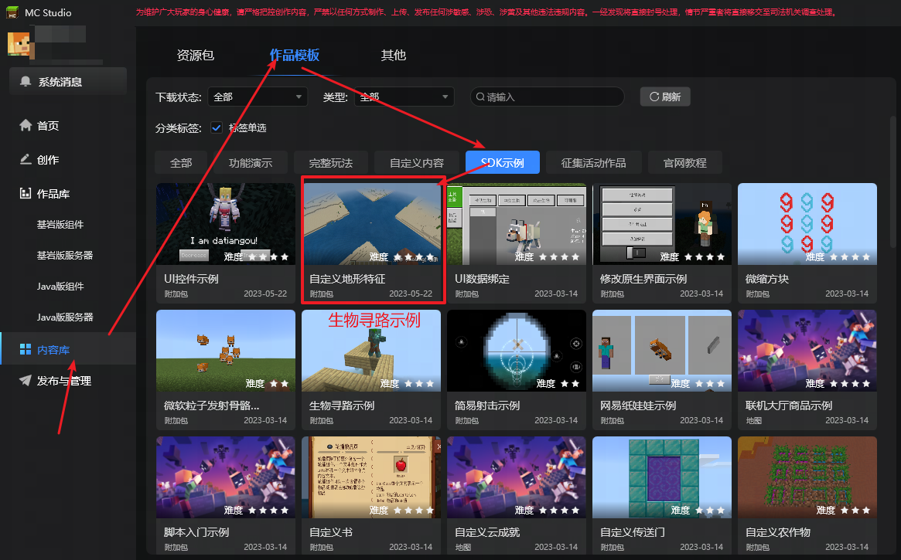


## 3.参考

拼图方块Wiki：[https://zh.minecraft.wiki/w/%E6%8B%BC%E5%9B%BE%E6%96%B9%E5%9D%97](https://zh.minecraft.wiki/w/%E6%8B%BC%E5%9B%BE%E6%96%B9%E5%9D%97)


## 4.常见问题or报错

1.This code should only be executed on the main or server thread

原因：一般情况下是结构(structure)中使用了命令方块，并且命令方块中使用一些fill，replace等对区块操作的指令，因为类似前面这些指令只能对已经加载完成的区块进行操作，而大型结构加载时，区块并未加载完全，所以出现此Assert

建议：开发者可在结构中放置BlockEntity，并在脚本中监听tick事件，当玩家靠近时，完成类似命令方块中的操作即可

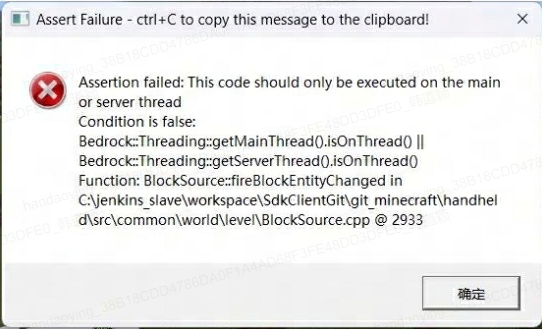


2.当使用**ignore_fit_in_context**字段并使用拼图方块在一个结构的内部生成另外一个结构时，可能会出现内部结构缺失的问题

正常情况如下图（中间钻石地板通过房子内拼图方块生成）：

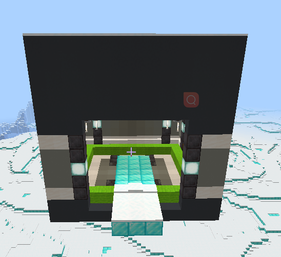

异常情况（房子内的钻石地板被裁剪掉了）：

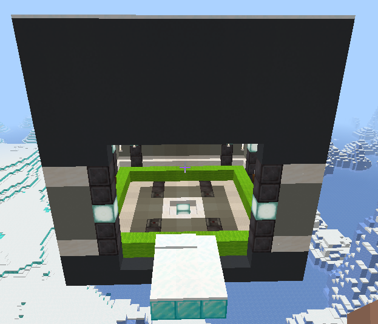


出现此问题的原因是，Minecraft区块加载顺序是不固定的，当大型结构生成时候，会判断结构的生成范围是否与这个区块有交集，如果有，则执行一遍完整的结构摆放，可能出现两种情况：

1.假设房子和内部钻石地板都没有跨区块，先生成房子，再生成钻石地板，这样是正常的

2.假设房子跨区块，但是钻石地板没有跨区块，并且钻石地板所在区块优先生成时，后续和房子有交集但和钻石地板没交集的区块会再执行一遍房子的摆放逻辑，所以就会将原来的钻石地板给裁剪，造成了异常

解决方案：

1.可以考虑加大内部结构导出时候的Size，即导出时候框选的大小，至少让这个size比外面房子的要大，即可解决被裁剪的问题

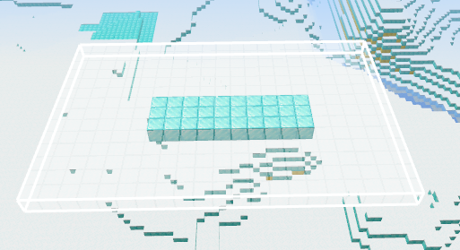

2.但是将内部结构Size调大，会导出许多空气，导致生成时外部房子被裁剪，可以考虑将空气替换为结构空位来解决

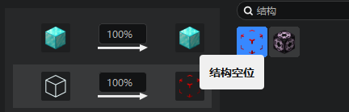


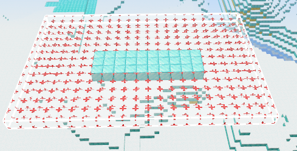

