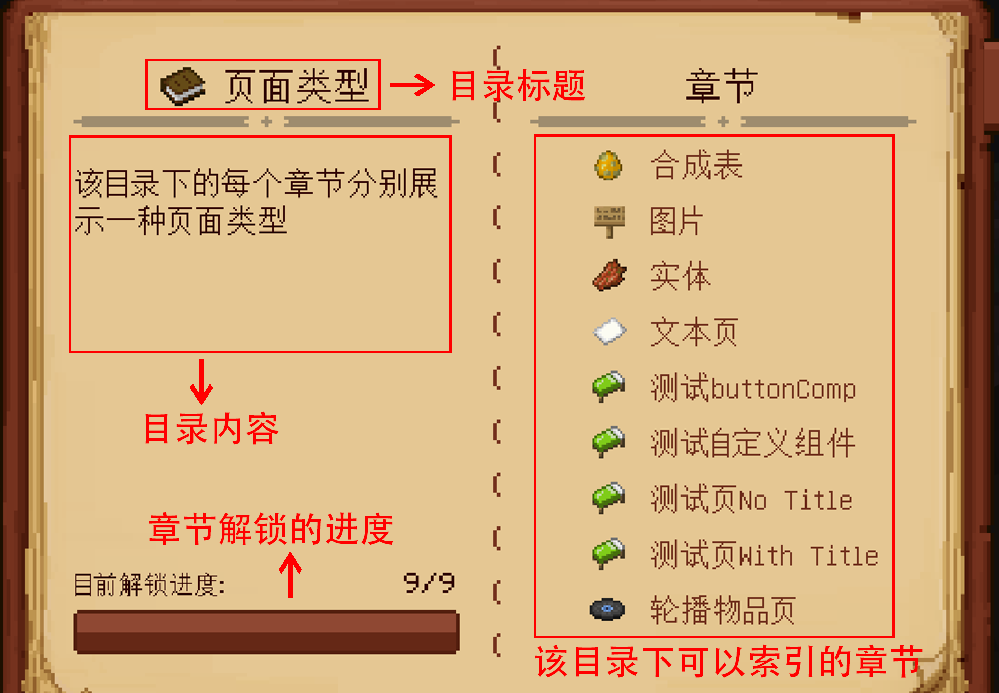
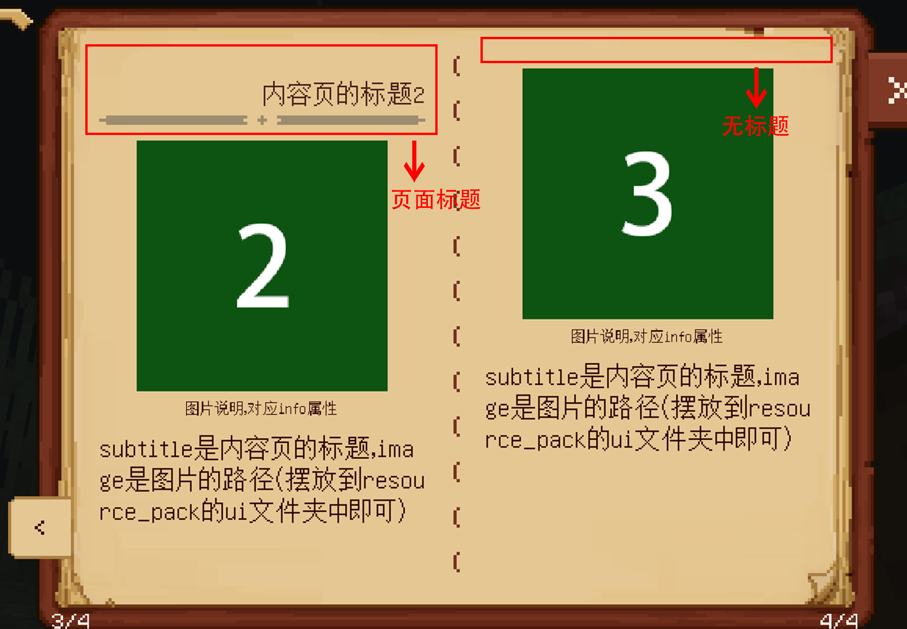
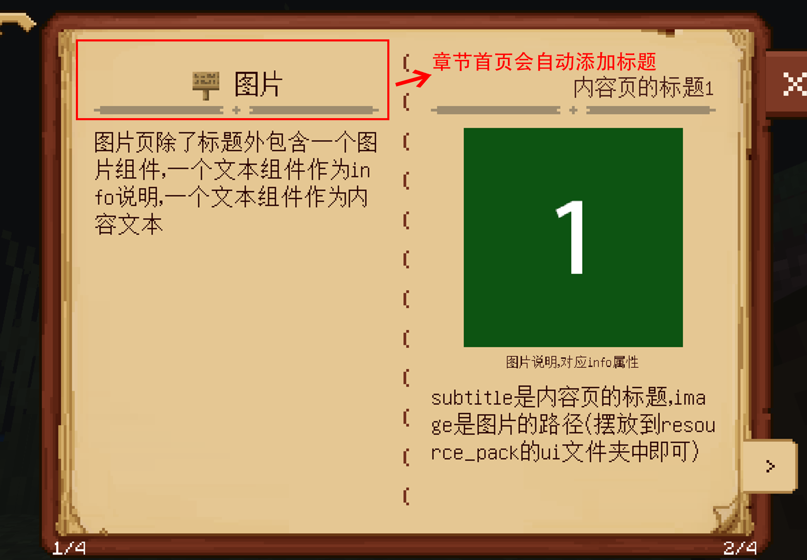
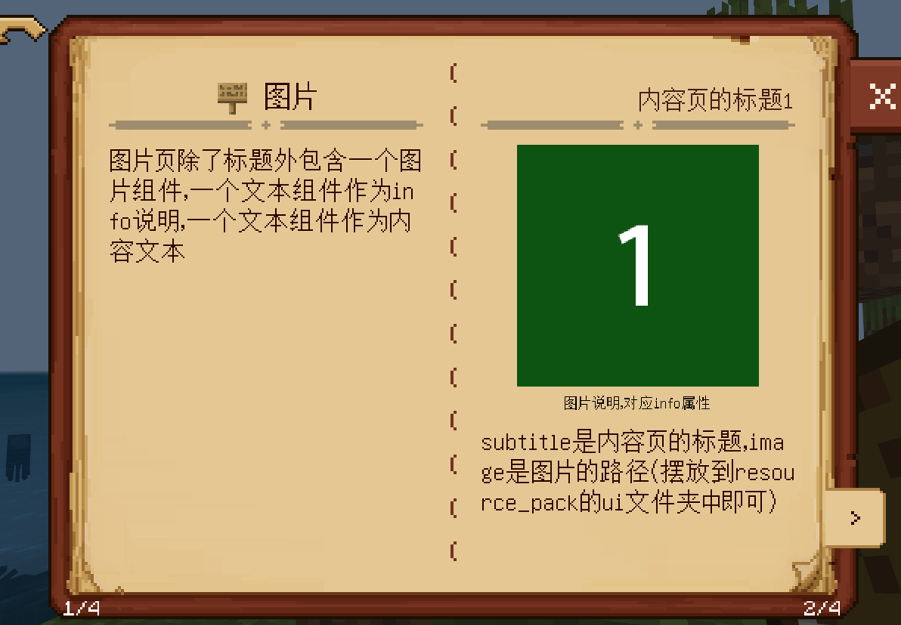

---
front:
hard: 入门
time: 分钟
sidebarDepth: 4
---

# 自定义基础书本

## 1.概述

书本作为一种物品，主要是供玩家浏览信息，基于自定义书本，你可以提供一个书本界面给玩家，可以让玩家用翻书本的方式获取知识。

开发者需要先在行为包和资源包的“**netease_items_res**”目录下，配置自定义书本这个自定义物品，详见[自定义基础物品](../1-自定义物品/1-自定义基础物品.md)。

然后通过在“**behavior_pack/customBooks**”中配置json来添加自定义书本，可以通过编写脚本拓展书本样式、功能，添加的书本支持”**MOD SDK文档**“中与书本相关的所有事件和接口。

下面将通过定义一本名叫”**customBook**“的书本来展现如何定义一本自定义书本。（详见示例[CustomBookMod](../../13-模组SDK编程/60-Demo示例.md#CustomBookMod)）。


## 2.json配置书本

### 1.创建书本

一本书本对应一个文件夹，我们必须在“**behavior_pack/customBooks**”这一目录下创建该书本的文件夹”**customBook**“，然后在”**customBook**“文件夹中创建文件”**book.json**“以及空文件夹”**category**“，**”entry“**，完整的目录结构如下：

```
| customBook（文件夹，名字可自定义）
	| book.json（文件名字固定）
	| category（文件夹，名字固定）
	| entry（文件夹，名字固定）
```

”**category**“存放的是书本中所有目录的信息，”**entry**“存放的是书本中所有章节的信息，这两个文件夹后面会具体展开，而”**book.json**“描述的是书本的基础信息。

类似资源标识符，每个书本实际上都有自己的<span id="目录identifier">**identifier**</span><span id="书本identifier"></span>，即对应的**文件夹**名称，本次示例的为"**customBook**"。

### 2.编写json

我们将一本完整的书本分为三个索引层级：书本，目录，章节。章节是最基础的层级，它包含最基础的内容页，而目录比章节高一个层级，它包含多个章节，书本则是包含多个目录，比如你要索引到书本中含有介绍蔬菜水果的那一页，需要到目录“页面类型”，然后索引章节“轮播物品页”，第二页就是你的目标页。


<center>先是找到customBook这一物品（本地名称为“测试自定义书本”），然后使用物品打开界面，按照层级一层一层索引到目标</center>

#### 1.book.json编写

”**book.json**“包含两部分的信息，一个是指明使用何种物品可以打开书本界面，一个是描述书本首页的排版信息，编写”**book.json**“如下：

```
{
    "item": "custombooks:test0",
    "title1": "自定义书本的一级标题",
    "title2": "自定义书本的二级标题",
    "content": "第一页为书本首页，第二页为书本目录显示页。\n如果把一本书本比作一个大文件夹，\n那么\"目录\"就是它里面的子文件夹，\n\"章节\"就是\"目录\"的子文件夹。",
    "titleArea":{
        "offset": [-10,0],
        "textSize1": 9,
        "textSize2":8,
        "padding": 1
    },
    "pageConfig": {
        "subtitle":"默认的副标题"
    }

}
```


<center>书本首页的结构</center>

| <div style="width:100px">属性</div> | 解释                                                         |
| :---------------------------------: | ------------------------------------------------------------ |
|                item                 | 书本对应的物品的**identifier**。                             |
|               title1                | 书本首页的主标题文本内容，默认值为""。                                   |
|               title2                | 书本首页的副标题文本内容，默认值为""。                                   |
|              titleArea              | 书本首页主标题和副标题的排版属性，该值可以不写，默认值为所有子属性的默认值。下面为子属性的介绍：<br>offset：主标题和副标题的整体相对于默认位置的整体偏移（坐标参见[“自定义书本UI坐标系”](#页面编写)），默认值为[-10, 0]。<br>textSize1：主标题的字体大小，默认值为9。 <br>textSize2：副标题的字体大小，默认值为8。 <br>padding：两个标题之间的垂直间隔，默认值为1。 |
|               content               | 书本首页内容文本，默认值为""，文本框的高度为100px，如果文本内容过多将不显示超出的部分文字。 |
|           contentTextSize           | 书本首页内容文本的字体大小。<br>该属性系统默认值为**BookConfig.TextSize.content**，数值为**10**（整型），可以不写。 |
|             pageConfig              | 页面的配置默认值，用**object**表示，页面中的属性默认值继承这里所定义的属性值。<br>该属性无默认值，如果不写该属性，则页面中的属性默认值继承系统默认值。<br>关于系统默认值以及配置默认值的区别请见下文备注。 |
|           categoryConfig            | 目录的配置默认值，用**object**表示，目录中的默认值继承这里所定义的属性值。<br/>该属性无默认值，如果不写该属性，则目录中的属性默认值继承系统默认值。<br/>关于系统默认值以及配置默认值的区别请见下文备注。 |
|             entryConfig             | 章节的配置默认值，用**object**表示，章节中的默认值继承这里所定义的属性值。<br/>该属性无默认值，如果不写该属性，则章节中的属性默认值继承系统默认值。<br/>关于系统默认值以及配置默认值的区别请见下文备注。 |

备注：

1. 关于系统默认值以及配置默认值的区别，**请在阅读此处前先对[目录编写](#目录编写)，[章节编写](#章节编写)，[页面编写](#页面编写)有一定的了解**。在编写目录以及章节，页面的属性时，部分携带默认值的属性，使用默认值的时候会优先使用配置默认值，如果没有配置默认值就会使用系统默认值，请不要在配置默认值里面配置不携带默认值的属性，否则会产生意想不到的问题。

   我们以一个用例说明，我们希望所有的目录首页中的文本内容字体大小（属性名为"**contentTextSize**"）默认都是12px，所有页面的文本内容字体大小（属性名为"**contentTextSize**"）默认为8px（章节的首页是用户自定义的一个页面，并不一定含有"**contentTextSize**"属性），则可以这样编写：

   book.json

   ```python
   {
       "item": "custombooks:test0",
       "title1": "自定义书本的一级标题",
       "title2": "自定义书本的二级标题",
       "content": "第一页为书本首页，第二页为书本目录显示页。\n如果把一本书本比作一个大文件夹，\n那么\"目录\"就是它里面的子文件夹，\n\"章节\"就是\"目录\"的子文件夹。",
       "titleArea":{
           "offset": [-10,0],
           "textSize1": 9,
           "textSize2":8,
           "padding": 1
       },
       "categoryConfig":{
           "contentTextSize": 12
       },
       "pageConfig":{
           "contentTextSize": 8
       }
   }
   ```

   这些默认值我们称为配置默认值，如果目录json文件，章节json文件中均无对"**contentTextSize**"属性定义，则取这里的默认值。而如果book.json中没有定义"categoryConfig"，"entryConfig"，"pageConfig"，则它们的属性值取系统默认值。

2. 因为支持富文本，如果你想修改文字样式，可以通过[格式化代码](https://zh.minecraft.wiki/w/%E6%A0%BC%E5%BC%8F%E5%8C%96%E4%BB%A3%E7%A0%81)来修改。

3. 所有的文本都遵循UI控件中的Label控件规范，具体见[UI说明文档-Label](../../../18-界面与交互/30-UI说明文档.md#label)。

#### 2.目录的编写<span id="目录编写"></span>

目录的json文件都定义在“**category**”文件夹中，主要描述该目录首页的信息，比如其中的”**pages.json**“，需注意，目录中的章节信息并不是存在目录json文件中，而是章节json文件指向该目录，后续“[章节的编写](#章节编写)”会具体说明。

每个目录实际上都有自己的<span id="目录identifier">**identifier**</span>，即对应的**json**文件名称（去除后缀），比如目录文件”**pages.json**“的**identifier**就是"**pages**"。

```python
{
    "title": "页面类型",
    "content": "该目录下的每个章节分别展示一种页面类型",
    "isLocked": false
}
```



<center>目录"页面类型"的首页</center>

属性说明：

| <div style="width:100px">属性</div> | 解释                                                         |
| :---------------------------------: | ------------------------------------------------------------ |
|                title                | 目录首页的标题文本。                                         |
|               content               | 目录首页内容文本，默认值为""，文本框的高度为100px，如果文本内容过多将不显示超出的部分文字。 |
|           contentTextSize           | 目录首页内容文本的字体大小。<br>该属性系统默认值为**BookConfig.TextSize.content**，数值为**10**（整型），可以不写。 |
|                icon                 | 目录在书本首页中显示的图标以及目录首页中的标题图标，这里写的是路径字符串，比如要索引”**resource_pack/textures/items/apple.png**“这一图片 就写地址 ”**textures/items/apple**“。<br>该属性系统默认值为 **BookConfig.Images.categoryDefaultIcon** （详见[书本配置](05-常用脚本对象.md#书本配置)），可以不写。 |
|              isLocked               | 目录是否被锁住，如果为 true，该目录变成上锁状态，用户无法查看到该目录下的内容。<br>该属性系统默认值为 false，可以不写。 |
|              lockIcon               | 目录上锁状态下的锁图标路径，格式和icon属性相同。<br>该属性系统默认值为 **BookConfig.Images.lockBtn_dark**（详见[书本配置](05-常用脚本对象.md#书本配置)，如果在**book.json**中定义了**categoryConfig**，则默认值为**categoryConfig**的**lockIcon**值），可以不写。 |
|               lockMsg               | 目录上锁状态下在书本首页中被点击显示的消息。<br>如果该属性的值为""，则将不显示该消息，而是显示该目录的标题。<br>该属性系统默认值为""，可以不写。 |
|               parent                | 目录的父目录json文件名称。<br>该属性有系统默认值，如果不写该属性，则默认的父目录为书本，即目录成为一级目录。 |
|               sortnum               | 目录的排列优先级，用**int**类型数值表示，数字越小表示优先级越高，则排列在更前面。<br>该属性没有默认值，如果不写该属性，则该目录的优先级最低（多个无**sortnum**属性的目录排列按照目录标题文本字符串排序）。 |

下面的图片对属性“**icon**”，“**lockIcon**”，“**lockMsg**”进行补充。


<center>目录"页面类型"在书本首页的图标，对应“icon”属性</center><br>


<center>目录在上锁状态下的锁图标，对应"lockIcon"属性，这里显示的是默认图标</center><br>


<center>目录在上锁状态下的提示消息文本，对应"lockMsg"属性。</center>

<span id="目录嵌套">属性“**parent**”的用法可以参见**demo**中的”**subcategoryTest.json**“和 其对应的两个子目录”**subcategory1.json**“以及”**subcategory2.json**“，目录这一层级是支持多层嵌套的，你可以定义一级，二级，三级，四级乃至五级的子目录。</span>但是需要注意一点，书本系统不支持**目录与章节同层级**，比如一个**子目录**的“**parent**”为”**subcategoryTest**“，而有一个**章节**的“**parent**”也为”**subcategoryTest**“，此时会造成冲突报错。

#### 3.章节的编写<span id="章节编写"></span>

章节的json文件都定义在“**entry**”文件夹中，我们以最简单的”**imageEntry.json**“为例说明，该章节共有4页，第一页总体介绍，后三页展示的是图片以及对应的内容。

和目录类似，每个章节都有自己的<span id="章节identifier">**identifier**</span>，即对应的**json**文件名称（去除后缀），比如章节文件”**imageEntry.json**“的**identifier**就是"**imageEntry**"。

```
{
    "parent": "pages",
    "icon": "textures/items/sign",
    "title": "图片",
    "pages":[
        {
            "type": "textPage",
            "content": "该章节为图片页\n\"imagePage\"的介绍"
        },
        {
            "type": "imagePage",
            "subtitle": "内容页的标题1",
            "content": "subtitle是内容页的标题，image是图片的路径（摆放到resource_pack的ui文件夹中即可）",
            "image": "textures/ui/myCustomBook/testImage_1",
            "info": "图片说明，对应info属性"
        },
        {
            "type": "imagePage",
            "subtitle": "内容页的标题2",
            "content": "subtitle是内容页的标题，image是图片的路径（摆放到resource_pack的ui文件夹中即可）",
            "image": "textures/ui/myCustomBook/testImage_2",
            "info": "图片说明，对应info属性"
        },
        {
            "type": "imagePage",
            "subtitle": "内容页的标题3",
            "content": "subtitle是内容页的标题，image是图片的路径（摆放到resource_pack的ui文件夹中即可）",
            "image": "textures/ui/myCustomBook/testImage_3",
            "info": "图片说明，对应info属性"
        }
    ]
}
```


<center>章节"图片"在目录"页面类型"的首页的图标以及标题，对应"icon"属性和"title"属性</center>


<center>章节"图片"的前两页。</center>

属性说明：

| <div style="width:100px">属性</div> | 解释                                                         |
| :---------------------------------: | ------------------------------------------------------------ |
|                title                | 章节的标题文本。                                             |
|                icon                 | 章节在目录首页中显示的图标以及目录首页中的标题图标，这里写的是路径字符串，比如要索引”**resource_pack/textures/ui/apple.png**“这一图片 就写地址 ”**textures/items/apple**“。<br>该属性系统默认值为  **BookConfig.Images.categoryDefaultIcon** （详见[书本配置](05-常用脚本对象.md#书本配置)），可以不写。 |
|              isLocked               | 章节是否被锁住，如果为 true，该章节变成上锁状态，用户无法查看到该章节下的内容。<br>该属性系统默认值为 false，可以不写。 |
|              lockIcon               | 章节上锁状态下的锁图标路径，格式和icon属性相同。<br>该属性系统默认值为**BookConfig.Images.lockBtn_dark**（详见[书本配置](05-常用脚本对象.md#书本配置)），可以不写。 |
|               lockMsg               | 章节上锁状态下在目录首页中被点击显示的消息。<br>如果该属性的值为""，则将不显示该消息，而是显示该章节的标题。<br/>该属性系统默认值为""，可以不写。 |
|               parent                | 该章节所属目录的json文件名。<br>该属性无默认值，必须写。     |
|                pages                | 该章节下的所有页面，详见页面类型介绍                         |
|               sortnum               | 章节的排列优先级，用**int**类型数值表示，数字越小表示优先级越高，则排列在更前面。<br>该属性没有默认值，如果不写该属性，则该章节的优先级最低（多个无**sortnum**属性的章节排列按照章节标题文本字符串排序）。 |

### 3.浏览历史记录<span id="浏览历史记录"></span>

历史记录的入口位于书本首页的历史按钮中，历史记录中显示的是用户所浏览过的所有章节，并按照浏览先后顺序排序（最近浏览的排列在前），用户可以点击列表中的章节进行页面跳转。


### 4.预设页面类型<span id="页面编写"></span>

#### 1.书本界面坐标系，界面大小，页面共同属性

目前提供的页面类型共5种，先介绍下书本的UI布局坐标系，它遵循常规的图像坐标系，原点位于书本界面左上角，所有的偏移属性方向都按照这个坐标系，如下图所示，**书本界面大小默认为（268, 200）**，单位为像素，然后是每种页面的共同属性。而<span id="全局坐标系">**全局坐标系**</span>实际上就是屏幕坐标系，二者区别详见下图。


<center>UI布局坐标系。</center>


<center>全局坐标系。</center>

页面的共同属性：

| <div style="width:100px">属性</div> | 解释                                                         |
| :---------------------------------: | ------------------------------------------------------------ |
|                type                 | 页面的类型，可选的值为："textPage"，"highlightPage"，"imagePage"，"entityPage"，"tableRecipePage"，开发者可以通过编写python类来自定义更多的类型，详见[python编写部分](02-脚本自定义书本.md#脚本自定义组件)。 |
|              subtitle               | 页面的标题文本，如果不写该属性，则无标题，内容直接置顶。     |



<center>左边的页面是带有标题的，右边的页面不带标题。</center>

对于一个章节的首页，一般不定义"**subtitle**"属性，因为会默认给该页添加一个主标题（就是章节的标题）。



#### 2.文本页

文本页在json文件中的type属性值为 "**textPage**"，示例在**behavior_pack/customBooks/entry/textEntry.json**。


| <div style="width:100px">属性</div> | 解释                                                         |
| :---------------------------------: | ------------------------------------------------------------ |
|               content               | 内容文本，默认值为""，支持格式化文本。文本框大小会自动适应页面，如果文本内容过多将不显示超出页面的文字。 |
|           contentTextSize           | 内容文本的字体大小。<br>该属性系统默认值为**BookConfig.TextSize.content**，数值为**10**（整型），可以不写。 |

#### 3.图片页

图片页在json文件中的type属性值为 "**imagePage**"，示例在**behavior_pack/customBooks/entry/imageEntry.json**。



| <div style="width:100px">属性</div> | 解释                                                         |
| :---------------------------------: | ------------------------------------------------------------ |
|                image                | 图片路径，开发者需要先把图片放到resource_pack中，比如要索引"**resource_pack/textures/ui/myCustomBook/testImage_1.png**"这一图片就写地址 "**textures/ui/myCustomBook/testImage_1**"。 |
|              imageSize              | 图片的大小，用二维浮点数组表示。<br>该属性系统默认值为 [80.0, 80.0]，可以不写。 |
|                info                 | 图片的备注文本，显示在图片的下方。如果不写该属性，则无备注，内容文本会自动往上对齐。 |
|               content               | 内容文本，默认值为""，支持格式化文本。文本框大小会自动适应页面，如果文本内容过多将不显示超出页面的文字。 |
|           contentTextSize           | 内容文本的字体大小。<br>该属性系统默认值为**BookConfig.TextSize.content**，数值为**10**（整型），可以不写。 |

#### 4.轮播物品页

轮播物品页在json文件中的type属性值为 "**highlightPage**"，示例在**behavior_pack/customBooks/entry/highlightEntry.json**。


点击当前轮播的物品能显示其物品本地名称。

| <div style="width:100px">属性</div> | 解释                                                         |
| :---------------------------------: | ------------------------------------------------------------ |
|              itemData               | 需要轮播的所有物品数据，用数组表示，存储要轮播的每个物品的信息，见下面的表格。 |
|              itemSize               | 物品显示的大小，用二维浮点数组表示。<br/>该属性系统默认值为 [30.0, 30.0]，可以不写。 |
|                info                 | 轮播物品的备注文本，显示在物品的下方。如果不写该属性，则无备注，内容文本会自动往上对齐。 |
|               content               | 内容文本，默认值为""，支持格式化文本。文本框大小会自动适应页面，如果文本内容过多将不显示超出页面的文字。 |
|           contentTextSize           | 内容文本的字体大小。<br>该属性系统默认值为**BookConfig.TextSize.content**，数值为**10**（整型），可以不写。 |

每个物品的信息：

| <div style="width:100px">属性</div> | 解释                                                         |
| :---------------------------------: | ------------------------------------------------------------ |
|                item                 | 物品的**identifier**，比如MC中的苹果，则该属性写为: "**minecraft:apple**"，支持[自定义物品](../1-自定义物品/1-自定义基础物品.md) |
|                data                 | 物品的附加值**AuxValue**，该属性可以不写，系统默认值为0（整型）。 |

#### 5.工作台合成表页

工作台合成表页在json文件中的type属性值为 "tableRecipePage"，示例在**behavior_pack/customBooks/entry/tableRecipeEntry.json**。


| <div style="width:100px">属性</div> | 解释                                                         |
| :---------------------------------: | ------------------------------------------------------------ |
|              recipeId               | 合成配方的ID，一般为合成的物品的**identifier**，支持[自定义配方](../5-自定义配方.md) |
|             recipeSize              | 合成表显示的大小，用二维浮点数组表示。<br/>该属性系统默认值为 [90.0, 48.0]，可以不写。 |
|                 aux                 | 合成物品的附加值**AuxValue**，该属性可以不写，系统默认值为0（整型）。 |
|                info                 | 合成物品的备注文本，显示在物品的下方。如果不写该属性，则无备注，内容文本会自动往上对齐。 |
|               content               | 内容文本，默认值为""，支持格式化文本。文本框大小会自动适应页面，如果文本内容过多将不显示超出页面的文字。 |
|           contentTextSize           | 内容文本的字体大小。<br>该属性系统默认值为**BookConfig.TextSize.content**，数值为**10**（整型），可以不写。 |

#### 6.实体页

实体页在json文件中的type属性值为 "**entityPage**"，展示的实体会**自动顺时针旋转**，示例在**behavior_pack/customBooks/entry/entityEntry.json**。


| <div style="width:100px">属性</div> | 解释                                                         |
| :---------------------------------: | ------------------------------------------------------------ |
|               entity                | 包含要展示的实体的信息，详细见下方表格                       |
|             entitySize              | 实体显示的大小，用二维浮点数组表示。<br/>该属性系统默认值为 [100.0, 100.0]，可以不写。 |
|                info                 | 展示的实体的备注文本，显示在实体的下方。如果不写该属性，则无备注，内容文本会自动往上对齐。 |
|               content               | 内容文本，默认值为""，支持格式化文本。文本框大小会自动适应页面，如果文本内容过多将不显示超出页面的文字。 |
|           contentTextSize           | 内容文本的字体大小。<br>该属性系统默认值为**BookConfig.TextSize.content**，数值为**10**（整型），可以不写。 |

entity包含的属性：

| <div style="width:100px">属性</div> | 解释                                                         |
| :---------------------------------: | ------------------------------------------------------------ |
|                name                 | 实体的**identifier**，比如这里的猫是 "**minecraft:cat**"，支持[自定义生物](../3-自定义生物/01-自定义基础生物.md) |
|               offset                | 显示的实体相对于外边框的偏移，用于微调，用二维浮点数组表示，该属性必须填写，无偏移则填写[0, 0] |
|             molang_dict             | molang表达式字典                                             |

## 3.Demo说明

示例Demo（[CustomBookMod](../../13-模组SDK编程/60-Demo示例.md#CustomBookMod)）中包含了三本书本，对应的物品名称为："测试自定义书本"，"链接测试书本"，"回收组件测试书本"。

### 1."测试自定义书本"

- 供开发者预览书本的基础功能，结合本文进行理解。
- “页面类型”这一目录下的“测试页No Title”，“测试页With Title”，这两章节演示的是[如何自定义页面](02-脚本自定义书本.md#脚本自定义页面)
- “页面类型”这一目录下的“测试自定义组件”，这章节演示的是[如何自定义组件](02-脚本自定义书本.md#脚本自定义组件)
- “页面类型”这一目录下的“测试buttonComp”，这章节分别演示的是[点击按钮显示消息](05-常用脚本对象.md#显示消息文本)，[点击按钮进行跳转](05-常用脚本对象.md#页面跳转机制)。
- “目录嵌套测试”这一目录演示的是[目录嵌套](#目录编写)。

### 2."链接测试书本"

- 该书本只有一个章节，演示的是[书本的页面跳转机制](05-常用脚本对象.md#页面跳转机制)。

### 3."回收组件测试书本"

- 该书本只有一个章节，演示的是[自定义组件开启回收时需注意的问题](03-组件API.md#Reset)。

