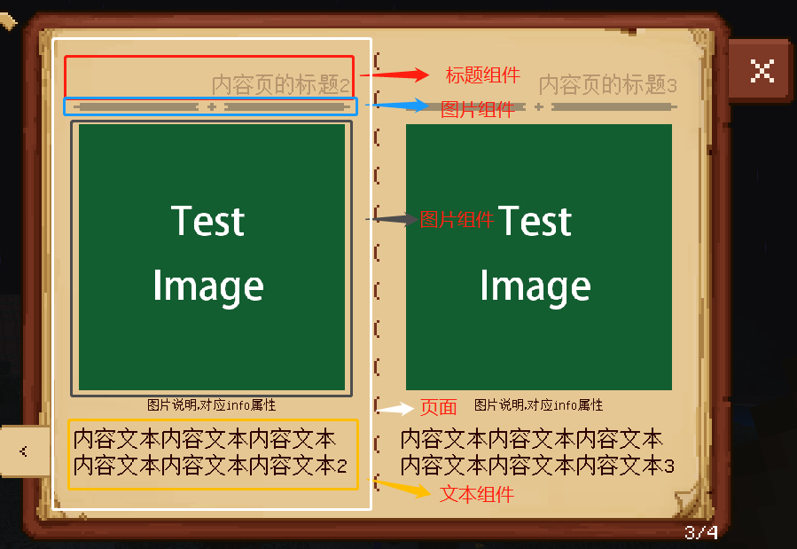
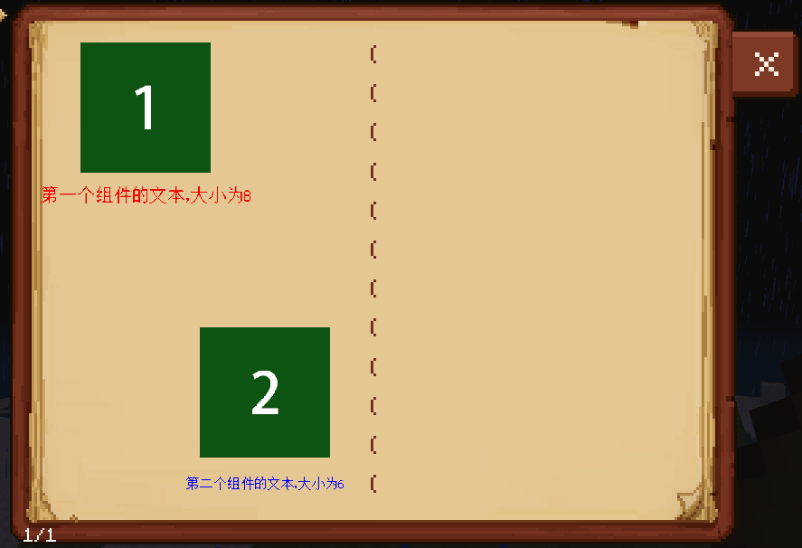
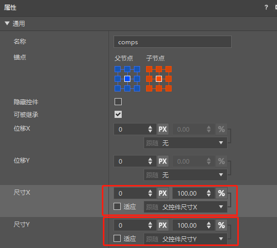
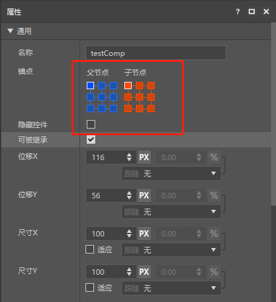

---
front:
hard: 入门
time: 分钟
sidebarDepth: 4
---

# 脚本自定义书本

## 1.概述

书本界面本质上也是个ScreenNode控件，用户可以通过获取UI节点的接口来获取它：
```
import mod.client.extraClientApi as clientApi
# 其中参数 nameSpace = "BookMod"，uiKey = "book_screen.main"
node = clientApi.GetUI("BookMod", "book_screen.main")
print node
```
在自定义书本框架中，一个章节由每一个特定类型的页面组成，而组成一个页面的UI元素我们又称之为组件，下图简单的展示了何为页面，何为组件。



按照功能定义，书本的三个层级“书本”，“目录”，“章节”决定了每一个页的排版（比如双页结构的书本，第1页就会放置在书本的左侧，第2页会放置在书本的右侧）以及每一个页是否能被显示。

页面则相当于组件的容器，对内在的组件按需排版，而组件是实际存放数据和处理显示数据的单位，所谓的数据实际就是开发者定义的书本json文件，经由页面获取后分配给其内置的组件。


<center>以上图的图片页为例子显示数据流向。</center>

## 2.自定义页面<span id="脚本自定义页面"></span>

### 1.创建页面

在预设的页面中（比如图片页，文本页等）普遍含有标题的处理，这里我们先编写个没有标题处理的页面，学习通用的页面是如何编写，其次再做类似预设页面的标题处理，下面以[CustomBookMod](../../13-模组SDK编程/60-Demo示例.md#CustomBookMod)中的页面类型"**MyNoTitlePage**"为例说明。


<center>自定义的一个页面</center>

在编写脚本类之前，我们先将数据定义在”**behavior_pack/customBooks/customBook/entry/noTitlePage.json**“这一文件中，对于一个自定义页面，除了"**type**"属性外，其他属性均可以自定义（由后续编写的脚本类来解析），"**type**"值为要编写的页面的名称（后面注册页面的时候会详述），这里自定义了"**testTitle**"，"**image**"，"**content1**"，"**content2**"四个属性，后面编写类的时候我们将分别用文本组件，图片组件，文本组件，文本组件去存储显示。

myNoTitlePage.json

```
{
    "parent": "pages",
    "icon": "textures/items/bed_lime",
    "title": "测试页No Title",
    "lockMsg": "需解锁固定成就",
    "lockIcon": "textures/ui/book_gui/icon02",
    "isLocked": false,
    "pages":[
        {
            "type": "CustomMod:MyNoTitlePage",
            "testTitle": "标题文本",
            "image": "textures/ui/myCustomBook/testImage",
            "content1": "第一段文本",
            "content2": "第二段文本"
        }
    ]
}
```

在[CustomBookMod](../../13-模组SDK编程/60-Demo示例.md#CustomBookMod)中，与**myNoTitlePage.json**相对应的脚本类是“**behavior_pack/tutorialScripts/pages/noTitlePage.py**”中的**MyNoTitlePage**，一个页面需要编写3个基本的函数接口：

- 类初始化函数 "\_\_init\_\_"
- 获取json传过来的数据的函数"SetData"
- 显示页面的函数"Show"

  这些接口需符合链式调用的格式，最终返回**self**。**MyNoTitlePage**实现的是最基本的页面，所以这里继承是**BasePage**，**BasePage**不包含对标题的预处理，如果需要对标题进行预处理，则需要继承**TitlePage**，后续会再提到该页面。**BasePage**的接口详见 [“页面API”](04-页面API.md)。另外，下面的代码中含有很多预设组件的用法，详细请参考[“组件API”](03-组件API.md)。

myNoTitlePage.py

```python
#-*- coding: UTF-8 -*-

import mod.client.extraClientApi as clientApi
# 获取书本管理对象，详细用法见“05-常见脚本对象”
bookManager = clientApi.GetBookManager()
# 获取书本配置常量，详细API见“05-常见脚本对象”
bcf = bookManager.GetBookConfig()
# 获取页面基类 BasePage
BasePage = bookManager.GetBasePageCls()
# 获取预设组件类 TextComp
TextComp = bookManager.GetTextCompCls()
# 获取预设组件类 ImageComp
ImageComp = bookManager.GetImageCompCls()

class MyNoTitlePage(BasePage):
    """
        自定义的页类
    """
    def __init__(self, size = None, position = None):
        """"
            编写该接口需按照如下编写。
            1. 先调用父类的同名方法。
            2. 定义需要用到的组件。
            3. 调用AddComps接口添加所有组件。
        """
        # 调用父类__init__方法
        BasePage.__init__(self, size, position)

        # 实例化需要用到的组件
        self.testTitle = TextComp(bcf.TextAlign.Fit_Center)  # 使用文本组件存储显示自定义属性"testTitle""
        self.content1 = TextComp(bcf.TextAlign.Left)  # 使用文本组件存储显示自定义属性"content1""
        self.image = ImageComp()  # 使用图片组件存储显示自定义属性"image""
        self.content2 = TextComp(bcf.TextAlign.Left)  # 使用文本组件存储显示自定义属性"content2""

        # 调用AddComps接口添加所有定义了的组件
        self.AddComps(self.testTitle, self.content1, self.image, self.content2)

        # 照应SetData方法
        self.data = None


    def SetData(self, data):
        """
            书本在调用Show之前会调用该方法将json中的数据打包成Dict变量"data"作为参数传进来。
            建议是将数据存储下来然后在Show方法中进行读取。
        """
        # 存储各个组件的数据
        self.data = data
        return self

    def Show(self):
        """
            书本向页面传递数据后调用该接口，这里负责为每个组件填充数据并且排版它们的位置。
            编写该接口需按照如下编写。
            1. 向所有组件注入数据。
            2. 调用父类的同名方法。
            3. 重置所有组件相对于页面的位置。
            4. 对组件进行排版（通过调用组件的排版API，每个API的解释见“03-组件API”）。
        """
        if self.data:
            # 为每个组件注入数据，data中的键值对应json文件中的页面属性值
            self.testTitle.SetDataBeforeShow(self.data["testTitle"], bcf.TextSize.title)
            self.content1.SetDataBeforeShow(self.data["content1"], bcf.TextSize.content)
            self.content2.SetDataBeforeShow(self.data["content2"], bcf.TextSize.content)
            self.image.SetDataBeforeShow(self.data["image"])

            # 执行父类的Show方法，该方法会依次调用会所有组件的Show方法
            BasePage.Show(self)
            # 重置所有组件相对页面的位置，保证每次调用Show的时候组件的排版都是相对于页面的原点
            self.ResetCompsPosition()
            # 获取该页面的中心坐标和大小，方便后面使用
            pageCenter = self.Center()
            pageSize = self.GetSize()

            # 布局自己的组件，组件在调用Align以及Move方法前需要先调用SetSize方法，因为这些方法都是基于GetSize来计算的。
            # testTitle 是Fit类型文本，会根据文本内容来调整自己的大小，无需调用SetSize。将其中心对齐到页面的中心，将其上边界与 页面 的上边界对齐，然后往下移动4px
            self.testTitle.AlignCenterToX(pageCenter[0]).AlignTopToY(self.Top()).MoveY(4)
            # 对 content1 设置大小后，将其左边界对齐到页面的左边界，将其上边界与 testTitle 的下边界对齐，然后往下移动5px
            self.content1.SetSize((pageSize[0], 20)).AlignLeftToX(self.Left()).AlignTopToY(self.testTitle.Bottom()).MoveY(5)
            # 对 image 设置大小后，将其左中心对齐到页面的中心，将其上边界与 content1 的下边界对齐，然后往下移动5px
            self.image.SetSize((80, 80)).AlignCenterToX(pageCenter[0]).AlignTopToY(self.content1.Bottom()).MoveY(5)
            # 对 content2 设置大小后，将其左边界对齐到页面的左边界，将其上边界与 image 的下边界对齐，然后往下移动5px
            self.content2.SetSize((pageSize[0], 40)).AlignLeftToX(self.Left()).AlignTopToY(self.image.Bottom()).MoveY(5)

            return self
        else:
            print "in MyNoTitlePage Show: no data present"
            return self
```

在**MyNoTitlePage**这个页中，其实是包含了简单的文本标题处理（**self.testTitle**这个文本组件），而本书提供了**TitlePage**这个类为开发者省去对标题的处理，详述见 [“页面API”](04-页面API.md)，以及Demo中的“**behavior_pack/customBooks/customBook/entry/myTitlePage.json**”以及“**behavior_pack/tutorialScripts/pages/myTitlePage.py**”。

### 2.注册页面

创建好自定义的页面以及对应的json文件后，需要系统中注册你的自定义页面，使系统在解析json文件的时候能读取到类信息。仅需要在**客户端System**初始化的时候调用注册接口即可，**BookManager**包含了自定义书本的各种接口，详见[BookManager API](05-常用脚本对象.md#BookManager)。因为自定义书本系统中内置了一些常用的页面类型，所以开发者尽量使用规范的名称来命名自己的页面类型，这里建议使用固定格式"**Mod名称:页面类型名称**"，其中页面类型名称建议就和定义的类名是一致的（类名后置如果带上“**page**”会更加有辨识度），比如上面的则**MyNoTitlePage**可以命名为"**CustomMod:MyNoTitlePage**"，这个自定义的页面类型名称，是用于**json**数据中对应的**type**字段属性值。

```python
# -*- coding: utf-8 -*-

# 获取客户端引擎API模块
import mod.client.extraClientApi as clientApi
# 获取客户端system的基类ClientSystem
ClientSystem = clientApi.GetClientSystemCls()

# 在modMain中注册的Client System类
class TutorialClientSystem(ClientSystem):

    # 客户端System的初始化函数
    def __init__(self, namespace, systemName):
        # 首先初始化TutorialClientSystem的基类ClientSystem
        super(TutorialClientSystem, self).__init__(namespace, systemName)
        print "==== TutorialClientSystem Init ===="
        # 注册自定义的page
        # 先import定义好的页面类
        from tutorialScripts.pages.myNoTitlePage import MyNoTitlePage
        from tutorialScripts.pages.myTitlePage import MyTitlePage
        from tutorialScripts.pages.customCompPage import MyCustomCompPage
        from tutorialScripts.pages.buttonPage import MyButtonPage
        from tutorialScripts.pages.addrPage import MyAddrPage
        from tutorialScripts.pages.recyclePage import MyRecyclePage
        # 获取书本管理对象，详细用法见“05-常见脚本对象”
        bookManager = clientApi.GetBookManager()
        # 注册自定义的页面类，同时为它们命名，这些名称是在json中使用的
        bookManager.AddPageType("CustomMod:MyNoTitlePage", MyNoTitlePage)
        bookManager.AddPageType("CustomMod:MyTitlePage", MyTitlePage)
        bookManager.AddPageType("CustomMod:MyCustomCompPage", MyCustomCompPage)
        bookManager.AddPageType("CustomMod:MyButtonPage", MyButtonPage)
        bookManager.AddPageType("CustomMod:MyAddrPage", MyAddrPage)
        bookManager.AddPageType("CustomMod:MyRecyclePage", MyRecyclePage)
        print "============== add MyTestPage success =============="


    # 函数名为Destroy才会被调用，在这个System被引擎回收的时候会调这个函数来销毁一些内容
    def Destroy(self):
        pass
```

### 3.如何供其他人使用

其他开发者若想使用你的自定义页面，只需要加载你的MOD，然后在配置自定义书本的json的时候使用你的页面类型名称即可。


## 3.自定义组件（进阶）<span id="脚本自定义组件"></span>

该内容为**进阶向**话题，如果开发者不满足于系统提供的**预设组件**，则可以通过这里学习如何自定义组件。需注意以下两点：

- 在阅读此处前请先掌握[界面与交互](../../../18-界面与交互/2-从零开始创建UI.md)中**MC Studio**的使用以及对各类**UI控件**（**BaseUIControl**）的熟悉，**UI json**文件的编写。

- 目前书本仅支持使用这些控件来封装组件，关于它们的介绍具体见[UI说明文档](../../../18-界面与交互/30-UI说明文档.md)：

  - Label
  - Image
  - Button
  - Panel
  - StackPanel
  - NeteasePaperDoll
  - ItemRenderer
  - ProgressBar

在自定义书系统中，是通过加载**UI json**文件的方式来获取UI控件对象，而获取到的UI控件对象又被封装成组件使用，我们在[CustomBookMod](../../13-模组SDK编程/60-Demo示例.md#CustomBookMod)中定义了一个自定义组件**MyCustomComp**，它的脚本文件为”**behavior_pack/tutorialScripts/comps/customComp.py**“，与该组件相关的UI json文件为”**resource_pack/ui/CustomComp.json**“，并且又自定义了一个页面来使用组件**MyCustomComp**，它的脚本文件为“**behavior_pack/tutorialScripts/pages/customCompPage.py**”，然后我们用一个章节来调用该页面，数据定义在”**behavior_pack/customBooks/customBook/entry/customCompPage.json**“文件中，最终该章节的页面展示结果如下。



<center>该自定义组件可以填充图片，文本，设置文本字体大小，而该页面有两个这样的组件，分别位于左上和右下。</center>

### 1.定义UI json文件<span id="UI模板库"></span>

和[界面与交互](../../../18-界面与交互/2-从零开始创建UI.md)一样， 我们可以通过MC Studio来创建一个组件的UI模板，也可以按照**UI**的**json**文件规范来编写**UI**的**json**文件，在本例中我们使用了MC Studio创建一个名为**testComp**的UI控件，它将作为自定义组件**MyCustomComp**的封装对象，同时，该**UI json**文件需要满足以下的节点结构才能供组件使用，我们将comps下的所有UI控件节点的集合称为组件的**UI模板库**。

需注意！**请不要将该json文件起名为“book_preset.json”**，该名字已被预设模板使用。

```
main （名字固定，必须为"main")
	| comps （panel控件，名字固定，必须为"comps")
		| testComp （组件要使用的UI的根节点，本例中为 testComp，并且该节点的控件类型无规定）
		| ...
```

你可以在**comps**层级下创建多个UI根节点，但是一个根节点只会和一个组件进行绑定。

并且为了让自定义组件坐标系与预设组件坐标系一致，**comps**节点的的大小必须设置如下



对应到**UI json**文件中的属性为 **"size" : [ "100.0%+0.0px", "100.0%+0.0px" ]**

```json
   "comps" : {
      "alpha" : 1.0,
      "anchor_from" : "center",
      "anchor_to" : "center",
      "clip_offset" : [ 0, 0 ],
      "clips_children" : false,
      "controls" : [
         {
            "testComp@CustomComp.testComp" : {}
         }
      ],
      "enabled" : true,
      "layer" : 0,
      "max_size" : [ 0, 0 ],
      "min_size" : [ 0, 0 ],
      "offset" : [ 0, 0 ],
      "priority" : 0,
      "propagate_alpha" : false,
      "size" : [ "100.0%+0.0px", "100.0%+0.0px" ],
      "type" : "panel",
      "visible" : true
   }
```

并且**Comps**下的子节点（比如**testComp**）的锚点坐标系必须设置如下图：



对应到**UI json**文件中的属性为如下：

```json
"anchor_from" : "top_left",
"anchor_to" : "top_left",
```

### 2.创建组件类

类似页面，一个组件类需要编写3个基本的函数接口：

- 类初始化函数 "\_\_init\_\_"

- 将从页面传过来的数据存储下来的方法 "SetDataBeforeShow"

- 显示组件的函数 "Show"

  这些接口需符合链式调用的格式，最终返回**self**。**MyCustomComp**实现的是一个图文控件，可以根据传入的数据更改文本大小，颜色，内容，图片。

  这里继承的父类是**BaseComp**，详细请参考[“组件API”](03-组件API.md)。

customComp.py

```python
#-*- coding: UTF-8 -*-

import mod.client.extraClientApi as clientApi
# 获取书本管理对象，详细用法见“05-常见脚本对象”
bookManager = clientApi.GetBookManager()
# 获取书本配置常量，详细API见“05-常见脚本对象”
bcf = bookManager.GetBookConfig()
# 获取组件基类 BaseComp
BaseComp = bookManager.GetBaseCompCls()

class MyCustomComp(BaseComp):
    """
        自定义的书本组件类
    """
    def __init__(self):
        """
            编写该接口需按照如下编写。
            1. 先调用父类的同名方法。
            2. 定义自定义的属性
        """
        # 调用父类__init__方法，该方法会注册书本自定义组件名称，因此该方法只能调用一次（一个组件绑定一个控件节点）。
        # 第1个参数为组件的注册名称，为了防止重名，建议名字格式为 'mod名称:任意名称'，最好就是带“Comp”后缀。
        # 第2个参数为组件所封装的UI控件所在的json文件名+'.main'
        # 第3个参数为组件所封装的UI控件节点名称
        # 通过第2，3个参数可以让组件定位到所要封装的UI控件节点，更详细的内容可见 "组件API" 章节。
        BaseComp.__init__(self, "CustomMod:MyCustomComp", "CustomComp.main", "testComp")

        # 定义自定义的属性，这些都是向页面暴露的属性
        self.text = None                # 组件的文本字符串，类型为str
        self.textSize = None            # 组件的文本大小，类型为int
        self.textColor = None           # 组件的文本颜色，类型为tuple(4)
        self.image = None               # 组件的图片路径，类型为str


    def SetDataBeforeShow(self, image, text, textColor, textSize):
        """
            页面在调用组件的Show之前默认会先调用该方法进行数据的存储
            建议是将数据存储下来然后在Show方法中进行读取。
        """
        # 存储页面传过来的数据
        self.text = text
        self.textSize = textSize
        self.textColor = textColor
        self.image = image

        return self


    def Show(self):
        """
            页面向组件传递数据后调用该接口，组件在这里对UIControl节点进行操作。
            编写该接口需按照如下编写。
            1. 调用父类的同名方法。
            2. 按照特定逻辑处理你的UIControl节点
        """
        # 执行父类的Show方法，执行该方法后组件才能得到对应的UI控件节点并用_node_属性指向它。
        BaseComp.Show(self)

        # 往UI控件节点填充数据，_node_为组件所对应的UI控件节点（本demo中为 testComp，即__init__方法中的第3个参数）。
        textNode = self.GetRootUINode().GetChildByPath("/text").asLabel()
        # 如果是LabelUIControl节点，设置文本和字体大小时需要分别调用 SetNodeText 和 SetTextFontSize，具体可见 "组件API" 章节。
        self.SetNodeText(textNode, self.text).SetNodeTextFontSize(textNode, 10, self.textSize)
        textNode.SetTextColor(self.textColor)
        imageNode = self.GetRootUINode().GetChildByPath("/image").asImage()
        imageNode.SetSprite(self.image)
        return self
```

本质上组件就是一个带数据的UI控件节点，当组件调用Show的时候，自定义书系统将UI模板中对应的节点拷贝到组件中，所以如果组件没调用Show而调用了它里面的UI控件或者该UI控件下的子节点都是会报错的。

尽管大部分编写的节点都存在拷贝操作，但是可以在初始化节点的时候设置为可回收，防止UI控件节点的过度拷贝和删除，具体可见[“组件API”](03-组件API.md) 章节


