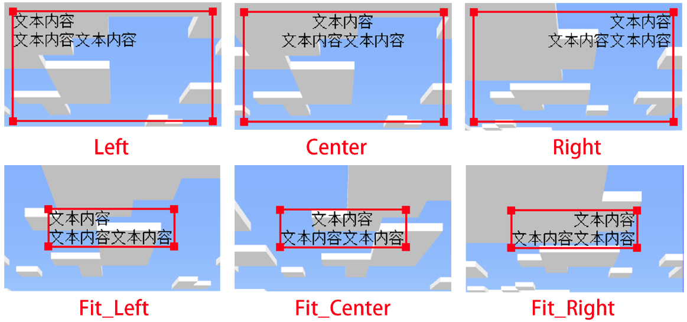
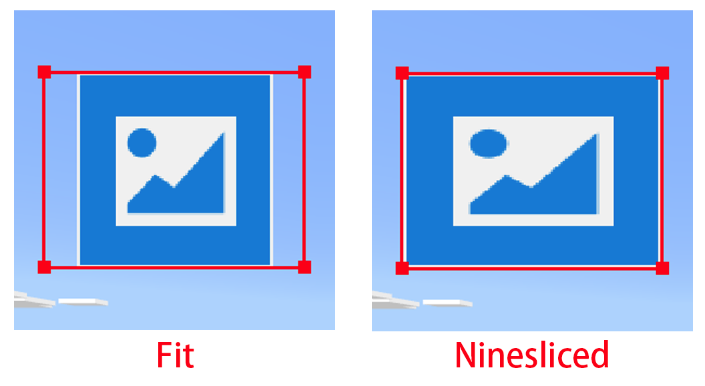
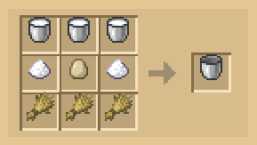
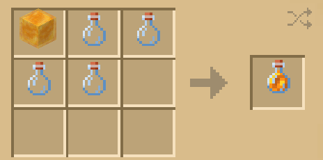

---
front:
hard: 入门
time: 分钟
sidebarDepth: 4
---

# 组件API

## 1.BaseComp

所有书本组件都继承**BaseComp**，本质将数据和UI控件对象封装在一起，通过程序逻辑将数据正确地填充到对应的UI控件中，而UI控件的获取是从[UI模板库](02-脚本自定义书本.md#UI模板库)中获取的。整体结构如下所示。


### 1.重写方法

#### \_\_init\_\_

- 描述

  初始化组件。

- 参数

  | 参数名       | 数据类型 | 说明                                                         |
  | ------------ | -------- | ------------------------------------------------------------ |
  | compName     | str      | 注册的自定义组件的名称，为了防止重名，建议名字格式为 'mod名称:组件名称'。 |
  | jsonFile     | str      | 组件所封装的UI控件所在的json文件名（无后缀） +'.main'。      |
  | compNodeName | str      | 组件所封装的UI控件节点名称，该节点作为组件的UI根节点（RootUINode）。 |
  | recycled     | bool     | 组件是否可回收，详见备注。<br>默认值为False                  |

- 返回值

  | 数据类型 | 说明     |
  | -------- | -------- |
  | BaseComp | 组件实例 |

- 备注

  - 当你自定义一个组件的时候**必须重写类初始化方法**，并执行父类"**\_\_init\_\_**"方法，如何重写请参考[脚本自定义书本](02-脚本自定义书本.md#脚本自定义组件)。
  - 自定义书本第一次显示组件的时候会从UI模板库中拷贝对应的UI控件节点到书本界面并显示出来，**如果开启组件可回收**，那么在组件不显示的时候（比如翻页的时候第一页的组件就会调用Hide方法隐藏），**拷贝出来的UI控件节点不会被删除**，而会被加入到空闲节点队列中，当**该组件第二次显示**或者有**别的同名组件要显示**的时候就会从空闲队列中寻找可用的UI控件节点，从而避免过多的删除及拷贝。但是因为节点复用的原因，如果第一次对UI控件节点进行属性更改，那么复用的时候必须考虑哪些属性需要重置，所以**如果开启了组件可回收，必须重写Reset方法**，组件在调用Hide前会调用Reset。
  - **如果关闭组件可回收**，那么组件在不显示的时候，拷贝出来的UI控件节点会被**立即删除**，不会加入到空闲节点队列中，当组件再次显示的时候，会**重新**从UI模板库中**拷贝**对应的UI控件节点显示，因此**无需考虑属性重置，无需重写Reset方法**。
  - 因为拷贝UI节点存在性能开销，开启组件回收能一定程度提高UI渲染的速度，但是也增加了内存占用，增加了程序逻辑控制。
  - 一个组件只能对应一个**UI控件根节点**，组件调用父类"**\_\_init\_\_**"方法时就会为这个组件注册名称**compName**（内部有防止重复注册），组件每次需要显示的时候就依照**compName**从UI模板库中获取对应的UI控件根节点。

#### Show

- 描述

  显示组件。

- 参数

  无

- 返回值

  | 数据类型 | 说明     |
  | -------- | -------- |
  | BaseComp | 组件实例 |

- 备注

  - 当你自定义一个组件的时候**必须重写该方法**，并执行父类**Show**方法，必须返回自身以支持链式调用。如何重写请参考[脚本自定义书本](02-脚本自定义书本.md#脚本自定义组件)。
  - 该方法的调用时机：该方法由页类进行调用，页类在对组件排版之前会调用自身的**Show**方法，从而调用组件的**Show**方法。
  - 组件只有显示出来才会对UI控件节点进行拷贝显示，所以组件未显示之前无法获取其封装的UI控件节点。
  - 通常是在该方法中将数据设置到UI控件节点中。

#### Hide

- 描述

  隐藏组件。

- 参数

  无

- 返回值

  | 数据类型 | 说明     |
  | -------- | -------- |
  | BaseComp | 组件实例 |

- 备注

  - 当你自定义一个组件的时候**可以不重写该方法**，但如果重写该方法一定要在最后主动调用父类**Hide**方法，必须返回自身以支持链式调用。
  - 该方法的调用时机：该方法由页类进行调用，页类在隐藏的时候会调用自身的**Hide**方法，从而调用组件的**Hide**方法。
  - 如果组件可回收，调用该方法会调用组件的**Reset**方法，对组件内的UI控件节点进行属性重置。如果组件不可回收，则会直接删除其内的UI控件节点，下次显示的时候重新从UI模板库中拷贝。

- 示例

  ```python
  def Hide(self):
      """
      	这是一个继承BaseComp的组件类的重写示例，比如我们希望组件隐藏前先将组件中的数据清空，可以如下编写
      """
      # 清空组件内的数据
      self.clearData()
      # 只需要在前面完成别的逻辑，最后调用父类方法即可。
     	return BaseComp.Hide(self)
  ```

#### Reset<span id="Reset"></span>

- 描述

  当组件回收的时候对UI控件节点进行属性重置。

- 参数

  无

- 返回值

  | 数据类型 | 说明     |
  | -------- | -------- |
  | BaseComp | 组件实例 |

- 备注

  - 当你自定义一个组件的时候**可以不重写该方法**，但如果该组件的类型为**可回收**，建议重写该方法，在该方法中**无需调用父类Reset方法**。
  - 该方法的调用时机：该方法由组件调用，组件调用Hide的时候会先调用该方法。
  - 如果Show方法中对UI控件节点默认属性（UI json中定义）进行修改了，并且组件希望每次Show的时候都希望读取默认值，则需要在该方法中填充逻辑，否则只需要直接返回self。

- 示例

  为了说明Reset函数重写的必要性，这里以一个错误例子为例，该例子中UI控件节点的结构如下：

  ```python
  | RootUINode		# 组件封装的控件节点（根节点）
  	| entity		# 布娃娃控件
  	| background	# 图片控件
  ```

  我们希望在组件中提供一个偏移属性，让 entity 节点相对于自己的默认位置（UI Json中布局）往上移动3px。

  ```python
  def Show(self):
      # 获取 entity 节点
      entityNode = self.GetRootUINode().GetChildByPath("/entity").asNeteasePaperDoll()
      # 读取当前 entity 位置
      pos = entityNode.GetPosition()
      newPos = (pos[0], pos[1] - 3)
      entityNode.SetPosition(newPos)
  ```

  Show方法偏移之前是需要获取该节点的位置的，每次的Show就会导致该节点偏移叠加起来，最终的结果看起来就会如下图所示（组件逐渐上移）。

  

  为了解决UI控件复用导致的问题，可以使用Reset的方法对该类进行属性重置，让每次读取得到的pos都是与UI json中定义的默认值一致。

  ```python
  def Show(self):
      # 获取 entity 节点
      entityNode = self.GetRootUINode().GetChildByPath("/entity").asNeteasePaperDoll()
      # 读取当前 entity 位置
      pos = entityNode.GetPosition()
      newPos = (pos[0], pos[1] - 3)
      entityNode.SetPosition(newPos)
      # 记录下位置
      self.originPos = pos

  def Reset(self):
      entityNode = self.GetRootUINode().GetChildByPath("/entity").asNeteasePaperDoll()
      # 恢复位置属性
      entityNode.SetPosition(self.originPos)
  ```

  该方法为统一接口，主要是**提示开发者使用组件复用的时候需要留意的问题**，开发者完全可以通过别的方式实现属性的重置（比如第一次读取就将默认属性存储下来然后后面show的时候读取）而**不重写Reset方法**。

  比如我们的Demo中的一个自定义组件**MyRecyleToggle**，具体可见示例[CustomBookMod](../../13-模组SDK编程/60-Demo示例.md#CustomBookMod)中的“**behavior_pack/tutorialScripts/comps/recycleToggleComp.py”**以及包含它的自定义页面“**behavior_pack/tutorialScripts/pages/recyclePage.py”**和**json**数据“**behavior_pack/customBooks/RecycleBook”**中的用法（该书本对应的物品中文名称为：“**回收组件测试书本**”），这个组件的**Reset**方法并没有具体实现，而是自己组件记录下状态，只从**json**数据中读取第一次数据。

  另外，为了方便开发者，一些常见的复用问题已经内置工具方法解决，比如关于节点的偏移导致的控件复用问题，可以使用**BaseComp**中提供工具的方法 **SetNodeOffset** 解决，更多的可见下面的方法。

### 2.排版UI控件的方法

BaseComp提供了一系列方法方便开发者在页面中进行排版，这些方法依照的UI坐标系参见[“自定义书本UI坐标系”](01-自定义基础书本.md#页面编写)。在对组件调用排版方法之前，需确保组件处于**显示状态**，也就是组件已经获取到封装的**UI控件对象**。

对组件进行排版排版实际上就是操作组件所封装的**控件根节点**，最基本的四个方法就是**GetPosition，SetPosition，GetSize，SetSize**。其余方法本质是调用这四个方法，比如获取组件左右边界，上下边界以及中心的**Left，Right，Top，Bottom，Center**，以及各类将组件与别的东西对齐的方法（以**Align**为前缀的方法），以**Move**为前缀的方法，这些方法在使用之前必须先调用**SetSize**，否则组件排版时会产生意想不到的结果。

#### GetPosition

- 描述

  获取组件在书本坐标系中的位置。

- 参数

  无

- 返回值

  | 数据类型        | 说明                                 |
  | --------------- | ------------------------------------ |
  | tuple(int, int) | 组件在书本坐标系中的位置，单位为像素 |

- 备注
  - 组件的根节点控件的**锚点**是位于**左上角**的，具体可见[自定义组件](02-脚本自定义书本.md#脚本自定义组件)，所以此处获取得到的坐标也是指锚点在书本坐标系中的坐标，参见[书本坐标系](01-自定义基础书本.md#页面编写)。

#### SetPosition

- 描述

  设置组件在书本坐标系中的位置。

- 参数

  | 参数名      | 数据类型        | 说明                                   |
  | ----------- | --------------- | -------------------------------------- |
  | newPosition | tuple(int, int) | 组件在书本坐标系中的位置，单位为像素。 |

- 返回值

  | 数据类型 | 说明     |
  | -------- | -------- |
  | BaseComp | 组件实例 |

- 备注
  - 该方法实际上调用的是组件中的根节点控件的**SetPosition**方法。

#### GetSize

- 描述

  获取组件的大小

- 参数

  无

- 返回值

  | 数据类型        | 说明                     |
  | --------------- | ------------------------ |
  | tuple(int, int) | 组件的大小，单位为像素。 |

- 备注
  - 该方法实际上调用的是组件中的根节点控件的**GetSize**方法。

#### SetSize

- 描述

  设置组件大小

  | 参数名  | 数据类型        | 说明                         |
  | ------- | --------------- | ---------------------------- |
  | newSize | tuple(int, int) | 设置的组件大小，单位为像素。 |

- 返回值

  | 数据类型 | 说明     |
  | -------- | -------- |
  | BaseComp | 组件实例 |

- 备注
  - 该方法实际上调用的是组件中的根节点控件的**SetSize**方法，如果该根节点下面的节点控件均为自适应的布局结构（比如大小定义为**跟随父控件百分比**），那么改变组件大小的同时根节点下的自适应节点控件也会跟着改变。而如果根节点下面的非自适应布局的节点控件，则不会改变其固定的大小。
  - 如果开发者不满足于UI所提供的一系列控件布局方法，则建议重写本方法定义自己的控件缩放规则。

#### Center

- 描述

  获取组件的中心坐标

- 参数

  无

- 返回值

  | 数据类型        | 说明                         |
  | --------------- | ---------------------------- |
  | tuple(int, int) | 组件的中心坐标，单位为像素。 |

#### Left

- 描述

  获取组件左边界的X值

- 参数

  无

- 返回值

  | 数据类型 | 说明                          |
  | -------- | ----------------------------- |
  | int      | 组件左边界的X值，单位为像素。 |

#### Right

- 描述

  获取组件右边界的X值

- 参数

  无

- 返回值

  | 数据类型 | 说明                          |
  | -------- | ----------------------------- |
  | int      | 组件右边界的X值，单位为像素。 |

#### Top

- 描述

  获取组件上边界的Y值

- 参数

  无

- 返回值

  | 数据类型 | 说明                          |
  | -------- | ----------------------------- |
  | int      | 组件上边界的Y值，单位为像素。 |

#### Bottom

- 描述

  获取组件下边界的Y值

- 参数

  无

- 返回值

  | 数据类型 | 说明                          |
  | -------- | ----------------------------- |
  | int      | 组件下边界的Y值，单位为像素。 |

#### MoveToX

- 描述

  不改变组件位置坐标的Y值，单独设置组件位置坐标的X值

- 参数

  | 参数名 | 数据类型 | 说明                        |
  | ------ | -------- | --------------------------- |
  | x      | int      | 设置坐标的x值，单位为像素。 |

- 返回值

  | 数据类型 | 说明     |
  | -------- | -------- |
  | BaseComp | 组件实例 |

#### MoveToY

- 描述

  不改变组件位置坐标的X值，单独设置组件位置坐标的Y值

- 参数

  | 参数名 | 数据类型 | 说明                        |
  | ------ | -------- | --------------------------- |
  | y      | int      | 设置坐标的y值，单位为像素。 |

- 返回值

  | 数据类型 | 说明     |
  | -------- | -------- |
  | BaseComp | 组件实例 |

#### MoveX

- 描述

  沿X轴正方向移动一段距离

- 参数

  | 参数名 | 数据类型 | 说明                                                     |
  | ------ | -------- | -------------------------------------------------------- |
  | x      | int      | 移动的距离，如果为负数，则表示往负方向移动，单位为像素。 |

- 返回值

  | 数据类型 | 说明     |
  | -------- | -------- |
  | BaseComp | 组件实例 |

#### MoveY

- 描述

  沿Y轴正方向移动一段距离

- 参数

  | 参数名 | 数据类型 | 说明                                                     |
  | ------ | -------- | -------------------------------------------------------- |
  | y      | int      | 移动的距离，如果为负数，则表示往负方向移动，单位为像素。 |

- 返回值

  | 数据类型 | 说明     |
  | -------- | -------- |
  | BaseComp | 组件实例 |

#### AlignCenterToX

- 描述

  水平移动组件使组件中心到指定的x值

- 参数

  | 参数名 | 数据类型 | 说明                    |
  | ------ | -------- | ----------------------- |
  | x      | int      | 指定的x值，单位为像素。 |

- 返回值

  | 数据类型 | 说明     |
  | -------- | -------- |
  | BaseComp | 组件实例 |

#### AlignCenterToY

- 描述

  垂直移动组件使组件中心到指定的y值

- 参数

  | 参数名 | 数据类型 | 说明                    |
  | ------ | -------- | ----------------------- |
  | x      | int      | 指定的x值，单位为像素。 |

- 返回值

  | 数据类型 | 说明     |
  | -------- | -------- |
  | BaseComp | 组件实例 |

#### AlignCenterToPosition

- 描述

  移动组件使组件中心到指定的坐标值

- 参数

  | 参数名   | 数据类型        | 说明                       |
  | -------- | --------------- | -------------------------- |
  | position | tuple(int, int) | 指定的坐标值，单位为像素。 |

- 返回值

  | 数据类型 | 说明     |
  | -------- | -------- |
  | BaseComp | 组件实例 |

#### AlignLeftToX

- 描述

  水平移动组件使组件左边界到指定的x值

- 参数

  | 参数名 | 数据类型 | 说明                    |
  | ------ | -------- | ----------------------- |
  | x      | int      | 指定的x值，单位为像素。 |

- 返回值

  | 数据类型 | 说明     |
  | -------- | -------- |
  | BaseComp | 组件实例 |

#### AlignRightToX

- 描述

  水平移动组件使组件右边界到指定的x值

- 参数

  | 参数名 | 数据类型 | 说明                    |
  | ------ | -------- | ----------------------- |
  | x      | int      | 指定的x值，单位为像素。 |

- 返回值

  | 数据类型 | 说明     |
  | -------- | -------- |
  | BaseComp | 组件实例 |

#### AlignTopToY

- 描述

  垂直移动组件使组件上边界到指定的y值

- 参数

  | 参数名 | 数据类型 | 说明                    |
  | ------ | -------- | ----------------------- |
  | y      | int      | 指定的y值，单位为像素。 |

- 返回值

  | 数据类型 | 说明     |
  | -------- | -------- |
  | BaseComp | 组件实例 |

#### AlignBottomToY

- 描述

  垂直移动组件使组件下边界到指定的y值

- 参数

  | 参数名 | 数据类型 | 说明                    |
  | ------ | -------- | ----------------------- |
  | y      | int      | 指定的y值，单位为像素。 |

- 返回值

  | 数据类型 | 说明     |
  | -------- | -------- |
  | BaseComp | 组件实例 |

### 3.与UI控件节点相关的方法

#### GetRootUINode

- 描述

  获取组件所封装的UI控件根节点

- 参数

  无

- 备注

  - 仅当组件处于可见状态的时候该方法才会返回BaseUIControl类型的根节点
  - 如果组件不可见，则会报错并返回None

- 返回值

  | 数据类型      | 说明                     |
  | ------------- | ------------------------ |
  | BaseUIControl | 组件所封装的UI控件根节点 |

#### HasRootUINode

- 描述

  判断组件是否拥有UI控件根节点

- 参数

  无

- 返回值

  | 数据类型 | 说明                                              |
  | -------- | ------------------------------------------------- |
  | bool     | 如果组件拥有UI控件根节点则返回True，否则返回False |

#### SetNodeOffset

- 描述

  对组件所封装的UI控件节点（以及其子节点）进行位置偏移。

- 参数

  | 参数名 | 数据类型        | 说明                 |
  | ------ | --------------- | -------------------- |
  | node   | BaseUIControl   | 要进行位置偏移的节点 |
  | offset | tuple(int, int) | 偏移值，单位为像素。 |

- 备注

  - 该方法主要是为了解决组件中UI控件节点复用的问题，调用该方法时会记录下节点偏移之前的位置，然后在组件隐藏的时候复原节点的位置，保证下次组件显示的时候仍然是正确的，因此用户无需在Reset中重置对应节点的位置。

- 返回值

  | 数据类型 | 说明     |
  | -------- | -------- |
  | BaseComp | 组件实例 |

- 示例

  仍然以**Reset**函数的示例说明，组件中的UI控件节点结构如下所示：

  ```python
  | RootUINode		# 组件封装的控件节点（根节点）
  	| entity		# 布娃娃控件
  	| background	# 图片控件
  ```

  在显示的时候将 entity 节点相对于自己的默认位置（UI Json中布局）往上移动3px。

  ```python
  def Show(self):
      # 获取 entity 节点
      entityNode = self.GetRootUINode().GetChildByPath("/entity").asNeteasePaperDoll()
      # 偏移 entity 节点
      self.SetNodeOffset(entityNode, (0, -3))
  ```

  并且无需再重写**Reset**函数。

#### SetNodeSize

- 描述

  对组件所封装的UI控件节点（以及其子孙节点）进行大小设置。

- 参数

  | 参数名  | 数据类型        | 说明                 |
  | ------- | --------------- | -------------------- |
  | node    | BaseUIControl   | 要进行位置偏移的节点 |
  | newSize | tuple(int, int) | 要设置的节点大小     |

- 备注

  - 该方法类似**SetNodeOffset**的作用，主要是为了解决组件中UI控件节点复用的问题，用户无需在Reset中重置对应节点的大小。

- 返回值

  | 数据类型 | 说明     |
  | -------- | -------- |
  | BaseComp | 组件实例 |

#### SetNodeText

- 描述

  对组件中指定的文本控件（LabelUIControl）设置文本。

- 参数

  | 参数名 | 数据类型      | 说明             |
  | ------ | ------------- | ---------------- |
  | node   | BaseUIControl | 要设置的文本节点 |
  | text   | str           | 要设置的文本值   |

- 返回值

  | 数据类型 | 说明     |
  | -------- | -------- |
  | BaseComp | 组件实例 |

- 备注

  - 相比于获取**LabelUIControl**控件节点后直接调用其**SetText**方法，该方法会在设置文本后刷新界面。
  - 该方法结合组件回收的时候，需要在Reset中重置文本。

- 示例

  比如组件中的UI控件节点结构如下所示：

  ```python
  | RootUINode	# 组件封装的控件节点（根节点）
  	| somepanel	# panel
      	| text	# 文本控件（LabelUIControl）
  ```

  在显示的时候修改"**text"控件节点**的文本为"**hello world**"：

  ```python
  def Show(self):
      # 获取 文本 节点
      textNode = self.GetRootUINode().GetChildByPath("/somepanel/text")
      # 设置文本
      self.SetNodeText(textNode, "hello world")
  ```

#### SetNodeTextFontSize

- 描述

  对组件中指定的文本控件（LabelUIControl）设置其文字大小

- 参数

  | 参数名         | 数据类型      | 说明                                                  |
  | -------------- | ------------- | ----------------------------------------------------- |
  | node           | BaseUIControl | 要设置的文本节点                                      |
  | originFontSize | int           | 文字原来的大小（UI json中定义的默认值），单位为像素。 |
  | newFontSize    | int           | 要设置的文字大小，单位为像素。                        |

- 返回值

  | 数据类型 | 说明     |
  | -------- | -------- |
  | BaseComp | 组件实例 |

- 备注

  - 该方法结合组件回收的时候，需要在Reset中重置字体大小值。

- 示例

  比如组件中的UI控件节点结构如下所示：

  ```python
  | RootUINode	# 组件封装的控件节点（根节点）
  	| somepanel	# panel
      	| text	# 文本控件（LabelUIControl）
  ```

  "**text**"控件节点的原本的字号为8，在显示的时候修改为10：

  ```python
  def Show(self):
      # 获取 文本 节点
      textNode = self.GetRootUINode().GetChildByPath("/somepanel/text")
      # 设置文本
      self.SetNodeTextFontSize(textNode, 8, 10)
  ```

#### GetNodeCenterGlobal

- 描述

  获取组件中的指定UI控件节点的中心全局坐标

- 参数

  | 参数名 | 数据类型      | 说明             |
  | ------ | ------------- | ---------------- |
  | node   | BaseUIControl | 指定的UI控件节点 |

- 返回值

  | 数据类型        | 说明                         |
  | --------------- | ---------------------------- |
  | tuple(int, int) | 指定UI控件节点的中心全局坐标 |

- 备注

  - 全局坐标系与书本坐标系不同，详见[全局坐标系](01-自定义基础书本.md#页面编写)


#### SetLayer

- 描述

  更改组件所封装UI控件根节点的UI层级

- 参数

  | 参数名 | 数据类型 | 说明           |
  | ------ | -------- | -------------- |
  | layer  | int      | 要设置的UI层级 |

- 返回值

  | 数据类型 | 说明     |
  | -------- | -------- |
  | BaseComp | 组件实例 |

- 备注

  - 该方法结合组件回收的时候，需要在Reset中重置UI层级。

### 4.其他工具方法

#### Call

- 描述

  调用回调函数

- 参数

  | 参数名       | 数据类型 | 说明                             |
  | ------------ | -------- | -------------------------------- |
  | callbackDict | dict     | 回调函数以及其参数（属性见备注） |

- 返回值

  | 数据类型 | 说明             |
  | -------- | ---------------- |
  | object   | 回调函数的返回值 |

- 备注

  - 该函数主要用于将回调函数作为额外的数据传进到组件中（比如**ButtonComp**）

  - callbackDict的格式如下：

    | 参数名 | 数据类型 | 说明                                                   |
    | ------ | -------- | ------------------------------------------------------ |
    | func   | function | 回调的函数                                             |
    | args   | list     | 回调函数的参数列表，如果回调函数无参，则该属性无需定义 |

- 示例

  ```python
  """
  	我们定义两个回调函数，然后分别使用 Call 回调它
  """
  def func_1():
      pass
  def func_2(args1, args2):
      pass

  callbackDict_1 = {
      "func": func_1	# func_1函数没有参数，所以这里不传入参数列表
  }
  callbackDict_2 = {
      "func": func_2,
      "args": [1, 2]	# func_2函数需要两个参数，所以这里传入的是包含两个参数的参数列表
  }

  comp = BaseComp()
  comp.Call(callbackDict_1)
  comp.Call(callbackDict_2)
  ```

#### GetPage

- 描述

  返回组件当前所在的页面对象

- 参数

  无

- 返回值

  | 数据类型                           | 说明                                                 |
  | ---------------------------------- | ---------------------------------------------------- |
  | [BasePage](04-页面API.md#BasePage) | 页面实例<br>如果组件未被加入到任何页面中，则返回None |

## 2.系统预设控件

所有的预设控件均继承自**BaseComp**，在显示组件之前一定要先设置组件的数据。

### 1.TextComp

#### \_\_init\_\_

- 描述

  文本组件初始化

- 参数

  | 参数名    | 数据类型 | 说明                                                         |
  | --------- | -------- | ------------------------------------------------------------ |
  | textAlign | int      | 文本的对齐方式，可选值为以下值，备注中会图文说明：<br>BookConfig.TextAlign.Left<br>BookConfig.TextAlign.Right<br>BookConfig.TextAlign.Center<br>BookConfig.TextAlign.Fit_Left<br>BookConfig.TextAlign.Fit_Center<br>BookConfig.TextAlign.Fit_Right<br>默认值为：BookConfig.TextAlign.Left |

- 返回值

  | 数据类型 | 说明     |
  | -------- | -------- |
  | TextComp | 组件实例 |

- 备注

  

  **Fit前缀**的表示UI控件**根节点**的大小会自适应文本内容（**红色框**为UI控件根节点的实际边框），所以**Fit**类型的文本组件调用**SetSize**方法是**无效**的。需注意，文本框的对齐方式和其所在的组件的实际对齐是没关系的，组件的对齐是需要调用各种Align方法实现的，对齐的对象是UI控件根节点，而文本框的对齐表示的是框内对齐方式（并且**框内是不支持垂直居中**的）。

- 示例

  ```python
  import mod.client.extraClientApi as clientApi
  # 获取书本管理对象，详细用法见“05-常见脚本对象”
  bookManager = clientApi.GetBookManager()
  # 获取书本配置常量，详细API见“05-常见脚本对象”
  bcf = bookManager.GetBookConfig()
  # 获取预设组件类 TextComp
  TextComp = bookManager.GetTextCompCls()
  # 创建TextComp实例
  textComp = TextComp(bcf.TextAlign.Fit_Center)
  ```


#### SetDataBeforeShow

- 描述

  在显示组件之前，设置组件的数据

- 参数

  | 参数名   | 数据类型 | 说明                                                         |
  | -------- | -------- | ------------------------------------------------------------ |
  | text     | str      | 文本内容                                                     |
  | textSize | int      | 文本内容的字体大小，单位为像素<br>默认值为**BookConfig.TextSize.content**，数值为**10** |

- 返回值

  | 数据类型 | 说明     |
  | -------- | -------- |
  | TextComp | 组件实例 |

- 备注

  - 该函数应该在组件显示之前被调用（也就是在组件调用**Show**之前）

- 示例

  ```python
  textComp.SetDataBeforeShow("hello world", 12)	# 内容为"hello world"，字体大小为12px
  textComp.Show()
  ```

#### SetAlpha

- 描述

  设置文本字体透明度

- 参数

  | 参数名 | 数据类型 | 说明                       |
  | ------ | -------- | -------------------------- |
  | alpha  | float    | 透明度值，范围都在(0, 1)内 |

- 返回值

  | 数据类型 | 说明     |
  | -------- | -------- |
  | TextComp | 组件实例 |

- 备注

  - 在使用该方法之前需保证组件处于显示状态（也就是调用**Show**之后），因为该方法本质是调用控件节点的**SetAlpha**。

- 示例

  ```python
  textComp.SetAlpha(0.5)	# 设置文本半透明
  ```


#### SetColor

- 描述

  设置文本字体颜色

- 参数

  | 参数名 | 数据类型                          | 说明                                           |
  | ------ | --------------------------------- | ---------------------------------------------- |
  | color  | tuple(float, float, float, float) | 颜色值，分别为RGBA四个通道值，范围都在(0, 1)内 |

- 返回值

  | 数据类型 | 说明     |
  | -------- | -------- |
  | TextComp | 组件实例 |

- 备注

  - 在使用该方法之前需保证组件处于显示状态（也就是调用**Show**之后），因为该方法本质是调用控件节点的**SetColor**。

- 示例

  ```python
  textComp.SetColor((0, 0, 1.0, 1.0))	# 设置文本颜色为蓝色
  ```

### 2.ImageComp

#### \_\_init\_\_

- 描述

  图片组件初始化

- 参数

  | 参数名          | 数据类型 | 说明                                                         |
  | --------------- | -------- | ------------------------------------------------------------ |
  | imageResizeRule | int      | 图片的大小缩放规则，可选值为以下值，备注中会图文说明：<br>BookConfig.ImageReszieRule.Ninesliced<br>BookConfig.ImageReszieRule.Fit<br/>默认值为**BookConfig.ImageReszieRule.Ninesliced** |

- 返回值

  | 数据类型  | 说明     |
  | --------- | -------- |
  | ImageComp | 组件实例 |

- 备注

  

  **Fit**表示图片保持固定长宽比，而**Ninesliced**会改变原有图片的长宽比，使之适应给定的大小。

- 示例

  ```python
  import mod.client.extraClientApi as clientApi
  # 获取书本管理对象，详细用法见“05-常见脚本对象”
  bookManager = clientApi.GetBookManager()
  # 获取书本配置常量，详细API见“05-常见脚本对象”
  bcf = bookManager.GetBookConfig()
  # 获取预设组件类 ImageComp
  ImageComp = bookManager.GetImageCompCls()
  # 创建ImageComp实例
  imageComp = ImageComp(BookConfig.ImageReszieRule.Fit)	# 该图片组件的缩放规则为固定长宽比
  ```

#### SetDataBeforeShow

- 描述

  在显示组件之前，设置组件的数据

- 参数

  | 参数名 | 数据类型 | 说明                                                         |
  | ------ | -------- | ------------------------------------------------------------ |
  | image  | str      | 显示的图片路径，这里写的是路径字符串，比如要索引”**resource_pack/textures/items/apple.png**“这一图片 就写地址”**textures/items/apple**“。 |

- 返回值

  | 数据类型 | 说明     |
  | -------- | -------- |
  | BaseComp | 组件实例 |

- 备注

  - 该函数应该在组件显示之前被调用（也就是在组件调用**Show**之前）

- 示例

  ```python
  imageComp.SetDataBeforeShow(“textures/items/apple”)	# 图片显示为苹果
  imageComp.Show()
  ```

#### SetAlpha

- 描述

  设置图片透明度

- 参数

  | 参数名 | 数据类型 | 说明                       |
  | ------ | -------- | -------------------------- |
  | alpha  | float    | 透明度值，范围都在(0, 1)内 |

- 返回值

  | 数据类型 | 说明     |
  | -------- | -------- |
  | BaseComp | 组件实例 |

- 备注

  - 在使用该方法之前需保证组件处于显示状态（也就是调用**Show**之后），因为该方法本质是调用控件节点的**SetAlpha**。

- 示例

  ```python
  imageComp.SetAlpha(0.5)	# 设置图片半透明
  ```

### 3.HighlightComp

#### \_\_init\_\_

- 描述

  轮播物品组件初始化

- 参数

  无

- 返回值

  | 数据类型      | 说明     |
  | ------------- | -------- |
  | HighlightComp | 组件实例 |

- 备注

  

  该组件每隔3秒会播放下一个物品，点击能显示物品信息。

- 示例

  ```python
  import mod.client.extraClientApi as clientApi
  # 获取书本管理对象，详细用法见“05-常见脚本对象”
  bookManager = clientApi.GetBookManager()
  # 获取预设组件类 HighlightComp
  HighlightComp = bookManager.GetHighlightCompCls()
  # 创建HighlightComp实例
  highlightComp = HighlightComp()
  ```

#### SetDataBeforeShow

- 描述

  在显示组件之前，设置组件的数据

- 参数

  | 参数名   | 数据类型 | 说明                             |
  | -------- | -------- | -------------------------------- |
  | itemData | dict     | 需要轮播的物品数据，格式详见备注 |

- 返回值

  | 数据类型      | 说明     |
  | ------------- | -------- |
  | HighlightComp | 组件实例 |

- 备注

  - 该函数应该在组件显示之前被调用（也就是在组件调用**Show**之前）

  - itemData为**List**类型，存储的每个元素的格式如下：

    | 参数名 | 数据类型 | 说明                                                         |
    | ------ | -------- | ------------------------------------------------------------ |
    | item   | str      | 物品的**identifier**，支持[自定义物品](../1-自定义物品/1-自定义基础物品.md) |
    | data   | int      | 物品的附加值**AuxValue**，该属性可以不写，默认值为0。        |

- 示例

  ```python
  itemData = [
      {
          "item": "minecraft:iron_pickaxe",
          "data": 0
      },
      {
          "item": "minecraft:iron_shovel",
          "data": 0
      },
      {
          "item": "minecraft:iron_sword",
          "data": 0
      }
  ]
  highlightComp.SetDataBeforeShow(itemData)	# 设置了3个物品的轮播
  highlightComp.Show()
  ```

  结果如下图所示：

  

### 3.TableRecipeComp

#### \_\_init\_\_

- 描述

  工作台合成表组件初始化

- 参数

  无

- 返回值

  | 数据类型        | 说明     |
  | --------------- | -------- |
  | TableRecipeComp | 组件实例 |

- 备注

  

  如果合成表输出有多个物品，则在合成物品处和轮播物品组件一样对输出的物品进行轮播，点击物品能显示物品信息。

- 示例

  ```python
  import mod.client.extraClientApi as clientApi
  # 获取书本管理对象，详细用法见“05-常见脚本对象”
  bookManager = clientApi.GetBookManager()
  # 获取预设组件类 TableRecipeComp
  TableRecipeComp = bookManager.GetTableRecipeCompCls()
  # 创建TableRecipeComp实例
  tableRecipeComp = TableRecipeComp()
  ```

#### SetDataBeforeShow

- 描述

  在显示组件之前，设置组件的数据

- 参数

  | 参数名   | 数据类型 | 说明                                                         |
  | -------- | -------- | ------------------------------------------------------------ |
  | recipeId | str      | 合成配方的ID，一般为合成的物品的**identifier**，支持[自定义配方](../5-自定义配方.md) |
  | aux      | int      | 物品的附加值**AuxValue**，该属性可以不写，默认值为0。        |

- 返回值

  | 数据类型        | 说明     |
  | --------------- | -------- |
  | TableRecipeComp | 组件实例 |

- 备注

  - 该函数应该在组件显示之前被调用（也就是在组件调用**Show**之前）

- 示例

  ```python
  tableRecipeComp.SetDataBeforeShow("minecraft:honey_bottle", 0)	# 设置蜂蜜的配方
  tableRecipeComp.Show()
  ```

  结果如下图所示：

  

### 4.EntityComp

#### \_\_init\_\_

- 描述

  实体预览组件初始化

- 参数

  无

- 返回值

  | 数据类型   | 说明     |
  | ---------- | -------- |
  | EntityComp | 组件实例 |

- 备注

  

  该组件在显示的时候，设定的实体会自动进行旋转。

- 示例

  ```python
  import mod.client.extraClientApi as clientApi
  # 获取书本管理对象，详细用法见“05-常见脚本对象”
  bookManager = clientApi.GetBookManager()
  # 获取预设组件类 EntityComp
  EntityComp = bookManager.GetEntityCompCls()
  # 创建EntityComp实例
  entityComp = EntityComp()
  ```

#### SetDataBeforeShow

- 描述

  在显示组件之前，设置组件的数据

- 参数

  | 参数名          | 数据类型        | 说明                                                         |
  | --------------- | --------------- | ------------------------------------------------------------ |
  | entityName      | str             | 实体的**identifier**，比如这里的猫是 "**minecraft:cat**"，支持[自定义生物](../5-自定义配方.md) |
  | molang_dict     | dict            | molang表达式字典<br>默认值为{}                               |
  | entityOffset    | tuple(int, int) | 显示的实体相对于外边框的偏移，用于微调，单位为像素。<br>默认值为(0, 0) |
  | backgroundImage | str             | 实体显示的背景图片，这里写的是路径字符串，比如要索引”**resource_pack/textures/items/apple.png**“这一图片 就写地址 ”**textures/items/apple**“。<br>默认值为**BookConfig.Images.sqrtPanel_light**，详见[书本配置](05-常用脚本对象.md#书本配置) |

- 返回值

  | 数据类型   | 说明     |
  | ---------- | -------- |
  | EntityComp | 组件实例 |

- 备注

  - 该函数应该在组件显示之前被调用（也就是在组件调用**Show**之前）

- 示例

  ```python
  entityName = "minecraft:cow",
  molang_dict = {}
  entityOffset = (0, -20)
  entityComp.SetDataBeforeShow(entityName, molang_dict, entityOffset)	# 设置牛
  entityComp.Show()
  ```

  结果如下图所示：

  

### 5.ProgressBarComp

#### \_\_init\_\_

- 描述

  进度条组件初始化

- 参数

  无

- 返回值

  | 数据类型        | 说明     |
  | --------------- | -------- |
  | ProgressBarComp | 组件实例 |

- 示例

  ```python
  import mod.client.extraClientApi as clientApi
  # 获取书本管理对象，详细用法见“05-常见脚本对象”
  bookManager = clientApi.GetBookManager()
  # 获取预设组件类 ProgressBarComp
  ProgressBarComp = bookManager.GetProgressBarCompCls()
  # 创建ProgressBarComp实例
  progressBarComp = ProgressBarComp()
  ```

#### SetDataBeforeShow

- 描述

  在显示组件之前，设置组件的数据

- 参数

  | 参数名     | 数据类型 | 说明                                                         |
  | ---------- | -------- | ------------------------------------------------------------ |
  | value      | float    | 进度条的值，范围为(0, 1)，**0**表示进度为**0%**，**1**表示进度为**100%**。<br>默认为**1** |
  | emptyImage | str      | 进度条的底图，这里写的是路径字符串，比如要索引”**resource_pack/textures/items/apple.png**“这一图片 就写地址 ”**textures/items/apple**“<br>默认值为**BookConfig.Images.progressBar_dark**，详见[书本配置](05-常用脚本对象.md#书本配置) |
  | fillImage  | str      | 进度条的填充图<br>默认值为**BookConfig.Images.progressBar_light**，详见[书本配置](05-常用脚本对象.md#书本配置) |

- 返回值

  | 数据类型        | 说明     |
  | --------------- | -------- |
  | ProgressBarComp | 组件实例 |

- 备注

  - 进度条的显示主要是通过裁剪**fillImage**从而显示出部分**emptyImage**。

- 示例

  ```python
  progressBarComp.SetDataBeforeShow(0.5)	# 设置进度条到50%
  progressBarComp.Show()
  ```

  结果如下图所示：

  

### 6.ButtonComp

#### \_\_init\_\_

- 描述

  按钮组件初始化

- 参数

  无

- 返回值

  | 数据类型   | 说明     |
  | ---------- | -------- |
  | ButtonComp | 组件实例 |

- 示例

  ```python
  import mod.client.extraClientApi as clientApi
  # 获取书本管理对象，详细用法见“05-常见脚本对象”
  bookManager = clientApi.GetBookManager()
  # 获取预设组件类 ButtonComp
  ButtonComp = bookManager.GetButtonCompCls()
  # 创建ButtonComp实例
  buttonComp = ButtonComp()
  ```

#### SetDataBeforeShow

- 描述

  在显示组件之前，设置组件的数据

- 参数

  | 参数名         | 数据类型 | 说明                                                         |
  | -------------- | -------- | ------------------------------------------------------------ |
  | defaultImage   | str      | 按钮正常状态时（没被点击或者鼠标浮动时）显示的图片，这里写的是路径字符串，比如要索引”**resource_pack/textures/items/apple.png**“这一图片 就写地址 **”textures/items/apple**“<br/>默认值为**BookConfig.Images.blank**，即空白图片，详见[书本配置](05-常用脚本对象.md#书本配置) |
  | pressCallBack  | dict     | 按钮被按下的时候调用的函数，格式见备注。<br>默认值为**None** |
  | moveInCallBack | dict     | 按下并滑动到按钮的时候调用的函数，格式见备注。<br>默认值为**None** |
  | text           | str      | 按钮上的文本<br>默认值为""                                   |
  | pressImage     | str      | 按钮被点击时显示的图片<br>默认值为**None**                   |
  | hoverImage     | str      | 按钮被鼠标浮动时显示的图片<br/>默认值为**None**              |

- 返回值

  | 数据类型   | 说明     |
  | ---------- | -------- |
  | ButtonComp | 组件实例 |

- 备注

  - pressCallBack  和 moveInCallBack 的数据格式是一致的：

    | 参数名 | 数据类型 | 说明                                                   |
    | ------ | -------- | ------------------------------------------------------ |
    | func   | function | 回调的函数                                             |
    | args   | tuple    | 回调函数的参数列表，如果回调函数无参，则该属性无需定义 |

- 示例

  ```python
  def OnPress(arg):
      print "on button press with arg '{0}'".format(arg)

  pressCallBackDict = {
      "func": OnPress,
      "args": [1]
  }
  buttonComp.SetDataBeforeShow(defaultImage="textures/items/apple", pressCallBack=pressCallBackDict)
  buttonComp.Show()
  ```

#### SetAlpha

- 描述

  设置按钮中图片的透明度

- 参数

  | 参数名 | 数据类型 | 说明                       |
  | ------ | -------- | -------------------------- |
  | alpha  | float    | 透明度值，范围都在(0, 1)内 |

- 返回值

  | 数据类型   | 说明     |
  | ---------- | -------- |
  | ButtonComp | 组件实例 |

- 备注

  - 在使用该方法之前需保证组件处于显示状态（也就是调用**Show**之后），因为该方法本质是调用控件节点的**SetAlpha**。

#### SetTextColor

- 描述

  设置按钮中文字的颜色

- 参数

  | 参数名 | 数据类型                          | 说明                                           |
  | ------ | --------------------------------- | ---------------------------------------------- |
  | color  | tuple(float, float, float, float) | 颜色值，分别为RGBA四个通道值，范围都在(0, 1)内 |

- 返回值

  | 数据类型   | 说明     |
  | ---------- | -------- |
  | ButtonComp | 组件实例 |

- 备注

  - 在使用该方法之前需保证组件处于显示状态（也就是调用**Show**之后），因为该方法本质是调用**文本控件节点**的**SetColor**。

#### SetTextSize

- 描述

  设置按钮中文本字体的大小

- 参数

  | 参数名  | 数据类型 | 说明                 |
  | ------- | -------- | -------------------- |
  | newSize | int      | 要设置的文本字体大小 |

- 返回值

  | 数据类型   | 说明     |
  | ---------- | -------- |
  | ButtonComp | 组件实例 |

- 备注
  - 在使用该方法之前需保证组件处于显示状态（也就是调用**Show**之后），因为该方法本质是调用**文本控件节点**的**SetTextFontSize**。

#### SetTextAlpha

- 描述

  设置按钮中文字的透明度

- 参数

  | 参数名 | 数据类型 | 说明                       |
  | ------ | -------- | -------------------------- |
  | alpha  | float    | 透明度值，范围都在(0, 1)内 |

- 返回值

  | 数据类型   | 说明     |
  | ---------- | -------- |
  | ButtonComp | 组件实例 |

- 备注

  - 在使用该方法之前需保证组件处于显示状态（也就是调用**Show**之后），因为该方法本质是调用**文本控件节点**的**SetAlpha**。

