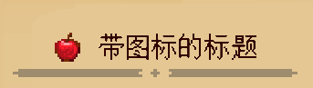

---
front:
hard: 入门
time: 分钟
sidebarDepth: 4
---


# 页面API

## 1.BasePage<span id="BasePage"></span>

所有书本页面都继承**BasePage**，页面负责排版页内的组件。

### 1.重写方法

#### \_\_init\_\_

- 描述

  初始化页面

- 参数

  | 参数名   | 数据类型        | 说明                                                         |
  | -------- | --------------- | ------------------------------------------------------------ |
  | size     | tuple(int, int) | 页的大小，单位为像素<br>默认值为**None**，书本系统会根据当前书本界面自动获取页面的大小 |
  | position | tuple(int, int) | 页的位置（锚点为左上角），单位为像素<br/>默认值为**None**，书本系统会根据当前书本界面自动获取页面的位置 |

- 返回值

  | 数据类型 | 说明     |
  | -------- | -------- |
  | BasePage | 页面实例 |

- 备注

  - 当你自定义一个页类的时候**必须重写类初始化方法**，并执行父类"**\_\_init\_\_**"方法，如何重写请参考[脚本自定义书本](02-脚本自定义书本.md#脚本自定义页面)。

#### Show

- 描述

  显示页面

- 参数

  无

- 返回值

  | 数据类型 | 说明     |
  | -------- | -------- |
  | BasePage | 页面实例 |

- 备注

  - 当你自定义一个页面的时候**必须重写该方法**，并执行父类**Show**方法，必须返回自身以支持链式调用。如何重写请参考[脚本自定义书本](02-脚本自定义书本.md#脚本自定义页面)。
  - 该方法会依次调用页内组件的**Show**方法，因此在调用该方法前需调用**AddComps**方法将组件添加至页面中。

#### Hide

- 描述

  隐藏页面

- 参数

  无

- 返回值

  | 数据类型 | 说明     |
  | -------- | -------- |
  | BasePage | 页面实例 |

- 备注

  - 当你自定义一个页面的时候**可以不重写该方法**，但如果重写该方法一定要在最后主动调用父类**Hide**方法，必须返回自身以支持链式调用。
  - 该方法的调用时机：该方法由书本系统进行调用，当用户翻页的时候，当前页会被隐藏。


### 2.排版方法

BasePage提供了一系列方法方便开发者在页面中进行排版，这些方法依照的UI坐标系参见[“自定义书本UI坐标系”](01-自定义基础书本.md#页面编写)。在对组件调用排版方法之前，确保组件已经加入到页面中（在初始化的时候调用**AddComps**添加组件），以及调用了页面父类的**Show**方法。

#### GetPosition

- 描述

  获取页面在书本坐标系中的位置

- 参数

  无

- 返回值

  | 数据类型        | 说明                                                 |
  | --------------- | ---------------------------------------------------- |
  | tuple(int, int) | 页面在书本坐标系中的位置（锚点在左上角），单位为像素 |

#### GetSize

- 描述

  获取页面的大小

- 参数

  无

- 返回值

  | 数据类型        | 说明                     |
  | --------------- | ------------------------ |
  | tuple(int, int) | 页面的大小，单位为像素。 |

#### Center

- 描述

  获取页面的中心坐标

- 参数

  无

- 返回值

  | 数据类型        | 说明                         |
  | --------------- | ---------------------------- |
  | tuple(int, int) | 页面的中心坐标，单位为像素。 |

#### Left

- 描述

  获取页面左边界的X值

- 参数

  无

- 返回值

  | 数据类型 | 说明                          |
  | -------- | ----------------------------- |
  | int      | 页面左边界的X值，单位为像素。 |

#### Right

- 描述

  获取页面右边界的X值

- 参数

  无

- 返回值

  | 数据类型 | 说明                          |
  | -------- | ----------------------------- |
  | int      | 页面右边界的X值，单位为像素。 |

#### Top

- 描述

  获取页面上边界的Y值

- 参数

  无

- 返回值

  | 数据类型 | 说明                          |
  | -------- | ----------------------------- |
  | int      | 页面上边界的Y值，单位为像素。 |

#### Bottom

- 描述

  获取页面下边界的Y值

- 参数

  无

- 返回值

  | 数据类型 | 说明                          |
  | -------- | ----------------------------- |
  | int      | 页面下边界的Y值，单位为像素。 |

#### ResetCompsPosition

- 描述

  重置所有组件的位置为页面当前的位置

- 参数

  无

- 返回值

  | 数据类型 | 说明     |
  | -------- | -------- |
  | BasePage | 页面实例 |

- 备注

  - 该函数在调用页面父类的**Show**方法后使用，在调用组件的排版方法前使用，相当于将组件先对齐页面后再进行平移，具体用法可见[脚本自定义书本](02-脚本自定义书本.md#脚本自定义页面)。


### 3.工具方法

#### GetPageGroup

- 描述

  获取页面当前所在的页组对象

- 参数

  无

- 返回值

  | 数据类型  | 说明                                                         |
  | --------- | ------------------------------------------------------------ |
  | PageGroup | 页面当前所在的[页组对象](05-常用脚本对象)<br>如果没有则返回**None** |

#### AddComps

- 描述

  向页面中添加组件

- 参数

  | 参数名 | 数据类型                   | 说明           |
  | ------ | -------------------------- | :------------- |
  | comps  | 可变长参数，元素为BaseComp | 添加的组件对象 |

- 返回值

  | 数据类型 | 说明     |
  | -------- | -------- |
  | BasePage | 页面实例 |

- 备注

  - 该函数在页面初始化函数中使用，只有将组件添加进页面后，页面在调用**Show**方法的时候才会调用组件的**Show**方法，具体用法可见[脚本自定义书本](02-脚本自定义书本.md#脚本自定义页面)。

#### Call

- 描述

  调用回调函数

- 参数

  | 参数名       | 数据类型 | 说明                             |
  | ------------ | -------- | -------------------------------- |
  | callbackDict | dict     | 回调函数以及其参数（属性见备注） |

- 返回值

  | 数据类型 | 说明             |
  | -------- | ---------------- |
  | object   | 回调函数的返回值 |

- 备注

  - 该函数主要用于将回调函数作为额外的数据传进到组件中（比如**ButtonComp**）

  - callbackDict的格式如下：

    | 参数名 | 数据类型 | 说明                                                   |
    | ------ | -------- | ------------------------------------------------------ |
    | func   | function | 回调的函数                                             |
    | args   | list     | 回调函数的参数列表，如果回调函数无参，则该属性无需定义 |

- 示例

  ```python
  """
  	我们定义两个回调函数，然后分别使用 Call 回调它
  """
  def func_1():
      pass
  def func_2(args1, args2):
      pass

  callbackDict_1 = {
      "func": func_1
  }
  callbackDict_2 = {
      "func": func_2,
      "args": [1, 2]
  }

  page = BasePage()
  page.Call(callbackDict_1)
  page.Call(callbackDict_2)
  ```

## 2.TitlePage


### 1.概述

TitlePage提供了对标题的处理方法，方便开发者，具体的示例详见Demo中的“**behavior_pack/customBooks/customBook/entry/myTitlePage.json**”以及“**behavior_pack/tutorialScripts/myTitlePage.py**”。

该页面对标题的处理逻辑为：

1. 当前页面是否为章节的首页，如果是则设置其标题为章节的标题（包括章节的图标）
2. 当前页面如果不是首页，分两种情况：若传进页面的**Data**中定义了"**subtitle**"属性，则标题为"**subtitle**"的值，若无，则不显示标题，页面剩余内容自动往上顶。

标题的页面样式可以这样划分，存在大标题的情况下，可以有图标也可以没有图标，不存在大标题但存在小标题的情况下，就显示小标题，我们结合示例中的**json**文件中的不同属性值来看：

</img>

```json
"title": {
    "icon": "textures/items/apple",
    "text": "带图标的标题"
}
```

如果当前页非首页，**title**如上定义为一个对象，则显示的效果为带图标的大标题。

</img>

```json
"title": "大标题"
```

如果当前页非首页，**title**如上定义为一个字符串，则显示的效果为不带图标的大标题。

</img>

```json
"subtitle": "默认的副标题"
```

如果当前页非首页，只定义**subtitle**而不定义**title**则显示如上的文本副标题。

### 2.方法

#### SetTitleData

- 描述

  设置标题的数据

- 参数

  无

- 返回值

  | 数据类型  | 说明     |
  | --------- | -------- |
  | TitlePage | 页面实例 |

- 备注

  - 该函数是在你自定义页面重写**Show**方法的时候调用，往标题中注入数据，如何使用见Demo。

#### LayoutTitle

- 描述

  排版页面的标题

- 参数

  无

- 返回值

  | 数据类型 | 说明                                 |
  | -------- | ------------------------------------ |
  | int      | 排版标题后，标题的下边界，单位为像素 |

- 备注

  - 该函数是在你自定义页面重写**Show**方法的时候调用，用于排版标题，如何使用见Demo。


