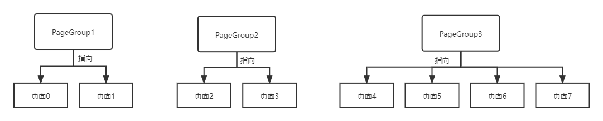
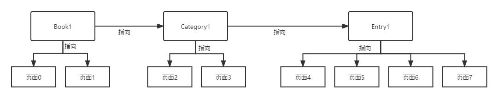

---
front:
hard: 入门
time: 分钟
sidebarDepth: 4
---


# 常用脚本对象

## 1.书本的页面跳转机制

### 1.概述<span id="页面跳转机制"></span>

所谓的页面跳转和浏览器的页面跳转效果是类似的，比如我们从书本首页，点击目录图标就**跳转**进入目录首页，从目录首页中点击章节标题就**跳转**进入章节首页，这些都是常见的**跳转**操作。


<center>从目录一直跳转到章节内的某一页</center>

除此常规跳转外，还支持链接地址的跳转，为了说明链接地址是如何使用的，这里有必要将与之相关的对象以及它们之间的关系阐述清楚。

### 2.对象解析<span id="对象分析"></span>

书本的构成元素实际上就是一个一个的页面，但是它们的关系并不是独立的，有些页面是属于同一个章节内的，有些页面是作为一个目录的首页来使用，为此我们将所有的页面进行分组管理，使用**PageGroup**对象来管理它下面的页面，组内的页面如何排版，如何排序就由**PageGroup**负责。



如上图所示的例子，这本书有8页（页号从0开始算），由3个PageGroup管理，当你需要请求页面4，就只需要向PageGroup3请求它的第一个页面即可。<br>请求的地址格式为 **PageGroup3的名称 + "/0**"， 0表示第0页。

尽管有了分组管理，但是仍然不像书本拥有目录，章节等层级结构，PageGroup仍然是相同层级的，因此有了 **Book**，**Category**，**Entry**这三个对象，它们均继承自**PageGroup**，除了指向页面外还能指向其子页组，具体可见示例[CustomBookMod](../../13-模组SDK编程/60-Demo示例.md#CustomBookMod)中的“**behavior_pack/customBooks/Book1**”，其对应的物品中文名称为”**链接测试书本“**。




如上图所示，页面0，1为**书本的首页**（首页除了第一页的介绍还包含目录列表展示页），由**Book1**这个**Book**对象管理，同时它还指向它的子页组**Category1**。

页面2，3为**目录1的首页**（首页除了第一页的介绍还包括章节列表展示页），由**Category1**这个**Category**对象管理，同时它还指向它的子页组**Entry1**。

页面4，5，6，7为**章节1的实际页面**，由**Entry1**这个**Entry**对象管理，它没有子页组。

- <span id="绝对路径">绝对路径（以"**/**"开头）</span>

  自定义书系统会按照层级关系设置这三个页组的路径值如下：

  - **Book1**的名称为其[identifier](01-自定义基础书本.md#书本identifier)，其**绝对路径**为“**/Book1的名称**"，即“**/Book1**"。
  - **Category1**的名称为其[identifier](01-自定义基础书本.md#目录identifier)，其**绝对路径**为“**Category1的父页组的绝对路径/Category1的名称**"，即“**/Book1/Category1**"。
  - **Entry1**的名称为其[identifier](01-自定义基础书本.md#章节identifier)，其**绝对路径**为“**Entry1的父页组的绝对路径/Entry1的名称**"，即“**/Book1/Category1/Entry1**"。

  如果不在路径后面添加**页号**，则默认跳转到**第0页**。而**返回**是相对于跳转的操作，只有跳转后才能进行返回。

- 相对路径

  相对路径不以“**/**"开头，当进行路径解析的时候会获取当前所在的页组作为路径开头拼成绝对路径。比如当前所在的页组是**Entry1**，如果调用[To](#To)函数，传入参数“**2**"，那么就会拼接成全局路径“**Entry1的绝对路径/2**"，即“**/Book1/Category1/Entry1/2**"，即跳转到**页面6**。

- 关于路径的跳转，可以参见示例中的**章节1的首页**中的2个**按钮**进行点击跳转。

自定义书系统支持同章节内，跨章节，同目录内，跨目录的页面跳转，但是不支持不同书本之间的跳转，只能对当前正在打开的书本进行页面跳转。

## 2.BookConfig<span id="书本配置"></span>

**系统默认值**的配置对象，是一个静态对象，请不要在程序运行期间修改该对象的属性。

| 属性名          | 描述                 | 枚举值                                                       |
| --------------- | -------------------- | ------------------------------------------------------------ |
| TextSize        | 文字字体大小（整型） | infotext：用于组件的标注文本字体大小，值为6px<br>footprint：页面脚注的文本字体大小，值为8px<br>content：内容文本字体大小，值为10px<br>smallTitle：小标题，值为12px<br>middleTitle：中标题，值为14px<br>title：大标题，值为16px |
| Colors          | 颜色（三维浮点数）   | TextDefault：默认字体颜色，值为(48, 3, 3, 255)归一化后的取值<br/>BookTitle：书本首页标题字体颜色，值为(249, 221, 166, 255)归一化后的取值<br/>SubTitle：页面标题的字体颜色，值为(72.0, 30, 23, 255)归一化后的取值<br/> |
| TextAlign       | 文本对齐方式         | Left：文本框大小固定，文本左对齐<br/>Center：文本框大小固定，文本居中对齐<br/>Right：文本框大小固定，文本右对齐<br/>Fit_Left：文本框大小自适应，文本左对齐<br/>Fit_Center：文本框大小自适应，文本居中对齐<br/>Fit_Right：文本框大小自适应，文本右对齐 |
| ImageReszieRule | 图片缩放方式         | Ninesliced：九宫格方式缩放，左右上下边距为0px<br>Fit：图片比例固定，图片会尽量占满给定空间 |
| Images          | 预设图片路径         | blank：完全透明的空白图片<br>categoryDefaultIcon： 目录默认图标<br/> </img><br>lockBtn_dark：目录默认的锁图标<br/></img><br>sqrtPanel_light：实体显示的默认背景图<br></img><br/>progressBar_light：进度条默认前景图<br></img><br/>progressBar_dark：进度条默认背景图<br></img><br/> |

获取方式：

```python
import mod.client.extraClientApi as clientApi
# 获取书本管理对象，如何使用可见 BookManager API
bookManager = clientApi.GetBookManager()
# 获取书本配置常量
bcf = bookManager.GetBookConfig()
```

## 3.BookManager<span id="BookManager"></span>

该对象管理**所有的书本对象**，它会保存所有书本的[浏览历史记录](01-自定义基础书本.md#浏览历史记录)以及[链接地址](#绝对路径)，提供所有书本的公共方法，通过该对象能获取到当前正在打开的书本对象，以及调用全局消息显示，注册自定义页面，跳转书本页面。

该对象是一个全局单例对象，可以通过API获取。

```python
import mod.client.extraClientApi as clientApi
bookManager = clientApi.GetBookManager()
```

### GetBookConfig

- 描述

  获取书本配置常量

- 参数

  无

- 返回值

  | 数据类型                | 说明         |
  | ----------------------- | ------------ |
  | [BookConfig](#书本配置) | 书本配置常量 |

- 示例

  ```python
  import mod.client.extraClientApi as clientApi
  # 获取书本管理对象
  bookManager = clientApi.GetBookManager()
  # 获取书本配置常量
  bcf = bookManager.GetBookConfig()
  print bcf.TextSize.content	# 输出正常文本的字体大小值 10
  ```

### GetBookInstance

- 描述

  根据书本名称获取管理该书本的对象

- 参数

  | 参数名   | 数据类型 | 说明                                                         |
  | -------- | -------- | ------------------------------------------------------------ |
  | bookName | str      | 书本的名称，也就是书本的[identifier](01-自定义基础书本.md#书本identifier) |

- 返回值

  | 数据类型                  | 说明             |
  | ------------------------- | ---------------- |
  | [NormalBook](#NormalBook) | 管理该书本的对象 |

- 备注
  - 如果是没有创建成功的书本，则会返回None。

- 示例

  ```python
  import mod.client.extraClientApi as clientApi
  bookInstance = clientApi.GetBookManager().GetBookInstance("customBook")	# 获取书本名称为"customBook"的书本管理对象
  if bookInstance:
  	print bookInstance.bookName	# 输出该书本的名称
  ```

### GetOpeningBookInstance

- 描述

  获取当前处于打开状态的书本的管理对象

- 参数

  无

- 返回值

  | 数据类型                  | 说明                         |
  | ------------------------- | ---------------------------- |
  | [NormalBook](#NormalBook) | 处于打开状态的书本的管理对象 |

- 备注

  - 如果当前没有打开的书本，则会返回None。

- 示例

  ```python
  import mod.client.extraClientApi as clientApi
  bookInstance = clientApi.GetBookManager().GetOpeningBookInstance()	# 获取当前正在打开的书本的管理对象
  if bookInstance:
  	print bookInstance.bookName	# 输出该书本的名称
  ```

### ShowMsg<span id="显示消息文本"></span>

- 描述

  全局显示消息文本

- 参数

  | 参数名   | 数据类型        | 说明                                                         |
  | -------- | --------------- | ------------------------------------------------------------ |
  | position | tuple(int, int) | 消息显示的位置（[全局坐标系](01-自定义基础书本.md#页面编写)） |
  | msg      | str             | 消息的文本内容<br>默认值为“**点击无任何说明，请填充数据**"   |

- 返回值

  无

- 示例

  可见[CustomBookMod](../../13-模组SDK编程/60-Demo示例.md#CustomBookMod)中的**behavior_pack/tutorialScripts/pages/buttonPage.py**这一自定义页面的这块代码，这里实现的功能就是点击按钮后在按钮的中心位置显示文本信息。

  ```python
  def ShowMsg(self, msg):
      # 获取所有书本得管理对象
      bookManager = clientApi.GetBookManager()
      # 获取button1组件所封装的UI控件根节点
      buttonNode = self.button1.GetRootUINode()
      # 使用GetNodeCenterGlobal获取该根节点中心的全局坐标
      position = self.button1.GetNodeCenterGlobal(buttonNode)
      # 显示提示消息
      bookManager.ShowMsg(position, msg)
  ```

- 备注
  - 该文本的显示时间为**2秒**，2秒后会自动隐藏。

### HideMsg

- 描述

  隐藏全局消息文本

- 参数

  无

- 返回值

  无

- 示例

  ```python
  import mod.client.extraClientApi as clientApi
  bookManager = clientApi.GetBookManager()
  bookManager.HideMsg()
  ```

- 备注
  - 即使当前全局消息显示未满2秒，调用该方法可以直接隐藏它。

### AddPageType

- 描述

  注册自定义页面

- 参数

  | 参数名   | 数据类型 | 说明                 |
  | -------- | -------- | -------------------- |
  | pageName | str      | 自定义页面的名称     |
  | pageCls  | classobj | 自定义页面所对应的类 |

- 返回值

  无

- 示例

  可见[CustomBookMod](../../13-模组SDK编程/60-Demo示例.md#CustomBookMod)中的**behavior_pack/tutorialScripts/tutorialClientSystem.py**这块代码，这里编写了几个自定义的页面类，并为它们注册页的名称，这个名称将会在编写书本json的页面时使用，详细可见[json使用页面](01-自定义基础书本.md#页面编写)。

  **TutorialClientSystem.py**

  ```python
  # MyNoTitlePage是自定义的一个页面类
  from tutorialScripts.pages.myNoTitlePage import MyNoTitlePage
  # 为MyNoTitlePage注册名字为"CustomMod:MyNoTitlePage"，该名字将作为页面json中的键值使用
  bookManager.AddPageType("CustomMod:MyNoTitlePage", MyNoTitlePage)
  ```

  **behavior_pack/customBooks/customBook/entry/myNoTitlePage.json**中对应的代码，**type**的属性对应的就是上面注册的页面名称。

  ```json
  {
      "type": "CustomMod:MyNoTitlePage",
      "testTitle": "标题文本",
      "image": "textures/ui/myCustomBook/testImage",
      "content1": "第一段文本",
      "content2": "第二段文本"
  }
  ```

- 备注

  - 该函数只能在**ClientSystem**初始化的时候调用，否则不会生效。
  - 为了避免该页面与其他Mod中的页面或者系统预设的页面重名，建议开发者使用 Mod名称+":"+页面名称 这一格式来命名你的页面。如果发生了重名情况，该注册将不会成功，系统会报相应的错误信息。
  - 符合命名规则情况下，自定义的页面是可以给其他Mod开发者使用的，不局限于一本书本。

### UpdateScreen

- 描述

  刷新书本界面

- 参数

  无

- 返回值

  无

- 示例

  ```python
  import mod.client.extraClientApi as clientApi
  bookManager = clientApi.GetBookManager()
  bookManager.UpdateScreen()
  ```

- 备注

  - 该函数本质是调用了书本界面这个ScreenNode的**UpdateScreen**方法。

### To<span id="To"></span>

- 描述

  根据提供的书本页面地址跳转书本页面

- 参数

  | 参数名 | 数据类型 | 说明                                                         |
  | ------ | -------- | ------------------------------------------------------------ |
  | addr   | str      | 书本页面地址，自定义书本的页面跳转机制和浏览器的地址导航是类似的，详见[页面跳转机制](#页面跳转机制) |

- 返回值

  | 数据类型                | 说明         |
  | ----------------------- | ------------ |
  | [PageGroup](#PageGroup) | 跳转到的页组 |

- 示例

  可见[CustomBookMod](../../13-模组SDK编程/60-Demo示例.md#CustomBookMod)中的**behavior_pack/tutorialScripts/pages/addrPage.py**这一自定义页面的这块代码，这里实现的功能就是点击按钮后跳转到指定章节的指定页面。

  ```python
  def GoToPage(self, addr):
      # 获取所有书本得管理对象
      bookManager = clientApi.GetBookManager()
      # 跳转到地址
      bookManager.To(addr)
  ```

  备注

  - 只能在打开的书本中进行跳转，无法从一本书中的页面跳转到另外一本书的页面，其他跳转均是允许的，比如同章节内跳转，章节跳转到目录等等。
- 只有发生跳转（调用该函数的时候），才可以点击”**返回“**按钮进行返回（和浏览器的后退是类似的功能），常见的从书本首页到目录首页，从目录首页到章节，这些操作都属于跳转，所以返回的时候就会回到跳转前的状态，而**”上一页“按钮**，**”下一页“按钮**并不是跳转操作，具体可以参见[页面跳转机制](#页面跳转机制)。

### 获取组件类<span id="获取组件类"></span>

- 描述

  这一类方法均是获取基础组件以及类预设的组件类，格式为"Get"+组件类名+"Cls"，均无参数

- 接口

  | 函数名                | 返回值                | 说明                             |
  | --------------------- | --------------------- | -------------------------------- |
  | GetBaseCompCls        | type(BaseComp)        | 获取组件类的基类                 |
  | GetButtonCompCls      | type(ButtonComp)      | 获取 预设组件 ButtonComp 类      |
  | GetEntityCompCls      | type(EntityComp)      | 获取 预设组件 Entity 类          |
  | GetHighlightCompCls   | type(HighlightComp)   | 获取 预设组件 HighlightComp 类   |
  | GetImageCompCls       | type(ImageComp)       | 获取 预设组件 ImageComp 类       |
  | GetTextCompCls        | type(TextComp)        | 获取 预设组件 TextComp 类        |
  | GetProgressBarCompCls | type(ProgressBarComp) | 获取 预设组件 ProgressBarComp 类 |

- 示例

  因为用法是一样的，这里仅举一个例子，更具体的用法可参见[CustomBookMod](../../13-模组SDK编程/60-Demo示例.md#CustomBookMod)的自定义页面部分

  ```python
  import mod.client.extraClientApi as clientApi
  # 获取书本管理对象，详细用法见“05-常见脚本对象”
  bookManager = clientApi.GetBookManager()
  # 获取书本配置常量，详细API见“05-常见脚本对象”
  bcf = bookManager.GetBookConfig()
  # 获取预设页面类 TitlePage
  TitlePage = bookManager.GetTitlePageCls()
  # 获取预设组件类 TextComp
  TextComp = bookManager.GetTextCompCls()
  # 获取预设组件类 ImageComp
  ImageComp = bookManager.GetImageCompCls()

  # 自定义的一个Page
  class MyTitlePage(TitlePage):
      def __init__(self, size = None, position = None):
          # 调用父类同名方法，TitlePage 会自动添加标题组件以及提供标题组件注入数据的方法，排版的方法。
          TitlePage.__init__(self, size, position)
          self.content1 = TextComp(bcf.TextAlign.Left)
          self.image = ImageComp()
          self.content2 = TextComp(bcf.TextAlign.Left)
          self.AddComps(self.content1, self.image, self.content2)
  ```

### 获取页面类<span id="获取页面类"></span>

- 描述

  这一类方法均是获取基础页面以及预设的页面类，格式为"Get"+页面类名+"Cls"，均无参数

- 接口

  | 函数名          | 返回值          | 说明                       |
  | --------------- | --------------- | -------------------------- |
  | GetBasePageCls  | type(BasePage)  | 获取页面类的基类           |
  | GetTitlePageCls | type(TitlePage) | 获取 预设页面 TitlePage 类 |

- 示例

  例子可参见[获取组件类](#获取组件类)


## 4.NormalBook<span id="NormalBook"></span>

该对象管理的是**已经成功创建的书本**。该对象是一个全局单例对象，可以通过API获取。

```python
import mod.client.extraClientApi as clientApi
bookManager = clientApi.GetBookManager()
# 两种方式获取，一种是通过正在打开的书本获取，调用GetOpeningBookInstance，一种是通过书本名称获取，调用GetBookInstance
bookInstance = bookManager.GetBookInstance("customBook")	# 获取书本名称为"customBook"的书本管理对象
```

### GetOriginJsonData

- 描述

  获取从书本**json**文件传过来**未经处理**的数据，如果想获取**当前被修改**的数据则可以调用**GetCurrentJsonData**

- 参数

  无

- 返回值

  | 数据类型 | 说明                       |
  | -------- | -------------------------- |
  | dict     | 从书本json文件传过来的数据 |

- 示例

  ```python
  import mod.client.extraClientApi as clientApi
  bookInstance = clientApi.GetBookManager().GetBookInstance("customBook")	# 获取书本名称为"customBook"的书本管理对象
  if bookInstance:
      originData = bookInstance.GetOriginJsonData()	#获取原始json数据
  ```

- 备注

  - 书本系统在将数据传入到页面以及组件的时候会经过预处理（比如配置默认值等），因此传入的数据并不是与原来json中定义的数据是一致的，如果想要获取当前预处理后的数据可调用**GetCurrentJsonData**。

### GetCurrentJsonData

- 描述

  获取从书本**json**文件传过来并**经过修改**的数据，如果想获取**未被修改**的数据则可以调用**GetOriginJsonData**

- 参数

  无

- 返回值

  | 数据类型 | 说明                       |
  | -------- | -------------------------- |
  | dict     | 从书本json文件传过来的数据 |

- 示例

  ```python
  import mod.client.extraClientApi as clientApi
  bookInstance = clientApi.GetBookManager().GetBookInstance("customBook")	# 获取书本名称为"customBook"的书本管理对象
  if bookInstance:
      currentData = bookInstance.GetCurrentJsonData()	#获取当前json数据
  ```

- 备注

  - 书本系统在将数据传入到页面以及组件的时候会经过预处理（比如配置默认值等），因此传入的数据并不是与原来json中定义的数据是一致的，如果想获取**未被修改**的数据则可以调用**GetOriginJsonData**

### GetBook

- 描述

  获取书本首页所在的页组对象

- 返回值

  | 数据类型      | 说明     |
  | ------------- | -------- |
  | [Book](#Book) | 书本实例 |

- 示例

  ```python
  import mod.client.extraClientApi as clientApi
  bookInstance = clientApi.GetBookManager().GetBookInstance("customBook")	# 获取书本名称为"customBook"的书本管理对象
  if bookInstance:
      bookObj = bookInstance.GetBook()	# 获取该书的书本页组对象
  ```


### GetCategory

- 描述

  根据目录的**identitfier**获取其对象

- 参数

  | 参数名                                            | 数据类型 | 说明             |
  | ------------------------------------------------- | -------- | ---------------- |
  | [identifier](01-自定义基础书本.md#目录identifier) | str      | 目录的唯一标识。 |

- 返回值

  | 数据类型              | 说明     |
  | --------------------- | -------- |
  | [Category](#Category) | 目录实例 |

- 示例

  ```python
  import mod.client.extraClientApi as clientApi
  bookInstance = clientApi.GetBookManager().GetBookInstance("customBook")	# 获取书本名称为"customBook"的书本管理对象
  if bookInstance:
      categoryObj = bookInstance.GetCategory("pages")	# 比如获取一个identifier为"pages"的目录对象
  ```

### GetEntry

- 描述

  根据章节的**identitfier**获取其对象

- 参数

  | 参数名                                            | 数据类型 | 说明             |
  | ------------------------------------------------- | -------- | ---------------- |
  | [identifier](01-自定义基础书本.md#章节identifier) | str      | 章节的唯一标识。 |

- 返回值

  | 数据类型        | 说明     |
  | --------------- | -------- |
  | [Entry](#Entry) | 章节实例 |

- 示例

  ```python
  import mod.client.extraClientApi as clientApi
  bookInstance = clientApi.GetBookManager().GetBookInstance("customBook")	# 获取书本名称为"customBook"的书本管理对象
  if bookInstance:
  	entryObj = bookInstance.GetEntry("entityEntry")	# 比如获取一个identifier为"entityEntry"的目录对象
  ```

### LockCategory

- 描述

  根据目录的**identitfier**锁住对应的目录

- 参数

  | 参数名                                            | 数据类型 | 说明             |
  | ------------------------------------------------- | -------- | ---------------- |
  | [identifier](01-自定义基础书本.md#目录identifier) | str      | 目录的唯一标识。 |

- 返回值

  无

- 示例

  ```python
  import mod.client.extraClientApi as clientApi
  bookInstance = clientApi.GetBookManager().GetBookInstance("customBook")	# 获取书本名称为"customBook"的书本管理对象
  if bookInstance:
      bookInstance.LockCategory("pages")	# 比如锁住一个identifier为"pages"的目录
  ```

### UnlockCategory

- 描述

  根据目录的**identitfier**解锁对应的目录

- 参数

  | 参数名                                            | 数据类型 | 说明             |
  | ------------------------------------------------- | -------- | ---------------- |
  | [identifier](01-自定义基础书本.md#目录identifier) | str      | 目录的唯一标识。 |

- 返回值

  无

- 示例

  ```python
  import mod.client.extraClientApi as clientApi
  bookInstance = clientApi.GetBookManager().GetBookInstance("customBook")	# 获取书本名称为"customBook"的书本管理对象
  if bookInstance:
      bookInstance.UnlockCategory("pages")	# 比如解锁一个identifier为"pages"的目录
  ```

### LockEntry

- 描述

  根据章节的**identitfier**锁住对应的章节

- 参数

  | 参数名                                            | 数据类型 | 说明             |
  | ------------------------------------------------- | -------- | ---------------- |
  | [identifier](01-自定义基础书本.md#章节identifier) | str      | 章节的唯一标识。 |

- 返回值

  无

- 示例

  ```python
  import mod.client.extraClientApi as clientApi
  bookInstance = clientApi.GetBookManager().GetBookInstance("customBook")	# 获取书本名称为"customBook"的书本管理对象
  if bookInstance:
      bookInstance.LockEntry("entityEntry")	# 比如上锁一个identifier为"entityEntry"的章节
  ```


### UnlockEntry

- 描述

  根据章节的**identitfier**解锁对应的章节

- 参数

  | 参数名                                            | 数据类型 | 说明             |
  | ------------------------------------------------- | -------- | ---------------- |
  | [identifier](01-自定义基础书本.md#章节identifier) | str      | 章节的唯一标识。 |

- 返回值

  无

- 示例

  ```python
  import mod.client.extraClientApi as clientApi
  bookInstance = clientApi.GetBookManager().GetBookInstance("customBook")	# 获取书本名称为"customBook"的书本管理对象
  if bookInstance:
      bookInstance.UnlockEntry("entityEntry")	# 比如解锁一个identifier为"entityEntry"的章节
  ```

## 5.PageGroup<span id="PageGroup"></span>

该对象是管理一组页面的，详细见[对象分析](#对象分析)。一般开发者不会直接使用该类，而是使用该类的三个继承类：**Book，Category，Entry**，所以这里的API实际上是这三个类的公共API。

### GetAddr

- 描述

  获取该页组的[绝对路径](#绝对路径)

- 参数

  无

- 返回值

  | 数据类型 | 说明               |
  | -------- | ------------------ |
  | str      | 页组对应的绝对路径 |

- 示例

  因为 **Book**， **Category**，**Entry**都是继承**PageGroup**的，这里我们就举例**Category**的。

  ```python
  import mod.client.extraClientApi as clientApi
  bookInstance = clientApi.GetBookManager().GetBookInstance("customBook")	# 获取书本名称为"customBook"的书本管理对象
  if bookInstance:
      categoryObj = bookInstance.GetCategory("pages")	# 比如获取一个identifier为"pages"的目录对象
      if categoryObj:
          print categoryObj.GetAddr()	# 输出 "/customBook/pages"
  ```

### GetPages

- 描述

  获取该页组的所有页面对象

- 参数

  无

- 返回值

  | 数据类型       | 说明             |
  | -------------- | ---------------- |
  | List[BasePage] | 页组中的所有页面 |

- 示例

  因为 **Book**， **Category**，**Entry**都是继承**PageGroup**的，这里我们就举例**Category**的。

  ```python
  import mod.client.extraClientApi as clientApi
  bookInstance = clientApi.GetBookManager().GetBookInstance("customBook")	# 获取书本名称为"customBook"的书本管理对象
  if bookInstance:
      categoryObj = bookInstance.GetCategory("pages")	# 比如获取一个identifier为"pages"的目录对象
      if categoryObj:
      	print categoryObj.GetPages()	# 输出页面对象，你可以使用页面API的方法进行验证
  ```

### GetPagesCount

- 描述

  获取该页组的页面数量

- 参数

  无

- 返回值

  | 数据类型 | 说明             |
  | -------- | ---------------- |
  | int      | 页组中的页面数量 |

- 示例

  因为 **Book**， **Category**，**Entry**都是继承**PageGroup**的，这里我们就举例**Category**的。

  ```python
  import mod.client.extraClientApi as clientApi
  bookInstance = clientApi.GetBookManager().GetBookInstance("customBook")	# 获取书本名称为"customBook"的书本管理对象
  if bookInstance:
      categoryObj = bookInstance.GetCategory("pages")	# 比如获取一个identifier为"pages"的目录对象
      if categoryObj:
      	print categoryObj.GetPagesCount()	# 输出"2"
  ```

## 6.Book<span id="Book"></span>

该对象继承**PageGroup**，是包含书本首页的页组，表示一个书本的对象，详细见[对象分析](#对象分析)。

### GetSons

- 描述

  获取子页组（其子页组就是Category对象）

- 参数

  无

- 返回值

  | 数据类型       | 说明           |
  | -------------- | -------------- |
  | list(Category) | 书本的一级目录 |

- 示例

  ```python
  import mod.client.extraClientApi as clientApi
  bookInstance = clientApi.GetBookManager().GetBookInstance("customBook")	# 获取书本名称为"customBook"的书本管理对象
  if bookInstance:
      bookObj = bookInstance.GetBook()
      # 获取所有子页组的identifier
      print [son.name for son in bookObj.GetSons()]
  ```

### GetProgressValue

- 描述

  获取子页组解锁的进度，常用于进度条显示

- 参数

  无

- 返回值

  | 数据类型 | 说明                                                         |
  | -------- | ------------------------------------------------------------ |
  | float    | 当前子页组解锁的进度，范围为[**0, 1**]，**0**表示**0%**，**1**表示**100%** |

- 示例

  ```python
  # 比如获取书本当前的解锁进度，如果书本下有两个已经解锁的一级子目录，那么其解锁进度为100%，如果一个解锁一个未解锁，则为50%
  import mod.client.extraClientApi as clientApi
  bookInstance = clientApi.GetBookManager().GetBookInstance("customBook")	# 获取书本名称为"customBook"的书本管理对象
  if bookInstance:
      bookObj = bookInstance.GetBook()
      # 获取进度
      progressValue = bookObj.GetProgressValue()
      print progressValue
  ```

## 7.Category<span id="Category"></span>

该对象继承**PageGroup**，是包含目录首页的页组，表示一个目录的对象，详细见[对象分析](#对象分析)。

### GetSons

- 描述

  获取子页组（其子页组可以是Category对象，也可以是Entry对象，因为目录是允许嵌套的，可参见[目录嵌套](01-自定义基础书本.md#目录嵌套)。）

- 参数

  无

- 返回值

  | 数据类型  | 说明                         |
  | --------- | ---------------------------- |
  | PageGroup | 该目录下的子目录或者章节对象 |

- 备注

  - **Category**是支持嵌套的，它的子页组对象可以是**Category**，也可以是**Entry**

- 示例

  ```python
  import mod.client.extraClientApi as clientApi
  bookInstance = clientApi.GetBookManager().GetBookInstance("customBook")	# 获取书本名称为"customBook"的书本管理对象
  if bookInstance:
      categoryObj = bookInstance.GetCategory("pages")	# 比如获取一个identifier为"pages"的目录对象
      if categoryObj:
          # 获取所有子页组（要么全都是Category对象，要么全都是Entry对象）的identifier
          print [son.name for son in categoryObj.GetSons()]
  ```

### GetParent

- 描述

  获取其父页组（其父页组可以是Category对象，也可以是Book对象，因为目录是允许嵌套的，可参见[目录嵌套](01-自定义基础书本.md#目录嵌套)。）

- 参数

  无

- 返回值

  | 数据类型  | 说明       |
  | --------- | ---------- |
  | PageGroup | 父页组对象 |

- 备注

  - **Category**是支持嵌套的，它的父页组对象可以是**Category**，也可以是**Book**

- 示例

  ```python
  import mod.client.extraClientApi as clientApi
  bookInstance = clientApi.GetBookManager().GetBookInstance("customBook")	# 获取书本名称为"customBook"的书本管理对象
  if bookInstance:
      # 比如获取一个identifier为"pages"的目录对象，它的父页组为"customBook"这个Book对象
      categoryObj_1 = bookInstance.GetCategory("pages")
      # 比如获取一个identifier为"subcategory1"的目录对象，它的父页组为"subcategoryTest"这个Category对象，这就是一个嵌套的例子
      categoryObj_2 = bookInstance.GetCategory("subcategory1")
      if categoryObj_1:
          print categoryObj_1.GetParent().name	# 输出 "customBook"
      if categoryObj_2:
      	print categoryObj_2.GetParent().name	# 输出 "subcategory"
  ```

### isLocked

- 描述

  返回该目录解锁状态

- 参数

  无

- 返回值

  | 数据类型 | 说明                              |
  | -------- | --------------------------------- |
  | bool     | True表示未解锁，False表示已经解锁 |

- 示例

  ```python
  import mod.client.extraClientApi as clientApi
  bookInstance = clientApi.GetBookManager().GetBookInstance("customBook")	# 获取书本名称为"customBook"的书本管理对象
  if bookInstance:
      categoryObj = bookInstance.GetCategory("pages")	# 比如获取一个identifier为"pages"的目录对象
      if categoryObj:
          print categoryObj.isLocked()
  ```

### Lock

- 描述

  将该目录上锁

- 参数

  无

- 返回值

  无

- 示例

  ```python
  import mod.client.extraClientApi as clientApi
  bookInstance = clientApi.GetBookManager().GetBookInstance("customBook")	# 获取书本名称为"customBook"的书本管理对象
  if bookInstance:
      categoryObj = bookInstance.GetCategory("pages")
      if categoryObj:
          # 给 identifier 为"pages"的目录上锁
          categoryObj.Lock()
  ```

### Unlock

- 描述

  将该目录解锁

- 参数

  无

- 返回值

  无

- 示例

  ```python
  import mod.client.extraClientApi as clientApi
  bookInstance = clientApi.GetBookManager().GetBookInstance("customBook")	# 获取书本名称为"customBook"的书本管理对象
  if bookInstance:
      categoryObj = bookInstance.GetCategory("pages")
      if categoryObj:
          # 给 identifier 为"pages"的目录解锁
          categoryObj.Unlock()
  ```

### GetProgressValue

- 描述

  获取子页组解锁的进度，常用于进度条显示

- 参数

  无

- 返回值

  | 数据类型 | 说明                                                         |
  | -------- | ------------------------------------------------------------ |
  | float    | 当前子页组解锁的进度，范围为[**0, 1**]，**0**表示**0%**，**1**表示**100%** |

- 示例

  ```python
  # 比如获取书本当前的解锁进度，如果书本下有两个已经解锁的一级子目录，那么其解锁进度为100%，如果一个解锁一个未解锁，则为50%
  import mod.client.extraClientApi as clientApi
  bookInstance = clientApi.GetBookManager().GetBookInstance("customBook")	# 获取书本名称为"customBook"的书本管理对象
  if bookInstance:
      categoryObj = bookInstance.GetCategory("pages")
      if categoryObj:
          # 获取 identifier 为"pages"的目录的解锁进度
          progressValue = categoryObj.GetProgressValue()
          print progressValue
  ```

## 8.Entry<span id="Entry"></span>

该对象继承**PageGroup**的页组，表示一个章节的对象，详细见[对象分析](#对象分析)。

### GetParent

- 描述

  获取其父页组（其父页组是Category对象）

- 参数

  无

- 返回值

  | 数据类型 | 说明                 |
  | -------- | -------------------- |
  | Category | 该章节所属的目录对象 |

- 备注

  - **Entry**是无法嵌套的，它的父页组对象只能是**Category**

- 示例

  ```python
  import mod.client.extraClientApi as clientApi
  bookInstance = clientApi.GetBookManager().GetBookInstance("customBook")	# 获取书本名称为"customBook"的书本管理对象
  if bookInstance:
      entryObj = bookInstance.GetEntry("entityEntry")	# 比如获取一个identifier为"entityEntry"的目录对象
      if entryObj:
      	print entryObj.GetParent().name	# 它的父页组是"pages"
  ```

### isLocked

- 描述

  返回该章节解锁状态

- 参数

  无

- 返回值

  | 数据类型 | 说明                              |
  | -------- | --------------------------------- |
  | bool     | True表示未解锁，False表示已经解锁 |

- 示例

  ```python
  import mod.client.extraClientApi as clientApi
  bookInstance = clientApi.GetBookManager().GetBookInstance("customBook")	# 获取书本名称为"customBook"的书本管理对象
  if bookInstance:
      entryObj = bookInstance.GetEntry("entityEntry")	# 比如获取一个identifier为"entityEntry"的目录对象
      if entryObj:
      	print entryObj.isLocked()
  ```

### Lock

- 描述

  将该章节上锁

- 参数

  无

- 返回值

  无

- 示例

  ```python
  import mod.client.extraClientApi as clientApi
  bookInstance = clientApi.GetBookManager().GetBookInstance("customBook")	# 获取书本名称为"customBook"的书本管理对象
  if bookInstance:
      entryObj = bookInstance.GetEntry("entityEntry")
      if entryObj:
          # 给 identifier 为"entityEntry"的目录上锁
          entryObj.Lock()
  ```

### Unlock

- 描述

  将该章节解锁

- 参数

  无

- 返回值

  无

- 示例

  ```python
  import mod.client.extraClientApi as clientApi
  bookInstance = clientApi.GetBookManager().GetBookInstance("customBook")	# 获取书本名称为"customBook"的书本管理对象
  if bookInstance:
      entryObj = bookInstance.GetEntry("entityEntry")
      if entryObj:
          # 给 identifier 为"entityEntry"的目录解锁
          entryObj.Unlock()
  ```

