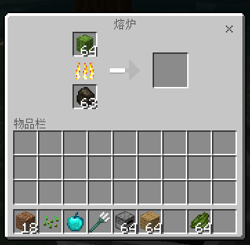

# 自定义配方

## 概述

该功能不需要开启实验性玩法。

开发者可以在addon的bevavior目录下新增netease_recipes文件夹， 然后配置json来添加自定义配方。

该配方支持自定义物品。

## 定义配方Json

### 配方类型说明

目前可以通过json自定义的配方主要有以下五种类型：

#### minecraft:recipe_shaped

代表一个[**工作台**]的有序合成配方。

在`pattern`中可以使用任何除了空格（` `）以外的字符作为`key`，因为空格代表一个空的合成栏位。

配方的输出物品不能设置自定义NBT数据标签。

**配方共同属性** 

```css
.
├── pattern：由单字符键所组成的数组，用于描述一个2×2或3×3的有序合成图案。该数组中的一个字符串代表合成方格中的一行。每个字符串应写至多3个键，并且包含键的个数应当相同。空格代表一个空的合成栏位。
└── key：所有该有序合成配方用到的键。
|    ├── one-key：该键所代表的物品。
|    │   └── item：物品ID
|    |   └── data：物品附加值
|    ├── one-key：该键所代表的物品。
|    │   └── item：物品ID
|    |   └── data：物品附加值
└── result：该配方的输出物品。可以是数组，包含多个输出物品。
     ├── item：物品ID
     ├── data：物品附加值
```

例子：木锹 + 木板 合成 船

```json
{
  "format_version": "1.12",
  "minecraft:recipe_shaped": {
    "description": {
    "identifier": "minecraft:netease_acacia_boat"
    },
    "tags": [ "crafting_table" ],
    "pattern": [
      "#P#",
      "###"
    ],
    "key": {
      "P": {
        "item": "minecraft:wooden_shovel"
      },
      "#": {
        "item": "minecraft:planks",
        "data": 1
      }
    },
    "result": {
      "item": "minecraft:boat",
      "data": 4
    }
  }
}
```


#### minecraft:recipe_shapeless

代表一个[**工作台**]的无序合成配方。

配方的输出物品不能设置自定义NBT数据标签。

**配方共同属性**

```css
.
└── ingredients：该无序合成配方的一系列原料。数量应在1至9个之间。
|    ├── ：该键所代表的物品。
|    │   └── item：物品ID
|    |   └── data：物品附加值
|    ├── ：该键所代表的物品。
|    │   └── item：物品ID
|    |   └── data：物品附加值
└── result：该配方的输出物品。与有序配方不同，只能有一个输出物品。
     ├── item：物品ID
     ├── data：物品附加值
	 ├── count：物品个数
```


例子：闪长岩 + 圆石 -> 安山岩

```json
{
  "format_version": "1.12",
  "minecraft:recipe_shapeless": {
    "description": {
    "identifier": "minecraft:netease_andesite"
    },
    "tags": [ "crafting_table" ],
    "ingredients": [
      {
        "item": "minecraft:stone",
        "data": 3
      },
      {
        "item": "minecraft:cobblestone"
      }
    ],
    "result": {
      "item": "minecraft:stone",
      "data": 5,
      "count": 2
    }
  }
}
```

其中，`ingredients`定义的数量应该在1~9之间。

#### minecraft:recipe_furnace

代表一个[**熔炉**]配方

**配方共同属性**

```css
.
└── input：熔炉配方的输入材料，放在熔炉左上方的格子里。
└── output：熔炉配方的输出物品，产出在熔炉右边的格子中。
```



例子：仙人掌 -> 仙人掌绿

```json
{
  "format_version": "1.12",
  "minecraft:recipe_furnace": {
    "description": {
    "identifier": "minecraft:netease_furnace_cactus"
    },
    "tags": ["furnace"],
    "input": "minecraft:cactus",
    "output": "minecraft:dye:2"
  }
}
```

#### minecraft:recipe_brewing_mix

代表一个[**酿造台**]混合酿造配方

混合酿造配方，指的是将一个具有某种状态效果的药水放入酿造台后，再加入某个物品，可以酿造出具有另一种状态效果的药水的配方。 

**配方共同属性**

```css
.
└── input：一个物品ID，该配方接受的药水类型。
└── reagent：一个物品ID，酿造所需要的额外物品。
└── output：该配方输出的药水类型。注：输出的物品无法和原来的物品合一起
```
**注：输出的物品无法和原来的物品堆叠一起**

例子：粗制药水 + 烈焰粉 -> 力量药水

```json
{
  "format_version": "1.12",
  "minecraft:recipe_brewing_mix": {
    "description": {
      "identifier": "minecraft:netease_brew_awkward_blaze_powder"
    },

    "tags": [ "brewing_stand" ],

    "input": "minecraft:potion_type:awkward",
    "reagent": "minecraft:blaze_powder",
    "output": "minecraft:potion_type:strength"
  }

}
```

#### minecraft:recipe_brewing_container

代表一个[**酿造台**]换容酿造配方

换容酿造配方，指的是一瓶药水被酿造后将会改变容器的配方。例如从普通玻璃瓶转换为喷溅型玻璃瓶或滞留型玻璃瓶等。 

例子：

```json
{
  "format_version": "1.12",
  "minecraft:recipe_brewing_container": {
    "description": {
      "identifier": "minecraft:netease_brew_potion_sulphur"
    },

    "tags": [ "brewing_stand" ],

    "input": "minecraft:potion",
    "reagent": "minecraft:gunpowder",
    "output": "minecraft:splash_potion"
  }

}
```


### tags说明

tags有以下几种值：

#### crafting_table

使用工作台合成配方

#### stonecutter

使用切石机合成配方。注:由于**切石机**的合成格子只有一个，因此合成配方ingredients的物品的count值的和不能大于1！

例子：

```python
{
  "format_version": "1.12",
  "minecraft:recipe_shapeless": {
    "description": {
        "identifier": "minecraft:netease_stonecutter_polished_andesite_slab"
        },
        "tags": [ "stonecutter" ],
        "priority": 4, # 对于多个配方，优先级越高越先合成
        "ingredients": [
         {
            "item": "minecraft:stone",
            "data": 5
          }
        ],
        "result": {
          "item": "minecraft:double_stone_slab3",
          "data": 2,
          "count": 2
        }
  	}
 }
```


#### cartography_table

使用制图台合成配方

例子：

```python
{
  "format_version": "1.12",
  "minecraft:recipe_shapeless": {
    "description": {
    "identifier": "minecraft:netease_cartography_table_locator_map"
    },
    "tags": [ "cartography_table" ],
    "ingredients": [
      {
        "item": "minecraft:paper"
      },
      {
        "item": "minecraft:compass"
      }
    ],
    "result": {
      "item": "minecraft:emptymap",
      "data": 2
    }
  }
}
```


#### furnace

使用熔炉合成配方

熔炉（Furnace）是一种用来烧炼方块和物品并把它们转换为另一种方块或物品的方块。

#### blast_furnace

使用高炉合成配方

高炉（Blast Furnace）是与熔炉和烟熏炉相似的方块实体，专用于烧炼矿石、盔甲和工具。

#### smoker

使用烟熏炉合成配方

烟熏炉（Smoker）是屠夫村民的工作站点方块，是专门用于烹制熟食的熔炉变种。

#### campfire

使用营火合成配方

营火（Campfire） 是一种可用于烹饪食物并作为光源或烟雾信号使用的方块。

#### brewing_stand

 酿造台配方

酿造台（Brewing Stand）是一个用于酿造药水、喷溅药水和滞留药水的方块。


***其中需要注意的是data为item对应的附加值**


## 支持耐久度配置的配方

目前【工作台】**有序合成配方**与**无序合成配方**已支持配置耐久度。

例子：

```
{
  "format_version": "1.12",
  "minecraft:recipe_shaped": {
    "description": {
    "identifier": "minecraft:recipe_shaped_test14"
    },
    "tags": [ "crafting_table" ],
    "pattern": [
      " P#",
      " # "
    ],
    "key": {
      "P": {
        "item": "minecraft:diamond_sword",
        "durability": [1, 1560]
      },
      "#": {
        "item": "minecraft:iron_sword"
      }
    },
    "result": {
      "item": "minecraft:bow",
      "durability": [1, 300]
    }
  }
}
```

该例子表示一把耐久度在1至1560之间的钻石剑和两把任意耐久度的铁剑合成一把耐久度在1至300之间的弓。配置耐久度格式为`"durability": [min, max]`，其中min和max均为正整数，且max大于等于min。生成物品的耐久度为min与max之间的随机值，若大于物品的最大耐久度将以物品的最大耐久度为准。

**注：若生成物品配置了耐久度参数且该物品支持耐久度（如武器、装备等），在工作台生成预览界面中将随机显示该参数范围内的耐久度，但不代表最终耐久度。只有完成合成从工作台中取出合成物品时耐久度才最终确定。**

## 注意事项
- 如果配方的identifier和引擎的已有配方或者自己mod的已有配方重复，则这几个重复的配方将会只有其中一个生效（不保证是哪个），开发包也将会报一个**Recipe for ×× already exists**的错误。这个时候就要把配方的identifier修改成不同的即可