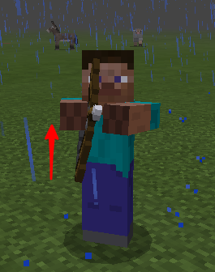

---
front:
hard: 入门
time: 分钟
---

# 自定义远程武器

## 1 概述

可蓄力物品如原版中的弓（minecraft:bow）、弩（minecraft:crossbow）一样，鼠标右键按下时进行蓄力，鼠标右键抬起发射武器。

自定义远程武器包括以下部分内容：

* 自定义物品
  * 序列帧动画，可用做射击动画
  * 右键蓄力后释放触发事件，可以在事件中发射自定义抛射物
  * 手中渲染偏移配置
* 自定义抛射物
  * 自定义贴图、模型、动画配置
  * 抛射物掉落在地上时捡起物品
  * 发射抛射物控制，包括发射力量、初始位置、方向、重力因子、造成伤害值等
  * 方向性抛射物

本文档将结合示例[CustomRangedWeaponMod](../13-模组SDK编程/60-Demo示例.md#CustomRangedWeaponMod)进行说明如何定义一把远程武器。

## 2 自定义可蓄力物品

### 2.1 自定义物品

**自定义可蓄力物品的identifier必须以:bow结尾，否则第三人称下的抬手动作不会生效。**



#### 2.1.1 json组件说明

* minecraft:use_duration

  物品最大使用时长，也就是物品蓄力过程的最大时长，与第三人称下抬起手的速度有关，该值越大，抬手速度越慢。

  下图分别展示use_duration为40和use_duration为100时的速度对比:
  
  ↑use_duration为40
  
  ↑use_duration为100
  **如果未配置`minecraft:use_duration`将不会播放该动画,并且蓄力时间没有上限，ItemReleaseUsingClientEvent/ItemReleaseUsingServerEvent这两个事件返回的durationLeft为负数。**

* netease:render_offsets

  手中物品渲染参数

* netease:frame_animation

  物品使用过程动画序列帧

* minecraft:use_animation

  使用物品时播放的动画，需在材质包中定义，如原版使用`apple`时会播放`eat`动画，在`resource_packs/vanilla/items/apple.json`中就有`"minecraft:use_animation": "eat"`配置。

  在自定义远程物品中，通常使用的是弓的动画，即`"minecraft:use_animation": "bow"`。


#### 2.1.2 行为包json配置

与《1-自定义基础物品》文档中的*1.2注册*部分一样，在`behavior/netease_items_beh`目录下增加物品json文件，如customrangedweapon_bow.json。

注意：description的custom_item_type字段标为**ranged_weapon**，同时identifier必须以:bow结尾（如：customrangedweapon:bow），否则第三视角下不会播放动画，如下示例：

```json
{
  "format_version": "1.10",
  "minecraft:item": {
    "description": {
      "identifier": "customrangedweapon:bow", # 必须是:bow结尾
      "custom_item_type": "ranged_weapon" # 此类型表示自定义远程武器物品
    },

    "components": {
      "minecraft:use_duration": 72000, # 该值影响抬手动作的速度
      "netease:render_offsets": {
        "controller_position_adjust": [ 0.0, 0.1, 0.0 ],
        "controller_rotation_adjust": [ 0.0, -45.0, 0.0 ],
        "controller_scale": 1
      }
    }
  }
}
```

netease:render_offsets在下面[自定义渲染偏移](#render_offsets)章节进行说明。


#### 2.1.3 自定义蓄力动画帧

* **资源包json配置**

在resource/netease_items_res下增加json文件，如customrangedweapon_bow.json

内容如下所示：

```json
{
  "format_version": "1.10",
  "minecraft:item": {
    "description": {
      "identifier": "customrangedweapon:bow", # 该值必须以:bow结尾
      "category": "Equipment"
    },
    "components": {
      "minecraft:icon": "customrangedweapon:bow",
      "netease:frame_animation": {
        "frame_count": 3,
        "texture_name": "customrangedweapon:bow_frame",
        "animate_in_toolbar": true
      }
    }
  }
}
```

* **json组件说明**

**netease:frame_animation**

| 键                 | 类型 | 默认值 | 解释                           |
| ------------------ | ---- | ------ | ------------------------------ |
| frame_count        | int  | 1      | 蓄力过程帧动画帧数             |
| texture_name       | str  |        | 蓄力过程帧动画texture映射名    |
| animate_in_toolbar | bool | false  | 蓄力过程在物品栏是否也显示动画 |

* **动画序列帧**

在resource/textures/items文件夹中增加三张贴图，分别是：

customitems_ranged_weapon_0.png

customitems_ranged_weapon_1.png

customitems_ranged_weapon_2.png


resource/textures/item_texture.json中如下所示：

```json
"customrangedweapon:bow": {
    "textures": "textures/items/customitems_ranged_weapon_0"
},
"customrangedweapon:bow_frame": {
    "textures": [
        "textures/items/customitems_ranged_weapon_0",
        "textures/items/customitems_ranged_weapon_1",
        "textures/items/customitems_ranged_weapon_2"
    ]
}
```

其中，这三张贴图文件后缀0、1、2分别表示动画的帧数。

至此，我们已经定义好了一个支持帧动画的可蓄力物品。

#### <span id="render_offsets"></span>2.1.4 自定义渲染偏移

另外，对于自定义可蓄力物品，我们增加了物品的偏移配置性。

**netease:render_offsets**

| 键                         | 类型  | 默认值        | 解释         |
| -------------------------- | ----- | ------------- | ------------ |
| controller_position_adjust | array | [0.0,0.0,0.0] | 物品位置调整 |
| controller_rotation_adjust | array | [0.0,0.0,0.0] | 物品旋转调整 |
| controller_scale           | float | 1.0           | 物品大小调整 |

### 2.2 视野变化控制

在[CustomRangedWeaponMod](../13-模组SDK编程/60-Demo示例.md#CustomRangedWeaponMod)中，我们使用camera组件提供的接口实现了一个类似弓拉近镜头效果的demo，这里简要地进行说明。

```python
def ListenEvent(self):
		self.ListenForEvent(conf.EngineNamespace, conf.EngineSystemName, 'OnScriptTickClient', self,
		                    self.OnScriptTickClient)
		self.ListenForEvent(conf.EngineNamespace, conf.EngineSystemName, 'ClientItemTryUseEvent', self,
		                    self.OnClientItemTryUseEvent)
		self.ListenForEvent(conf.EngineNamespace, conf.EngineSystemName, "RangedWeaponReleaseUsingClientEvent",
		                    self, self.OnRangedWeaponReleaseUsingClientEvent)

	def Init(self):
		self.cameraComp = self.CreateComponent(clientApi.GetLevelId(), "Minecraft", "camera")
		self.cameraComp.SetFov(self.initFov)

	def OnScriptTickClient(self):
		self.tickCnt += 1
		offset = self.tickCnt - self.startUsingTick
		if self.isUsingItem:
			self.cameraComp.SetFov(self.initFov - offset * 0.15)

	def OnRangedWeaponReleaseUsingClientEvent(self, args):
		self.isUsingItem = False
		if self.initFov:
			self.cameraComp.SetFov(self.initFov)

    def OnClientItemTryUseEvent(self, args):
		if args["itemName"] == "customrangedweapon:bow" or args["itemName"] == "customrangedweapon:cross_bow" or \
			args["itemName"] == "customrangedweapon:boa":
			# control camera
			self.isUsingItem = True
			self.startUsingTick = self.tickCnt
```

* 鼠标右键开始使用物品时标记正在使用物品isUsingItem，并且记录当前帧数startUsingTick
* 在OnScriptTickClient的回调事件中使用接口SetFov不断拉近镜头
* 在鼠标右键抬起释放事件RangedWeaponReleaseUsingClientEvent的回调中重置摄像机的fov


## 3 自定义抛射物

### 3.1 概述

场景中的自定义抛射物就是一种实体，其定义方式和自定义生物一样。

下面通过自定义箭来说明如何自定义一个抛射物。

### 3.2 自定义过程

* 在behavior/entities下添加entity定义，如示例中的custom_arrow.json

​          其中netease:custom_entity_type如下所示：

```json
"netease:custom_entity_type": {
	"value": "projectile_entity"
},
```

* 自定义抛射物捡起的物品

```json
"netease:pick_up": {
	"item_name": "customrangedweapon:projectile", # 捡起物品的id
	"favored_slot": 1 # 捡起物品放在物品栏的位置
}
```

* 在resource/entity下增加entity的表现定义，如示例中的custom_arrow.entity.json

  这里将贴图、材质、几何、动画、渲染控制器关联在一起。

  ```json
  {
  	"format_version": "1.10.0",
  	"minecraft:client_entity": {
  	  "description": {
  		"identifier": "customrangedweapon:custom_arrow",
  		"materials": {
  		  "default": "arrow"
  		},
  		"textures": {
  		  "default": "textures/entity/custom_arrows"
  		},
  		"geometry": {
  		  "default": "geometry.custom_arrow"
  		},
  		"animations": {
  		  "move": "animation.custom_arrow.move"
  		},
  		"scripts": {
  		  "pre_animation": [
  			"variable.shake = query.shake_time - query.frame_alpha;",
  			"variable.shake_power = variable.shake > 0.0 ? -Math.sin(variable.shake * 200.0) * variable.shake : 0.0;"
  		  ],
  		  "animate": [
  			"move"
  		  ]
  		},
  		"render_controllers": [ "controller.render.custom_arrow" ]
  	  }
  	}
    }

  ```

* 贴图

  在resource/textures/entity目录下增加custom_arrows.png作为自定义生物的贴图

* 几何形状

  在resource/models/entity目录下增加custom_arrow.geo.json定义自定义生物的几何形状

* 动画组件

  在resource/animations目录下增加custom_arrow.animation.json定义自定义生物的动画

  其中，因为箭的模型具有方向性，因此需要调整一下旋转角度rotation，如下所示：

  ```json
  {
  	"format_version" : "1.8.0",
  	"animations" : {
  		"animation.custom_arrow.move" : {
  			"loop" : true,
  			"bones" : {
  				"body" : {
  					"rotation" : [ "variable.shake_power - query.target_x_rotation", "-query.target_y_rotation", 0.0 ],
  					"scale" : [ 0.7, 0.7, 0.9 ]
  				}
  			}
  		}
  	}
  }
  ```


* 渲染控制器

  在resource/render_controllers目录下增加custom_arrow.render_controllers.json定义自定义生物的渲染控制器

### 3.3 使用自定义抛射物

#### 3.3.1 物品使用发射自定义抛射物

过程参考《自定义物品》文档，不同点包括如下两点：

1）custom_item_type为projectile_item

2）components下需要包括使用哪种抛射物（包括vallina或者自定义的抛射物）

```json
{
  "format_version": "1.10",
  "minecraft:item": {
    "description": {
      "identifier": "customrangedweapon:projectile",
      "category": "Nature",
      "custom_item_type": "projectile_item" # 自定义抛射物物品标记
    },

    "components": {
      "minecraft:max_stack_size": 32,
      "minecraft:max_damage": 10,
        "netease:show_in_hand": {
        "value": false
      },
      "netease:projectile": "customrangedweapon:custom_arrow" # 右键使用何种抛射物
    }
  }
}
```

上述例子在右键使用物品customrangedweapon:projectile时发射自定义抛射物customrangedweapon:custom_arrow

#### 3.3.2 python脚本直接发射自定义抛射物

python脚本层提供了创建抛射物（包括vallina或者自定义的抛射物）的接口CreateProjectileEntity，定义如下：

```python
def CreateProjectileEntity(self, spawnerId, entityIdentifier, param):
```

详情请查看mod sdk文档，示例如下：

```python
def ListenEvent(self):
	self.ListenForEvent(serverApi.GetEngineNamespace(), serverApi.GetEngineSystemName(),
		"ItemReleaseUsingServerEvent", self, self.OnItemReleaseUsingServerEvent)

	def OnItemReleaseUsingServerEvent(self, args):
		print 'ItemReleaseUsingServerEvent:', args
		playerId = args["playerId"]
		comp = serverApi.GetEngineCompFactory().CreateProjectile(levelId)
		projectileEntityId = comp.CreateProjectileEntity(playerId, "customrangedweapon:custom_arrow")
```


### 3.4 自定义抛射物方向

抛射物如果非圆形，它具有一定的方向性的话，需要通过animation把模型的方向进行调整，如示例[CustomRangedWeaponMod](../13-模组SDK编程/60-Demo示例.md#CustomRangedWeaponMod)中的自定义箭（custom_arrow）

```json
{
	"format_version" : "1.8.0",
	"animations" : {
		"animation.custom_arrow.move" : {
			"loop" : true,
			"bones" : {
				"body" : {
					"rotation" : [ "variable.shake_power - query.target_x_rotation", "-query.target_y_rotation", 0.0 ],
					"scale" : [ 0.7, 0.7, 0.9 ]
				}
			}
		}
	}
}

```

其中variable.shake_power为json定义的变量，用来做箭碰撞后的抖动；

query.target_x_rotation为引擎内定义的变量，返回此时自定义箭在x方向的旋转角度；

query.target_y_rotation为引擎内定义的变量，返回此时自定义箭在y方向的旋转角度。

另外，如果抛射物具有变化方向的话，需要进行数学运算得出最终的旋转角度。


### 3.5 其他相关

#### 3.5.1 相关事件

##### ProjectileDoHitEffectEvent

##### ProjectileCritHitEvent


#### 3.5.2 骨骼模型设置

自定义抛射物支持设置骨骼模型，参考如下：

```python
def changeModel(args):
	comp = clientApi.CreateComponent(args['id'], "Minecraft", "model")
	comp.SetModel("xuenv")
```


