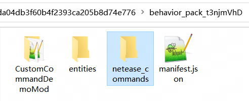
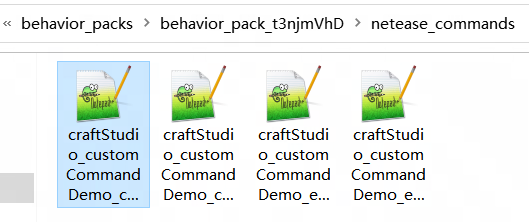
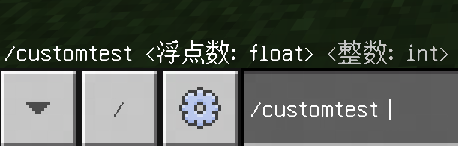
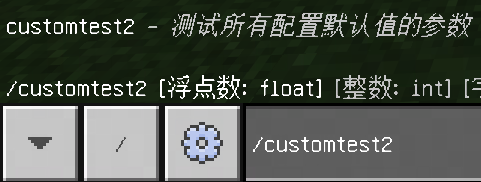
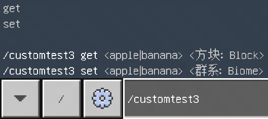
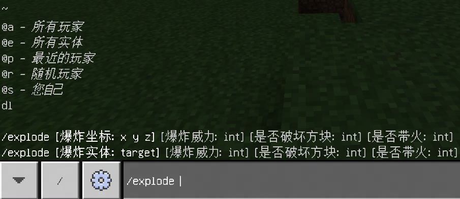

# 自定义指令

## 概述

开发者可以通过在行为包中配置json来添加自定义指令。添加的自定义指令支持在聊天栏预览和Tab补全，支持与指令相关的所有事件及接口。

## 注册

以demo [CustomCommandDemo](../13-模组SDK编程/60-Demo示例.md#CustomCommandDemo)为例。

1. 在behavior中新建`netease_commands`目录。

	

2. 在目录下新建一个json，编写指令的定义。json文件命名推荐为`团队名_模组命名空间_指令名称`，例如`craftStudio_customCommandDemo_explode`，文件名应使用英文数字和下划线，不可含有中文和特殊字符。

	

3. 打开json文件编写指令定义，以demo中的customtest2指令为例，文件位于`netease_commands/craftStudio_customCommandDemo_customtest2.json`。
	```json
	{
		"format_version": "0.0.1",
		"name": "customtest2",
		"description": "测试所有配置默认值的参数",
		"permission_level": "game_directors",
		"args": [
			{"name": "浮点数", "type": "float", "default": 123},
			{"name": "整数", "type": "int", "default": 12},
			{"name": "布尔值", "type":"bool", "default": true},
			{"name": "字符串", "type": "str", "default": "hello"},
			{"name": "目标", "type": "target", "default": "@s"},
			{"name": "位置", "type": "pos", "default": [2.5, 3.0, 4.4]},
			{
				"name": "实体",
				"type": "entity",
				"default": {"entityType": "minecraft:sheep"}
			},{
				"name": "物品",
				"type": "item",
				"default": {"itemName": "minecraft:apple"}
			}
		]
	}
	```

- 以下是代码和说明。

	|键|类型|默认值|解释|
	|:-|:-|:-|:-|
	|format_version|str||格式版本，请填写0.0.1|
	|name|str||指令名称，例如gamemode|
	|description|str||指令描述，也支持在语言文件（例如zh_CN.lang）中定义|
	|permission_level|str|权限等级，可选game_directors、admin、host、owner、any，具体含义如下<br>game_directors：任何操作员都可以运行此命令，包括命令方块<br>admin：任何操作员都可以运行此命令，但命令方块不能<br>host：任何服务器主机都可以运行此命令<br>owner：只有专用服务器可以运行此命令<br>any：任何人都可以运行此命令|
	
- args是一个包含object的列表，定义指令的参数。每个object都代表一个参数，object的顺序决定指令参数的输入顺序，每个object的参数说明如下

	|键|类型|解释|
	|:-|:-|:-|
	|name|str|参数名称，会在输入提示中显示|
	|type|str|参数类型，具体见<a href="../../../mcdocs/1-ModAPI/事件/世界.html#customcommandtriggerserverevent" rel="noopenner">CustomCommandTriggerServerEvent</a>事件的备注|
	|default|any|参数默认值，可填写任意json数据格式|

- 例如配置为`{"name": "浮点数", "type": "float"}`时，输入时会显示

	

- default不必和type的类型符合，**含有default的参数必须排在参数列表的尾部**，且在游戏中可以不传。<br>例如配置为`{"name": "浮点数", "type": "float", "default": null}`时，输入时会显示

	

## 使用

- 开发者需要监听<a href="../../../mcdocs/1-ModAPI/事件/世界.html#customcommandtriggerserverevent" rel="noopenner">CustomCommandTriggerServerEvent</a>，为自定义指令编写功能。
- 使用<a href="../../../mcdocs/1-ModAPI/接口/世界/指令.html#setcommand" rel="noopenner">SetCommand</a>接口可以触发自定义指令。
- 使用<a href="../../../mcdocs/1-ModAPI/事件/世界.html#globalcommandserverevent" rel="noopenner">GlobalCommandServerEvent</a>可以监听所有指令，包括自定义指令。

## 配置变体

写好自定义指令的一套参数后，可以使用args1、args2......args9来额外配置多套参数，加上原来的args，最多能配置10套参数，开发者可以通过<a href="../../../mcdocs/1-ModAPI/事件/世界.html#customcommandtriggerserverevent" rel="noopenner">CustomCommandTriggerServerEvent</a>的variant字段确定玩家发送的是哪一套参数。

```json
{
    "format_version": "0.0.1",
    "name": "customtest3",
    "description": "测试参数变体",
    "args": [
        ...
    ],
	"args1": [
        ...
    ],
	"args2": [
        ...
    ]
}
```

- 注意，配置指令变体时，变体区分处的参数（如首个参数）类型不能相同，例如，如果你注册了`/explode <pos> <float>`和`/explode <float> <pos>`，那么玩家调用/explode 1 1 1 1将无法解析。如果一定要这样设计，建议在前方加一个type为`enum`或`enum_short`的参数用于区分，`enum`的用法具体见示例mod中的`customtest3`指令。

	

## demo说明

- customCommandDemo实现了四个指令，`customtest`的三个指令用来给开发者测试用法，`explode`指令实现了让指定坐标或实体位置发生爆炸的功能。

	

- 该指令支持多种调用方式，示例如下
```
让发送指令的对象爆炸
/explode
让发送对象的上方8格爆炸
/explode ~~8~
让所有鸡爆炸
/explode @e[type=chicken]
让发送对象的上方8格爆炸，爆炸范围为3，不破坏方块，不产生火焰
/explode ~~8~ 3 false
让发送对象爆炸，爆炸范围为3，破坏方块，产生火焰
/explode @s 3 true true
```