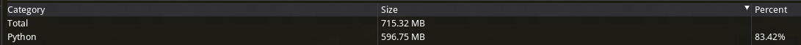

# 配置文件优化指南

本文介绍了如何优化Python配置文件的内存使用。

## 1. 使用结构优化建筑生成

在建筑生成和放置方面，我们推荐使用结构文件而不是Python配置。

### 使用feature\_rules控制建筑生成

参考教程：[自定义特征](../15-自定义游戏内容/4-自定义维度/4-自定义特征.md)

**优点：**

*   无需代码处理，无卡顿效果
*   采用微软原生机制，性能优异

**缺点：**

*   feature\_rules文件中的molang表达式不宜过于复杂
*   复杂的表达式可能导致内存占用增加，影响游戏加载速度

### 通过API放置structure


参考API：<a href="../../../mcdocs/1-ModAPI/接口/世界/地图.html#placestructure" rel="noopenner">PlaceStructure</a>

**优点：**

*   提供灵活的代码控制能力
*   可实现复杂的生成规则

**缺点：**

*   放置时可能出现短暂卡顿

## 2. 使用方块调色板节约内存

方块调色板可用于保存建筑数据。使用<a href="../../../mcdocs/1-ModAPI/接口/世界/方块组合.html#getblockpalettebetweenpos" rel="noopenner">GetBlockPaletteBetweenPos</a>等接口获取方块调色板后，使用<a href="../../../mcdocs/1-ModAPI/接口/方块/方块调色板.html#serializeblockpalette" rel="noopenner">SerializeBlockPalette</a>将调色板转化成字典后，手动存入配置文件中。

**优点：**

*   方块调色板是高度压缩的字典结构，可最大程度节约内存
*   对应的放置接口<a href="../../../mcdocs/1-ModAPI/接口/世界/方块组合.html#setblockbyblockpalette" rel="noopenner">SetBlockByBlockPalette</a>是原生c++批量放置，性能较好
*   可实现复杂的生成规则

**缺点：**

*   放置时可能出现短暂卡顿

## 3. 使用引用避免重复定义

在配置文件中，应避免重复定义相同的配置项，而是采用引用方式：

*   错误的写法

```python
# 存在大量重复的方块数据定义
building = {
    'build_A': {
        'size': [0, 1, 2],
        'blocks': [
            {'aux': 0, 'name': 'minecraft:air'},
            {'aux': 0, 'name': 'minecraft:air'},
            {'aux': 0, 'name': 'minecraft:air'},
            {'aux': 0, 'name': 'minecraft:air'},
            {'aux': 0, 'name': 'minecraft:air'},
            {'aux': 0, 'name': 'minecraft:air'},
            {'aux': 0, 'name': 'minecraft:air'},
            {'aux': 0, 'name': 'minecraft:air'},
            {'aux': 0, 'name': 'minecraft:air'},
            {'aux': 0, 'name': 'minecraft:air'},
            {'aux': 0, 'name': 'minecraft:air'},
        ],
    },
}
```

*   正确的写法

```python
# 定义基础方块数据
AirBlock = {'aux': 0, 'name': 'minecraft:air'}
GrassBlock = {'aux': 0, 'name': 'minecraft:grass'}
StoneBlock = {'aux': 0, 'name': 'minecraft:stone'}

# 通过引用复用方块数据
building = {
    'build_A': {
        'size': (0, 1, 2),
        'blocks': [
            AirBlock, AirBlock, StoneBlock, AirBlock, AirBlock,
            GrassBlock, AirBlock, GrassBlock, AirBlock, AirBlock, StoneBlock,
        ],
    },
}
```

## 4. 使用元组替代字典

对于只读的配置数据，建议使用元组代替字典，以提高内存使用效率：

*   错误的写法

```python
# 定义基础方块数据
AirBlock = {'aux': 0, 'name': 'minecraft:air'}
GrassBlock = {'aux': 0, 'name': 'minecraft:grass'}
StoneBlock = {'aux': 0, 'name': 'minecraft:stone'}
```

*   正确的写法

```python
# 使用元组存储只读数据，提高内存效率
AirBlock = ('minecraft:air', 0)
GrassBlock = ('minecraft:grass', 0)
StoneBlock = ('minecraft:stone', 0)
```

## 5. 分割配置文件并动态加载

如果你的配置文件已经有几十M的大小，建议将配置文件按功能模块分割，采用动态加载方式：

*   错误的写法

```python
# 一次性导入所有配置
from build import build1, build2, build3
```

*   正确的写法

```python
def load_build_config(data):
    building = data['build']

    if build == '1':
        # 按需导入配置
        import build1
        place_build(data, build1)
    elif build == '2':
        # 按需导入配置
        import build2
        place_build(data, build)
```

## 注意事项

*   建议将一个模块切割得尽量细，并结合前面所述的方法减少单个模块的大小，否则动态加载模块也会带来卡顿。
*   即便使用动态加载，如果玩家将各个类型的建筑都摆放一次，那么所有配置也会被加载进来，大量占用内存。
*   如果想进一步优化，可以将配置存储为json文件，通过json方式使用和卸载，相关接口<a href="../../../mcdocs/1-ModAPI/接口/通用/工具.html#getmodconfigjson" rel="noopenner">GetModConfigJson</a>。
*   可以使用`zlib`库压缩数据。

## 优化效果

**优化前内存占用715.32M、优化后占用下降到了224.46M**

优化前的内存占用（使用方块探针工具）：


优化后的内存占用（使用方块探针工具）：


## 总结

1.  优先使用结构文件/方块调色板存储大型数据
2.  使用类组织相关配置
3.  采用引用而不是重复定义
4.  使用元组存储只读数据
5.  按功能分割配置文件