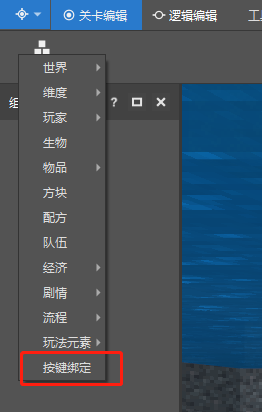
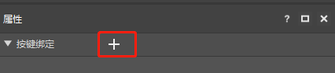
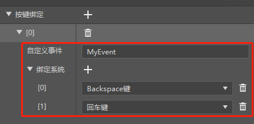
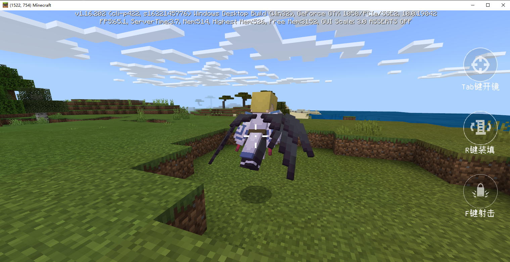
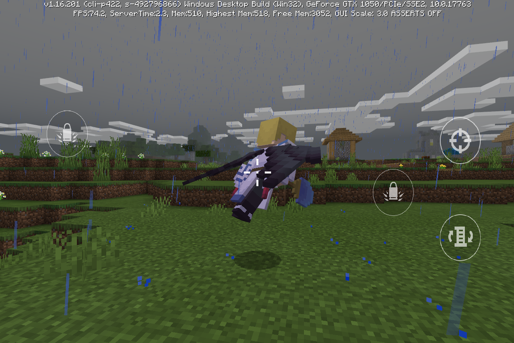

# PE模组适配PC

PE模组由于最初的开发目标是在移动端运行，因此不论是界面还是逻辑都无法直接用于PC端，其中最主要的限制在UI显示和按键上。因为PE端的界面输入来源于对屏幕的点击，显示UI上就需要有接收点击事件的按钮，以及处理按钮回调的逻辑代码，而到了PC端，大部分界面输入都可以用键盘事件取代，UI的显示也必然会不一样。

本课程将会从按键绑定适配和平台UI适配两个方面教学PE模组适配PC，并使用旧版简易射击模板做示例，方便开发者理解。

## 按键绑定适配

为了方便开发者适配PC按键，MCEditor关卡编辑器新增了按键绑定组件。该组件可以帮助开发者进行自定义事件的注册以及自定义事件与键盘、鼠标等按键的绑定响应，当键盘按键按下或抬起时，该自定义事件将自动调用<a href="../../../mcdocs/1-ModAPI/接口/通用/事件.html#notifytoserver" rel="noopenner"> NotifyToServer </a>接口广播给服务端，自动调用<a href="../../../mcdocs/1-ModAPI/接口/通用/事件.html#broadcastevent" rel="noopenner"> BroadcastEvent </a>接口广播给客户端，开发者仅需要监听自定义事件的响应即可。

### 按键绑定组件

在关卡编辑器中新建按键绑定组件，如下图。



创建完成后，点击按键绑定节点即可在属性窗口进行按键绑定设置。

首先点击下图中的"+"按钮添加一个自定义事件绑定。



然后填入自定义事件字符串，并添加若干想要绑定的系统按键，如下图。



完成绑定后，当该模组运行时按下Backspace或回车键，MyEvent自定义事件就会被触发，开发者可以监听MyEvent事件在客户端和服务端做相应的回调处理。

### 旧版简易射击模板中的按键绑定

简易射击模板的界面中共有三个按钮，对应开枪、开镜、装弹功能，并添加一个射击游戏非常常用的按住Alt键呼出鼠标的功能，因此可以使用按键绑定组件进行重构。


如图所示，注册四个自定义事件，ReloadEvent绑定R键对应装弹，Shoot绑定F键对应射击，AimEvent绑定Tab键对应开镜，AltEvent绑定Alt键对应呼出鼠标。

那其中的射击举例，绑定完成后，在服务端代码中监听Shoot事件并编写回调，即可在按下F键时执行射击逻辑。

```python
class FpsServerSystem(ServerSystem):
    def ListenEvent(self):
        ......
        self.ListenForEvent(inputBindConfig.ModName, inputBindConfig.InputBindClientSystem, modConfig.ShootEvent, self, self.OnKeyBoardShoot)

    def OnKeyBoardShoot(self, args):
        isDown = args["isDown"]
        if isDown == '0':
            self.OnShoot(args)

```

## 平台UI适配

由于PE和PC的操作不同，导致UI的表现也有不同，因此我们需要根据当前平台的不同创建不同的UI。

这里，我们直接使用<a href="../../../mcdocs/1-ModAPI/接口/通用/本地设备.html#getplatform" rel="noopenner"> GetPlatform </a>接口进行获取，然后根据返回结果创建不同的UI。

### 旧版简易射击模板中的平台UI适配

这里直接给出代码。

```python
    def OnUIInitFinished(self, args):
        ......
        if clientApi.GetPlatform() == 0:
            self.mFpsBattleUINode = clientApi.CreateUI(modConfig.ModName, modConfig.FpsBattlePCUIName, {"isHud": 1})
        else:
            self.mFpsBattleUINode = clientApi.CreateUI(modConfig.ModName, modConfig.FpsBattleUIName, {"isHud": 1})

```

在PC上显示的界面如图



在PE上显示的界面如图

