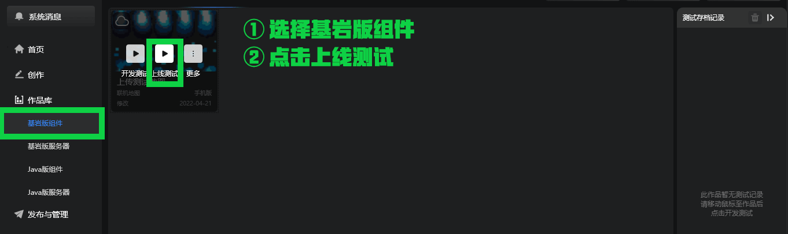
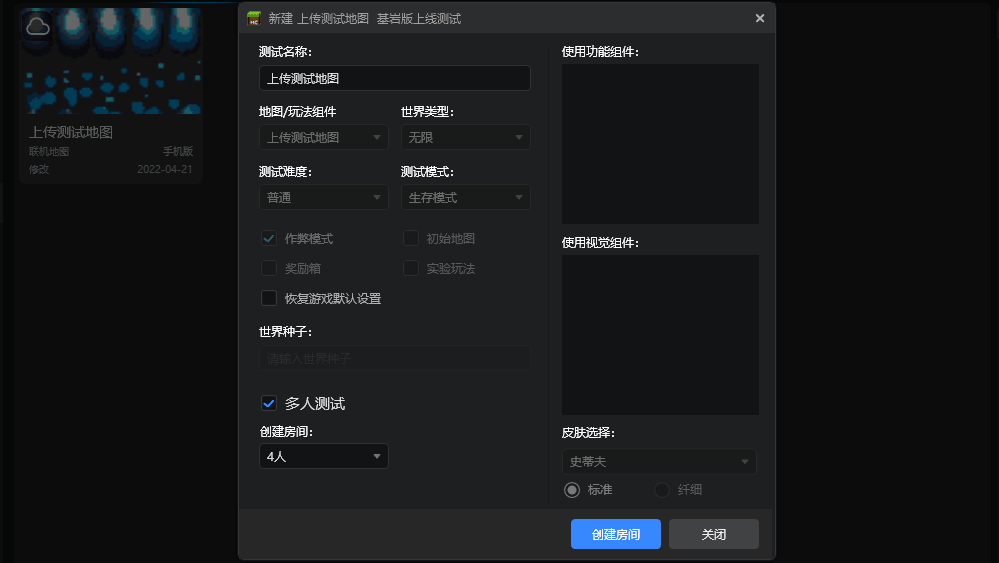
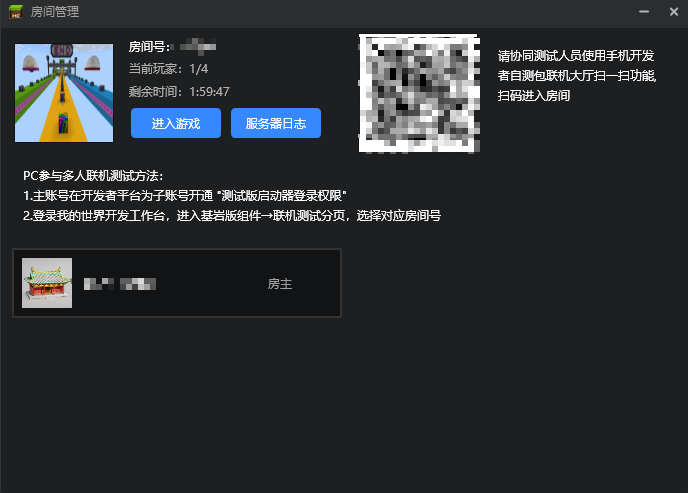
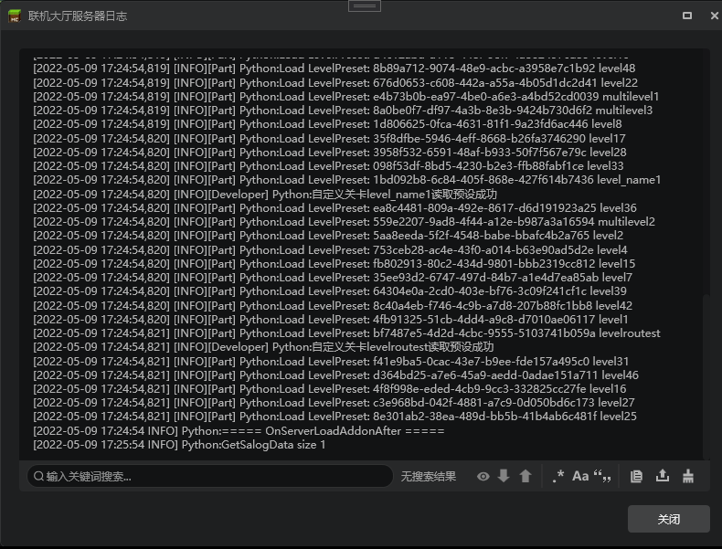
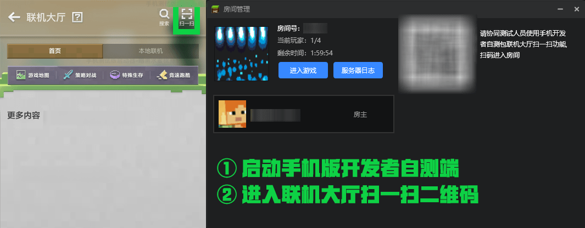
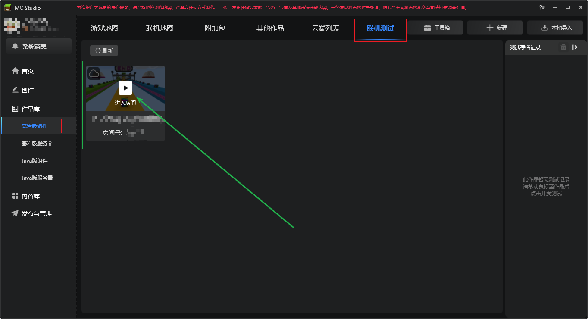
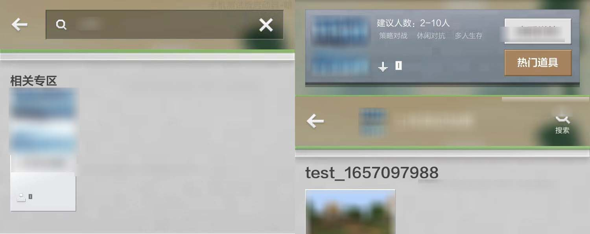

# 联机大厅调试与多人测试文档

联机大厅作品在运行上使用 **远程主机** 托管游戏， **本地玩家** 加入线上的形式进行游戏。考虑到手机游玩与电脑开发上有可能存在实际差异，联机大厅地图作品在本地开发完成后，强烈建议开发者根据所发布的联机地图作品类型，分别在手机版自测开发包和电脑版客户端进行模拟联机大厅的线上自测。

**在本地测试时，日志窗口只会显示本地客户端的日志** ，这在联机大厅作品测试上是远远不够的。 使用多人上线测试不仅方便发现问题，还可以拉起服务端日志进行日志分析。

## 一、房主开启多人测试，建立房间
进入 **《我的世界》开发工作台** ，点击 **【作品库】** - **【基岩版组件】** - **【联机地图】** ，点击上线测试以拉起服务端日志。

勾选 **【多人测试】** ，点击 **【创建房间】** ，耐心等待房间开启。

房间开启后，可以在 **【房间管理】** 窗口找到服务器日志按钮，点击即可打开服务器日志。

服务器日志如下图。点击进入游戏后，会自动拉起脚本测试日志，两个日志窗口会同时存在，一个显示客户端日志，一个显示服务端日志。

## 二、其他玩家加入游戏，进行多人联机测试
房间开启完成后，同一个开发者账号下的子账号可以进入房间并进行联机测试，且可以同时允许PC和手机版自测包进入同一个房间，详情如下。

### 1. 手机版自测包进入多人测试
打开手机版开发者自测包，进入联机大厅后使用 **【扫一扫】** 功能扫描服务器日志按钮旁的二维码，进入房间与开发成员进行联机。

有关手机版开发自测包的下载链接，可以访问[开发者平台网站](https://mcdev.webapp.163.com/#/square)后点击左上角的【手机版测试工具下载】进行下载。

### 2. 电脑版客户端进入多人测试

在其他电脑启动我的世界开发工作台并登录对应的测试子账号，进入点击 **【作品库】** - **【基岩版组件】** - **【联机测试】** 分页 ，此时可以看见当前主账号和子账号体系下开启的多人测试房间，根据房间号寻找对应测试房间并进入测试。

## 商品购买测试
> 当前仅支持在手机版开发自测包内进行商品购买测试，我的世界开发工作台暂不支持商品测试。

商品位于 **【资源中心联机大厅道具橱窗】** 时：

- 在联机大厅首页点击搜一搜，找到对应作品。
- 点击热门道具，进入商品橱窗进行购买。

商品位于 **【游戏内道具橱窗可见】** 时：

- 点击游戏内左上角的商品按钮。
- 在商品页面内进行选购。

有关联机大厅作品商品编辑与上架，[可查看此文档链接](./5-联机大厅作品与商品上传文档.html)。