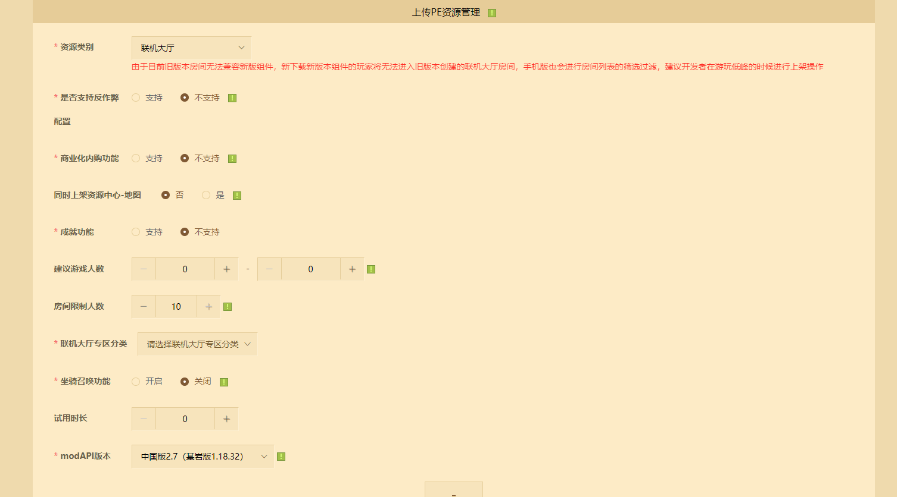
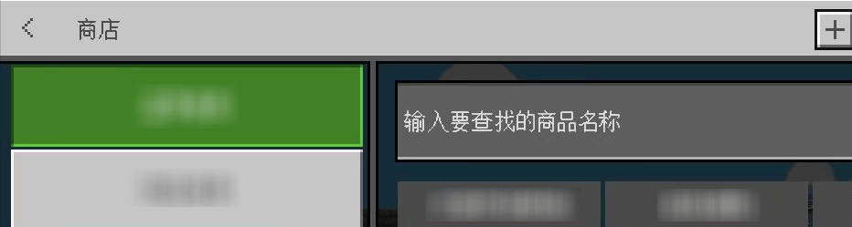
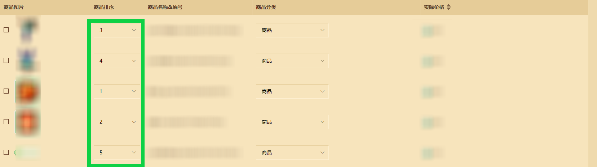

# 联机大厅作品与商品上传文档

联机大厅作品通常包括一张具有良好联机体验的多人玩法地图，内置附加包或命令方块，并且搭配契合主题的建筑大观。

玩家可以在联机大厅创建对应作品的 **远程房间** ，这些房间将不会因为创建玩家的离开而被关闭，只要始终有玩家活动，房间就会一直存在。帮助房主玩家最大限度地减少数据带宽与设备负担。

开发者需在开发者平台上传联机大厅作品，并使用《我的世界》开发者工作台进行作品开发与多人自测。


## 联机大厅作品打包

当前联机大厅作品需要通过本地打包的方式上传至开发者平台，可携带附加包增强游戏体验。作品需要使用ZIP格式进行压缩，绝大部分的电脑系统和手机系统皆支持压缩此类格式。

打开目标地图作品文件夹，若地图内存在 **【netease_world_behavior_packs.json】** 和 **【netease_world_resource_packs.json】** ，需在文件名称开头去掉 **【netease_】** ，并按照下方规范进行更改：


**【world_behavior|resource_packs.json】** 文件内默认接受一个数组，数组内可以传入多个资源包或行为包清单文件信息，以帮助地图可以识别需要加载的包体。其中：

- pack_id：对应单个资源包或行为包 **【清单文件（manifest.json|pack_manifest.json）】** 下header键对的uuid值。
- version：对应单个资源包或行为包 **【清单文件（manifest.json|pack_manifest.json）】** 下header键对的version值。
- type：必填项，值为 **【"Addon"】** 。

```json
// behavior_packs/some_behavior/manifest|pack_manifest.json
{
  "format_version": 1,
  "modules": [
    {
        //....
    }
  ],
  "header": {
    "description": "",
    "name": "behavior_pack",
    "uuid": "93c89241-3ecb-478f-a16c-c5eb99ceb580", // 对应world_behavior_packs.json的某对pack_id
    "version": [ 0, 0, 1]// 对应world_behavior_packs.json的某对version
  }
}
```

```json
// resource_packs/some_resource/manifest|pack_manifest.json
{
  "format_version": 1,
  "modules": [
    {
        //....
    }
  ],
  "header": {
    "description": "",
    "name": "resource_pack",
    "uuid": "614ba977-6b46-42da-afb6-50fa5a568ab6",// 对应world_resource_packs.json的某对pack_id
    "version": [ 0, 0, 1]// 对应world_resource_packs.json的某对version
  }
}
```

```json
// world_behavior_packs.json
[

	{
		"pack_id" : "93c89241-3ecb-478f-a16c-c5eb99ceb580",
        "type": "Addon",
		"version" : [ 0, 0, 1 ]
	}
]
```

```json
// world_resource_packs.json
[
    {
        "pack_id": "614ba977-6b46-42da-afb6-50fa5a568ab6",
        "type": "Addon",
		"version" : [ 0, 0, 1 ]
    }
]
```

并再次确认behavior_packs与resource_packs已携带相应的资源包和附加包。


右键整个地图文件夹并压缩成zip格式，即可完成打包。地图文件夹即包括了整个地图文件内容的最上级文件夹，下列使用UploadMap名称指代最上级文件夹。

```yaml
UploadMap："最上级文件夹"
内容:
- "behavior_packs"
- "db"
- "resource_packs"
- "level.dat"
- "level.dat_old"
- "levelname.txt"
- "world_behavior_packs.json"
- "world_resource_packs.json"
```


## 联机大厅作品上传

进入开发者平台，点击 **【作品管理】** - **【上架与资源管理】** ，选择发布一个新的 **【手机版】** 新资源。


填写联机大厅作品的基本信息，其中付费类型选择 **【multiplayer world】** 。


资源类型选择 **【联机大厅】** 。根据实际需要选择是否打开 **【商业化内购】** 功能。最后选填至多3个联机大厅专区分类并上传包体，提供辅助审核与玩家了解的作品简介和视频信息即可完成资源编辑操作。

**注意：开启【商业化内购功能】后将不支持同时上架地图至资源中心-地图分区。已上架联机大厅但未支持商业化内购功能的，同时未设置过同步上架至资源中心地图分区的作品，支持重新开启【商业化内购功能】。**




> 1. 【是否支持反作弊】选项是指是否开启原生游戏自带的反作弊功能，会限制玩家的非常规行为，默认为不支持，即关闭反作弊选项；
> 2. 若开启反作弊选项可能会导致玩家的镜头和动作出现抽搐和卡帧现象。
> 3. 建议开发者根据作品是否包含强制修改玩家镜头、动作，以及游戏类型是否需要开启反作弊保证公平性两个方面来决定是否开启反作弊选项。


## 联机大厅作品商品编辑

在 **【上架与资源管理】** 页选择 **【手机版平台】** - **【联机大厅商品】** ，可以对已保存的联机大厅作品进行商品创建、编辑与上架。


### 商品创建

点击 **【库存编辑】** ，再点击 **【添加商品】** 创建联机大厅内购商品。


填写商品的基本信息，其中：

- 商品简介：展示于商品
- 商品定价：玩家购买需要消费的货币数额，支持钻石、绿宝石或免费定价。
- 购买次数：玩家可购买内购商品的次数，若填写-1代表可无限次购买，其余购买次数请将数字设置大等于1。
- 购买场景：需至少在 **【游戏内道具橱窗可见】** 和 **【资源中心联机大厅道具橱窗可见】** 选择一个购买入口，也可在两处同时展示。 **自测作品期间，商品可选择提审后在《我的世界》基岩版手机自测开发端相应的购买场景找到，方便开发者进行商品测试。**

| 展示类型                         | 示例图片                                                     |
| -------------------------------- | ------------------------------------------------------------ |
| 【游戏内道具橱窗可见】           |  |
| 【资源中心联机大厅道具橱窗可见】 |             |

- 商品分类：可自定义商品分类，需要选择其中一个分类。 **每个联机大厅作品自带一个商品分类，可自定义默认分类显示第一个分类名称，后续新的分类点击添加分类即可再次自定义新的名称和分类。**
- 付费类型：默认选择 **【multiplayer world commodity】** 即可。
- 付费备注：主要用于审核时进行信息备注。
- 实现指令：使用<a href="../../mcdocs/1-ModAPI/接口/联机大厅.html#QueryLobbyUserItem">QueryLobbyUserItem</a>获取玩家未发货的商品信息后，可在返回字典内获取到的cmdStr字段值。常用来判断发货的商品类型，或者搭配Python内置的Json模块为业务提供可被反序列化的结构，进而协助完成商品发放。


详情信息内的文字将显示在对应商品的详情信息区域内。进入购买场景，每个商品分类下会显示不同商品的商品封面，轮播图则只会在资资源中心联机大厅道具橱窗才会展示，具体位置可参考以下示例：


点击 **【保存】** 即可完成商品创建。


## 联机大厅作品商品自测

联机大厅作品商品支持在《我的世界》手机版自测开发包进行自测，开发者需要先在开发者平台上点击 **自测** ，方可在自测端内看到购买入口。


**注意：手机版自测开发包将不会显示设定的商品分类，开发者可以预先设置并在之后的线上版本查看正式效果。**

使用《我的世界》开发工作台联机大厅多人上线自测功能，可以在手机版开发者自测包进行商品购买，触发游戏内的发货逻辑，验证商业化功能的完整性。[详情可查看此文档链接。](./20-联机大厅调试与多人测试文档.html)


## 联机大厅作品商品上架

联机大厅作品商品过审后，开发者可以在 **【库存编辑】** 页下点击 **【更新到橱窗】** 将商品更新至 **【橱窗编辑】** 。


接着在 **【橱窗编辑】** 页中，开发者可以对商品进行展示排序的设定，接着选择点击 **【完整更新橱窗列表】** 在线上向玩家进行展示。



若商品需要下架，需要在对应商品行目上勾选左侧的确认框，点击下架按钮下架商品。

**注意：下架商品无需审核，后续商品可以在【库存编辑】页下重新更新到橱窗。下架后且未编辑过的商品可在下次更新时跳过审核，但已重新编辑过信息的商品则需要重新提审。**


