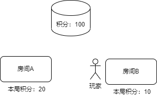
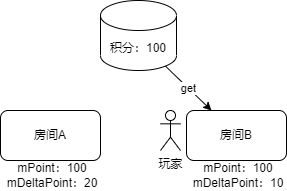
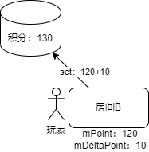

# 联机大厅商品2.0文档

**《我的世界》手机版联机大厅** 现已开放 **商业化** 与 **数据储存** 接口，打破开发者的创作边界，为联机游戏开发提供体验式购买、玩家数据持久化等全新条件。


## 数据储存说明

对比资源中心组件，联机大厅的数据储存接口支持上报游戏数据至云端数据库，支持跨存档及跨房间存取数据信息。每创建一个联机大厅作品，皆可在 **自测阶段** 和 **线上阶段** 对全局与单个玩家数据进行单独托管。

| 接口类型         | 服务范围                   | 有效范围                   | 数量 |
| ---------------- | -------------------------- | -------------------------- | ---- |
| 自定义数据储存   | 资源中心组件\|联机大厅玩法 | 单个游戏存档               | 1    |
| 联机大厅数据储存 | 联机大厅玩法               | 同玩法内的全部联机大厅房间 | ∞+   |


使用联机大厅数据储存功能，开发者便可以根据规范的 **接口调用** 与 **数据结构格式** ，将游戏内的 **成长数值** 、 **货币金额** 、甚至 **背包信息** 等内容由玩家从一个房间带到另一个房间，与不同房间的玩家分享无限可能的乐趣。

| 常见的数据储存类型 | 应用方向                        |
| ------------------ | ------------------------------- |
| 成长数值           | 经验\|等级\|签到天数\|RPG属性等 |
| 回合结算           | 小游戏\|回合制等                |
| 货币金额           | 装备交易\|购买商品等            |
| 背包信息           | 玩家背包\|额外行囊等            |


## 商品化说明

商品化允许开发者创建体验式购买，即玩家凭意愿和对玩法的认可程度，在联机大厅房间里购买增值服务与物品，让每个开发者的热爱有所回响。

| 常见的商品类型 | 应用内容                  |
| -------------- | ------------------------- |
| 特殊外观       | 人物、武器、装备、道具    |
| 增值服务       | 喊话、称号、VIP权限、礼包 |
| 游戏通行证     | 唯一次购买的限量道具      |


## MODSDK的API与事件

### API

- <a href="../../mcdocs/1-ModAPI/接口/联机大厅.html#querylobbyuseritem">QueryLobbyUserItem</a>

  查询还没发货的订单

- <a href="../../mcdocs/1-ModAPI/接口/联机大厅.html#lobbysetstorageanduseritem">LobbySetStorageAndUserItem</a>

  设置订单已发货或者存数据

- <a href="../../mcdocs/1-ModAPI/接口/联机大厅.html#lobbygetstorage">LobbyGetStorage</a>

  获取存储的数据

- <a href="../../mcdocs/1-ModAPI/接口/联机大厅.html#lobbygetstoragebysort">LobbyGetStorageBySort</a>

  排序获取存储的数据，在开发者平台上配置的可排序的key才可以查询
### 事件
- <a href="../../mcdocs/1-ModAPI/事件/联机大厅.html#lobbygoodbuysucserverevent">lobbyGoodBuySucServerEvent</a>
	当玩家购买完商品，或者玩家登录进联机大厅mod时触发


## 示例mod

[lobbyGoodsMod2.0](../20-玩法开发/13-模组SDK编程/60-Demo示例.html)展示了一个基本玩法：

- 玩法内设计了“金币”的虚拟货币，使用key为money存储，并且设置为可排序的key。
- 玩法上架了一个商品，玩家购买后可获得100金币，商品的实现指令为add_money_100
- 玩家可以通过聊天栏输入buysword获得初始装备“钻石剑”的7天有效期，有效期内玩家每次进入新房间都会获得一把钻石剑。重复购买会叠加有效期。
- 玩家可以在战斗中每击杀一个僵尸获得1个金币，获得的金币在战斗结束时统一结算。聊天栏输入endbattle触发战斗结算。
- demo的主要流程如下，详情可阅读demo的代码注释


## Q&A

### 为什么会有数据冲突的情况？

根本原因是，可能会有多个联机大厅房间同时修改同一个玩家的数据，同一个房间的get与set操作之间，可能被插入了其他房间的set操作。

假设我们以这样的流程设置数据（注意这个流程是错的！）：

1. 每个房间记录这一局战斗玩家获得的积分
2. 战斗结束时统一结算，先获取玩家最新积分，然后加上本局积分set回去

就有可能出现这样的情况：

1. 某个玩家在云端的积分是100

2. 这个玩家进入了房间A，并且在这一局游戏内的积分是20

   

2. 然后这个玩家先阵亡了，于是退出了房间A（这时房间A的战斗还没结束，也还没有进行结算），进了另一个房间B，然后获得了10个积分

   

3. 然后房间A和房间B同时结算了：两个房间都去获取云端积分，获取到的都是100

   

4. 于是房间A会设置积分为120，房间B设置积分为110。无论设置的先后顺序如何，结果都是错的！正确的积分应该是130！

   

### 那应该怎么保证数据的正确性？

为了防止上面所说的这种情况，每次设置数据时都会附带一个“版本号”，每次设置数据的版本都是上一次获取到的版本加一，这样云端就可以根据版本号判断数据时候被别的容器修改过，也就是冲突。这个版本号控制已经由引擎内部控制好，不需要开发者操心，您只需要按api文档里的规范处理好冲突即可。

我们推荐的数据控制流程如下（以积分为例）：

1. 每个房间维护两个容器，一个容器（mPoint）存放云端积分，另一个容器（mDeltaPoint）存放这个房间产生的积分的差异（例如+10分或者-10分）

2. 玩家登录时get数据，存放到mPoint。如果获取不到，则把默认积分（例如1000）放入mPoint

3. 结算，调用LobbySetStorageAndUserItem

4. 上传的积分为mPoint的积分加上mDeltaPoint的积分

   ```python
   def getter():
       return [
           {
               'key': 'point',
           	'value': self.mPoint[playerId] + self.mDeltaPoint[playerId]
           }
       ]
   ```

5. 如果返回数据冲突，则用返回的最新积分更新mPoint

6. 然后引擎会自动重试第4步

下面解释一下为何这个流程可以避免数据覆盖：

1. 某个玩家在云端的积分是100

2. 这个玩家进入了房间A，房间获取到该玩家的云端积分是100（同时也会获取到对应的“版本号”），并且在这一局游戏内的积分是20

   

3. 然后这个玩家先阵亡了，于是退出了房间A（这时房间A的战斗还没结束，也还没有进行结算），进了另一个房间B。

   房间获取到该玩家的云端积分是100（同时也会获取到对应的“版本号”），然后玩家在这一局游戏内的积分是10

   

4. 房间A和房间B同时结算：房间A想要设置积分为100+20，房间B想要设置积分为100+10。

   假设房间A的请求先到达，这时云端积分成功设置为120（同时“版本号”+1）

   

5. 房间B的请求后到达，这时候云端发现版本号不一致！于是将最新的数据（120）返回给房间B。房间B收到后更新本地的mPoint

   

6. 房间B的引擎重新调用getter并提交数据，此次设置的积分为120+10，设置成功，最终数据正确。

   

### 为什么demo的lobbyGoodsServerSystem.py，_EndBattle函数中要求将callback，getter以及接口的调用封装到一个子函数内？

假设我们不封装，写成以下的样子：

```python
    def _EndBattle(self):
        for playerId in self.mBattleMoney.keys():
            def getter():
                return [
                    {
                        'key': 'money',
                        'value': self.mMoney[playerId] + self.mBattleMoney[playerId]
                    }
                ]
            def callback(data):
                print playerId
                ...
            httpComp.LobbySetStorageAndUserItem(callback, self.mUid[playerId], None, getter)
```

因为LobbySetStorageAndUserItem的调用是异步的，getter与callback可能不会马上被调用。

当他们被调用时，这个for循环可能已经结束了，而此时playerId的值是mBattleMoney中的最后一个！

如果多一层函数调用，则不会出现这种情况，playerId的遍历不会影响到子函数的参数。

### 我的玩法不是按局计算，数据会实时更新，我应该如何减小set的频率？

1. 每隔一定时间（例如5分钟）更新数据到云端
2. 玩家退出时更新数据到云端

set接口频率上限为50次/秒，5分钟的间隔可以保证5\*60\*50=15000名以内的玩家同时在线，以此类推

如果需要承载玩家数量的量级更高，则要舍弃定时上传，只在玩家退出时上传

### 我的玩法不是按局计算，数据会实时更新，我应该如何维护数据的正确性？

对于定时上传，可以参考以下写法：

```python
def callback(data):
    if data:
        code = data['code']
        if code==0：
        	# 设置成功
            newData = {i["key"]: i["value"] for i in data["entity"]["data"]}
            newPoint = newData.get('point', DEFAULT_POINT)
            # 给mDeltaPoint减去上传成功的差量（不能直接清零，因为在调用返回之前mDeltaPoint可能会被更新）
            self.mDeltaPoint[playerId] -= newPoint - self.mPoint[playerId]
            # 使用返回的新数据更新mPoint
            self.mPoint[playerId] = newPoint
        else if code==2:
            # 数据冲突，直接用返回的数据更新mPoint
            newData = {i["key"]: i["value"] for i in data["entity"]["data"]}
            self.mPoint[playerId] = newData.get('point', DEFAULT_POINT)

def getter():
    return [
        {
            'key': 'point',
            'value': self.mPoint[playerId] + self.mDeltaPoint[playerId]
        }
    ]

```


