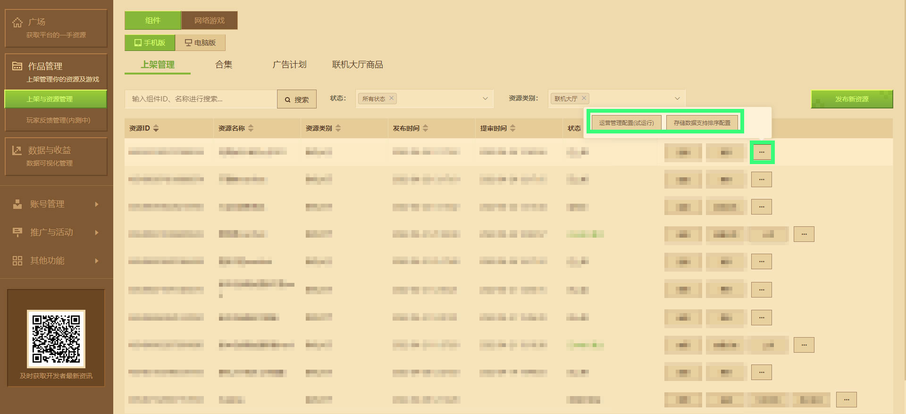

# 联机大厅运营管理配置试运行文档

**《我的世界》** 持续致力于打造更完善的 **开发者内容生态** 。自 **模组SDK2.0** 开放联机大厅地图内购功能以来，官方收到了许多开发者对于全新 **开发赛道** 的热情建议。通过对大家需求的综合评估，现在可以通过开发者平台配置 **已上线** 联机大厅玩法的 **运营信息** 。

**注： 联机大厅运营管理配置正在试运行中，具体使用文档不代表功能最终的呈现效果。我们将持续收集广大开发者的建议和试用反馈，您可以通过开发者平台左上方的【开发者常见问题答疑】- 【反馈其他问题】与我们取得联系。**


## 运营信息说明

**模组SDK联机大厅模块** 将支持获取开发者在内容管理平台中的运营管理配置，实现不通过玩法包体更新就能够灵活管理的联机大厅活动、数值等操作，大大提升联机大厅组件的开发者运营能力。以下将用说明和示例为开发者讲解运营配置的作用和常见用例。

**注意：运营管理配置功能目前仅支持手机版联机大厅，电脑版本以及其他平台暂时不支持。**

### 作用

运营信息是与游戏玩家内直接互动的功能模块，它的主要作用就是为玩家服务，配置游戏内运营活动，通过公告、邮件、跑马灯等形式通知玩家即将更新的功能或优化内容。

### 常见用例

#### 邮件

邮件主要作用是奖励发放/内容通知，常在内容更新、BUG通知、活动奖励发放时使用。

#### 跑马灯

直接在游戏内显示，通常在临时维护/突发紧急情况下通过后台编辑内容发放告知玩家。

#### 游戏内公告

游戏内公告主要作用是通知玩家信息（更新信息、活动信息等），公告形式较为简单。

#### 问卷调查

一般在游戏新功能上线期间，通过后台配置想要问玩家的问题，了解各系统玩家在玩家看来的满意度，通过奖励激励玩家作答。

#### 名称自定义

常用在激励玩家通过充值消费一定金额给与冠名特权，为方便操作直接在后台实现修改玩家昵称前缀（prefix）和后缀（suffix）。

#### 运营活动配置

可在后台直接配置游戏内的周期性活动或节日运营活动。


## 运营管理配置操作流程

进入开发者平台，点击 **【作品管理】-【上架与资源管理】** ，在组件标签下选择手机版，找到已上线的联机大厅资源，点击右侧 **【···】** 选择 [**运营配置管理（试运行）**](#运营配置管理（试运行）) 或 [**【存储数据支持排序设置】**](#存储数据支持排序设置) 。

**注意：运营配置与存储数据排序设置无需审核，但官方会定期对数据信息进行审核，确保符合平台规范，保障官方、开发者与玩家的权益。**




### 运营配置管理（试运行）

运营管理配置试运行期间仅支持设置运营数据，提交的信息格式需为JSON。开发者可直接点击 **【JS校验与格式化】** 对数据格式进行规范。借由 **模组SDK** 接口获取数据信息，最终将结果通过开发者预设的代码逻辑反映到联机大厅房间内。

**注意：每次提交的JSON配置会顶替掉上一次的配置信息。请在本地保存好上一次提交的数据配置。**

平台同时支持设置【手机版测试工具自测环境】和【正式服环境】的运营数据，方便开发者在手机测试工具上校验数据正确性后，再提交至正式服环境。


请在提交配置时，务必填写配置说明理由。以便审核人员审核数据信息的安全性、合规性。

在对应的联机大厅玩法中，开发者可以使用<a href="../../mcdocs/1-ModAPI/接口/联机大厅.html#lobbygetstorage">LobbyGetStorage</a>接口，传入uid为0、key为带有op_config的列表参数，获取来自开发者平台的运营管理配置中配置的数据。

```python
def callback(data):
	if data:
        # 在代码块下执行自己的业务逻辑
        print { i["key"]: i["value"] for i in data["entity"]["data"] }
httpComp = compFactory.CreateHttp(serverApi.GetLevelId())
# 返回来自开发者平台的运营管理配置中配置的数据。注意：每次在开发者平台提交的JSON配置数据会顶替掉上一次的配置信息。
httpComp.LobbyGetStorage(callback, 0, ['op_config'])
```

Callback需要接受一个参数。当请求失败时，参数返回None，当请求成功时，参数为一个Dict，格式如下。（获取的key如果没有设置过，就不会出现在返回的最新数据中）。

```json
{
    "entity": {
        "data": [
            {
                "key": str,     // 数据的key
                "value": int/float/str  // 数据的值
            },
            {
                //...
            }
        ]
    }
}
```


### 存储数据支持排序设置

存储数据支持排序配置支持对联机大厅玩法云端数据进行升序或降序，实现类似游戏内排行榜展现的场景实现。根据对应玩家数据存储的 **数据键（key）** ，点击窗口内的 **【+添加key】** ，联机大厅玩法可以在每次房间启动后，借助官方封装的接口对数据进行及时排序，并完成对应的玩法逻辑。


平台同时支持设置【手机版测试工具自测环境】和【正式服环境】待排序的 **数据键（key）** ，方便开发者在手机测试工具上校验数据正确性后，再提交至正式服环境。

存储玩家数据使用到联机大厅模组开发接口<a href="../../mcdocs/1-ModAPI/接口/联机大厅.html#lobbysetstorageanduseritem">LobbySetStorageAndUserItem</a>，配合<a href="../../mcdocs/1-ModAPI/接口/联机大厅.html#lobbygetstoragebysort">LobbyGetStorageBySort</a>按照升序或降序获取数据。点击超链接可查看相应的接口文档。

**注意：待排序的数据键，对应的值必须为整数，取值范围在-2^63至2^63之间。**


## 示例Mod

详见[lobbyGoodsMod2.0](../20-玩法开发/13-模组SDK编程/60-Demo示例.html)。